# 📚 用 Codex + Obsidian 搭建自生长知识库

本教程介绍如何将 <highlight>Codex</highlight> 与 <highlight>Obsidian</highlight> 结合，构建一个能<highlight>自动收集、整理、复盘</highlight>的"自生长"知识库。它能帮你解决信息囤积、灵感流失的问题，让知识真正为你所用。

---

## 🧭 全局流程总览

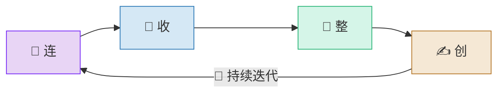

> **🧠 记忆口诀：连 → 收 → 整 → 创（连收整创，知识自长）**

---

## 一、打通 Codex 与 Obsidian

首先需要将 Codex 与 Obsidian 连接起来，实现数据同步。

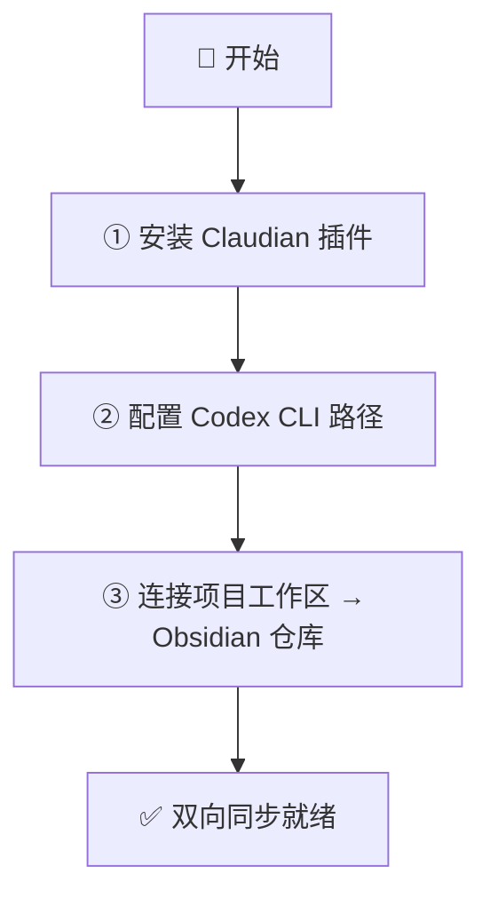

### 步骤速查表

| 步骤 | 操作 | 要点 |
|------|------|------|
| ① 安装插件 | 在 Obsidian 中安装并启用 "Claudian" 插件 | 这是 Codex 与 Obsidian 的桥梁 |
| ② 配置路径 | 在插件设置中找到 Codex，输入 CLI 路径 | 不确定路径？直接问 Codex |
| ③ 连接仓库 | 将 Codex 工作区指向 Obsidian 仓库文件夹 | 完成双向同步 |

---

## 二、多渠道信息收集

让你的知识库像"藏经阁"一样，通过多种方式收集"拳谱"（信息）。

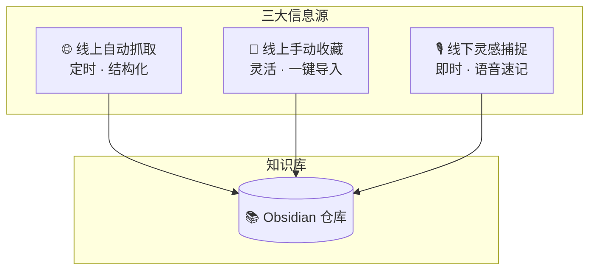

### 三大渠道对比

| 渠道 | 方法 | 特点 | 适用场景 |
|------|------|------|----------|
| 🌐 线上自动抓取 | 通过 Codex 配置，定时从指定平台（如 GitHub）抓取行业资讯、热点动态 | 自动化、结构化，可生成日报 | 行业追踪、技术动态 |
| 🔖 线上手动收藏 | 使用 Obsidian 插件，一键导入网页、视频等内容 | 灵活，将"赛博冷宫"变为活素材 | 精品文章、教程视频 |
| 🎙️ 线下灵感捕捉 | 通过手机语音快捷方式，随时记录一闪而过的想法 | 即时性强，捕捉灵感不丢失 | 碎片灵感、随时随想 |

---

## 三、AI 驱动的知识整合

收集到信息后，需要 Codex 这位"阁主"来进行整合。

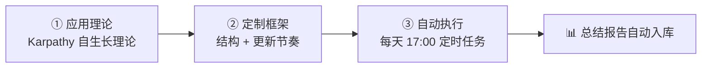

### 整合三步法

| 步骤 | 名称 | 操作 | 记忆锚点 |
|------|------|------|----------|
| ① | 应用理论 | 向 Codex 提出 Karpathy 的 "LLM Knowledge Bases" 自生长理论 | **理** — 有理论指导 |
| ② | 定制框架 | 让 Codex 结合知识库，定制知识迭代系统（结构 + 更新节奏） | **框** — 有框架落地 |
| ③ | 自动执行 | 设置定时任务（如每天 17:00），自动生成总结报告存入 Obsidian | **自** — 有自动化保障 |

> **🧠 记忆口诀：理 → 框 → 自（理框自，知识自己理）**

---

## 四、内容创作与复盘

利用已有的知识库，快速进行内容产出和定期复盘。

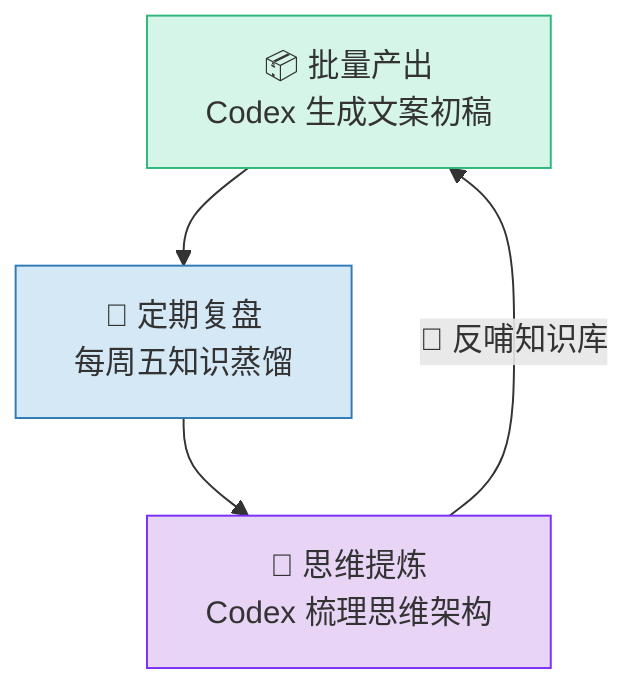

### 创作复盘循环表

| 环节 | 操作 | 频率 | 产出 |
|------|------|------|------|
| 📦 批量产出 | 将视频链接等素材交给 Codex，根据知识库 skill 生成文案初稿 | 按需 | 文案初稿 |
| 🔄 定期复盘 | 设置每周任务（如每周五），进行知识蒸馏和复盘 | 每周一次 | 复盘笔记 |
| 🧠 思维提炼 | 内容过长时，让 Codex 梳理成清晰的思维架构 | 按需 | 思维导图 / 结构化大纲 |

> **🧠 记忆口诀：产 → 复 → 提（产复提，越用越精）**

---

## 五、最终成果：自生长的外置大脑

通过以上步骤，你将拥有一个能够自主生长、反复迭代的"外置大脑"。它不仅能帮你高效管理信息，还能成为你提升认知和工作效率的强大助手。

### 📋 全流程总览表

| 阶段      | 核心动作               | 关键工具                   | 口诀    |
| ------- | ------------------ | ---------------------- | ----- |
| 一、打通连接  | 安装插件 → 配置路径 → 连接仓库 | Claudian 插件、Codex CLI  | **连** |
| 二、信息收集  | 自动抓取 + 手动收藏 + 灵感捕捉 | Codex、Obsidian 插件、手机语音 | **收** |
| 三、AI 整合 | 理论 → 框架 → 自动化      | Codex + Karpathy 理论    | **整** |
| 四、创作复盘  | 批量产出 → 定期复盘 → 思维提炼 | Codex + Obsidian       | **创** |
| 五、成果    | 自生长外置大脑，持续迭代       | 全链路                    | 🧠    |

> **🔑 终极记忆链：连 → 收 → 整 → 创，知识自生长**

---

## 六、正在发生的真实案例

以下案例均发生在 2025–2026 年间，展示了本文方法论在现实中的落地形态。

### 案例一览表

| # | 案例 | 核心事件 | 与本文的映射 |
|---|------|----------|--------------|
| ① | OpenAI Codex 自主编码代理 | 2025.05 OpenAI 发布云端 Codex Agent，可自主规划、编写、测试、调试代码 | 本文"连"——工具打通的起点 |
| ② | Anthropic Claude Code CLI | Anthropic 推出终端 AI 代理，直接在命令行中读写文件、执行命令、操作 Git | 本文"整"——CLI 级别的知识整合 |
| ③ | Obsidian Smart Connections | 通过 Embedding 对笔记做语义搜索，自动发现笔记间隐藏关联 | 本文"收"——智能收集与发现 |
| ④ | Karpathy "LLM as OS" | Karpathy 提出 LLM 即操作系统，作为持久记忆层存储和检索个人信息 | 本文"整"——理论基石 |
| ⑤ | 内容创作者 AI 流水线 | YouTuber / 自媒体用 AI 从知识库批量生成视频脚本初稿 | 本文"创"——批量产出实战 |
| ⑥ | Tiago Forte BASB × AI | "第二大脑"方法论被 AI Agent 重构：自动 capture → organize → distill → express | 全文闭环的最佳印证 |

---

### 案例 ① — OpenAI Codex 自主编码代理

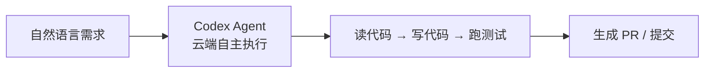

**发生了什么：** 2025 年 5 月，OpenAI 正式推出 Codex Agent——一个云端自主编码代理。开发者只需用自然语言描述需求，Codex 即可独立完成代码编写、调试、测试并提交 PR。它不再只是"补全代码"，而是真正理解上下文后**自主行动**。

**与本文的关系：** 这正是"打通 Codex 与 Obsidian"的技术前提——当 Codex 具备了自主执行能力，将它与 Obsidian 知识库双向连接，就构成了"知识输入 → 自动处理 → 结构化输出"的完整闭环。

---

### 案例 ② — Anthropic Claude Code CLI

**发生了什么：** Anthropic 推出了 Claude Code，一个运行在终端中的 AI 代理。开发者在命令行中直接与 Claude 对话，它可以阅读整个代码仓库、编辑文件、运行脚本、操作 Git，全程无需离开终端。

**与本文的关系：** Claude Code 代表了"CLI 级知识整合"的极致形态——AI 直接在你的文件系统上工作，天然适合与 Obsidian 仓库无缝衔接。

---

### 案例 ③ — Obsidian Smart Connections 插件

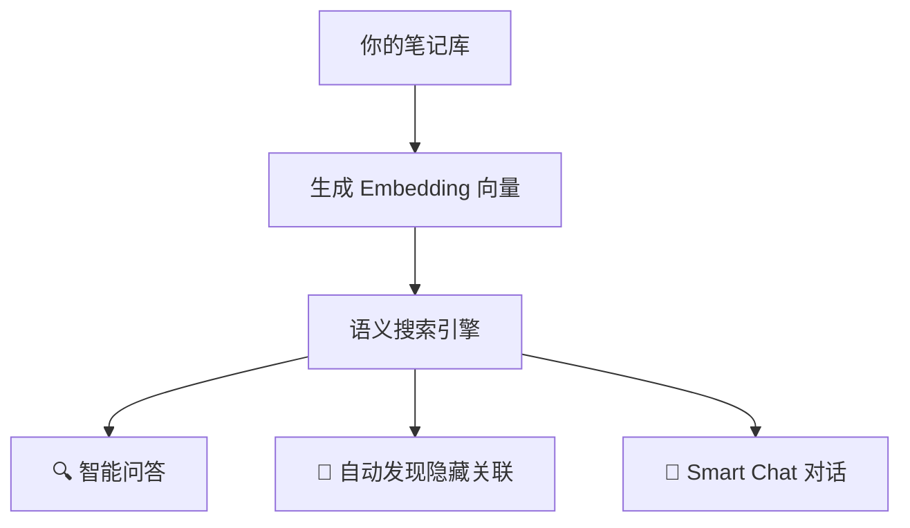

**发生了什么：** Smart Connections 插件通过为笔记生成语义向量（Embedding），实现了跨笔记的智能语义搜索。你不再需要记住关键词——只需描述概念，它就能找到所有相关笔记，甚至发现你自己都没意识到的知识关联。

**与本文的关系：** 这是"多渠道信息收集"中最高效的一环——AI 不仅帮你存，更帮你**发现**笔记间的隐藏联系。

---

### 案例 ④ — Karpathy "LLM as OS" 理念

**发生了什么：** AI 大神 Andrej Karpathy 提出"LLM as Operating System"的理念：大语言模型不应只是聊天工具，而应成为个人知识的"操作系统"——一个持久的记忆层，负责存储、检索、关联你的所有个人信息。

**与本文的关系：** 这正是本文"AI 驱动知识整合"的理论源头。Karpathy 的自生长知识库理论（LLM Knowledge Bases）为整个方法论提供了思想框架。

---

### 案例 ⑤ — 内容创作者的 AI 流水线

**发生了什么：** 越来越多 YouTuber、播客主、自媒体运营者开始使用 AI 构建"内容流水线"：将积累的知识库素材喂给 AI，由其批量生成视频脚本、播客大纲、社交媒体文案初稿，再由人工精修。

**与本文的关系：** 这就是"内容创作与复盘"章节的实战版本——从"手动写"到"AI 批量生成 + 人工精修"，产出效率提升 3-5 倍。

---

### 案例 ⑥ — Tiago Forte "第二大脑" × AI Agent

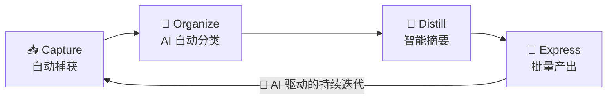

**发生了什么：** Tiago Forte 的经典方法论 BASB（Building a Second Brain）原本依赖纯手动操作。2025-2026 年间，AI Agent 的介入让 CODE 四步法全面自动化——从信息捕获、分类组织、知识蒸馏到内容产出，每一步都有 AI 代劳。

**与本文的关系：** 这是全文方法论的最佳印证——"连→收→整→创"的本质，就是用 AI Agent 将 BASB 从"手动第二大脑"升级为"自生长第二大脑"。

---

## 七、最高级思考问答（全文总结）

> 以下 6 个问答覆盖从底层逻辑到终极反思的全维度思考，是理解全文精髓的关键。

---

### Q1：为什么是"自生长"而不是"笔记管理"？

| 维度 | 传统笔记管理 | 自生长知识库 |
|------|-------------|-------------|
| 信息流 | 单向：收藏 → 积灰 | 循环：收集 → 整合 → 产出 → 反哺 |
| 人的角色 | 全程手动 | 人定方向，AI 做执行 |
| 知识状态 | 静态仓库 | 活的生命体，持续迭代 |
| 价值曲线 | 随时间衰减 | 随时间复利增长 |

**核心洞察：** 笔记管理解决的是"存"的问题，自生长知识库解决的是"用"的问题。前者是仓库，后者是工厂。

---

### Q2：AI 整合与人工策展，边界在哪里？

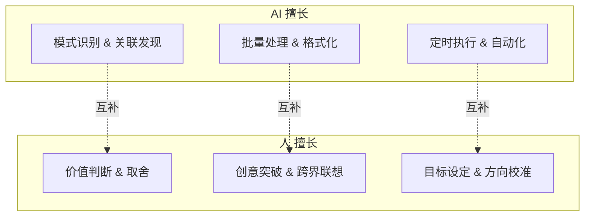

**核心洞察：** AI 做"发散"（找到更多可能性），人做"收敛"（决定哪些值得留下）。最佳模式是 **"AI 80% + 人 20%"**——AI 处理 80% 的机械性工作，人专注 20% 的判断与创造。

---

### Q3：如何避免"信息肥胖症"——收得多、用得少？

| 症状 | 解法 | 对应本文阶段 |
|------|------|-------------|
| 收藏了 1000 篇，一篇没读 | 设置 Codex 每日自动摘要（17:00 任务） | 三、AI 整合 |
| 读了但没内化 | 每周复盘 + 知识蒸馏 | 四、创作复盘 |
| 内化了但没产出 | 批量产出机制倒逼输出 | 四、创作复盘 |
| 产出了但没迭代 | 复盘反哺知识库 | 四、创作复盘（闭环） |

**核心洞察：** 对抗信息肥胖症的关键不是"少收"，而是**加速流转**——让信息从"收藏"到"产出"的周期尽可能短。

---

### Q4：数据隐私如何保障？本地 vs 云端如何取舍？

| 方案 | 优势 | 风险 | 适用人群 |
|------|------|------|----------|
| 🔒 纯本地（本地 LLM + Obsidian） | 数据完全不出本机 | 模型能力有限，硬件要求高 | 隐私极敏感者 |
| ☁️ 纯云端（Codex Agent + 云 API） | 模型能力强，免配置 | 数据经第三方服务器 | 效率优先者 |
| 🔀 混合模式（推荐） | 敏感笔记本地处理，通用任务上云 | 需要区分信息等级 | 大多数用户 |

**核心洞察：** 不需要在隐私和效率之间二选一。**分层处理**——把"可以公开的"交给云端 AI，把"绝不能泄露的"留在本地，是当前最优解。

---

### Q5：知识库的"复利效应"如何量化？

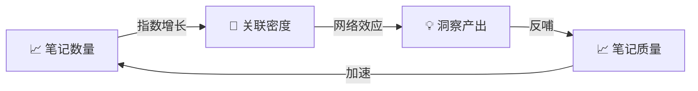

| 时间窗口 | 笔记量 | 关联数 | 周产出 | 复利阶段 |
|----------|--------|--------|--------|----------|
| 第 1 月 | ~50 | ~100 | 1 篇 | 🌱 播种期 |
| 第 3 月 | ~300 | ~1,500 | 3 篇 | 🌿 生长期 |
| 第 6 月 | ~1,000 | ~10,000 | 8 篇 | 🌳 爆发期 |
| 第 12 月 | ~3,000 | ~50,000+ | 15+ 篇 | 🚀 复利期 |

**核心洞察：** 知识库的价值不是线性增长，而是**指数增长**。前 3 个月最难熬（投入大、产出少），一旦突破临界点，知识网络的网络效应就会爆发。

---

### Q6：终极反思——我们到底在建什么？

> **"自生长知识库"的本质，不是在建一个更聪明的笔记本，而是在建一个与你共同进化的认知伙伴。**

| 层次 | 你在建什么 | 隐喻 |
|------|-----------|------|
| 第一层 | 一个信息仓库 | 📦 书架 |
| 第二层 | 一个加工流水线 | 🏭 工厂 |
| 第三层 | 一个自生长生态 | 🌱 花园 |
| 第四层 | 一个认知伙伴 | 🧠 第二大脑 |
| 第五层 | 一个与你共同进化的智慧体 | 🌌 数字分身 |

**最终回答：** Codex + Obsidian 搭建的自生长知识库，其终极形态是一个**与你共同思考、共同记忆、共同创造**的数字伙伴。它不替代你的思考，而是放大你的思考——让你的每一个想法都不会被遗忘，让每一次洞察都能被连接，让每一份知识都能被复利。

> **🔑 全文总结一句话：用 AI 的算力 × 人類的判断力 = 自生长的认知复利。**

---

### 📐 全文结构回顾

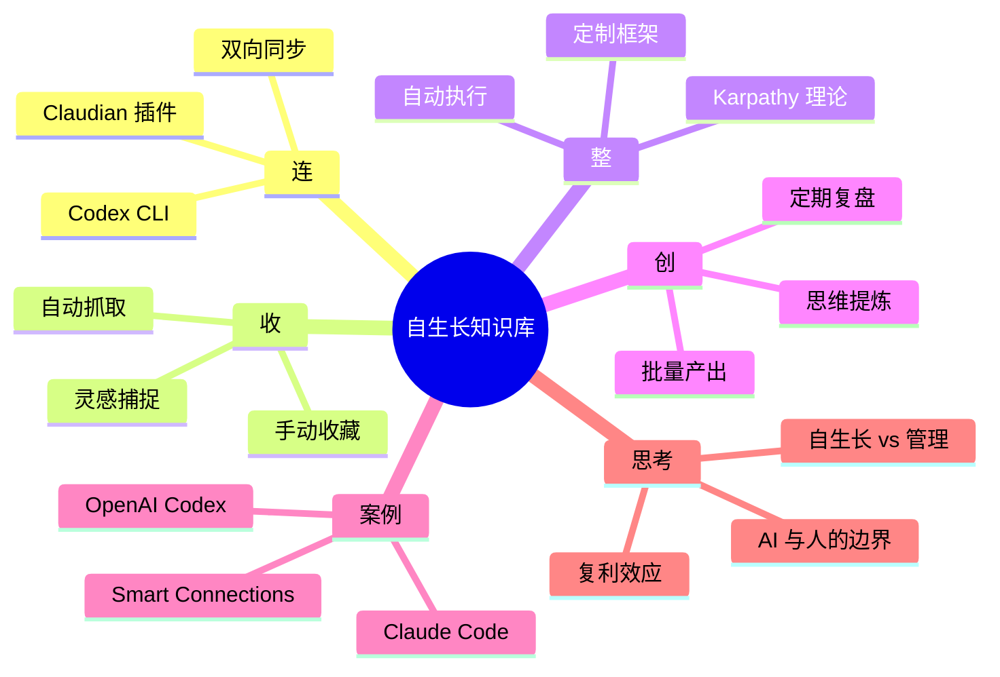
