这篇内容探讨了为何大模型应用（如 Claude Code）在企业级场景中落地困难，并以其与学术研究的差异为切入点。视频的核心观点是：**企业AI转型面临的最大挑战并非技术本身，而是复杂的组织和环境壁垒。** 内容从技术传播周期、运行环境差异、以及最终的企业数据孤岛三个层面进行了深入剖析。

## 整体分析框架

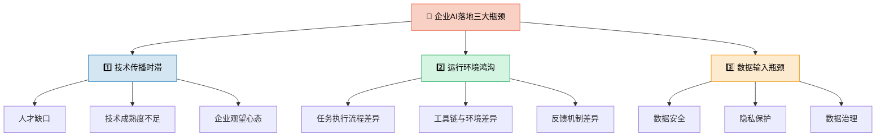

---

## 一、技术传播的时滞：学术与企业的"岩石"

新技术从学术研究到企业应用存在天然的时间差。

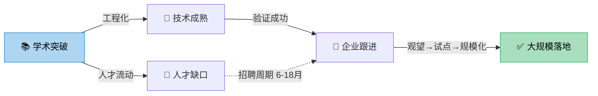

| 延迟因素 | 说明 | 典型周期 |
| --- | --- | --- |
| 🧑‍💻 人才缺口 | 企业需要招聘掌握前沿技术的人才，但市场上这类人才有限，存在招聘周期 | 6-18 个月 |
| 🔧 技术成熟度 | 许多大模型工程化应用（如 Claude Code）本身才发展了一年半，仍是全新方向，技术路线有待完善 | 1-3 年 |
| 👀 企业观望 | 当学术研究遇到瓶颈，技术路线清晰后，企业才会大规模跟进，但在此之前常处于观望状态 | 视行业而定 |

> [!tip] Gartner 技术成熟度曲线映射
> 当前大模型应用大致处于 **"膨胀期望的顶峰"向"幻灭低谷"** 过渡阶段，企业大规模跟进通常要等到进入"稳步爬升的光明期"。

---

## 二、运行环境的鸿沟：干净沙盒与复杂现实

Claude Code 等产品与企业 Agent 运行的环境截然不同，导致其在企业中难以直接复用。

> **Harris（任务执行流程）：** 所有大厂都在优化 AI 接收指令到完成任务的中间流程，即如何调度工具、处理上下文和错误兜底。

### 环境差异对比

| 维度 | 🖥️ 产品环境（如 Claude Code） | 🏢 企业环境 |
| --- | --- | --- |
| **环境特征** | 干净、统一且唯一 | 碎片化、异构、历史包袱重 |
| **工具链** | 所有工具和命令都是确定的 | 工具链不完善，甚至缺少完整 API 文档 |
| **任务定义** | 输入输出明确（代码→测试通过/失败） | 任务和结果定义充满模糊性 |
| **反馈速度** | 毫秒级准确、可量化的反馈 | 反馈周期长，常依赖人工判断 |
| **容错能力** | 可随时回退、重试 | 一旦输出盖章，无法回退 |

### 反馈机制对比图

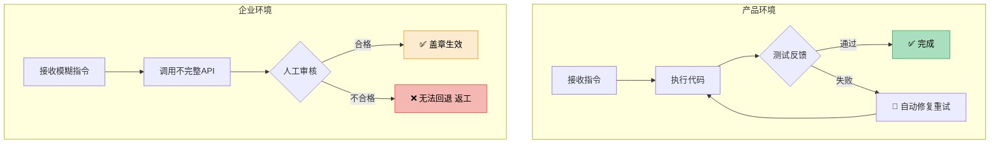

> [!example] 典型场景对比
> **产品场景：** 模型写一段代码 → 运行测试 → 毫秒内得知通过/失败 → 自动修正
> **企业场景：** 模型审核法律条款 → 输出"合理即可"的判断 → 无量化标准 → 一旦盖章无法撤回

---

## 三、落地的最大瓶颈：无法输入的企业数据

视频作者认为，相比工具和标准缺失，企业 AI 落地面临的**最大问题**是数据无法有效输入模型。

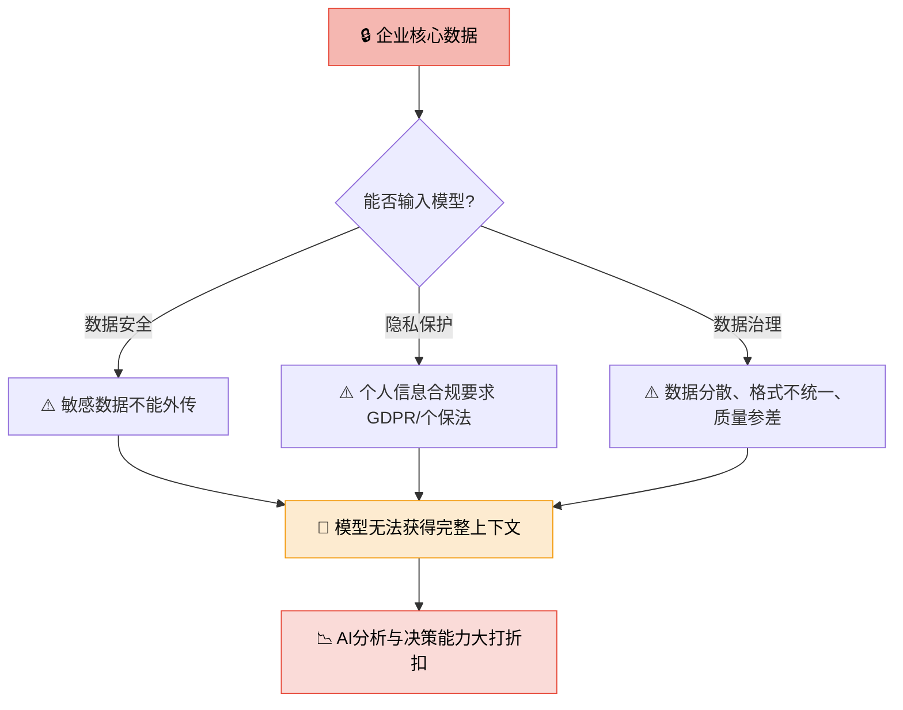

| 瓶颈类型 | 核心问题 | 影响范围 |
| --- | --- | --- |
| 🔐 数据安全 | 商业机密、核心代码等敏感数据不能外传至云端模型 | 全行业共性 |
| 🛡️ 隐私保护 | 个人信息保护法（GDPR/个保法）对用户数据使用有严格限制 | 涉及用户数据的行业 |
| 🗃️ 数据治理 | 企业内部数据分散在多个系统，格式不统一、质量参差不齐 | 数字化程度低的企业 |

> [!warning] 关键结论
> 数据安全、隐私保护、数据治理是后续**所有分析和应用的前提与基础**。如果数据无法有效输入模型，再先进的 AI 能力也无用武之地。

---

## 总结：企业 AI 落地瓶颈层级

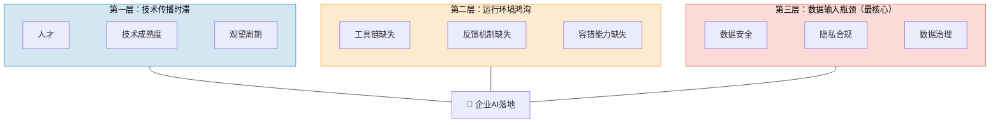

---

## 四、正在发生的案例：从理论到现实

以下案例印证了上文三大瓶颈在真实商业世界中的表现，每个案例都对应一个核心瓶颈点。

### 案例全景对照表

| 案例 | 时间 | 行业 | 对应瓶颈 | 关键教训 |
| --- | --- | --- | --- | --- |
| 🔒 三星源代码泄露 | 2023.04 | 科技制造 | 数据输入瓶颈 | 员工将机密代码输入 ChatGPT，暴露安全意识与工具管控的双重缺失 |
| ⚖️ 纽约律师伪造判例 | 2023.06 | 法律 | 运行环境鸿沟 | AI 捏造 6 个不存在的判例，律师未验证即提交法庭，被罚款 $5,000 |
| ✈️ Air Canada 聊天机器人案 | 2024.02 | 航空服务 | 反馈机制缺失 | 机器人给出错误丧亲票价信息，法院判企业担责——"AI 说的也算数" |
| 🔍 Google AI Overviews 幻觉 | 2025 至今 | 搜索/信息 | 技术成熟度 | 复杂查询准确率仅 ~60%，虚假医疗建议引发监管审查 |
| 🏢 企业 Agentic AI 采用 | 2024→2028 | 全行业 | 技术传播时滞 | Gartner 预测：2028 年 33% 企业软件含 Agentic AI（2024 年 <1%）|

---

### 案例一：🔒 三星源代码泄露事件（2023.04）

**对应瓶颈：** 第三层——数据输入瓶颈（数据安全）

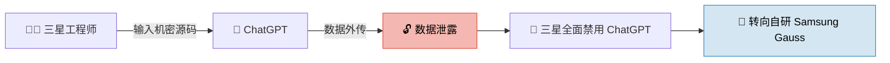

**事件回顾：** 三星员工至少 **3 次**将机密信息输入 ChatGPT：
1. 一份**机密源代码**
2. 包含敏感业务数据的**内部会议记录**
3. 一个**硬件组件相关代码**

**深层启示：** 这不仅是安全事件，更暴露了企业 AI 的根本矛盾——**员工需要 AI 提效，但企业无法安全地"喂"数据给外部模型**。三星的应对路径（禁用 → 自研）成为大型企业的典型范式。

> [!danger] 关键数据
> 三星事件后，Apple、JPMorgan、Verizon 等也相继限制了 ChatGPT 的使用。**数据安全焦虑**已成为企业 AI 采纳的第一道门槛。

---

### 案例二：⚖️ 纽约律师 AI 伪造判例案（2023.06）

**对应瓶颈：** 第二层——运行环境鸿沟（反馈机制缺失 + 任务定义模糊）

**案件：** *Mata v. Avianca, Inc.*

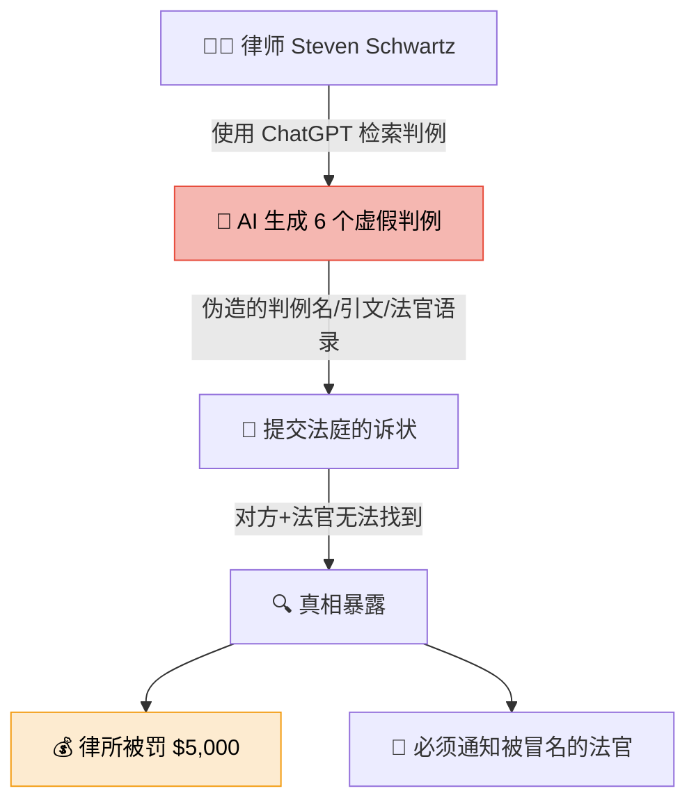

| 对比维度 | 🖥️ 代码世界 | ⚖️ 法律世界 |
| --- | --- | --- |
| **验证机制** | 运行测试 → 毫秒级反馈 | 需人工检索判例数据库 → 耗时数小时 |
| **错误代价** | 回退修改，成本趋近于零 | 提交法庭即为"虚假陈述"，不可撤回 |
| **AI 可控性** | 确定性输出（对/错） | 概率性输出（看起来对 ≠ 真对） |

> [!warning] 深层启示
> 此案精准印证了"运行环境鸿沟"——在代码世界里，AI 犯错可以被自动捕获；在法律世界里，**没有自动验证器**，错误一旦进入正式流程就无法回退。

---

### 案例三：✈️ Air Canada 聊天机器人案（2024.02）

**对应瓶颈：** 第二层——运行环境鸿沟（一旦盖章，无法回退）

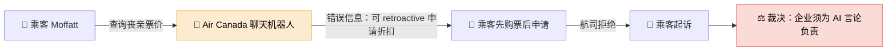

**裁决要旨：**  tribunal 裁定——"无论信息来自静态页面还是聊天机器人，**Air Canada 都须对其负责**。"

> [!tip] 里程碑意义
> 此案确立了 **"AI 输出 = 企业承诺"** 的法律先例。企业不能以"AI 说的"为由推卸责任，这正是文中"一旦输出盖章，便无法回退"的真实写照。

---

### 案例四：🔍 Google AI Overviews 持续幻觉问题（2025）

**对应瓶颈：** 第一层——技术传播时滞（技术成熟度不足）

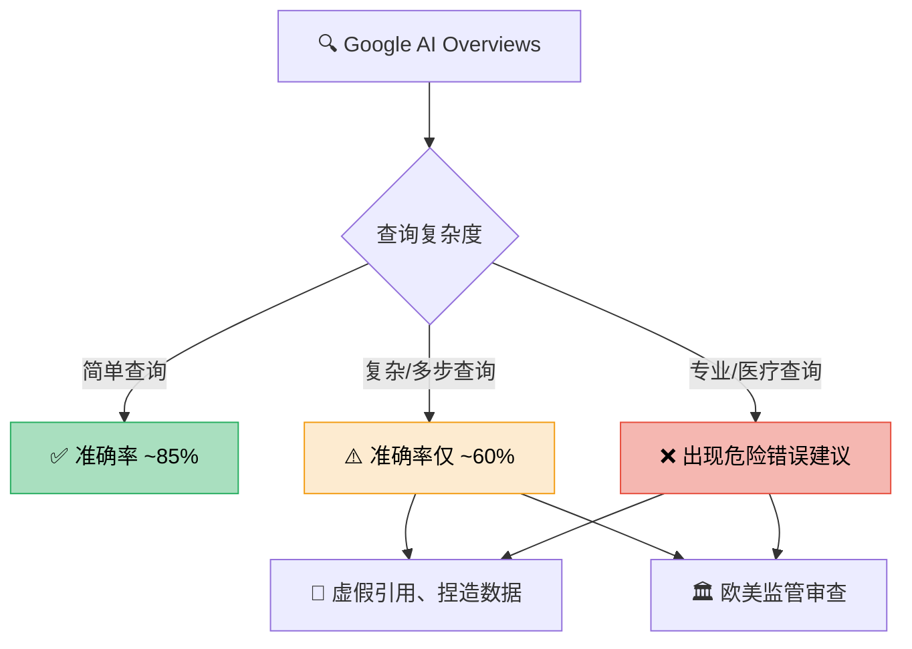

| 指标 | 数据 | 来源 |
| --- | --- | --- |
| 复杂查询准确率 | ~60% | Stanford Web Observatory, 2025.03 |
| 严重错误减少 | ~40%（相比 2024） | Google 官方声明 |
| 完全幻觉率 | ~15% | Stanford Web Observatory |
| 部分准确率 | ~25% | Stanford Web Observatory |

> [!note] 技术瓶颈的现实映射
> 即使是 Google 这样的技术巨头，在投入大量工程资源后，AI 幻觉问题仍**未被根本解决**。这印证了文中"技术成熟度不足"的判断——从"能用"到"可信赖"之间，还有漫长的路。

---

### 趋势数据：Gartner 企业 Agentic AI 预测

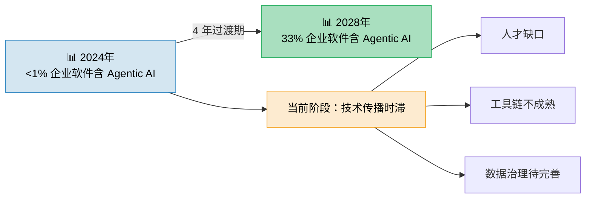

> [!info] 从 <1% 到 33%
> Gartner 预测到 2028 年，33% 的企业软件将包含 Agentic AI 能力（2024 年不到 1%）。这 **4 年的过渡期**，正是"技术传播时滞"最真实的写照——不是企业不想用，而是人才、工具、数据三重瓶颈尚未打通。

---

## 五、深度思考问答：全文总结与升华

> 以下问答从三个层次递进：**现象追问 → 本质洞察 → 未来推演**，旨在将全文的分析框架提升为可行动的思维模型。

---

### Q1：企业 AI 落地，真正卡在哪里？

> **一句话回答：** 不是卡在"模型不够聪明"，而是卡在**"企业数据喂不进去 + 输出结果无法验证"**。

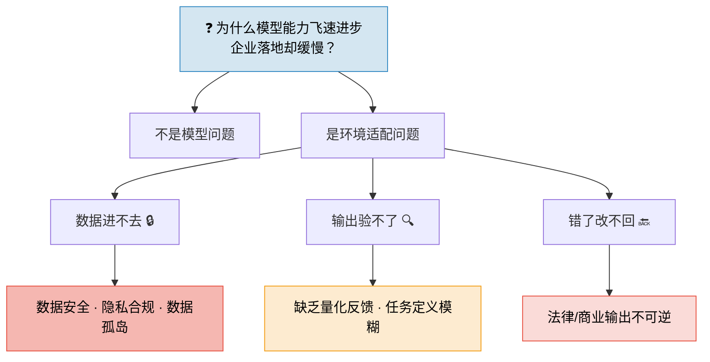

**核心洞察：** 大模型的能力是**通用的、开放的**，但企业的壁垒是**特有的、封闭的**。两者之间的"最后一公里"，不是技术问题，而是**信任问题**——数据信任、输出信任、责任信任。

---

### Q2：代码世界 vs 法律/金融世界——AI 落地的"难度光谱"是什么？

> **核心发现：** AI 落地难度与**"反馈闭环的确定性"成反比**。

```mermaid
graph LR
    subgraph "高确定性 · 低落地难度"
        L1["💻 代码生成"]
        L2["🧪 测试自动化"]
        L3["📊 数据处理"]
    end

    subgraph "中确定性 · 中落地难度"
        M1["📧 客服对话"]
        M2["📝 文档摘要"]
        M3["🔍 信息检索"]
    end

    subgraph "低确定性 · 高落地难度"
        H1["⚖️ 法律审查"]
        H2["💊 医疗诊断"]
        H3["🏦 合规审计"]
    end

    L1 --> L2 --> L3
    L3 --> M1 --> M2 --> M3
    M3 --> H1 --> H2 --> H3

    style L1 fill:#a9dfbf,stroke:#27ae60,color:#000
    style L2 fill:#a9dfbf,stroke:#27ae60,color:#000
    style L3 fill:#a9dfbf,stroke:#27ae60,color:#000
    style M1 fill:#fdebd0,stroke:#f39c12,color:#000
    style M2 fill:#fdebd0,stroke:#f39c12,color:#000
    style M3 fill:#fdebd0,stroke:#f39c12,color:#000
    style H1 fill:#f5b7b1,stroke:#e74c3c,color:#000
    style H2 fill:#f5b7b1,stroke:#e74c3c,color:#000
    style H3 fill:#f5b7b1,stroke:#e74c3c,color:#000
```

| 落地难度 | 决定因素 | 典型场景 | 案例佐证 |
| --- | --- | --- | --- |
| 🟢 低 | 输出可自动验证、错误可回退 | 代码生成、测试 | Claude Code 的成功 |
| 🟡 中 | 输出需人工审核、错误代价可控 | 客服、文档、搜索 | Google AI Overviews 的困境 |
| 🔴 高 | 输出不可逆、错误代价极高 | 法律、医疗、合规 | Avianca 律师案、Air Canada 案 |

---

### Q3：如果数据是最大的瓶颈，那出路在哪里？

> **三条路径，三种信任：**

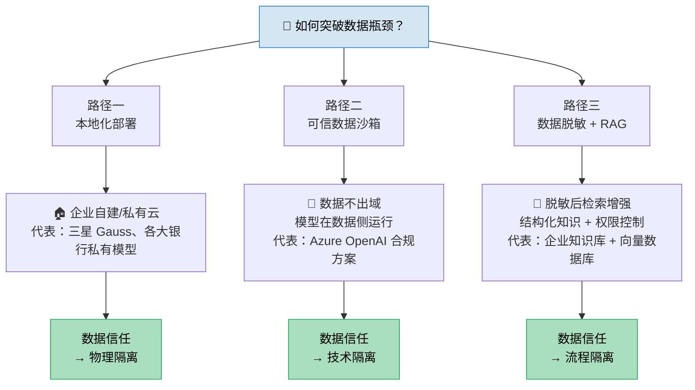

| 路径 | 核心思路 | 适用企业 | 代价 |
| --- | --- | --- | --- |
| 🏠 本地化部署 | 模型和数据都在企业防火墙内 | 大型金融、军工、医疗 | 算力成本极高，模型能力受限 |
| 🔐 可信沙箱 | 数据不出域，模型在数据侧运行 | 中大型跨国企业 | 架构复杂，需合规认证 |
| 🧹 脱敏 + RAG | 知识脱敏后检索增强生成 | 大多数企业的务实选择 | 信息损失，效果打折 |

---

### Q4：终极追问——AI 时代，企业的核心竞争力是什么？

> **答案不是"谁先用了 AI"，而是"谁能构建 AI 可消费的高质量数据资产"。**

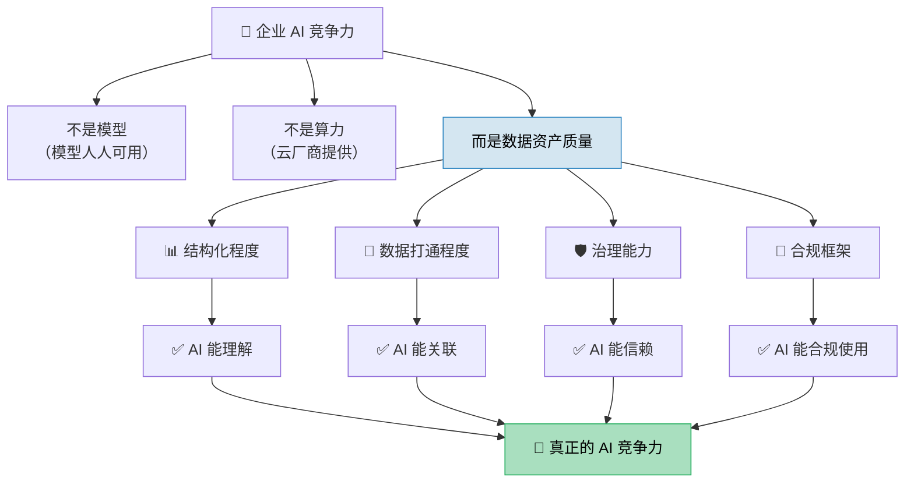

**全文核心结论：**

> [!success] 一句话总结
> **企业 AI 落地不是一场"技术军备竞赛"，而是一场"数据基建攻坚战"。**
> 谁先完成数据治理、建立可信反馈闭环、培养"人+AI"协作流程，谁就能在 Agentic AI 时代占据先机。

---

### 🧠 全文思维模型总结

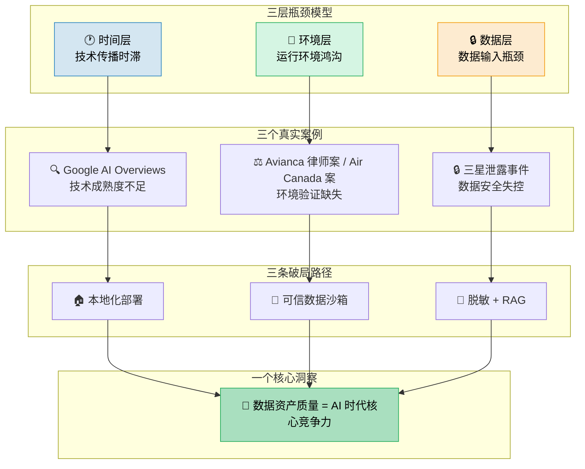

---

> [!question] 延伸思考
> 如果你的企业今天就开始"AI 就绪"改造，你会从**数据治理**、**流程改造**还是**人才培养**入手？为什么？
