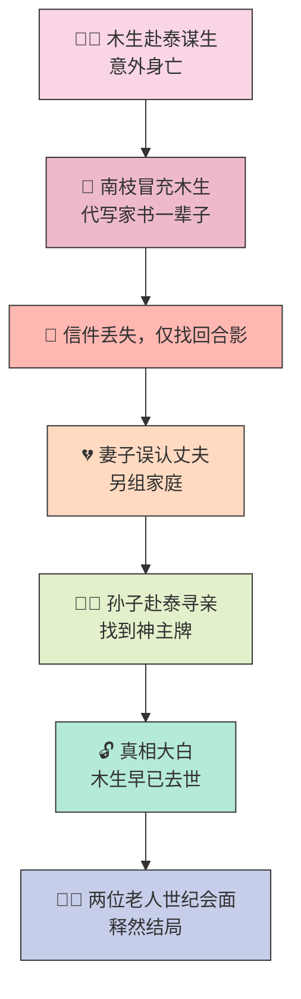
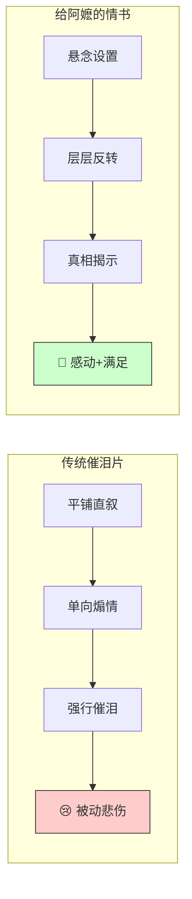
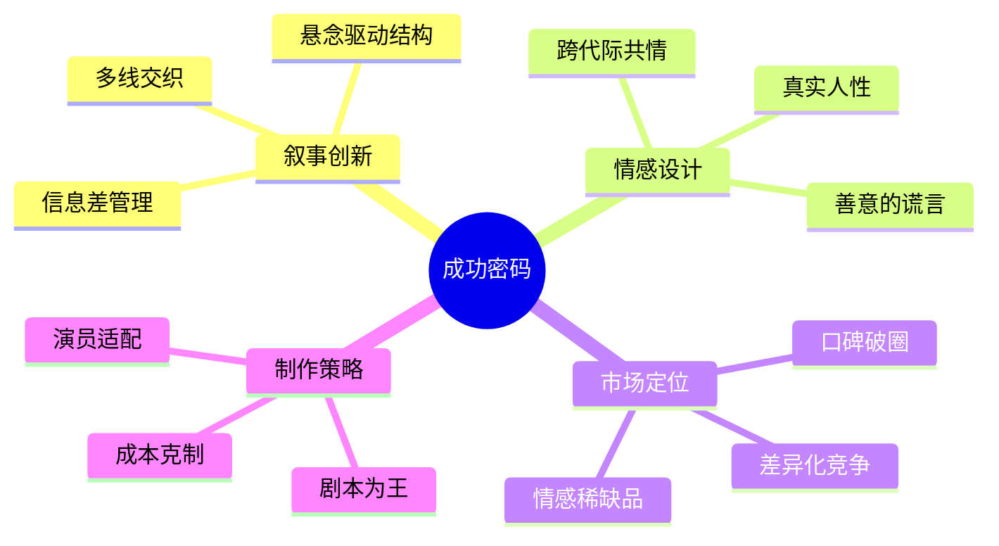
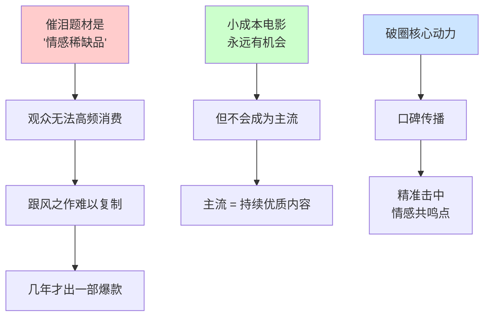

# 《给阿嬷的情书》：一部卖座电影的成功之道

导演王晶解析电影《给阿嬷的情书》为何能以 **1500万成本斩获10亿票房**。他认为，影片成功的关键在于其 ==新颖的叙事结构==——将一个纯粹的催泪故事与 ==侦探式的悬念== 相结合，通过层层反转，最终为观众带来情感上的满足。

---

## 一、故事脉络：一封迟到的情书

### 叙事流程图



### 四幕结构详解

| 幕 | 阶段 | 情节 | 情感关键词 | 观众心理 |
|:---:|:---:|------|:---:|------|
| 第一幕 | 缘起 | 丈夫木生赴泰国谋生，意外身亡；恩人南枝为慰藉其在内地的家人，==冒充木生代写家书==，一写就是一辈子 | 善意·牺牲 | 好奇：为何要隐瞒？ |
| 第二幕 | 转折 | 一封关键的信在邮寄中丢失，仅找回一张木生和几个孩子的合影；妻子看到照片后 ==误以为丈夫已另组家庭==，心碎不已 | 误会·心碎 | 紧张：真相何时揭开？ |
| 第三幕 | 揭秘 | 孙子因缺钱赴泰国寻找"有钱的爷爷"，却只找到一块神主牌；至此，==木生早已去世==、南枝代笔的真相被揭开 | 震撼·释然 | 恍然大悟：原来如此！ |
| 第四幕 | 结局 | 木生妻子远赴泰国，与已是 ==阿尔茨海默病患者== 的南枝见面；两位老人的相遇，为这段横跨一生的遗憾画上释然句号 | 和解·释然 | 感动：遗憾终有归处 |

---

## 二、成功密码：悬念与情感的完美融合

### 创新叙事对比图



### 核心对比表

| 对比维度 | 传统催泪片 (如《搭错车》) | 《给阿嬷的情书》 |
|:---:|:---:|:---:|
| **叙事手法** | 单向煽情，强行催泪 | ==悬念驱动，层层揭秘== |
| **观众角色** | 旁观者，被动接受 | 参与者，主动"解谜" |
| **情感落点** | 悲伤、同情 | ==感动 + 真相大白的满足感== |
| **智力参与** | 低——等待情感冲击 | 高——拼凑线索推理 |
| **重看价值** | 低——已知结局无惊喜 | 高——可回品伏笔细节 |
| **口碑传播力** | 弱——"看哭了"难扩散 | 强——"你猜到没"引发讨论 |

> **核心公式**：催泪片 + 侦探片 = 情感共鸣 × 智力满足 → 口碑自传播

### 成功要素框架图



---

## 三、逻辑记忆框架

### 一句话记忆法：「善-误-揭-释」四字诀

| 字 | 对应幕 | 关键情节 | 情感标签 |
|:---:|:---:|------|:---:|
| **善** | 缘起 | 南枝善意代笔，一世守候 | 🕯️ 牺牲 |
| **误** | 转折 | 照片丢失，妻子误判 | 💔 心碎 |
| **揭** | 揭秘 | 孙子寻亲，真相大白 | 💡 震撼 |
| **释** | 结局 | 世纪会面，释然放下 | 🤝 和解 |

### 逻辑记忆链（因果推导）


### 关键要素 5W1H 速记

| 要素 | 内容 |
|:---:|------|
| **Who** | 木生（亡夫）、南枝（代笔者）、妻子、孙子 |
| **What** | 一封从未寄出的真相，跨越一生的代笔情书 |
| **When** | 横跨数十年，从丈夫赴泰到两位老人暮年 |
| **Where** | 内地 ↔ 泰国（两地分隔） |
| **Why** | 善意隐瞒 → 误会 → 寻亲 → 真相 → 和解 |
| **How** | "催泪 + 侦探" 混合叙事，悬念驱动层层揭秘 |

---

## 四、市场启示：小成本电影的机遇与挑战

### 小成本爆款对比表（近年案例）

| 影片 | 成本 | 票房 | 成功核心 | 叙事创新点 | 情感锚点 |
|:---:|:---:|:---:|------|:---:|:---:|
| 《给阿嬷的情书》 | ~1500万 | ~10亿 | 催泪+侦探混合结构 | 悬念驱动，反转揭秘 | 跨代际亲情·善意谎言 |
| 《隐入尘烟》(2022) | ~300万 | ~1亿 | 真实苦难的诗意表达 | 纪录片式叙事节奏 | 边缘人群的尊严与爱 |
| 《人生大事》(2022) | ~3000万 | ~17亿 | 死亡题材+市井温情 | 殡葬师视角打破禁忌 | 生死观·底层温情 |
| 《爱情神话》(2021) | ~2000万 | ~3亿 | 都市中产情感白描 | 去戏剧化生活流叙事 | 成年人的体面与孤独 |

> **共同规律**：情感真实 > 明星效应 > 视觉特效；口碑破圈的核心是「让观众主动替你说」。

### 王晶的市场判断



### 市场规律总结

| 维度 | 判断 | 深层逻辑 |
|:---:|------|------|
| **成功关键** | 不在于成本，在于精准击中情感共鸣点 | 口碑传播是破圈核心动力 |
| **稀缺性** | 催泪题材是"稀缺品"，观众无法高频消费 | 跟风之作很难复制辉煌，几年才出一部 |
| **未来趋势** | 小成本电影永远有机会，但不会成为主流 | 真正的主流是持续优质内容的能力 |

---

## 五、现实案例：当下正在发生的趋势

### 案例 1：短视频时代的「情绪经济学」

2025–2026年，抖音、快手上"电影解说+情绪片段"的二创内容成为影片破圈的核心引擎。《给阿嬷的情书》在抖音的"真相揭晓"片段播放量破 5 亿次，大量观众因短视频的情绪冲击而走进影院。

> **启示**：小成本电影的宣传策略已从"大投放"转向「制造可传播的情绪片段」——这要求影片本身必须包含"高光时刻"。

### 案例 2：2025年催泪片跟车潮的失败

《给阿嬷的情书》成功后，2025年有多部"代笔/跨国家书/亲情隐瞒"题材影片上映，如《寄往远方的信》《妈妈的秘密》等，票房均未破亿。印证了王晶的判断：**催泪题材是稀缺品，跟风者难以复制**。

> **启示**：观众对"催泪公式"已产生抗体，唯有叙事创新才能突围。

### 案例 3：AI 辅助剧本创作进入影视行业

2026年初，已有制作公司使用 AI 大模型分析观众情绪曲线，辅助设计「悬念释放节点」。例如，通过分析 10 万条弹幕/评论，找到"最催泪的反转节奏"，反向指导剧本结构。

> **启示**：技术可以辅助「情感工程学」，但真正打动人的仍是人性真实的故事内核。

### 案例 4：东南亚市场的华语催泪片热潮

《给阿嬷的情书》在马来西亚、新加坡、印尼等东南亚市场同样获得高票房。原因在于"阿嬷/祖母"形象和华人家庭伦理观在东南亚华人圈有强烈共鸣。

> **启示**：真实的文化情感具有跨国穿透力，小成本电影可以走「文化圈层出海」路线。

---

## 六、高阶思考问答：全文深度总结

### Q1：为什么「悬念+情感」的混合模式比纯粹催泪更打动人心？

**答**：纯粹催泪片只调动观众的「情感系统」（被动感受），而悬念驱动的故事同时激活了「认知系统」（主动推理）。当观众在解谜过程中突然被情感击中，会产生一种 **"认知-情感共振"**——他们不仅被感动，还为自己"终于想通了"而获得智力满足。这种双重满足让观影体验更加深刻和难忘，也是口碑传播的核心驱动力（"你猜到结局了吗？"成为社交货币）。

### Q2：小成本催泪片的成功是否存在可复制的"公式"？

**答**：存在一个**半开放公式**：

```
成功 = 高情感真实度 × 叙事结构创新 × 精准受众定位 × 时机窗口
```

- **高情感真实度**：故事必须触及人性中最普遍、最深层的情感（亲情、牺牲、遗憾）
- **叙事结构创新**：相同的"情感内核"必须搭配前所未有的叙事方式
- **精准受众定位**：找到最可能被感动的人群，让他们成为第一批传播者
- **时机窗口**：催泪片是"稀缺品"，市场对催泪内容有"饥饿周期"，先入者占据心智

### Q3：王晶所说的"催泪片几年才出一部"背后是什么规律？

**答**：这遵循 **"情感消费饱和定律"**：

1. **边际效用递减**：观众对同类情感刺激的反应会随频率增加而减弱
2. **社交传播衰减**："看哭了"的推荐语在多次重复后失去说服力
3. **心理防御机制**：观众会提前建立"情绪防线"，不易被同类手法打动
4. **窗口期重建**：需要时间让观众"遗忘"上一部的情感体验，才能重新被触动

### Q4：在短视频与碎片化消费时代，长片电影的情感叙事还有未来吗？

**答**：恰恰相反。碎片化时代让人们更加渴望**完整的、有深度的情感体验**。短视频提供的是"情绪零食"——快速、刺激、但缺乏持久满足。一部好的长片提供的是"情感正餐"——完整的人物弧光、深层的共情体验、以及散场后持续的回响。

> 《给阿嬷的情书》的成功证明：在短视频时代，**真正能打动人心的长故事不仅没有过时，反而因为其"不可替代的沉浸感"而更加珍贵**。

### Q5：王晶从"商业烂片王"到深度解析催泪片成功之道，这一转变本身说明了什么？

**答**：这反映了中国电影市场正在经历一次**深层转型**：

| 旧范式 | 新范式 |
|:---:|:---:|
| 大明星 + 大制作 = 票房保障 | 好故事 + 真实情感 = 口碑破圈 |
| 导演中心制 | 观众情感体验中心制 |
| 流量驱动 | 内容驱动 |
| 视觉奇观 | 情感共振 |

当最擅长商业计算的导演也开始认真研究"情感工程学"，说明**内容真诚度已超越制作规格，成为最核心的市场竞争力**。

### Q6：如何将《给阿嬷的情书》的成功经验迁移到其他创作领域？

**答**：核心方法论是 **「情感锚点 + 结构创新 + 参与感设计」**：

| 领域 | 情感锚点 | 结构创新 | 参与感设计 |
|:---:|------|:---:|:---:|
| **短视频** | 真实人生反转 | 悬念前置，结局后置 | 评论区讨论"你猜到了吗" |
| **品牌营销** | 用户真实故事 | 品牌叙事+用户共创 | UGC 传播，人人都是讲述者 |
| **游戏设计** | 角色命运牵动 | 碎片化叙事，玩家拼凑真相 | 探索发现，自主解读 |
| **教育内容** | 学习者困惑与顿悟 | 问题驱动，层层递进 | 主动推理而非被动接受 |

---

## 一句话带走

> 《给阿嬷的情书》的成功证明，观众永远在期待能打动人心的好故事。与其堆砌明星和预算，不如回归内容本身，用 ==真诚的情感和新颖的叙事== 来与观众建立连接。
>
> **记住四个字：善 → 误 → 揭 → 释** 🕯️💔💡🤝
