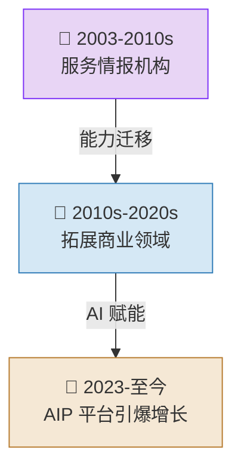
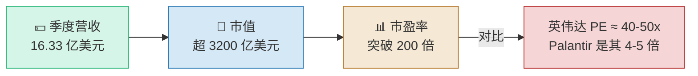
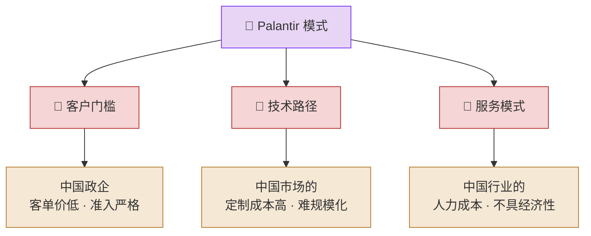
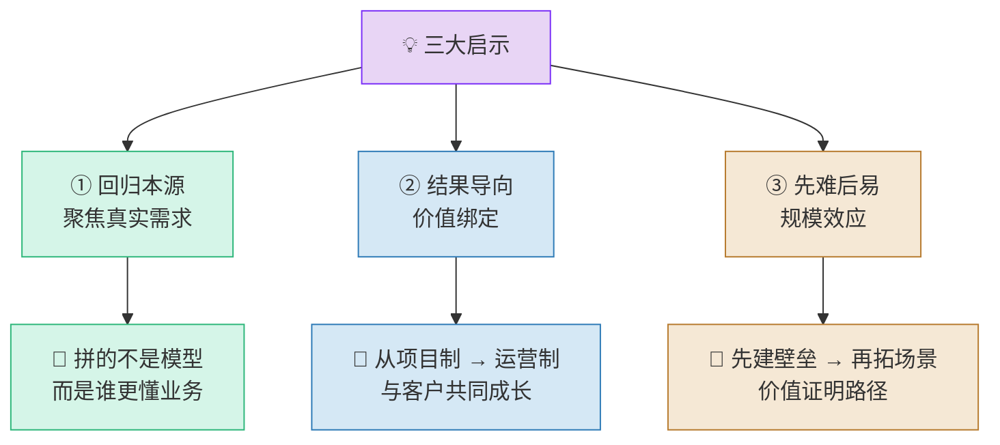
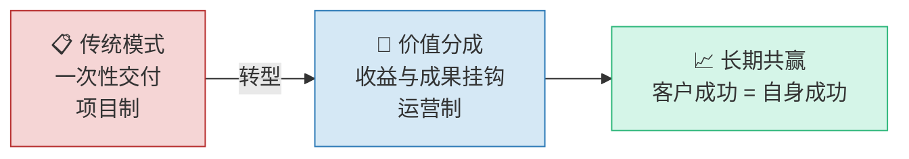
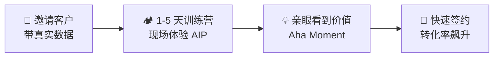
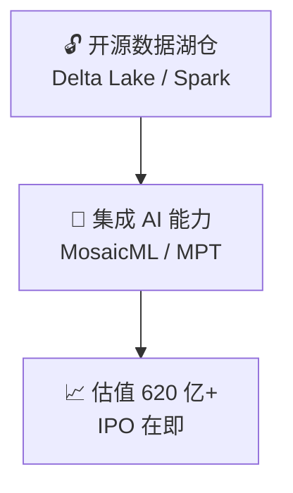
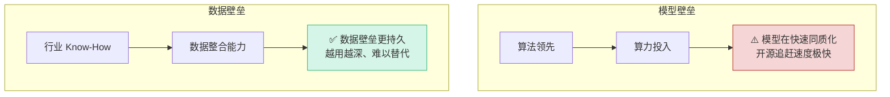
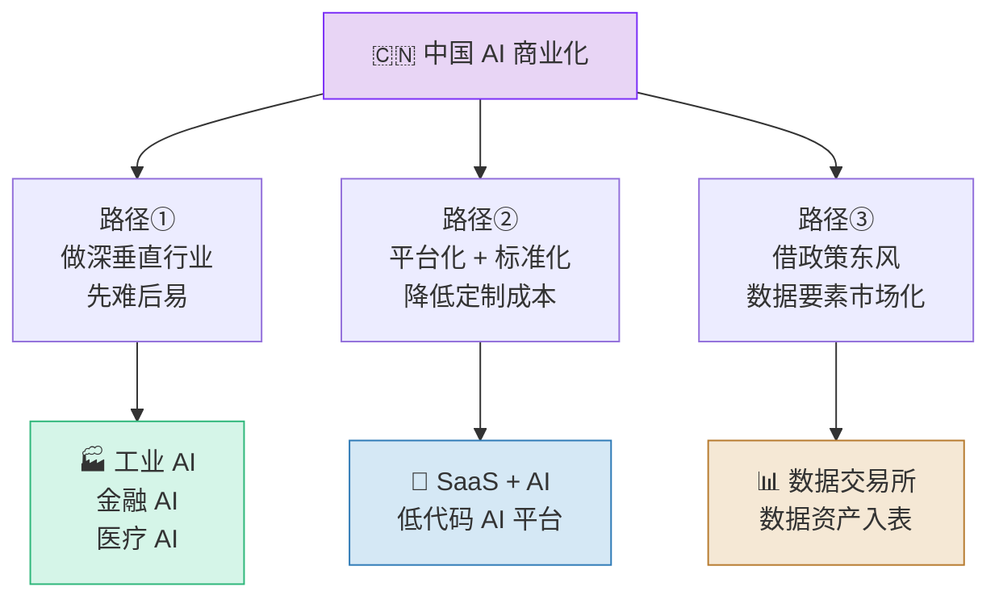
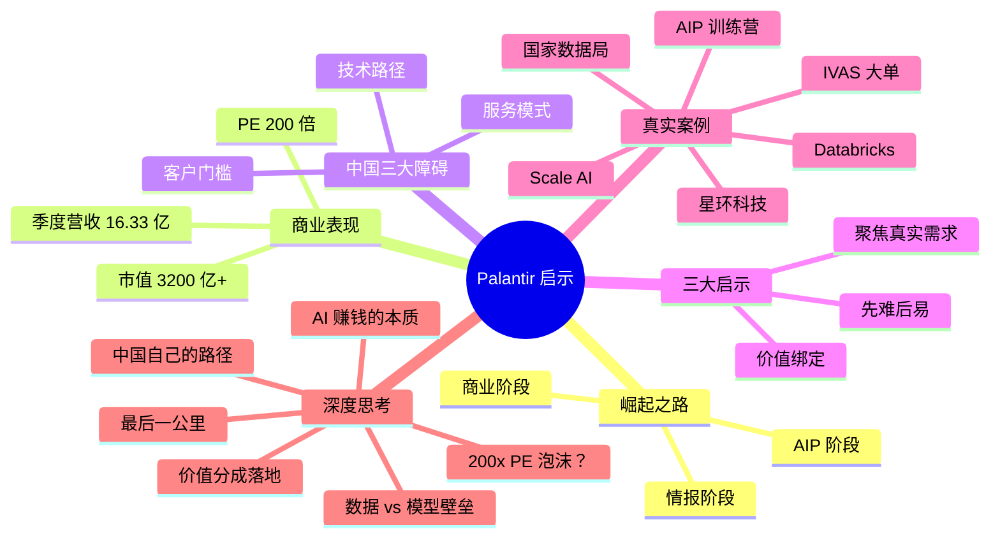

# 🔥 Palantir 爆火背后：AI 的核心赚钱逻辑

美国数据科技公司 Palantir 凭借其 AIP 平台实现惊人增长，市值超 3200 亿美元，证明了 AI 商业化的巨大潜力。其成功模式虽因客户、技术、成本等因素<highlight>难以在中国直接复制</highlight>，但其"回归客户需求"、"价值分成"和"先难后易"的战略思路，为中国 AI 产业提供了宝贵的<highlight>创新破局启示</highlight>。

> **🧠 核心逻辑链：需求 → 交付 → 分成（需交分，AI 能赚钱）**

---

## 🏛️ Palantir 的崛起之路

### 三阶段演进表

| 阶段 | 时间 | 核心客户 | 关键动作 | 记忆锚点 |
|------|------|----------|----------|----------|
| 🕵️ 情报阶段 | 2003-2010s | FBI、CIA 等情报机构 | 打造数据整合平台，解决"911"后情报数据分散问题 | **情** — 从情报起步 |
| 🏭 商业阶段 | 2010s-2020s | 空客、英国 BP 等大型跨国企业 | 将数据能力扩展至商业领域，优化供应链和生产效率 | **商** — 向商业扩张 |
| 🤖 AIP 阶段 | 2023-至今 | 政府 + 企业全面覆盖 | 推出 AIP 人工智能平台，将大语言模型接入企业私有数据，实现自动化业务决策 | **智** — 以 AI 引爆 |

> **🧠 记忆口诀：情 → 商 → 智（情商智，步步升级）**

---

## 💰 惊人的商业表现

Palantir 的成功不仅是技术上的，更是商业上的巨大突破，其数据对国内市场带来了极强的冲击感。

### 核心财务指标

| 指标 | 数据 | 说明 |
|------|------|------|
| 📈 季度营收 | **16.33 亿美元** | 2026 年 Q1，持续高增长 |
| 🏦 市值 | **超 3200 亿美元** | 超越多数传统科技巨头 |
| 📊 市盈率 | **突破 200 倍** | 是英伟达的 4-5 倍，市场给予极高预期 |

---

## 🚧 为何 Palantir 模式难以在中国复制？

尽管 Palantir 模式成功，但由于市场环境和运营模式的差异，其路径在中国面临<highlight>三大核心障碍</highlight>。

### 三大障碍对比表

| 挑战维度 | Palantir 模式 | 中国市场现状 | 记忆锚点 |
|----------|--------------|-------------|----------|
| 👥 客户门槛 | 服务美国政府及大型跨国企业，单个客户年均贡献近 **1 亿美元** | 政企采购客单价低，且有严格的准入限制，难以支撑高成本方案 | **客** — 客户不对等 |
| 🔧 技术路径 | "一个客户一个产品"，为每个客户深度定制，进入新行业需从头建模 | 深度定制模式成本高、周期长，不确定性大，难以规模化 | **技** — 技术难复制 |
| 🧑‍💻 服务模式 | 派遣顶尖工程师驻扎甲方，现场写代码改需求 | "堆人头"的模式远超国内人力成本，不具备经济性 | **人** — 人力不匹配 |

> **🧠 记忆口诀：客 → 技 → 人（客技人，三座大山）**

---

## 💡 Palantir 带来的三大启示

虽然模式无法照搬，但 Palantir 的成功为中国 AI 和数据产业提供了宝贵的创新思路。

---

### 1️⃣ 回归本源，聚焦真实需求

Palantir 不盲目追求技术，而是从客户痛点出发，构建业务语义层，让 AI Agent 在其中精准行动。这解决了当前 AI 落地"跑偏"的核心问题。

| 对比维度 | 传统 AI 落地 | Palantir 模式 |
|----------|-------------|--------------|
| 起点 | 技术驱动，先有模型再找场景 | 需求驱动，先找痛点再配技术 |
| 核心 | 拼模型参数 | 拼业务理解 |
| 结果 | AI 落地"跑偏"，叫好不叫座 | AI Agent 精准行动，直接产出价值 |

> **🔑 未来竞争，拼的不是模型，而是谁更懂业务。**

---

### 2️⃣ 以结果为导向，与客户价值绑定

Palantir 采用独特的"价值分成"模式，将项目收益与客户的业务成果直接挂钩，实现长期共赢。

这启示国内企业应从一次性交付的"项目制"，向与客户共同成长的"运营制"转型。

---

### 3️⃣ 先难后易，实现规模效应

Palantir 遵循"先难后易"的战略，先在高价值垂直领域建立技术壁垒，再横向拓展至其他场景，最终实现业务爆发。

| 阶段 | 策略 | 目标 |
|------|------|------|
| 🏔️ 先难 | 在高价值垂直领域（情报、金融）深耕 | 建立技术壁垒，证明价值 |
| 🔄 后易 | 横向拓展至其他场景（石油、医疗） | 复用核心能力，快速复制 |
| 🚀 爆发 | 形成跨行业的数据智能平台 | 实现规模化增长 |

---

## 🔭 正在发生的真实案例

以下案例均发生在 2024–2026 年间，展示了 Palantir 模式及其启示在现实中的落地形态。

### 案例一览表

| # | 案例 | 核心事件 | 与本文的映射 |
|---|------|----------|--------------|
| ① | Palantir AIP 训练营 | Palantir 推出"Boot Camp"销售模式，让客户在 1-5 天内用真实数据体验 AIP 价值，转化率飙升 | 本文💡启示① — 聚焦真实需求，先让客户"看见"价值 |
| ② | 国家数据局正式挂牌 | 2023 年 10 月成立，2024-2025 年密集出台数据要素政策，专门探讨 Palantir 现象 | 本文🚧中国障碍 — 顶层设计与制度探索 |
| ③ | Databricks 估值突破 620 亿 | 开源数据 + AI 平台，走"平台化 + 自助化"路线，与 Palantir 形成互补竞争 | 本文💡启示③ — 先难后易的另一条路径 |
| ④ | Scale AI 崛起为数据基础设施 | 为美军、OpenAI 等提供高质量数据标注与 AI 数据服务，估值超 138 亿美元 | 本文🏛️崛起之路 — 数据是 AI 的"石油" |
| ⑤ | 中国星环科技"数据 + AI"实践 | 国内大数据基础软件商，打造 AI + 数据中台，尝试从项目制向产品化转型 | 本文💡启示② — 从项目制到运营制的转型尝试 |
| ⑥ | Palantir 拿下美军 IVAS 大单 | 为美陆军集成视觉增强系统（IVAS），单合同价值近 2000 亿美元 | 本文🏛️崛起之路 — "先难"战略的极致体现 |

---

### 案例 ① — Palantir AIP 训练营

**发生了什么：** Palantir 彻底颠覆了传统 To-B 软件销售模式。不再做冗长的 PPT 演示，而是邀请客户带着自己的真实数据，在 1-5 天的"训练营"中直接体验 AIP 平台。客户亲眼看到 AI 如何解决自己的业务问题，签约转化率大幅提升。

**与本文的关系：** 这正是"回归本源，聚焦真实需求"的极致体现——不卖技术概念，卖的是客户"亲眼所见"的业务价值。

---

### 案例 ② — 国家数据局正式挂牌

**发生了什么：** 2023 年 10 月，中国国家数据局正式挂牌成立。2024-2025 年间密集出台数据要素相关政策，推动数据确权、数据交易、数据资产入表等基础制度建设。高层专门探讨 Palantir 现象，思考如何在中国培育类似的数据智能企业。

**与本文的关系：** 国家层面的关注说明 Palantir 模式已不仅是商业话题，更上升为数据战略问题。中国正在从制度层面探索"数据要素市场化"的独特路径。

---

### 案例 ③ — Databricks 估值突破 620 亿

**发生了什么：** Databricks 选择了与 Palantir 截然不同的路径——通过开源数据基础设施（Spark、Delta Lake）构建广泛生态，再叠加 AI 训练和部署能力。它不深度定制，而是提供通用平台让企业自建 AI 应用。2025 年估值突破 620 亿美元，成为 Palantir 最强对标。

**与本文的关系：** Databricks 代表了"先难后易"的另一种诠释——先在开源数据层建立技术壁垒（难），再向 AI 平台延伸（易），同样实现了规模化增长。

---

### 案例 ④ — Scale AI 崛起为数据基础设施

**发生了什么：** Scale AI 从数据标注起家，逐步发展为覆盖军事、政府、科技巨头的 AI 数据基础设施供应商。它不仅为 OpenAI 等公司提供训练数据，更拿下美军大额合同，将"数据质量"打造为核心竞争壁垒。估值超 138 亿美元。

**与本文的关系：** Scale AI 印证了 Palantir 模式的核心逻辑——AI 的价值不在模型本身，而在数据。谁能掌控高质量数据，谁就掌握 AI 时代的"石油"。

---

### 案例 ⑤ — 中国星环科技的转型探索

**发生了什么：** 作为国内领先的大数据基础软件商，星环科技尝试从传统的"项目制交付"向"产品化 + 运营制"转型，打造 AI + 数据中台平台。虽然尚未完全成功，但其探索方向正是 Palantir 启示②的本土化实践。

**与本文的关系：** 中国企业的转型阵痛恰恰印证了"项目制→运营制"转型的难度，也说明了 Palantir 启示在中国落地的现实挑战。

---

### 案例 ⑥ — Palantir 拿下美军 IVAS 大单

**发生了什么：** Palantir 为美国陆军打造集成视觉增强系统（IVAS），将战场数据实时融合到士兵的 AR 头盔中。这份合同价值近 2000 亿美元，是人类历史上最大的国防科技合同之一，也是 Palantir"先难后易"战略的巅峰之作。

**与本文的关系：** 这是"先难后易"的极致案例——先在最难的战场环境中证明价值，再将军用技术迁移至商业场景。

---

## 🧠 最高级思考问答（全文总结）

> 以下 6 个问答覆盖从底层逻辑到终极反思的全维度思考，是理解全文精髓的关键。

---

### Q1：Palantir 200 倍市盈率，是泡沫还是真实价值？

| 维度 | 看多逻辑 | 看空逻辑 |
|------|----------|----------|
| 增长 | 营收持续高增长，AIP 需求爆发 | 增速能否支撑 200x PE 的预期？ |
| 壁垒 | 政府 + 军工客户黏性极强 | 客户集中度高，依赖少数大单 |
| 赛道 | AI 商业化最成功的标杆 | AI 行业整体估值偏高 |

**核心洞察：** 200 倍 PE 本质上是市场在"定价未来"。关键不在于当前估值是否合理，而在于 AI 商业化能否持续超预期。**Palantir 赌的不是今天的利润，而是 AI 全面渗透企业决策的明天。**

---

### Q2：数据壁垒 vs 模型壁垒，哪个更持久？

**核心洞察：** Palantir 的真正护城河不是 AI 模型，而是**对行业数据的深度理解和整合能力**。模型会被开源追平，但 20 年积累的政府和企业数据关系网，无法被复制。这印证了启示①——**拼的不是模型，而是谁更懂业务**。

---

### Q3：AI 商业化的"最后一公里"到底难在哪？

| 难点 | 具体表现 | Palantir 的解法 |
|------|----------|----------------|
| 🔌 接入难 | 企业数据散落在数十个系统，格式混乱 | 打造通用数据整合层（Foundry） |
| 🎯 落地难 | AI 输出"正确但无用"的结论 | 构建业务语义层，让 AI 在行动边界内工作 |
| 💰 变现难 | 客户愿意试用，不愿长期付费 | "价值分成"模式，用结果说话 |
| 🔄 规模化难 | 每个行业都需要从头理解 | "先难后易"，先打透高价值行业再扩展 |

**核心洞察：** AI 商业化的最后一公里，本质上不是技术问题，而是**信任问题**。客户不信任 AI 能真正解决业务问题，Palantir 通过"训练营 + 价值分成"让信任变得可验证。

---

### Q4：中国企业如何走出自己的 AI 商业化路径？

**核心洞察：** 中国不需要复制 Palantir，而是需要找到自己的路。**三条可行路径**：① 在工业/金融等垂直领域做深做透；② 用标准化平台降低定制成本；③ 借国家数据局政策东风，参与数据要素市场建设。

---

### Q5："价值分成"模式在中国能落地吗？

| 条件 | 美国（Palantir） | 中国（现实挑战） | 破局可能 |
|------|------------------|-----------------|----------|
| 客户信任 | 长期合作建立信任 | 信任基础薄弱 | 从免费试用 → 效果付费起步 |
| 数据可量化 | 业务成果容易衡量 | 很多业务效果难以量化 | 选择可量化场景（如供应链降本） |
| 付费意愿 | 高客单价、长周期 | 预算有限、决策链长 | 中小企业 SaaS 化，降低门槛 |
| 法律环境 | 合同体系成熟 | 数据权属不清 | 借数据要素政策逐步完善 |

**核心洞察：** "价值分成"在中国不能照搬，但其**精神内核可以落地**——从"卖工具"转向"卖结果"，从"一锤子买卖"转向"长期共赢"。关键是选择**效果可量化**的垂直场景作为突破口。

---

### Q6：终极反思——AI 赚钱的本质是什么？

> **"Palantir 证明的最重要一件事，不是 AI 有多强大，而是 AI 可以真正赚钱。"**

| 层次 | 认知 | 隐喻 |
|------|------|------|
| 第一层 | AI 是技术工具 | 🔧 锤子 |
| 第二层 | AI 是效率引擎 | ⚙️ 工厂 |
| 第三层 | AI 是决策中枢 | 🧠 大脑 |
| 第四层 | AI 是商业模式的基石 | 💎 印钞机 |
| 第五层 | AI 是人与数据的共生体 | 🌌 数字合伙人 |

**最终回答：** AI 赚钱的本质不是"技术变现"，而是**"信任变现"**——谁能用 AI 让客户相信"问题被解决了"，谁就能赚到钱。Palantir 的伟大之处不在于技术最强，而在于它第一个证明了 **AI 可以从"成本中心"变成"利润中心"**。

> **🔑 全文终极洞察：AI 赚钱 = 懂业务（需求）× 可验证（信任）× 可持续（模式）**

---

## 📌 核心结论

Palantir 的神话虽无法再造，但其商业化实践证明了 AI 能真正跑出来赚钱。其"回归客户需求"、"价值分成"和"先难后易"的战略思路，为中国 AI 产业提供了宝贵的<highlight>创新破局启示</highlight>，这也是国家数据局专门探讨其现象的根本原因。

> **🔑 全文总结一句话：AI 赚钱的核心逻辑 = 懂需求 × 绑价值 × 先难后易。**

---

### 📐 全文结构速览表

| 章节 | 核心内容 | 关键词 | 记忆锚点 |
|------|----------|--------|----------|
| 🏛️ 崛起之路 | 情报 → 商业 → AIP 三阶段 | 数据整合 · AI 平台 | **情商智** |
| 💰 商业表现 | 营收/市值/PE 三大指标 | 3200 亿 · 200 倍 PE | **高增长** |
| 🚧 中国障碍 | 客户·技术·服务三座大山 | 不可复制 | **客技人** |
| 💡 三大启示 | 需求·价值·先难后易 | 创新破局 | **需价难** |
| 🔭 真实案例 | 6 个 2024-2026 案例 | 训练营 · 数据局 · IVAS | **六验证** |
| 🧠 深度思考 | 6 个终极问答 | AI 赚钱的本质 | **六反思** |

> **🧠 终极记忆链：Palantir = 情商智（崛起）→ 客技人（障碍）→ 需价难（启示）→ 六验证（案例）→ 六反思（思考）**
