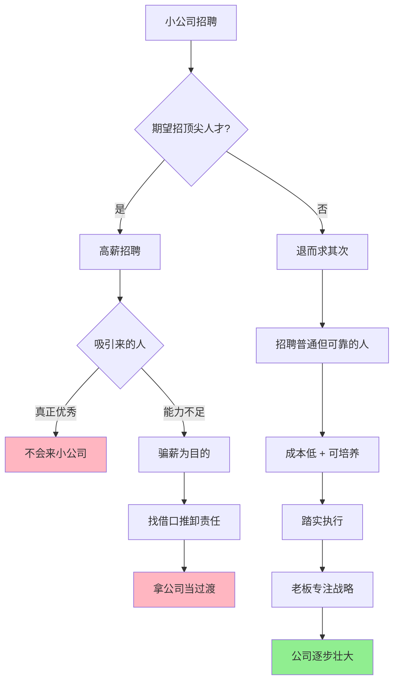

# 小公司招聘策略：放弃幻想，脚踏实地

> 核心观点：小公司不应期望招聘到顶尖人才，而应招聘普通但可靠的员工，老板自身的能力和员工的执行力才是成功关键。

## 招聘决策逻辑图



## 两种招聘策略对比

| 维度 | ❌ 高薪招聘陷阱 | ✅ 务实招聘策略 |
|------|----------------|----------------|
| **目标人群** | 顶尖人才、全才 | 普通但可靠的员工 |
| **成本** | 高薪资支出 | 成本可控 |
| **人员质量** | 可能吸引骗薪者 | 诚实、踏实肯干 |
| **离职风险** | 高（当过渡跳板） | 低（稳定执行） |
| **管理难度** | 高（找借口推责） | 低（听话执行） |
| **长期价值** | 低 | 可培养、可成长 |
| **最终结果** | 浪费资源 | 公司稳步发展 |

## 核心要点

### 1. 高薪招聘的陷阱

- **优秀人才不来**：真正好的人才通常不会选择加入中小公司
- **警惕"骗子"**：高薪可能吸引能力不足、以骗薪为目的的人
- **能力与借口**：这些人入职后以"公司这没有那没有"为由无法完成工作，实际是本身能力不行

### 2. 招聘的核心：退而求其次

- **放弃幻想**：接受招不到顶尖人才的现实
- **招聘普通人才**：选择"普通一点"、"不是全才"的员工
- **成本与实用**：成本低 + 具备学习能力和韧性 + 可被培养

### 3. 成功的关键：老板与执行力

- **老板是核心**：中小公司成功关键在于老板自己的能力
- **员工是"手脚"**：员工主要作用是听话和执行
- **能力与责任**：老板不应甩锅给员工
- **脚踏实地**：招聘底色好、诚实、踏实的员工，老板专注更重要的事

## 行动清单

- [ ] 重新审视当前招聘标准是否过于理想化
- [ ] 调整薪资预期，控制人力成本
- [ ] 建立"可靠性"评估维度（诚实、踏实、执行力）
- [ ] 老板自身持续提升业务和战略能力
- [ ] 培养现有员工的执行力和忠诚度

---

## 现实案例

### 案例一：某互联网创业公司的"CTO 陷阱"

**背景**：A 公司融资 500 万，CEO 花 80 万年薪挖来某大厂"技术专家"担任 CTO。

**结果**：
- 入职 3 个月，以"没有成熟的技术栈"、"没有 DevOps 团队支持"为由，核心系统迟迟未上线
- 实际上此人只是大厂螺丝钉，独立从 0 到 1 的能力为零
- 6 个月后离职，公司浪费了 40 万 + 半年时间

**反思**：如果招一个 20 万年薪、有创业经历、能写能扛的全栈工程师，结果可能完全不同。

---

### 案例二：字节跳动早期的"用人哲学"

**做法**：
- 创业初期不追求"大厂背景"，而是招"聪明、自驱、能扛事"的年轻人
- 很多早期员工是应届生或工作 1-2 年的新人
- 张一鸣自己深度参与产品和业务决策，员工负责高效执行

**启示**：老板的能力和判断力 > 员工的光鲜履历

---

### 案例三：某电商小团队的"务实招聘"

**背景**：B 公司 10 人团队，年营收 2000 万。

**招聘标准**：
- 不看学历、不看大厂背景
- 只看三点：①是否诚实 ②是否愿意干脏活累活 ③是否有学习能力

**结果**：
- 团队稳定性极高，核心员工跟随 5 年以上
- 老板从日常运营中抽身，专注战略和资源整合
- 公司利润率远高于同行业"明星团队"

---

## 深度思考问答

### Q1：如果小公司只招"普通人"，会不会永远做不大？

**答**：这是一个认知误区。公司的规模取决于**老板的认知边界**和**系统的可复制性**，而不是员工的个人能力。

- 麦当劳的员工都是"普通人"，但系统让它成为万亿帝国
- 小公司做不大的根本原因：老板自己没想清楚商业模式，而不是员工不够优秀
- 正确思路：先跑通模式 → 再招人复制 → 最后才是升级人才结构

---

### Q2："退而求其次"会不会变成"降低标准"的借口？

**答**：关键要区分**"降低能力标准"**和**"调整期望维度"**：

| 降低标准 ❌ | 调整维度 ✅ |
|------------|------------|
| 招能力差的人 | 招能力匹配的人 |
| 不要求执行力 | 要求执行力 > 创新能力 |
| 容忍混日子 | 要求诚实、踏实、可培养 |

核心：不是"随便招"，而是"招对人"——**可靠性 > 光鲜履历**

---

### Q3：老板如何判断自己是否"足够强"来弥补员工的"普通"？

**答**：问自己三个问题：

1. **战略清晰度**：我能否用一句话说清公司未来 1 年要做什么？
2. **业务拆解力**：我能否把目标拆成员工可执行的具体任务？
3. **决策质量**：过去半年的关键决策，有多少是正确的？

如果三项都模糊，问题不在员工，在老板自己。

---

### Q4：这种思路是否意味着小公司不需要"人才升级"？

**答**：需要，但时机和方式不同：

```
创业阶段：
  老板强 + 员工普通执行 = 活下来
  
成长阶段：
  系统强 + 员工专业分工 = 跑得快
  
成熟阶段：
  文化强 + 人才自驱 = 走得远
```

错误在于：**在"活下来"阶段就追求"走得远"的人才配置**。

---

### Q5：最高级的思考——小公司真正的竞争壁垒是什么？

**答**：不是人才，不是技术，不是资金，而是：

> **老板的认知速度 × 组织的执行效率**

- 认知速度：比别人更快看清趋势和机会
- 执行效率：用最小成本、最快速度验证和落地

大公司有人才、有资源，但决策慢、成本高。小公司的优势在于**灵活和聚焦**——前提是用对策略、用对人。

---

## 一句话总结

> **小公司的成功公式：清醒的老板 + 可靠的执行者 + 务实的预期 = 可持续的增长**
