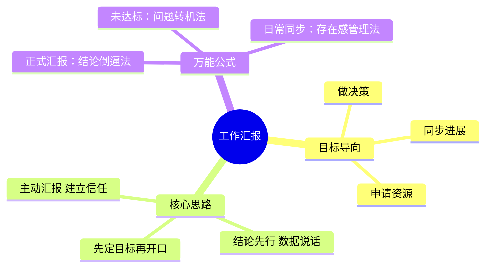
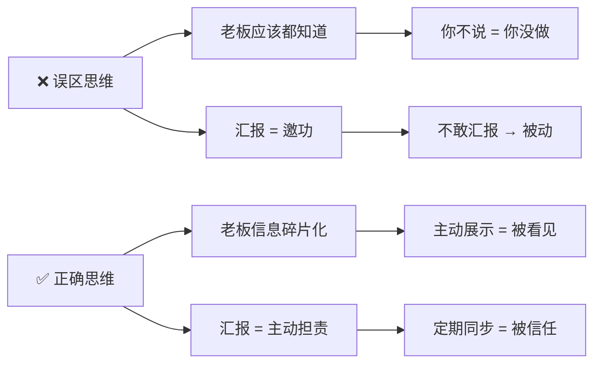
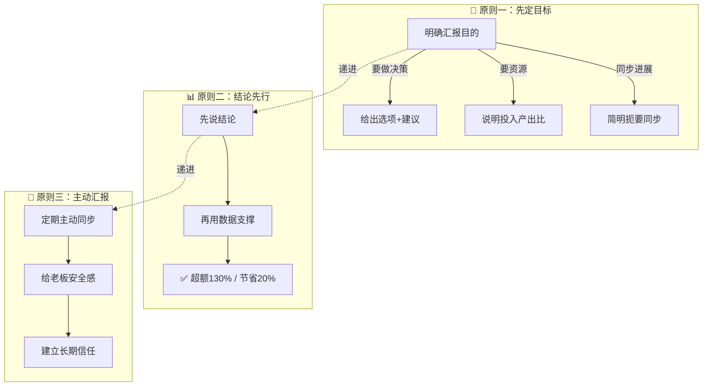
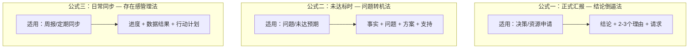
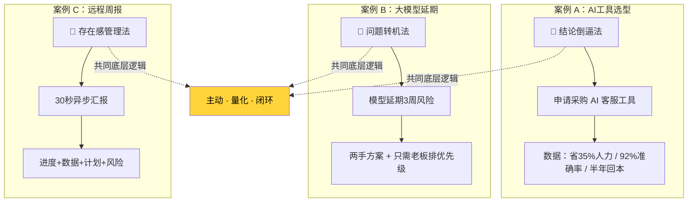
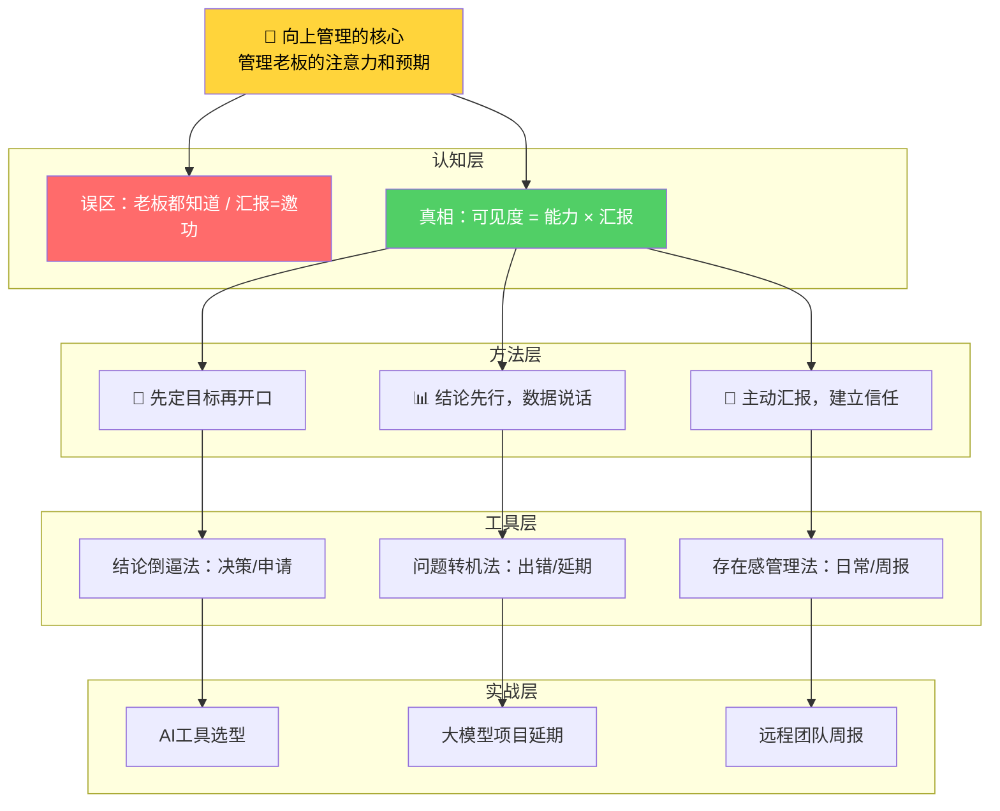

# 工作汇报：顶级向上管理的核心

> **核心定义**：工作汇报的本质不是简单告知，而是 `管理老板的注意力和预期`。优秀的汇报者能主动同步信息、分担压力，从而获得更多资源和信任。



---

## 一、汇报的两大常见误区

许多人对汇报存在误解，导致沟通低效甚至产生负面效果。

| 误区 | ❌ 错误认知 | ✅ 正确认知 |
|------|------------|------------|
| 误区一 | 认为老板都知道，只是走个过场 | 老板信息是碎片化的，你不主动展示价值，他只会默认你没有价值 |
| 误区二 | 觉得汇报就是邀功 | 汇报是作为负责人，主动同步进度、风险和结果，是责任与担当的体现 |



---

## 二、汇报的三大核心思路

掌握以下三个原则，能让你的汇报更有价值。

| 核心原则 | 关键词 | 行动指南 | 反面案例 |
|----------|--------|----------|----------|
| 🎯 先定目标再开口 | **目的明确** | 汇报前明确：要决策？要资源？还是同步进展？目标不同，说辞完全不同 | 没有目标地罗列工作，老板听不懂你要什么 |
| 📊 结论先行，数据说话 | **量化表达** | 开口第一句抛结论，用具体数据代替模糊词汇 | "项目做得挺好的" → "项目超额完成130%，节省20%成本" |
| 🚀 主动汇报，建立信任 | **安全感** | 长期项目定期同步，哪怕只是一句"一切正常" | 等老板来问，已陷入被动 |



---

## 三、三个万能汇报公式

以下公式可直接套用，让汇报变得简单高效。



### 1. 正式汇报：结论倒逼法

> **适用场景**：需要老板做决策或申请资源

**公式**：`结论` + `2-3个理由` + `请求`

| 要素 | 说明 | 案例（申请为项目组加人） |
|------|------|--------------------------|
| 结论 | 开门见山说出你的建议 | "张总，我建议给项目组加一个人。" |
| 理由① | 数据支撑，最有说服力 | "第一，目前排期已超负荷30%" |
| 理由② | 趋势/风险说明紧迫性 | "第二，下个月还有新需求进来" |
| 理由③ | 收益预期，给出正向价值 | "第三，加人可使交付时间提前两周" |
| 请求 | 明确提出需要的支持 | "希望您能支持" |

---

### 2. 未达标时：问题转机法

> **适用场景**：项目出现问题或未达预期，展现解决能力

**公式**：`事实` + `问题` + `方案` + `支持`

| 要素 | 说明 | 案例（转化率下降） |
|------|------|---------------------|
| 事实 | 客观数据，不回避 | "张总，本月转化率掉了8%" |
| 问题 | 根因分析，展现深度 | "主要原因是投放素材太旧" |
| 方案 | 已有行动，证明主动 | "我已让设计出了三版新素材，下周上线测试" |
| 支持 | 明确需要老板协调的事项 | "需要您帮忙协调媒介那边的排期" |


---

### 3. 日常同步：存在感管理法

> **适用场景**：周报或非核心项目的定期同步，保持存在感

**公式**：`进度` + `数据结果` + `行动计划`

| 要素 | 说明 | 案例（系统升级项目） |
|------|------|-----------------------|
| 进度 | 当前完成到哪 | "系统升级已完成80%" |
| 数据结果 | 关键节点/预期 | "预计周三上线" |
| 行动计划 | 下一步安排 | "下周将安排全员培训" |

---

## 四、公式速查对照表

| 场景 | 公式名称 | 结构 | 关键要诀 |
|------|----------|------|----------|
| 决策/申请资源 | 结论倒逼法 | 结论 + 理由 + 请求 | 数据说话，给选项不给开放题 |
| 未达标/出问题 | 问题转机法 | 事实 + 问题 + 方案 + 支持 | 先承认再解决，带方案不带情绪 |
| 周报/日常同步 | 存在感管理法 | 进度 + 数据 + 计划 | 简明扼要，定期主动，不给老板追问机会 |

---

## 五、一句话带走

> 老板的注意力和资源是稀缺品。与其被动等待，不如主动出击。通过高效的工作汇报，`主动争取注意力`，才能在职场中掌握主动权，获得更多机会。

---

## 六、正在发生的实战案例

> 以下案例取材于 2025-2026 年真实职场场景，展示三大公式在当下环境中的直接应用。

### 案例 A：AI 工具选型汇报 — 结论倒逼法

**背景**：某互联网公司产品经理发现团队每日手动处理大量用户反馈，效率低下。她调研了三款 AI 客服工具后，需要向 VP 申请采购预算。

**❌ 低效汇报**：
> "领导，最近大家都在讨论 AI 工具，我们也应该跟上趋势吧……目前市面上有挺多选择的，要不我们试试？"

**✅ 高效汇报（结论倒逼法）**：
> "王总，我建议采购智齿客服 AI 工具，年费 12 万。
> 第一，目前客服团队每天花 4.5 小时手动分类反馈，占人力的 35%；
> 第二，内测两周，AI 自动分类准确率达 92%，每人每天可省出 1.5 小时；
> 第三，按 6 人团队计算，半年内即可收回成本。
> 希望批一下采购流程。"

| 拆解 | 对应要素 |
|------|----------|
| "建议采购智齿客服 AI" | ✅ 结论先行 |
| 三个数据化理由（35%、92%、半年回本） | ✅ 数据说话 |
| "希望批一下采购流程" | ✅ 明确请求 |

---

### 案例 B：大模型项目延期 — 问题转机法

**背景**：某 AI 创业公司的算法负责人负责训练一个行业大模型，原定 6 月交付，但因为 GPU 算力资源被其他项目挤占，训练进度只完成 60%，面临延期风险。

**❌ 低效汇报**：
> "领导，那个……模型训练可能得推迟一下，因为算力不太够用……"
> （老板心想：所以呢？你要我怎么办？）

**✅ 高效汇报（问题转机法）**：
> "李总，跟您同步一个风险。大模型训练目前完成 60%，按现有算力预计要延期 3 周。
> 核心原因是上周紧急插入了 B 客户的微调任务，占用了 40% 的 GPU 资源。
> 我已经做了两手准备：第一，把训练任务拆分到夜间低谷时段，可恢复 25% 算力；第二，跟云厂商谈了临时扩容方案，增加 8 张卡，两周费用约 3 万。
> 需要您帮忙确认一下 B 客户任务的优先级排序，我好决定算力怎么分配。"

| 拆解 | 对应要素 |
|------|----------|
| "完成 60%，预计延期 3 周" | ✅ 事实，不回避 |
| "B 客户任务挤占 40% 算力" | ✅ 问题，根因清晰 |
| "夜间拆分 + 临时扩容两手准备" | ✅ 方案，已在行动 |
| "确认 B 客户优先级" | ✅ 支持，明确需要老板做什么 |

> 💡 **加分项**：不仅带着方案去，还把决策项缩小到"一个选择题"——老板只需排优先级，而不是"想办法解决延期"。

---

### 案例 C：远程团队周报 — 存在感管理法

**背景**：2026 年某跨国团队完全远程协作，分布在北京、新加坡、硅谷三地。团队负责人每周五向 CTO 发送一条异步汇报消息。

**❌ 低效汇报**：
> "本周工作正常推进中，下周继续。"
> （老板心想：所以到底推进了什么？）

**✅ 高效汇报（存在感管理法）**：
> "本周进展：多语言推荐引擎 v2 已完成联调，A/B 测试覆盖 15% 流量，点击率提升 7.2%。
> 下周计划：周三全量上线，周四出完整数据报告。
> 风险项：硅谷团队因时区差异，联调效率下降 20%，已改用录屏交接缓解。"

| 拆解 | 对应要素 |
|------|----------|
| "联调完成，覆盖15%，点击率+7.2%" | ✅ 进度 + 数据结果 |
| "周三上线，周四出报告" | ✅ 行动计划，精确到天 |
| 主动提及风险 + 缓解措施 | ✅ 超出预期的加分项 |

> 💡 **核心洞察**：远程时代，`可见性 = 信任`。30 秒就能读完的汇报，比一封长邮件有效 10 倍。

---

### 案例对比总览



---

## 七、最高级思考问答（全文总结）

> 以下 7 组问答，层层递进，从表面技巧深入到向上管理的本质认知。掌握这些思考，才算真正内化了工作汇报的底层逻辑。

### Q1：汇报的终极目的是什么？

<details>
<summary>💭 先想一想，再点击展开</summary>

> **不是告知，不是邀功，而是「管理老板的认知」。**
>
> 老板对你的评价 = 你的实际能力 × 你的可见度。汇报就是提升可见度的杠杆。不做汇报，能力再强，在老板的认知里也只是"0"。

</details>

---

### Q2：老板最讨厌什么样的汇报？

<details>
<summary>💭 先想一想，再点击展开</summary>

> **老板最讨厌的三种汇报：**
>
> | 类型 | 表现 | 老板内心OS |
> |------|------|------------|
> | 开放题式 | "您觉得我们接下来怎么做？" | "我要你干嘛的？" |
> | 流水账式 | "今天开了3个会，写了2个文档……" | "所以呢？有价值产出吗？" |
> | 惊吓式 | "完了完了，客户要跑了！" | "你能不能带着方案再来？" |
>
> **本质**：这些汇报都在把思考的负担转嫁给老板，而不是替老板节省认知资源。

</details>

---

### Q3：什么时候该汇报？有没有节奏感？

<details>
<summary>💭 先想一想，再点击展开</summary>

> **汇报的最佳时机遵循「三报」节奏：**
>
> ```mermaid
> graph LR
>     A["📢 事前报方案"] -->|争取对齐| B["📊 事中报进度"]
>     B -->|保持透明| C["📋 事后报结果"]
>     C -->|沉淀复盘| A
>
>     style A fill:#339af0,color:#fff
>     style B fill:#51cf66,color:#fff
>     style C fill:#ffd43b,color:#000
> ```
>
> - **事前报方案**：拿到任务 24 小时内，汇报你的拆解思路和预期节点
> - **事中报进度**：按项目周期 1/3 处主动同步，不等老板来问
> - **事后报结果**：完成后 48 小时内汇报，带数据 + 复盘 + 下一步
>
> **关键原则**：好消息主动报（放大价值），坏消息更要主动报（赢得时间窗口）。

</details>

---

### Q4：遇到"甩锅型"老板或"放养型"老板，怎么调整汇报策略？

<details>
<summary>💭 先想一想，再点击展开</summary>

> **先判断老板的管理风格，再选择汇报策略：**
>
> | 老板类型 | 特征 | 你的策略 |
> |----------|------|----------|
> | **微管型** | 事无巨细都要过问 | 主动高频同步，用细节填满他的安全感，反而能争取自主空间 |
> | **甩锅型** | 出了问题全推给你 | 每次汇报留文字记录（邮件/文档），关键决策让老板书面确认 |
> | **放养型** | 基本不问你做了什么 | 主动制造"触点"，每周一条存在感汇报，让老板知道你在运转 |
> | **结果导向型** | 只看结果不关心过程 | 结论先行 + 数据说话，过程一笔带过，重点突出产出 |
>
> **最高级的向上管理**：不是改变老板，而是 `适配老板的信息接收方式`。

</details>

---

### Q5：汇报和"拍马屁"的边界在哪里？

<details>
<summary>💭 先想一想，再点击展开</summary>

> **核心区分标准：**
>
> ```mermaid
> graph LR
>     subgraph "拍马屁"
>         P1["目的：讨好个人"]
>         P2["内容：夸大/虚构"]
>         P3["效果：短期获益，长期失信"]
>     end
>
>     subgraph "专业汇报"
>         R1["目的：推进工作"]
>         R2["内容：真实数据+客观分析"]
>         R3["效果：长期积累信任资产"]
>     end
>
>     style P1 fill:#ff6b6b,color:#fff
>     style P2 fill:#ff6b6b,color:#fff
>     style P3 fill:#ff6b6b,color:#fff
>     style R1 fill:#51cf66,color:#fff
>     style R2 fill:#51cf66,color:#fff
>     style R3 fill:#51cf66,color:#fff
> ```
>
> **一句话判断**：如果你的汇报把老板换成任何人，内容还成立，那就是专业汇报；如果只有对这个人才能说出口，那可能是在拍马屁。
>
> 真正的向上管理是 `用专业赢得尊重`，而不是用讨好换取好感。

</details>

---

### Q6：为什么"主动汇报"是最高级的职场策略？

<details>
<summary>💭 先想一想，再点击展开</summary>

> 因为主动汇报的本质是 `建立信息不对称的优势`：
>
> | 层次 | 被动者 | 主动者 |
> |------|--------|--------|
> | 信息层 | 等老板分配信息 | 主动同步，掌握信息主动权 |
> | 信任层 | 被质疑才解释 | 提前透明，建立信任储备 |
> | 资源层 | 缺资源才争取 | 平时积累，关键时刻老板主动给 |
> | 发展层 | 晋升时"想不起来" | 持续可见，晋升候选名单上的常客 |
>
> **底层逻辑**：职场中最大的不公平不是能力差距，而是 `可见度差距`。同样做到 80 分，主动汇报的人被看见 100 分，不汇报的人只被看见 50 分。

</details>

---

### Q7：如果用一句话概括汇报的最高境界？

<details>
<summary>💭 先想一想，再点击展开</summary>

> ### 🏆 「让老板觉得把事交给你，他可以放心去打高尔夫。」
>
> 这就是安全感的最高形态——你不仅在汇报工作，你是在 `经营一个人的预期管理`。
>
> 当你成为老板心中的"确定性来源"，你就从执行者变成了不可或缺的合作者。
>
> **向上管理的终极答案**：
>
> ```
> 你汇报的不是工作，而是"我值得被信任"；
> 你争取的不是注意力，而是"我配得上更多机会"。
> ```

</details>

---

## 全文知识图谱


