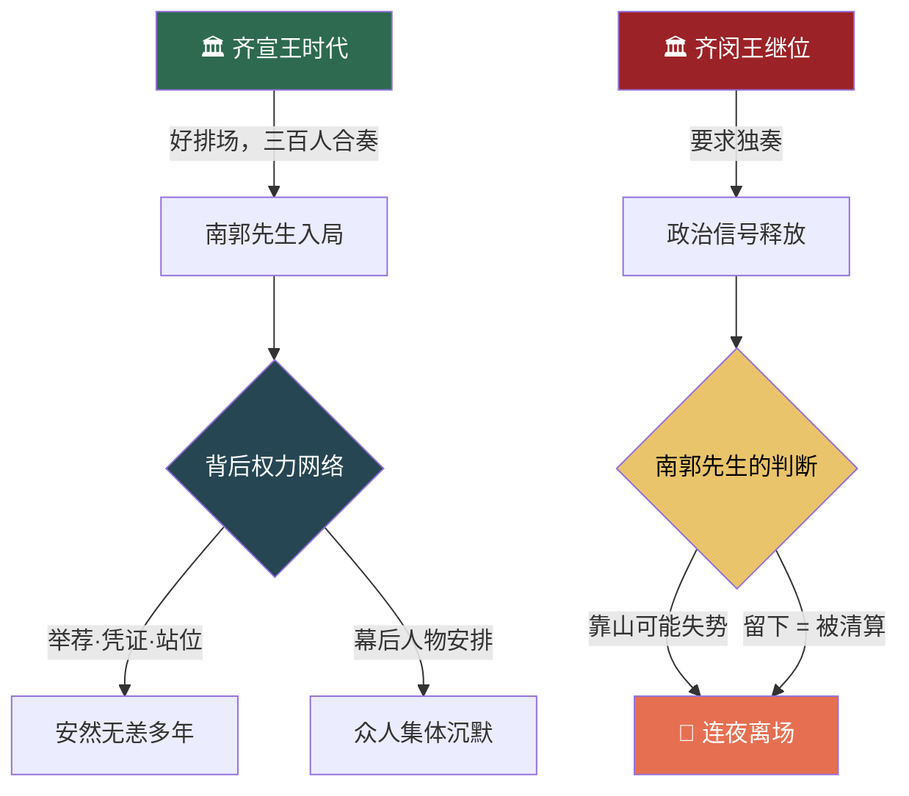
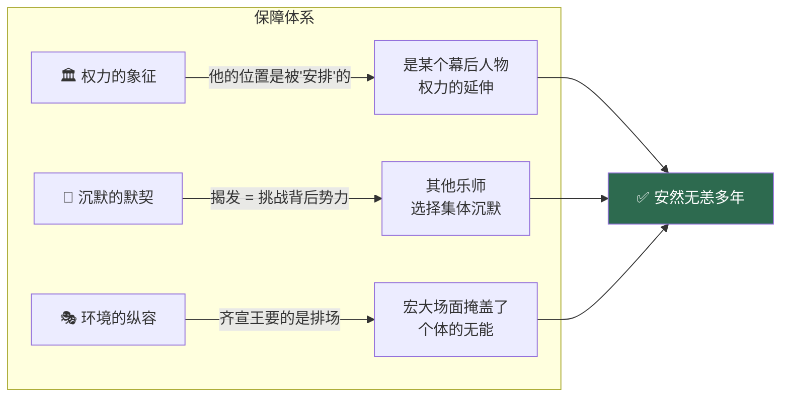
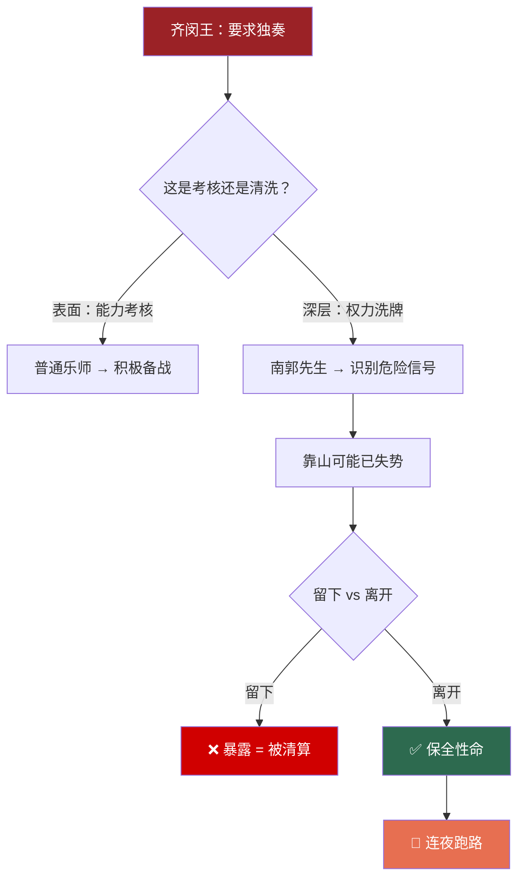
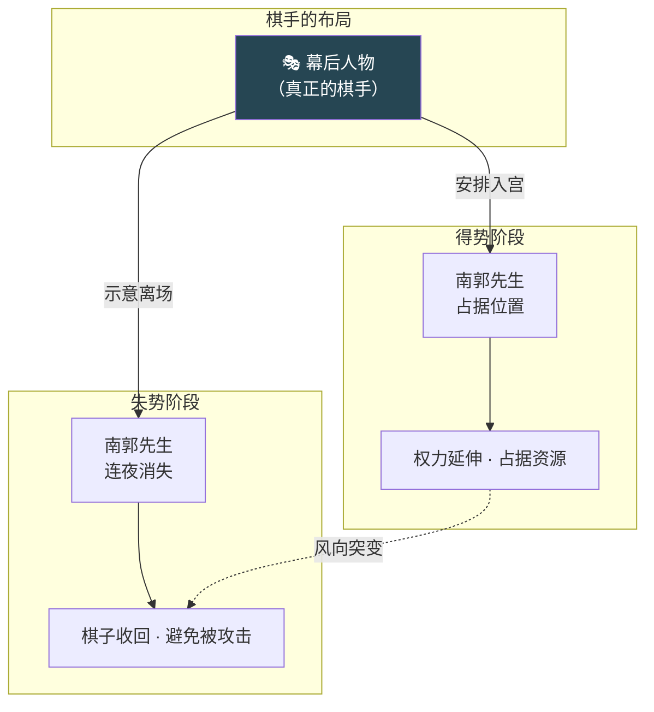
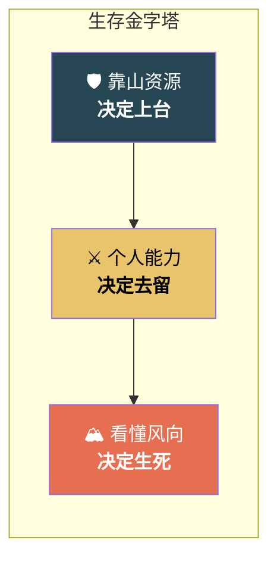
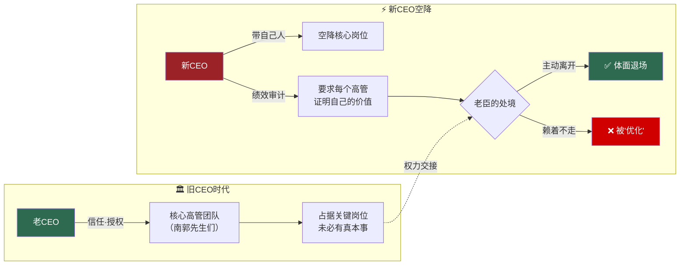
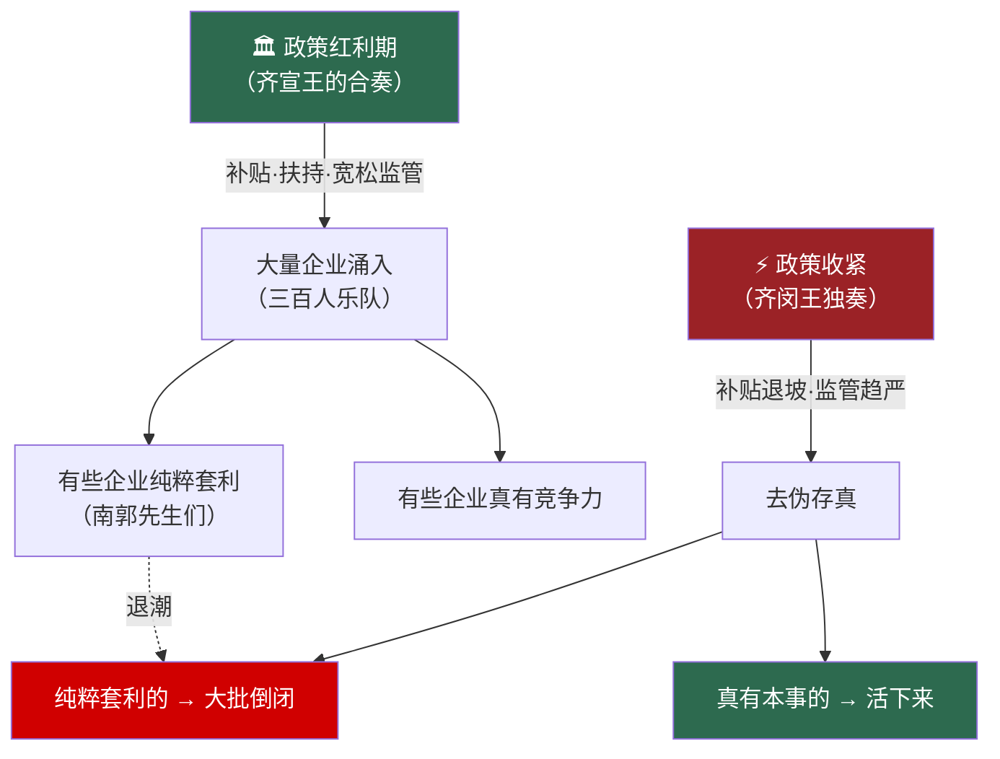
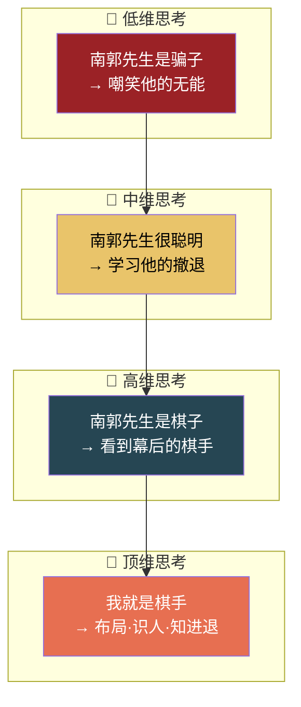

# 滥竽充数新解：权力洗牌中的生存智慧

> **核心论点**：我们熟知的"滥竽充数"故事，通常被解读为讽刺不学无术的骗子。但其本质并非能力与欺骗，而是一则关于**权力运作**与**生存智慧**的寓言。南郭先生的"全身而退"，恰恰证明了他是权力游戏中**最清醒的玩家**。

---

## 📊 全览图：滥竽充数的权力博弈模型



---

## 一、传统解读的巨大漏洞

故事的传统版本认为，南郭先生是一个侥幸混入乐队的骗子。但这忽略了一个关键问题：**在等级森严的战国宫廷，一个普通人是如何通过层层筛选，进入三百人编制的皇家乐队的？**

### 📋 入局可行性分析

| 环节 | 传统认知 | 现实逻辑 | 推论 |
|:---:|:---:|:---|:---|
| 🔑 混入方式 | 偷偷溜进去 | 需要举荐、凭证、签名，缺一不可 | 有后台安排 |
| 👥 乐队环境 | 一个人装模作样 | 三百人朝夕相处，谁会谁不会，第一天就知道 | 伪装不可能长期维持 |
| 🤐 众人反应 | 无人察觉 | 多年无人举报，说明大家不敢说 | 背后势力令人畏惧 |

> 👉 **结论**：南郭先生能站在那里，本身就是一种**巨大的本事**。他的价值不在于吹竽，而在于"站位"**。

---

## 二、南郭先生为何能安然无恙？

南郭先生能在宫廷乐队中待很多年，并非因为他伪装得好，而是因为他背后牵扯着复杂的权力关系。

### 📋 安然无恙的三重保障



> 真正危险的，从来不是能力差的人，而是**能力差却没人敢动的人**。

---

## 三、关键转折：为何要"连夜跑路"？

新王齐闵王继位，要求乐师独奏。南郭先生的第一反应不是装病或拖延，而是**立刻消失**。这背后隐藏着更深的考量。

### 📋 同一事件的不同解读

| 视角 | 看到的是... | 实际意味着... | 行动策略 |
|:---:|:---|:---|:---|
| 👨‍🎵 普通乐师 | 一次演奏考核 | 展示个人技艺的机会 | 积极准备 |
| 🧠 南郭先生 | 一场权力洗牌 | 旧时代结束，清算即将开始 | 立刻离场 |



> 他跑的不是独奏，而是独奏背后释放的**政治信号**。他敏锐地意识到，自己的靠山可能已经失势，必须立刻离场。

---

## 四、真正的主角：从未露面的幕后之手

视频推测，故事中真正的主角，是那个将南郭先生送进宫廷，又在关键时刻让他"消失"的**幕后人物**。南郭先生不过是这只手在棋盘上的一枚棋子。

### 📋 棋手与棋子的博弈关系



> 得势时，棋子被摆上台面，占据一个位置；失势时，棋子被迅速收回，避免成为攻击目标。**所有人都在嘲笑棋子的无能，却无人察觉棋手的高明。**

---

## 五、核心启示：看懂风向的生存法则

滥竽充数的故事，最终揭示了一个关于生存的残酷真相：

### 📋 生存三要素模型



| 生存要素 | 作用 | 失效后果 |
|:---:|:---|:---|
| 🛡️ 靠山 | 能送你**上台** | 无人引荐，连入场资格都没有 |
| ⚔️ 能力 | 能让你**留下** | 环境变化时，无法自保 |
| 🏔️ 风向 | 决定你能不能**活着下台** | 看不懂信号，成为权力洗牌的牺牲品 |

---

## 🧠 逻辑记忆：一句话串联全篇

```
一个靠「站位」入局的人 → 凭「关系网」安然多年 → 因「读懂信号」果断离场 → 
背后「棋手」才是真正主角 → 终极启示：「风向」比能力更决定生死
```

### 记忆锚点

| 章节 | 关键词 | 记忆锚点 |
|:---:|:---:|:---|
| 一 | **入局** | 能站上去 = 本事，不是运气 |
| 二 | **自保** | 没人敢动 = 最安全的伪装 |
| 三 | **离场** | 跑的不是考试，是政治信号 |
| 四 | **棋手** | 嘲笑棋子无能，却看不见棋手高明 |
| 五 | **风向** | 靠山送你上台，风向决定你下台 |

---

---

## 六、现实映照：当下正在发生的"滥竽充数"

历史的剧本从未改变，只是换了舞台。今天的商业世界、职场生态中，"南郭先生"的故事每天都在重演。

### 📋 当代案例对照表

| 场景 | "齐宣王"（庇护者） | "南郭先生"（站位者） | "齐闵王"（变局者） | "独奏"（考验） | 结局 |
|:---|:---|:---|:---|:---|:---|
| 🏢 **企业换帅** | 老CEO / 创始人 | 靠关系上位的高管 | 空降的新CEO | 绩效重组、业务审视 | "老臣"集中离职 |
| 💼 **VC更迭** | 前轮投资人 | 被投企业中的"关系户" | 新领投方 | 尽职调查、董事会重组 | 被"优化"出局 |
| 🏛️ **政策转向** | 旧政策红利期 | 靠政策套利生存的企业 | 新监管政策 | 合规审查、行业整顿 | 潮退裸泳者现形 |
| 🎓 **学术圈** | 学术权威 / 导师 | 靠师门关系获职位者 | 新院长 / 新评审体系 | 独立考核、论文审查 | "混子"无处遁形 |
| 📱 **大厂裁员** | 扩张期的业务线VP | 靠站队生存的"PPT工程师" | 降本增效的新战略 | 业务线合并、ROI考核 | 潮水退去，谁在裸泳 |

### 🔍 深度案例解析

#### 案例一：企业换帅——"空降CEO与老臣出走"



> **现实映射**：每一次企业换帅，都是一次"齐闵王独奏"。新CEO的"绩效审视"就是那首必须独奏的曲子——**你到底是真有本事，还是只是在"充数"，一首曲子就能听出来。**

#### 案例二：政策套利——"潮退方知谁在裸泳"



> **经典台词**：*"只有退潮的时候，你才知道谁在裸泳。"* ——巴菲特。这句话的本质就是：当"合奏"变成"独奏"，南郭先生们就藏不住了。

### 📊 当代"南郭先生"的五个信号

| # | 信号 | 表现 | 本质 |
|:---:|:---|:---|:---|
| 1 | 🔗 **靠关系上位** | 简历光鲜但经不起深究，核心能力是"认识谁" | 入局靠"站位" |
| 2 | 🎭 **擅长表演** | 会议发言精彩，落地执行稀烂；PPT做得比产品好 | 充数的核心技能 |
| 3 | 🤐 **同事心知肚明** | 周围人都知道他不行，但没人说破 | 沉默的默契 |
| 4 | 🛡️ **上面有人罩** | 领导对他格外宽容，考核标准似乎不同 | 权力的庇护 |
| 5 | 🏃 **风向一变就跑** | 领导调走后第一时间离职，绝不等到被审查 | 最清醒的撤退 |

---

## 七、最高级思考：十个灵魂拷问

> 读懂了故事，还要读懂自己。以下十个问题，是对全文的终极提炼——每一个问题，都是一面镜子。

### 🪞 自我审视篇

**Q1：你现在是"吹竽"还是"充数"？**
> 如果明天你的"庇护者"消失了，你的位置还能保住吗？**靠山是你的资产，还是你的负债？**

**Q2：你是"乐队中的南郭"，还是"幕后的棋手"？**
> 南郭先生已经够清醒了，但更高级的活法是——**成为那个决定谁能上台、谁该离场的人。**你在哪个层级？

**Q3：你有没有在"合奏"的掩护下，偷偷练过"独奏"？**
> 南郭先生的悲哀不是不会吹竽，而是**他在合奏的掩护下，从未为独奏做过准备。**你在舒适区里，有没有给自己留一条后路？

### 🔭 格局洞察篇

**Q4：你看到的"考核"，是能力测试还是权力洗牌？**
> 普通人看到KPI考核，以为是考能力；高手看到的是——**谁在重新定义"什么是好的表现"。**规则制定权的转移，才是真正的权力交接。

**Q5："沉默的默契"正在保护你，还是在消耗你？**
> 身边没人指出你的问题，不是因为你做得好，而是因为**指出问题的成本太高。**这种沉默，是在为你筑墙，还是在为你掘墓？

**Q6：你是"齐宣王"吗？你的身边有没有"南郭先生"？**
> 喜欢排场、喜欢被簇拥的领导，身边必然聚集一批"充数者"。**你是被真相包围，还是被沉默包围？**

### 🧭 行动指南篇

**Q7：如果"齐闵王"明天到来，你的"独奏曲"准备好了吗？**
> 不要问"变化什么时候来"，要问——**如果变化就是明天，你拿什么上台？**

**Q8：南郭先生最该学的，是吹竽还是跑路？**
> 都不是。他最该学的是——**在齐宣王还在的时候，就为齐闵王的到来做准备。**真正的生存智慧，不是学会吹竽，也不是学会跑路，而是**在风平浪静时就感知到风暴的信号。**

**Q9：你是该"留下来证明价值"，还是该"体面退场"？**
> 这取决于一个核心判断：**你的"独奏曲"能不能过关？** 如果能——留下来，变局正是你的机会；如果不能——趁还有选择的时候，体面离开。**最差的策略是：走不了，又演不好。**

**Q10：这个故事里，谁最可悲？**
> 不是南郭先生——他看清了局势，保全了自己。最可悲的是那些**在合奏中自以为有实力，直到独奏来临才发现自己也是"充数"的乐师。**——**没有危机感的安逸，才是真正的危机。**

### 📊 思维层级对照



| 思维层级 | 看滥竽充数的视角 | 核心能力 | 对应人物 |
|:---:|:---|:---:|:---:|
| 🔻 低维 | 嘲笑骗子 | 道德判断 | 吃瓜群众 |
| 🔹 中维 | 学习生存 | 风险感知 | 南郭先生 |
| 🔺 高维 | 洞察权力 | 系统思考 | 幕后棋手 |
| 👑 顶维 | 布局操盘 | 战略设计 | 齐宣王/齐闵王 |

---

## 🧠 全文终极逻辑链

```
「站位」入局 → 「关系网」自保 → 合奏掩盖无能 →
「齐闵王」变局 → 「独奏」检验真伪 → 
看懂「政治信号」→ 果断「离场」或「转型」→
背后「棋手」操盘 → 终极生存法则：
     靠山决定上台，能力决定留台，风向决定下台
```

> 💡 **终极总结**：靠山能送你上台，能力能让你留下，但决定你能不能活着下台的，往往是你**有没有看懂风向**。南郭先生的"逃跑"，不是愚蠢的暴露，而是一次**精准的风险规避**。在权力的游戏中，他或许不是最有才华的，但绝对是**最懂得何时离场**的清醒者。
>
> 而比清醒更高的境界，是**在风暴到来之前，就已经为自己准备好了独奏的曲子**——或者，**成为那个决定风暴何时来临的人。**
