# "铁杵成针"的认知陷阱：被伪装成励志的驯化术

> **核心论点**：「铁杵成针」并非单纯的励志故事，而是一个**认知驯化陷阱**。它用"坚持"的外衣，掩盖了方向、方法和资源的根本问题，将人困于**无效消耗**与**自我怀疑**之中，最终把损失伪装成成长。

---

## 📊 全览图：认知陷阱的完整解构

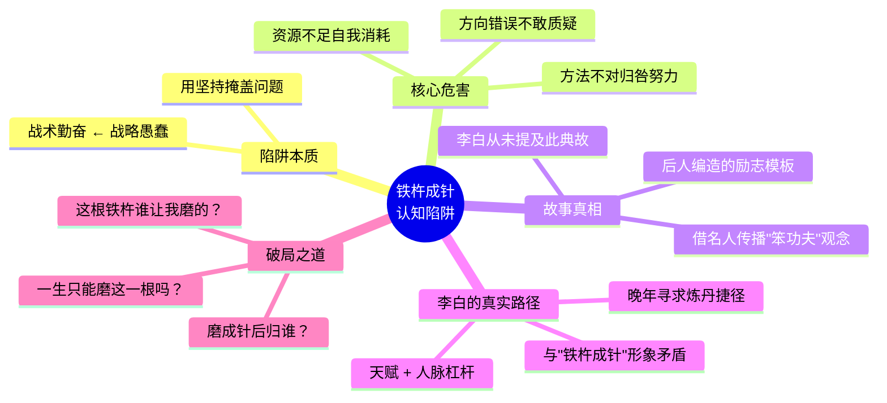

---

## 一、陷阱本质：用坚持掩盖问题

视频首先对"铁杵成针"的经典叙事提出质疑。老婆婆面对李白的困惑，并未解释**为何要读书、如何去学**，而是用一个无法回答"为什么"的口号来激励他。

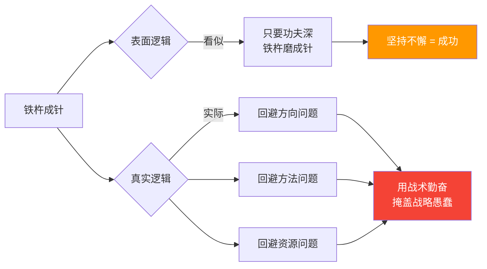

| 层面 | 表面叙事 | 真实意图 |
|------|---------|---------|
| 🎭 故事层 | 老婆婆坚持不懈磨铁杵 | 用一个荒诞行为传递口号 |
| 🧠 逻辑层 | 坚持就能成功 | 用"继续磨"的指令替代思考 |
| ⚠️ 危害层 | 励志、正能量 | 将复杂人生问题简化为"别停" |

> 💡 **危险性**：这种逻辑让人**不敢停下来思考方向**，只会用"我还不够努力"来解释一切失败。

---

## 二、核心危害：被伪装的消耗

"铁杵成针"最可怕的地方在于——**它会把一个人的损失全部伪装成成长**。

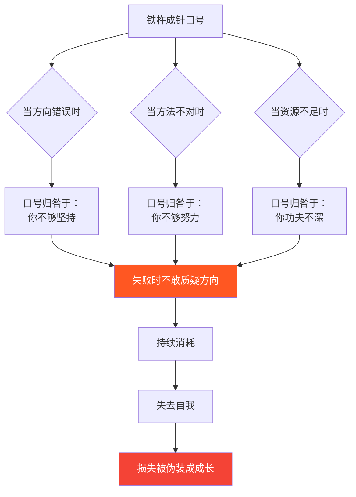

| 真实问题 | 口号的归因 | 当事人的反应 | 最终结果 |
|---------|-----------|-------------|---------|
| 🔴 方向错误 | "你不够坚持" | 不敢换方向 | 越磨越偏 |
| 🔴 方法不对 | "你不够努力" | 加倍蛮干 | 效率为零 |
| 🔴 资源不足 | "你功夫不深" | 自我怀疑 | 耗尽所有 |
| ⚫ 时间流逝 | "铁杵总会成针" | 等待奇迹 | 一无所获 |

---

## 三、故事真相：并非李白的人生片段

视频考证了故事的真实性，揭示了一个关键事实：

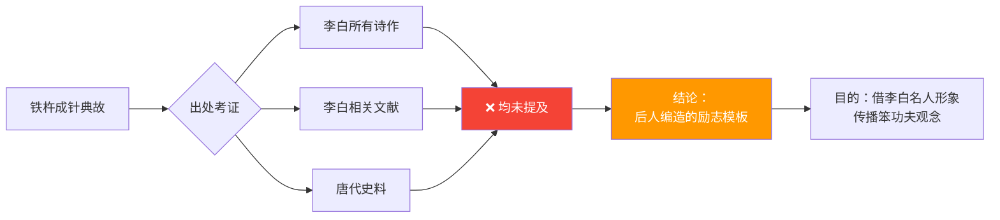

| 考证维度 | 结果 | 说明 |
|---------|------|------|
| 📜 李白诗作 | ❌ 无任何提及 | 李白从未在作品中引用此典故 |
| 📚 历史文献 | ❌ 无唐代记录 | 故事来源不可考 |
| 🎭 真实来源 | 后人编造 | 借用李白名人效应的励志模板 |
| 🎯 传播目的 | 驯化服从性 | 传递"下笨功夫就能成功"的观念 |

---

## 四、李白的真实人生：天赋与杠杆

视频进一步分析了李白的真实人生路径——与"铁杵成针"的叙事形成鲜明对比。

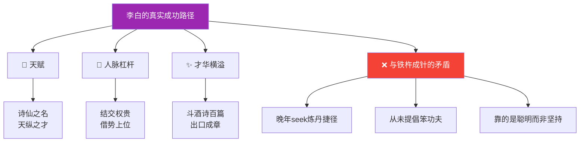

| 维度 | "铁杵成针"中的李白 | 真实的李白 |
|------|-------------------|-----------|
| 成功路径 | 被老婆婆的坚持感动而发奋 | 天赋 + 人脉杠杆 + 才华 |
| 核心特质 | 需要被"规训"的学生 | 天纵之才，自信张扬 |
| 晚年追求 | （故事未提及） | seek炼丹seek仙——seek捷径 |
| 与故事关系 | 被故事"教育"的主角 | 从未提及此典故 |

> 💡 **讽刺**：这个故事借李白之名，传播的恰恰是李白**本人从不信奉**的"笨功夫"哲学。

---

## 五、破局之道：学会提问与反思

视频呼吁人们在面对"铁杵成针"式激励时，提出**三个灵魂拷问**：

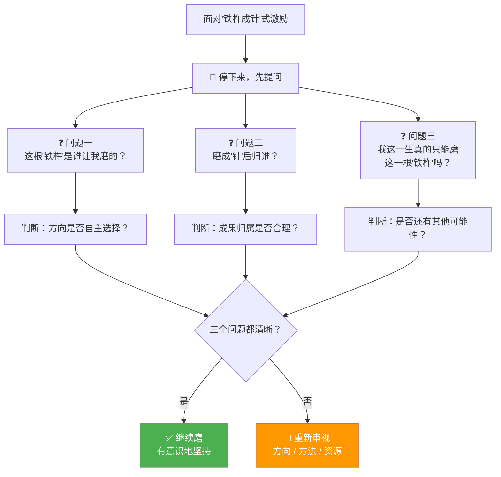

| # | 灵魂拷问 | 检验维度 | 破局意义 |
|---|---------|---------|---------|
| 1️⃣ | 这根"铁杵"是谁让我磨的？ | 🧭 **方向自主性** | 区分"我的选择"vs"别人安排的" |
| 2️⃣ | 磨成"针"后归谁？ | 💰 **利益归属** | 看清努力成果被谁收割 |
| 3️⃣ | 一生只能磨这一根吗？ | 🌍 **可能性空间** | 打破"唯一路径"的认知牢笼 |

---

## 六、逻辑记忆：四步闭环框架

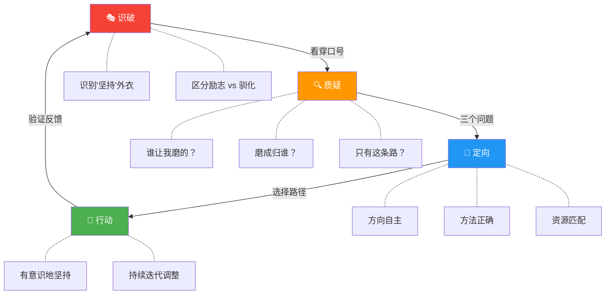

---

## 七、正在发生的案例（2024-2026）

> 用当下真实案例，验证"铁杵成针"认知陷阱的现实危害。

### 案例全景对照表

| 案例 | 对应陷阱特征 | "磨"的过程 | 结果 |
|------|------------|-----------|------|
| 🔴 职场996"狼性文化" | 用坚持掩盖方向问题 | 员工被灌输"加班就是成长"，不敢质疑不合理制度 | 身心透支、35岁被优化，损失伪装成"奋斗" |
| 🔴 百万考研/考公二战三战 | 用口号替代方法反思 | "只要功夫深"年年考，从不审视是否适合 | 沉没成本巨大，错过其他人生窗口 |
| 🟡 传统房企"三条红线"后死撑 | 方向已变仍盲目磨 | 坚信"熬过寒冬就是春天"，不转型不瘦身 | 恒大、碧桂园等暴雷，越磨越深 |
| 🟢 教培从业者转型AI/新赛道 | 敢于停下、重新定向 | 双减后不"死磨"教培，转向AI教育/直播/新能源 | 找到新增长曲线，认知升级后重新出发 |
| 🟢 Shein从服装到AI供应链 | 磨的不是铁杵而是杠杆 | 不是"更努力做服装"，而是用AI重构供应链效率 | 千亿市值，聪明坚持的典范 |

---

### 案例一：职场996——现代版"铁杵成针"

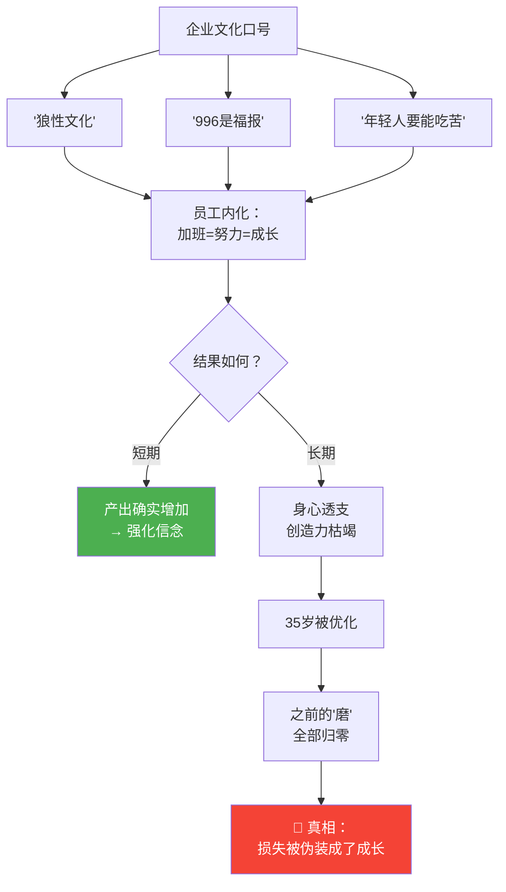

| 维度 | "铁杵成针"叙事 | 现实真相 |
|------|--------------|---------|
| 🎯 方向 | 公司方向正确，你只需执行 | 方向可能是错的，但你不被允许质疑 |
| 💪 方法 | 加班越多越好 | 大量时间用于无效会议和内耗 |
| 💰 成果归属 | 努力会有回报 | 回报归平台和老板，个人只拿到"成长"幻觉 |
| ⏰ 机会成本 | 坚持就是胜利 | 错过了转行、学习、生活的黄金时间 |

**认知复盘**：
- ❌ **被困者**：相信"吃苦=成长"→ 不敢质疑 → 35岁被优化后一无所有
- ✅ **破局者**：用三个问题检验 → 发现方向/归属/可能性全不对 → 提前布局第二曲线
- 📌 **对应心法**：**坚持的前提，是确认你在磨自己的"铁杵"，而不是别人的**

---

### 案例二：考研/考公"年年二战"——沉没成本的深渊

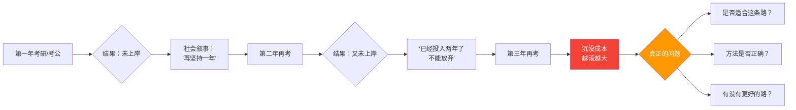

| 年份 | 考生心态 | 真实处境 | 三个问题的答案 |
|------|---------|---------|--------------|
| 第1年 | "差一点，再努力就行" | 可能方法不对 | 没问过"为什么考" |
| 第2年 | "已经一年了，不能放弃" | 沉没成本绑架 | 不敢回答"是否适合" |
| 第3年 | "再考不上就30了" | 机会窗口正在关闭 | 从未思考"有没有其他路" |
| 第N年 | "除了考这个我还能干嘛" | 可能性空间被自我压缩 | 认知牢笼已经形成 |

**认知复盘**：
- ❌ **被困者**："铁杵成针"思维 → 每年加倍磨 → 不敢换方向 → 30岁后发现无路可走
- ✅ **破局者**：第一年后就认真回答三个问题 → 如果不适合就果断转向 → 用时间换空间
- 📌 **对应心法**：**"再坚持一下"是最危险的口号——它让你在错误的路上越走越远**

---

### 案例三：2025 AI浪潮中的"聪明坚持" vs "笨功夫"

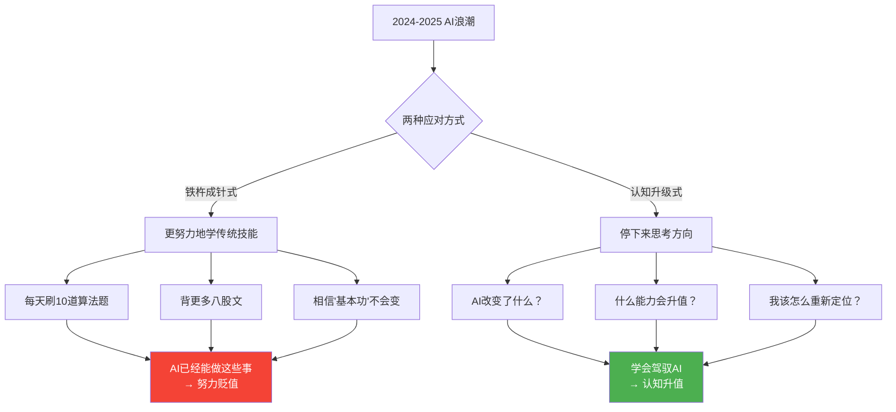

| 维度 | "笨功夫"路线 | "聪明坚持"路线 |
|------|------------|--------------|
| 策略 | 更努力地做AI能替代的事 | 停下来，先看清AI改变了什么 |
| 典型行为 | 刷题、背八股、卷时长 | 学Prompt Engineering、学AI工具、重构工作流 |
| 3年后 | 技能被AI替代，竞争力下降 | 成为"AI+人"的复合型人才 |
| 本质差异 | **磨的是别人定义的"铁杵"** | **自己选择要磨的"针"** |

**认知复盘**：
- ❌ **被困者**：用"铁杵成针"心态学传统技能 → 越努力越贬值 → 因为方向本身就是错的
- ✅ **破局者**：先问"AI时代该磨什么" → 选择AI无法替代的能力（判断力、创造力、人际洞察）→ 把AI变成杠杆
- 📌 **对应心法**：**在技术变革期，停下来重新选择"磨什么"，比"更努力地磨"重要100倍**

---

### 案例四：反面教材——那些"及时止损"的人

| 人物/群体 | 曾经的"铁杵" | 何时停下来 | 转向了什么 | 结果 |
|----------|-------------|-----------|-----------|------|
| 🟢 新东方转型东方甄选 | 教培业务 | 2021双减政策后 | 直播带货 + 农产品 | 俞敏洪60岁再创高峰 |
| 🟢 大量程序员转型AI | 传统开发 | 2023 ChatGPT后 | AI应用开发/Prompt工程 | 薪资翻倍，前景广阔 |
| 🟢 自媒体人转型短视频 | 图文公众号 | 2019-2020 | 抖音/小红书/B站 | 抓住流量红利期 |
| 🔴 坚持图文不转型的媒体人 | 传统媒体 | 从未停下 | 无 | 阅读量持续萎缩 |

> 📌 **核心对比**：停下来不是放弃，而是**用认知重新选择方向**。真正的勇气不是"坚持到底"，而是**敢于在错误的路上刹车**。

---

## 八、最高级思考问答：全文灵魂拷问

### Q1：坚持和盲目坚持的区别是什么？

> **问**：你说"铁杵成针"是陷阱，那坚持本身有错吗？怎么区分真正的坚持和盲目坚持？

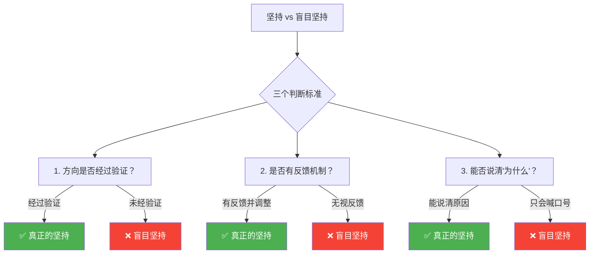

| 维度 | ✅ 真正的坚持 | ❌ 盲目的坚持 |
|------|-------------|-------------|
| 方向 | 经过验证、自主选择 | 别人指定、未经验证 |
| 方法 | 持续迭代、有反馈机制 | 一成不变、无视反馈 |
| 动力 | 内在驱动、知道"为什么" | 外部灌输、只会喊口号 |
| 面对失败 | 反思方向和方法 | 归咎于"不够努力" |
| 止损意识 | 设定边界、知道何时停 | 无限坚持、永不放弃 |

**答案**：**真正的坚持 = 正确的方向 × 持续迭代 × 内在驱动**。如果你只能回答"因为要坚持所以要坚持"，那你就掉进了"铁杵成针"的陷阱。

---

### Q2：如果方向错了，之前磨的时间不就浪费了吗？

> **问**：我已经在一个方向上投入了很多年，如果现在转向，之前的一切不就白费了？

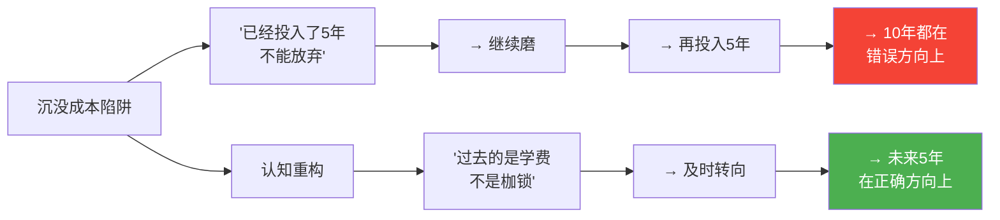

| 思维方式 | 逻辑 | 结果 |
|---------|------|------|
| 🔴 沉没成本思维 | "已经投入了5年，不能放弃" | 再浪费5年 → 总共10年损失 |
| 🟢 机会成本思维 | "如果不转向，未来5年还会浪费" | 及时止损 → 未来5年在正确方向增值 |

**答案**：**已经花掉的时间无论怎么做都回不来了**。真正的问题不是"过去浪费了多少"，而是"从今天起，你还要在错误的方向上磨多久"。**止损不是浪费，是最大的节约。**

---

### Q3："铁杵成针"为什么能流传千年？

> **问**：如果这个故事真的是陷阱，为什么它能流传这么久、被这么多人相信？

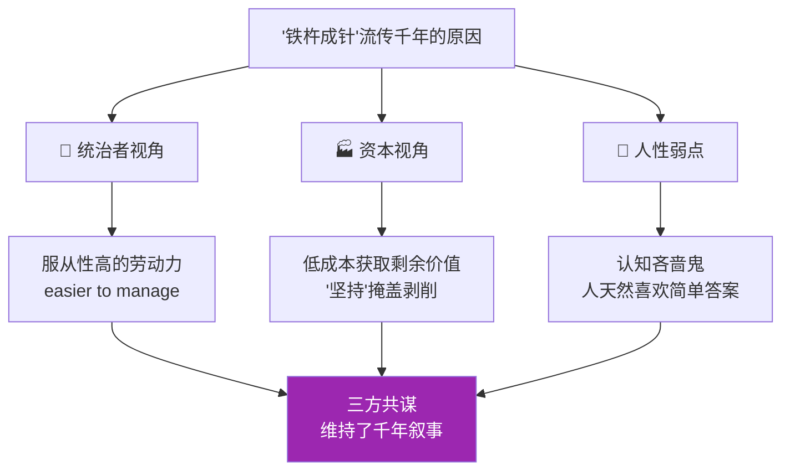

| 视角 | 谁在受益 | 如何受益 |
|------|---------|---------|
| 👑 统治/管理层 | 需要服从的执行者 | "坚持"口号降低管理成本，减少质疑 |
| 🏭 资本/平台方 | 低成本劳动力 | 用"奋斗"包装剥削，让劳动者自我规训 |
| 🧠 个体心理 | 逃避复杂思考 | 简单口号比深度思考容易得多 |
| 📚 教育体系 | 标准化培养 | "努力=成功"的叙事便于批量管理 |

**答案**：一个谎言能流传千年，不是因为它是真的，而是因为**太多人从它的传播中获益**。"铁杵成针"的本质是一个**多方共赢的认知控制工具**——除了正在磨铁杵的那个人。

---

### Q4：AI时代，"铁杵成针"式努力还有价值吗？

> **问**：2026年，AI可以做太多事情了——在这种时代，还需要"坚持"吗？

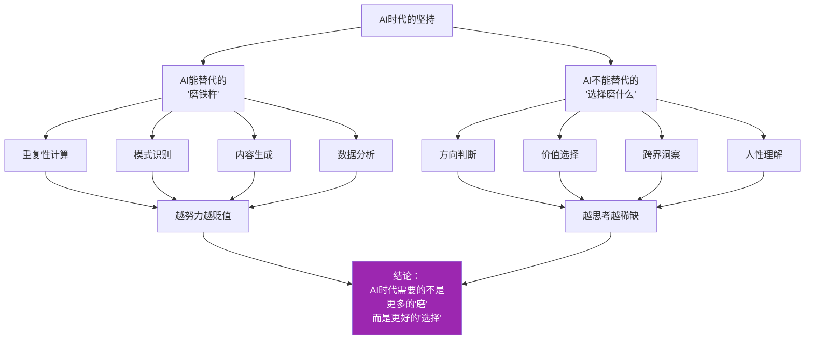

| 类别 | 具体能力 | AI时代价值 | 策略 |
|------|---------|-----------|------|
| 🔴 被替代 | 编程语法、翻译、基础设计 | 急剧下降 | 不应再"铁杵成针"式死磕 |
| 🟡 被增强 | 写作、分析、编程架构 | 提升2-10倍 | 学会用AI做杠杆 |
| 🟢 不可替代 | 判断力、品味、人际洞察 | 持续升值 | 这才是你该"磨"的针 |

**答案**：AI时代，**"磨"的价值在下降，"选择磨什么"的价值在飙升**。以前靠坚持可以弥补认知的不足，现在AI已经把"坚持"的部分接管了——**人类唯一不可替代的价值，是判断方向的能力**。

---

### Q5：普通人如何在日常中避免"铁杵成针"陷阱？

> **问**：我不是创业者也不是投资人，就是一个普通打工人/学生，怎么避免掉进这种陷阱？

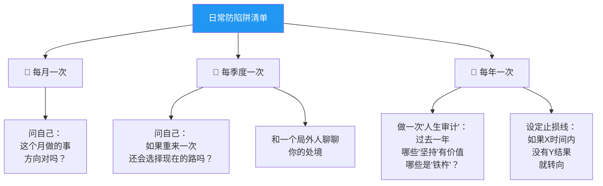

| 频率 | 具体动作 | 对应三个问题 |
|------|---------|-------------|
| 📅 **每月** | 10分钟自问：这个月在磨什么？为谁磨？ | 方向自主性 + 利益归属 |
| 📅 **每季度** | 和一位信任的朋友深聊：我的方向对吗？ | 外部视角打破认知牢笼 |
| 📅 **每年** | 做一次"人生审计"：今年哪些坚持有价值、哪些是消耗？ | 可能性空间扫描 |
| 🔄 **随时** | 设定止损线：如果在N时间内没有达到M，就重新评估 | 防止沉没成本陷阱 |

**答案**：**不需要等到人生重大转折点才反思**。真正的认知觉醒，是从**日常的微小 questioning** 开始的。每个月的10分钟自问，可能比10年的"铁杵成针"更有价值。

---

### Q6：最终极的问题——什么是真正的"聪明坚持"？

> **问**：如果"铁杵成针"是陷阱，那什么才是正确的坚持方式？

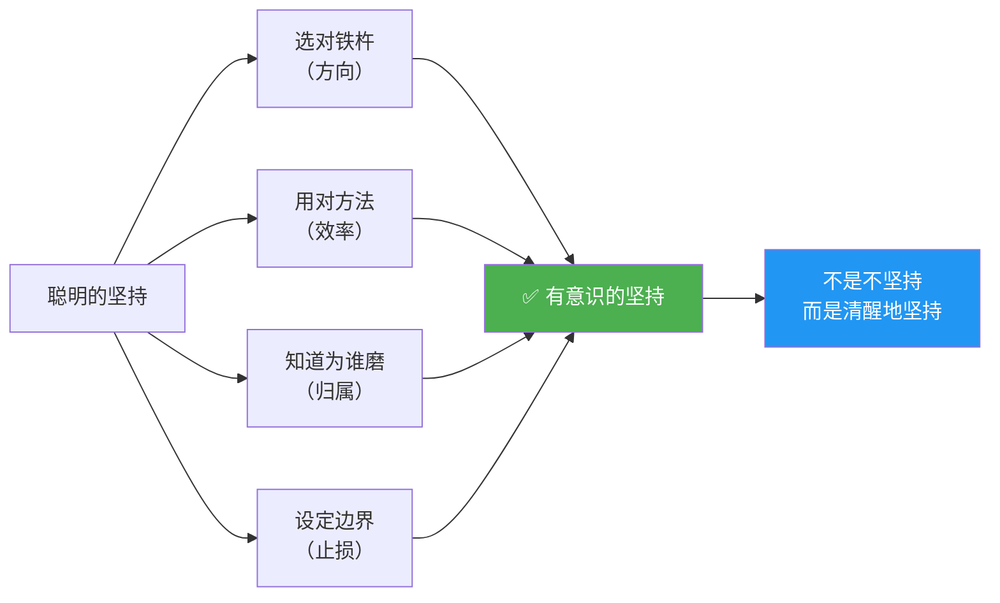

| 维度 | 铁杵成针式坚持 | 聪明的坚持 |
|------|--------------|-----------|
| 🧭 方向 | 别人指定的 | 自己验证后选择的 |
| 🔧 方法 | 一成不变 | 持续迭代 |
| 💰 归属 | 不清楚为谁磨 | 清楚成果归自己 |
| ⏰ 边界 | 无限坚持 | 有止损线 |
| 🧠 认知 | 用坚持代替思考 | 用思考指导坚持 |
| 📊 反馈 | 无视外部反馈 | 主动获取并调整 |

> 🏆 **终极答案**：聪明的坚持 = **选对方向 × 用对方法 × 知道为谁 × 设好边界**。
> 
> 它不是"铁杵成针"的反面——它是**"铁杵成针"的升级版**。不是不磨了，而是**先想清楚再磨，边磨边想，磨对了就加速，磨错了就换**。
> 
> **人生最昂贵的成本，不是失败的成本，而是在错误方向上坚持的成本。**

---

## 九、全文终极总结

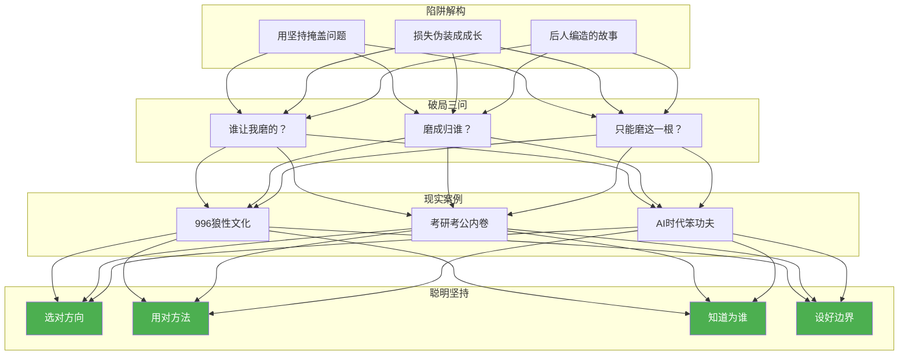

| 层次 | 内容 | 金句 |
|------|------|------|
| **陷阱** | "铁杵成针"是认知驯化 | "用战术勤奋掩盖战略愚蠢" |
| **危害** | 损失被伪装成成长 | "失败归咎于不够努力" |
| **真相** | 故事为后人编造 | "李白从未提及此典故" |
| **破局** | 三个灵魂拷问 | "谁让我磨？归谁？只有这条路？" |
| **案例** | 996/考研/AI时代 | "越努力越贬值的方向是错的" |
| **智慧** | 聪明的坚持 | "先想清楚再磨，边磨边想" |
| **本质** | 认知 > 坚持 | "人生最贵的成本是在错误方向上坚持" |

> 🎯 **一句话总结**：人生不是磨铁杵——**你值得花时间去选择，你到底要把有限的生命磨成什么**。真正的勇气不是"永不放弃"，而是**敢于在错误的路上及时刹车，然后在正确的方向上全力以赴**。

---

> 🏆 **全文最后一句话**：在这个充满"励志口号"的世界里，**最稀缺的不是坚持，而是清醒**。清醒地选择方向，清醒地投入时间，清醒地知道自己在为谁而磨。**铁杵成针不是答案——清醒地选择磨什么，才是。**
