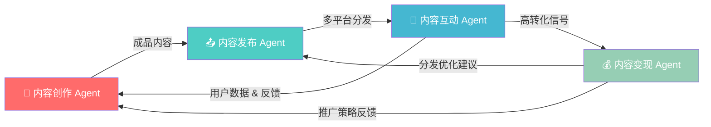
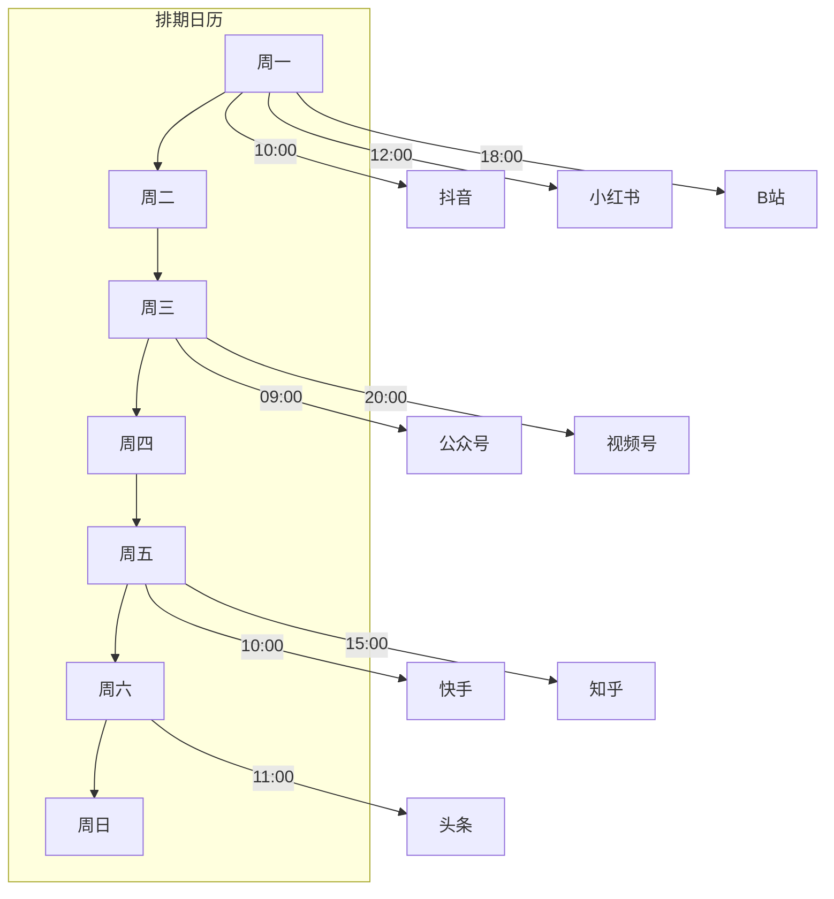
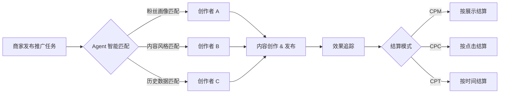
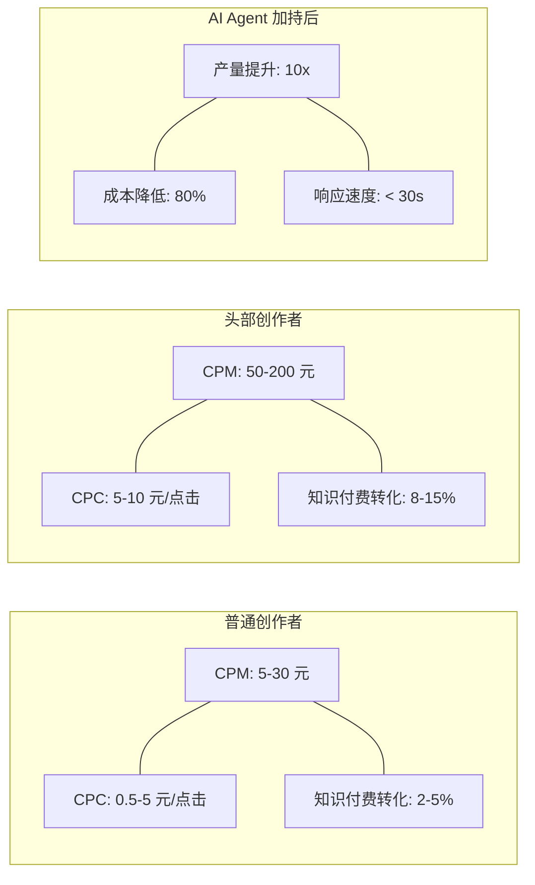

# AI Agent 自媒体全流程自动化

> [!quote] 核心观点
> 通过 AI Agent 将内容营销中的**重复性劳动自动化**，让创作者从"内容工厂"中解放出来，回归**创意本身**。

本项目（MIT 协议，可免费商用）构建了四大 Agent 模块，覆盖自媒体运营的完整生命周期：

---

## 一、系统架构总览

### 1.1 全流程架构图



### 1.2 四大模块对比表

| 模块                | 核心职责        | 关键技术                         | 输入        | 输出           | 价值指标        |
| ----------------- | ----------- | ---------------------------- | --------- | ------------ | ----------- |
| 🎨 **内容创作 Agent** | 自动生成视频 & 图文 | DALL-E、MidJourney、视频生成/翻译/剪辑 | 选题/关键词    | 成品内容（视频+图文）  | 创作效率 ↑10x   |
| 📤 **内容发布 Agent** | 多平台一键分发     | 14+ 平台 API 对接、日历排期           | 成品内容      | 全平台已发布状态     | 分发耗时 ↓90%   |
| 💬 **内容互动 Agent** | 浏览器插件自动互动   | NLP 情感分析、信号识别                | 用户评论/私信   | 自动回复 & 高转化提醒 | 互动响应 < 30s  |
| 💰 **内容变现 Agent** | 内容交易 & 推广结算 | CPM/CPC/CPT 计价引擎             | 流量 & 推广需求 | 推广匹配 & 收益结算  | 变现转化率 ↑3-5% |
|                   |             |                              |           |              |             |

---

## 二、模块详解

### 2.1 🎨 内容创作 Agent

负责自动生成视频和图文内容。

| 能力 | 详情 | 调用模型/工具 |
|------|------|-------------|
| **视频制作** | 自动调用视频生成、翻译和剪辑模块，一站式完成 | Runway / Pika / FFmpeg |
| **图文生成** | 支持批量生成适合不同平台尺寸和风格的内容 | DALL-E 3 / MidJourney v7 / Stable Diffusion |
| **文案策划** | 根据热点趋势自动生成标题、脚本、文案 | Claude / GPT-4o / 通义千问 |

> [!tip] 创作流程
> `选题分析 → 脚本生成 → 素材生成 → 自动剪辑 → 多版本适配 → 人工审核`

---

### 2.2 📤 内容发布 Agent

负责将内容分发到多个主流平台。

| 功能 | 说明 |
|------|------|
| **多平台分发** | 支持 14+ 常用平台（抖音、小红书、B站、公众号、视频号、快手、知乎、头条…） |
| **日历排期** | 类日程表视图，统一规划所有平台发布时间 |
| **格式自适应** | 自动根据平台要求调整封面尺寸、标签、话题 |
| **发布监控** | 实时追踪各平台审核状态和发布结果 |



---

### 2.3 💬 内容互动 Agent

通过浏览器插件实现与用户的自动互动。

| 功能 | 技术实现 | 业务价值 |
|------|---------|---------|
| **自动操作** | 模拟浏览器行为实现点赞、收藏、关注 | 提升账号活跃度 |
| **智能回复** | LLM 理解评论语义，生成个性化回复 | 用户满意度 ↑ |
| **信号识别** | NLP 识别"求分享""怎么购买"等高转化意图 | 快速响应商机 |
| **舆情监控** | 实时检测负面评论并预警 | 风控前置 |

> [!important] 高转化信号识别
> 当评论中出现以下关键词时，Agent 自动标记为**高优先级**并触发即时响应：
> - 🔥 "求分享" / "链接在哪"
> - 🛒 "怎么购买" / "多少钱"
> - ⭐ "推荐一下" / "有平替吗"

---

### 2.4 💰 内容变现 Agent

内置内容交易市场，帮助创作者将流量变现。

| 变现模式 | 全称 | 计费方式 | 适用场景 |
|---------|------|---------|---------|
| **CPM** | Cost Per Mille | 按千次展示付费 | 品牌曝光类推广 |
| **CPC** | Cost Per Click | 按点击付费 | 效果导向类推广 |
| **CPT** | Cost Per Time | 按时间付费 | 长期品牌合作 |



---

## 三、正在发生的真实案例（2025-2026）

### 3.1 行业落地案例

| 平台 | 案例类型 | 运营模式 | 收益规模 | 关键策略 |
|------|---------|---------|---------|---------|
| **抖音** | AI 虚拟人直播带货 | 24h 不间断直播 + CPS 佣金 | 月入 50 万+ | 数字人 + 实时话术生成 |
| **小红书** | AI 笔记代写矩阵 | 批量生产种草笔记 + 服务费 | 月入 10 万+ | 多账号矩阵 + 风格克隆 |
| **公众号** | AI 内容矩阵号 | 垂直领域批量产出 + 广告分成 | 月入 30 万+ | SEO 选题 + 知识付费 |
| **B站** | AI 辅助视频创作 | 脚本生成 + 配音剪辑 + 充电计划 | 年入百万 | 知识区 + 解说类内容 |
| **视频号** | AI + 私域联动 | 短视频引流 + 企微转化 | 月入 20 万+ | 社交裂变 + 社群运营 |

### 3.2 Multi-Agent 框架对比

| 维度 | CrewAI | AutoGPT | LangGraph | 本项目 Agent |
|------|--------|---------|-----------|-------------|
| **架构** | 多 Agent 团队协作 | 单 Agent 自主循环 | 图结构状态机 | 四模块流水线 |
| **任务管理** | 结构化工作流 | 自导向目标 | 状态转移图 | 端到端管线 |
| **内容适配** | ★★★★★ 极佳 | ★★★ 通用 | ★★★★ 灵活 | ★★★★★ 专用 |
| **上手难度** | 低（高层抽象） | 中（需技术背景） | 中高 | 低（开箱即用） |
| **生态集成** | OpenAI/Anthropic/本地模型 | 多模型支持 | LangChain 生态 | DALL-E/MJ/多平台 API |

### 3.3 收益数据参考



---

## 四、深度思考问答（全文总结）

### Q1：AI Agent 自媒体自动化的本质是什么？

> [!abstract] 本质洞察
> **不是"用 AI 替代人"，而是重构内容生产关系。** 传统自媒体是"一人工厂"模式——创作者同时承担策划、写作、拍摄、剪辑、运营、商务六重角色。AI Agent 的价值在于将后四个**执行层**角色自动化，让创作者回归前两个**决策层**角色——**"做什么"和"为什么做"**才是人类不可替代的。

---

### Q2：这套系统的最大风险是什么？

> [!warning] 三大核心风险
> 1. **平台合规风险**：抖音要求 AI 内容必须标注，小红书对 AI 内容降权 30-50%，违规可能导致封号
> 2. **内容同质化风险**：当所有人使用相同 Agent，内容将趋同，"AI 味"成为新的流量毒药
> 3. **信任危机**：用户对 AI 生成内容的信任度持续下降，"真实性"成为稀缺资源

**应对策略**：AI 负责 80% 的标准化生产，人类把控 20% 的个性化灵魂——**"80/20 人机协作"** 是当前最优解。

---

### Q3：从"单 Agent"到"Multi-Agent"，演进路径是什么？

> [!tip] 三阶段演进路线
> ```mermaid
> graph LR
>     S1["🔹 阶段一<br/>单点工具<br/>(2023-2024)"] --> S2["🔸 阶段二<br/>流水线 Agent<br/>(2025-2026)"]
>     S2 --> S3["🔶 阶段三<br/>自主协作生态<br/>(2026+)"]
>     style S1 fill:#e8e8e8
>     style S2 fill:#ffd93d,color:#333
>     style S3 fill:#ff6b6b,color:#fff
> ```
> - **阶段一**：单点工具——AI 写文案、AI 生图，人工串联
> - **阶段二**（当前）：流水线 Agent——创作→发布→互动→变现 端到端自动化
> - **阶段三**（未来）：自主协作生态——Agent 间自主谈判、交易、优化，形成"Agent 经济"

---

### Q4：对于个人创作者，最务实的落地建议是什么？

> [!success] 五步落地法
> 1. **从"AI 辅助"开始**，而非"AI 全自动"——先让 AI 帮你做选题分析和初稿，保留人工润色
> 2. **选择一个垂直领域深耕**——AI 的价值在规模化，但规模化的前提是领域聚焦
> 3. **建立"内容 SOP"**——将创作流程标准化，才能被 Agent 可靠执行
> 4. **重视数据反馈闭环**——让互动数据反哺创作决策，形成正向飞轮
> 5. **保持"人类温度"**——AI 负责效率，你负责共鸣。**读者关注的是"谁在说"，不只是"说了什么"**

---

### Q5：终极追问——当 AI 能生产所有内容，"创作者"还有意义吗？

> [!quote] 最终回答
> **有，而且意义更大。**
>
> 当内容生产成本趋近于零，**稀缺性从"生产力"转移到"判断力"和"人格"**。
> - AI 能写 100 篇文章，但**选择写哪一篇**是人的判断
> - AI 能生成完美画面，但**定义什么是美**是人的审美
> - AI 能分析万条数据，但**决定为谁发声**是人的价值观
>
> **未来的创作者 = 策展人 + 思想家 + 灵魂。** 技术让表达民主化，但让表达有意义的，永远是背后那个真实的人。

---

> [!info] 参考资源
> - [CrewAI 文档](https://docs.crewai.com) — Multi-Agent 协作框架
> - [AutoGPT GitHub](https://github.com/Significant-Gravitas/AutoGPT) — 自主 Agent 项目
> - [LangGraph](https://github.com/langchain-ai/langgraph) — 图结构 Agent 编排
> - 本项目遵循 MIT 协议，可免费商用
