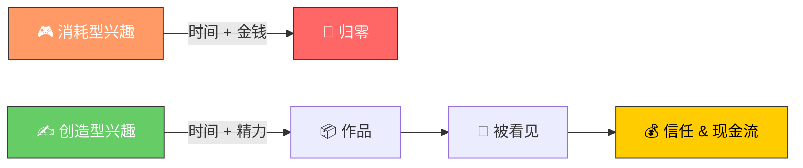
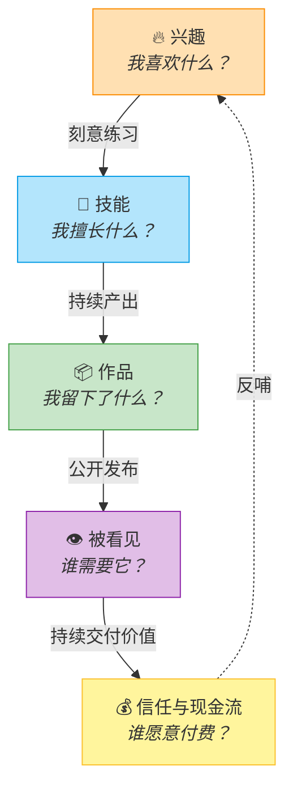
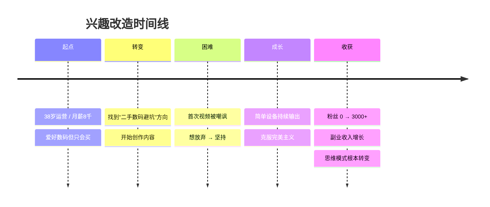
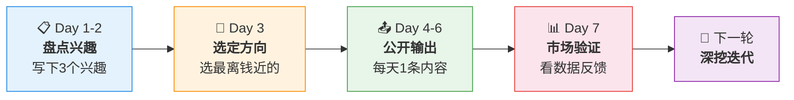
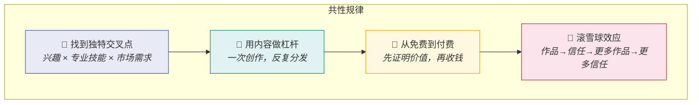
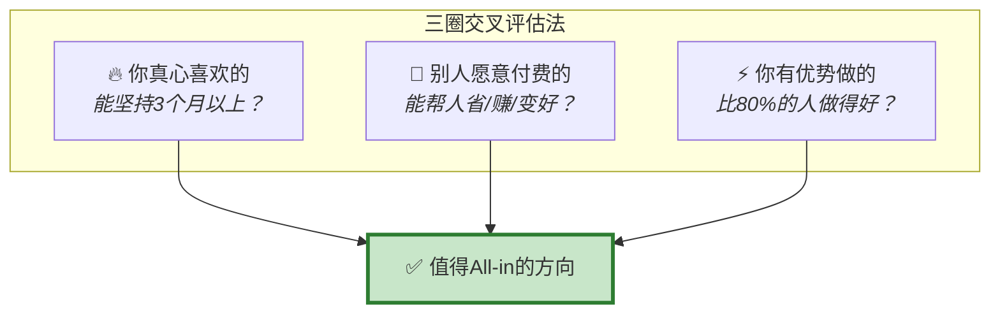
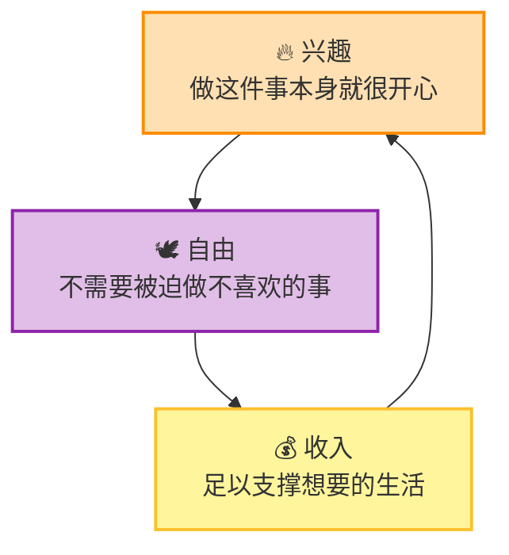
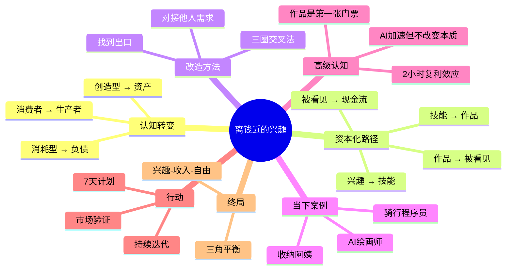

# 培养"离钱近"的兴趣：从消费到创造

> **核心观点**：成年人最奢侈的不是"纯粹的兴趣"，而是你喜欢的东西**刚好能让你离钱更近**。许多人的休闲方式（如刷剧、打游戏）只会消耗资源，而真正厉害的人，早已将兴趣转化为可变现的技能。

---

## 一、两种兴趣的天壤之别

兴趣并非都一样，它可以是**资产**，也可以是**负债**。

| 对比维度 | ❌ 消耗型兴趣（负债） | ✅ 创造型兴趣（资产） |
| --- | --- | --- |
| 典型活动 | 刷剧、打游戏、研究八卦 | 写作、拍摄、设计、理财、行业研究 |
| 核心影响 | 消耗时间、注意力和钱包 | 积累技能、作品和现金流 |
| 长期结果 | 训练你继续贫穷 | 训练你创造价值 |
| 心理反馈 | 即时快感 → 空虚 | 延迟满足 → 成就感 |
| 可迁移性 | 几乎为零 | 可跨领域复用 |

---

## 二、兴趣变现的底层逻辑：兴趣资本化

兴趣本身不值钱，**可复制、可展示、可交易**的兴趣才有机会值钱。这个过程遵循一条清晰的资本化路径：

> **记忆口诀**：**兴 → 技 → 作 → 看 → 钱**，五步闭环，缺一不可。

---

## 三、如何将兴趣"改造"得离钱更近

关键在于为你的兴趣找到一个**"出口"**，将其从纯粹的个人爱好，转变为能为他人提供价值的服务或产品。

| 原始兴趣 | 🔄 改造方向（离钱更近） | 变现形态举例 |
| --- | --- | --- |
| 🍜 喜欢吃 | 持续写出探店笔记、帮小店做内容 | 自媒体广告、探店合作 |
| 💬 喜欢聊天 | 转变为谈判、咨询、直播、社群运营 | 付费社群、直播带货 |
| 🛍️ 喜欢买东西 | 研究价格渠道、做二手交易、帮人选品 | 代购、选品顾问、二手差价 |
| 📷 喜欢拍照 | 学构图和后期，接约拍/卖图 | 摄影接单、图库售卖 |
| 🎮 喜欢打游戏 | 做攻略、录解说、研究游戏机制 | 内容创作、陪玩、代练 |

> **核心公式**：`兴趣 × 他人需求 = 变现机会`

---

## 四、案例：从"数码爱好者"到"内容创作者"

> 视频通过一个朋友的真实经历，展示了兴趣改造的完整过程。

| 阶段 | 状态与行动 | 关键转变 |
| --- | --- | --- |
| 🟡 起点 | 38岁运营，月薪8千，爱好研究数码产品，但只会买，家里堆成"电子垃圾站" | 消费者心态 |
| 🔵 转变 | 在作者建议下，决定将爱好转化为"二手数码避坑"内容，开始创作 | 找到出口 |
| 🔴 初期困难 | 首次视频就因口误被网友嘲讽"半桶水"，感到丢人想放弃 | 心理关卡 |
| 🟢 坚持与成长 | 克服心理障碍，坚持用简单设备（台灯、旧手机支架）持续输出 | 行动战胜完美 |
| 🟣 收获 | 粉丝从零到三千，副业收入逐步增加 | 生产者心态 |

> **本质转变**：从「**消费者**」→ 「**生产者**」，开始用**交易视角**看世界。

---

## 五、行动指南：7天兴趣改造计划

> 别只停留在想，从今晚开始行动。

### 第一步：盘点兴趣 ✍️

写下你最常做的**三个兴趣**，并思考：

- 它能不能变成**作品**？
- 能不能帮别人**省钱、赚钱、省时间、长见识、变好看、变方便**？

### 第二步：公开输出 📤

选择一个最"离钱近"的方向，**连续7天**进行公开输出（如一条视频、一篇笔记、一次二手转卖）。

> 别追求完美，只追求**发出去**。

### 第三步：市场验证 📊

7天后，根据市场反馈来决定下一步深挖的方向：

| 反馈信号 | 含义 | 下一步 |
| --- | --- | --- |
| 有人**私信**问 | 强需求，痛点明确 | 深挖，可以做付费服务 |
| 有人**收藏** | 内容有长期价值 | 体系化，做成系列 |
| 有人**评论互动** | 话题有讨论空间 | 加强互动，建社群 |
| 数据**平平无奇** | 方向或形式需调整 | 换角度，换个出口 |

> 市场的反馈比你的自我感动**诚实一万倍**。

---

## 六、正在发生的真实案例（2024-2026）

> 不是故事，是**此刻正在发生的事**。以下案例均来自公开可查的真实现象。

### 案例一：AI 绘画师——从"玩 Midjourney"到月入 5 万

| 维度 | 详情 |
| --- | --- |
| 主角 | 95后平面设计师，二线城市 |
| 原始兴趣 | 下班后玩 AI 绘画工具（Midjourney / Stable Diffusion），纯粹觉得好玩 |
| 转折点 | 2024年底，发现淘宝上"AI商业海报"需求暴涨，但供给极少 |
| 改造动作 | 把每天玩AI的提示词（Prompt）经验整理成作品集，在小红书发布对比图 |
| 变现路径 | 接电商主图单（200-500元/张）→ 出Prompt教程（知识星球99元/人）→ 企业内训（3000元/天） |
| 现状 | 副业月入稳定3-5万，正在考虑全职做"AI视觉顾问" |
| 关键洞察 | **工具本身不值钱，"审美+工具+行业理解"的组合才值钱** |

### 案例二：退休阿姨的"收纳整理"自媒体

| 维度 | 详情 |
| --- | --- |
| 主角 | 52岁退休教师，三线城市 |
| 原始兴趣 | 几十年喜欢整理家务，朋友搬家都找她帮忙规划 |
| 转折点 | 2025年初，女儿帮她开了抖音号，发了一条"30年老主妇的厨房收纳术" |
| 改造动作 | 每周发3条短视频，展示不同空间的整理前后对比 |
| 变现路径 | 抖音橱窗带收纳用品（佣金）→ 本地上门收纳服务（300元/小时）→ 整理师培训课程 |
| 现状 | 粉丝12万，月收入超过退休前工资，被本地媒体采访 |
| 关键洞察 | **你以为"谁都会"的技能，对另一群人来说是刚需** |

### 案例三：程序员下班后写"城市骑行路线"攻略

| 维度 | 详情 |
| --- | --- |
| 主角 | 28岁后端开发，深圳 |
| 原始兴趣 | 周末骑行，习惯用代码爬取海拔数据、生成路线热力图 |
| 转折点 | 把骑行路线分析发在GitHub上，意外获得大量Star |
| 改造动作 | 将数据可视化能力包装成"最美骑行路线"小程序，同步在公众号写深度攻略 |
| 变现路径 | 小程序广告 → 骑行装备品牌合作（测评稿800-2000元/篇）→ 骑行团定制路线服务 |
| 现状 | 小程序日活5000+，正在和3个骑行品牌谈年度合作 |
| 关键洞察 | **当兴趣叠加"技术杠杆"，一个人就能做出一个产品** |

### 三大案例的共性规律

| 共性 | AI绘画师 | 收纳阿姨 | 骑行程序员 |
| --- | --- | --- | --- |
| 独特交叉点 | 审美 + AI工具 + 电商 | 生活经验 + 短视频 | 编程 + 骑行 + 数据可视化 |
| 内容杠杆 | 小红书对比图 | 抖音前后对比 | 公众号深度攻略 |
| 免费→付费 | 免费作品展示 → 付费教程 | 免费视频 → 付费服务 | 免费小程序 → 品牌合作 |
| 滚雪球 | 作品越多→客户越信任 | 粉丝越多→本地口碑越强 | 用户越多→品牌越愿意投 |

---

## 七、高级思考问答：十个问题吃透全文

> 以下问答是全文的**认知压缩**。能回答这十个问题，说明你真正理解了"离钱近的兴趣"这套思维体系。

### Q1：为什么大多数人的兴趣不能变现？

**答**：因为99%的兴趣停留在**消费端**。你喜欢看电影≠你能拍电影，你喜欢吃东西≠你能写探店攻略。区别在于：消费是**输入**，变现需要**输出**。兴趣变现的本质是——把你从消费者变成**生产者**，把"我享受"变成"别人也因为我的输出而受益"。

> 🧠 **记忆锚点**：消费 = 花钱买体验；创造 = 让别人花钱买你的体验。

---

### Q2："离钱近"是不是太功利了？兴趣不应该纯粹吗？

**答**：这是一个**伪对立**。纯粹的兴趣当然珍贵，但问题是——纯粹的兴趣需要**经济基础**来守护。一个月薪8千的人，没有余力"纯粹"。把兴趣变得离钱更近，恰恰是为了**让你有钱继续纯粹**。而且，当你的兴趣能帮到别人时，它反而获得了更深的意义。

> 🧠 **记忆锚点**：不是让兴趣变功利，而是让功利为兴趣服务。

---

### Q3：我没有任何特长，怎么办？

**答**：你不是没有特长，你是**对自己的特长视而不见**。问自己三个问题：
1. 朋友最常找你帮什么忙？（选电脑？搭配衣服？推荐餐厅？）
2. 你刷手机时最常看什么内容？（这就是你的信息优势领域）
3. 你愿意无偿帮别人做什么？（这就是你的价值感知区）

三个问题的交集，大概率就是你的"离钱近"起点。

> 🧠 **记忆锚点**：特长不是"天赋异禀"，而是"你做了10000小时却没意识到的事"。

---

### Q4：兴趣资本化五步中，大多数人卡在哪一步？

**答**：卡在**第二步→第三步**，即从"技能"到"作品"。很多人技能不错，但从来不产出**可展示的、完整的作品**。他们画画只画半成品，写东西只写日记不发，做饭从不拍照。没有作品，后面的"被看见"和"现金流"根本不会发生。**作品是兴趣变现的"第一张门票"。**

> 🧠 **记忆锚点**：技能是子弹，作品才是枪。没有枪，子弹永远只是子弹。

---

### Q5：AI时代，兴趣变现的逻辑变了吗？

**答**：底层逻辑没变（依然是 兴→技→作→看→钱），但**每一步都被加速了**：

| 阶段 | AI之前 | AI时代 |
| --- | --- | --- |
| 兴趣→技能 | 需要数年练习 | AI辅助学习曲线缩短50%+ |
| 技能→作品 | 需要专业工具/团队 | 一个人+AI=一个团队 |
| 作品→被看见 | 依赖平台算法/运气 | AI生成多平台适配内容 |
| 被看见→变现 | 路径长、中间商多 | 直接对接需求（AI匹配、私域） |

**但这也意味着竞争更激烈**——当人人都能快速产出，**独特性和审美**反而成了最大壁垒。

> 🧠 **记忆锚点**：AI降低了"做出来"的门槛，但抬高了"被选中"的门槛。

---

### Q6：怎么判断一个兴趣值不值得"改造"？

**答**：用 **"三圈交叉法"** 评估：

- 只满足1个圈：**纯爱好**，享受就好
- 满足2个圈：**有潜力**，值得试水
- 3个圈全中：**全力投入**，这就是你的"离钱近"方向

> 🧠 **记忆锚点**：喜欢 × 有人买 × 你擅长 = 黄金交叉点

---

### Q7：起步阶段最大的心理障碍是什么？如何克服？

**答**：最大的障碍不是能力，是**"丢人感"**——怕别人觉得你不行、怕被嘲讽、怕熟人看到。

克服方法（实战验证）：
1. **接受"前10个作品一定是垃圾"** —— 没有人第一步就完美
2. **用匿名/小号起步** —— 降低社交压力
3. **关注数据而非评价** —— 播放量、收藏数比网友评论诚实
4. **记住：没人在乎你** —— 90%的人根本不会注意到你，真正注意到的那些人中，90%是善意的

> 🧠 **记忆锚点**：你怕的"丢人"，90%是自己想象出来的。

---

### Q8：上班族每天只有2小时，够用吗？

**答**：**完全够用**，前提是这2小时是**复利型投入**。

| 时间投入方式 | 1年后结果 | 3年后结果 |
| --- | --- | --- |
| 每天2h刷短视频 | 看了700小时别人的生活 | 零积累 |
| 每天2h创造型输出 | 产出200+条内容，初步建立标签 | 有一定粉丝和被动收入 |
| 每天2h学习+输出 | 掌握一项可变现技能 | 副业收入可能超过主业 |

关键不是时间多少，而是**时间花在"资产"还是"负债"上**。

> 🧠 **记忆锚点**：2小时 × 365天 = 730小时 = 一个全新的你。

---

### Q9：兴趣变现的终局是什么？

**答**：终局不是"赚大钱"，而是达到**"兴趣-收入-自由"三角平衡**：

- **第一阶段**：兴趣补贴生活（副业）
- **第二阶段**：兴趣 = 主业收入
- **第三阶段**：兴趣驱动生活本身（不需要"上班"）

这不是鸡汤，是一条**可计算的路径**。你现在处于哪个阶段？

> 🧠 **记忆锚点**：终局不是暴富，是"做自己热爱的事，还能养活自己"。

---

### Q10：如果只记住一句话，应该是什么？

> **你下班后的时间，决定了你5年后的人生。**
>
> 把它交给算法，你就是别人的流量；
> 把它交给作品，你就是自己的资产。
>
> 世界上最亏的交易，是用**不可再生的时间**，去换**一次性的快感**。
> 世界上最赚的投资，是用**每天的2小时**，去建造**会增值的技能**。

---

## 总结：全文认知地图

---

> 💡 **一句话带走**：
>
> 别让你的热爱只会花钱，要让它慢慢学会**"回钱"**。普通人最大的资源就是每天下班后的几小时——你把它交给短视频平台，它就变成别人的数据；你把它交给作品，它就可能变成你的**筹码**。
