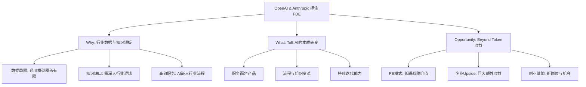
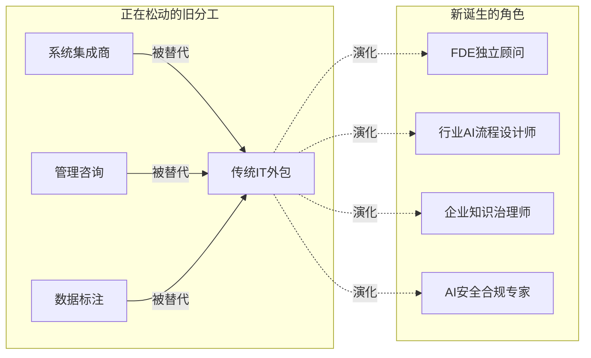

# OpenAI与Anthropic为何同时押注FDE

> **核心观点**：FDE并非简单的”售前/交付”，而是代表着ToB AI时代全新的组织结构与商业边界。企业真正需要的不是更强的模型，而是能将AI融入流程、接入系统、治理知识并对结果负责的人。

---

## 逻辑结构图



---

## FDE核心：解决行业数据与知识短板

| 痛点 | 描述 | FDE解决方案 |
|------|------|-------------|
| **数据局限** | 通用大模型的训练数据有限，难以覆盖所有行业的具体需求 | 将行业专有数据注入AI流程 |
| **知识缺口** | AI需要深入行业，理解特定的业务逻辑和知识体系 | 构建行业知识图谱与治理体系 |
| **高效服务** | 相比于聘请多位专家，成本高效率低 | AI直接嵌入行业流程，一人多能 |

---

## ToB AI的本质：从软件到服务

| 维度 | 传统软件 | ToB AI服务 |
|------|----------|------------|
| **交付形式** | 单一软件产品 | 持续性服务 |
| **价值来源** | 功能实现 | 流程改造 + 组织变革 |
| **迭代方式** | 版本更新 | 持续学习、实时迭代 |
| **人才需求** | 开发+运维 | FDE（懂AI+懂业务+懂流程）|

---

## 商业机会：Beyond Token收益

### 关键洞察

1. **PE模式**：OpenAI和Anthropic的合资公司均采用PE（私募股权）模式
   - 看重长期的战略价值，而非短期的Token收入

2. **企业Upside**：AI对行业的改造带来的额外收益可能非常巨大
   - 这才是吸引资本的真正原因

3. **创业缝隙**：旧的行业分工正在松动
   - 新的岗位和创业机会从这些缝隙中产生

---

## 总结：FDE的价值定位

```
┌─────────────────────────────────────────────────────────────┐
│                    FDE = 三重能力融合                         │
├──────────────┬──────────────┬───────────────────────────────┤
│   AI技术力   │   行业认知   │        流程改造力             │
├──────────────┼──────────────┼───────────────────────────────┤
│ • 模型应用   │ • 业务逻辑   │ • 组织设计                    │
│ • 系统集成   │ • 知识体系   │ • 流程重构                    │
│ • 数据治理   │ • 合规要求   │ • 变革管理                    │
└──────────────┴──────────────┴───────────────────────────────┘
```

---

## 正在发生的案例

### 案例矩阵

| 公司/机构 | FDE实践 | 核心动作 | 阶段 |
|-----------|---------|----------|------|
| **Anthropic** | 设立FDE岗位 | 直接派驻客户现场，帮助安全部署Claude | 规模化招聘中 |
| **OpenAI** | Solutions Engineer / Technical Success Manager | 企业级ChatGPT部署+定制化集成 | 快速扩张 |
| **McKinsey (QuantumBlack)** | AI部署咨询团队 | 从战略到落地的全链路AI transformation | 成熟运营 |
| **BCG (BCG X)** | AI Build & Design | "Build, Buy, Partner"框架帮助企业选型落地 | 成熟运营 |
| **Rolling AI** | FDE创业实践 | 专注行业AI流程嵌入与知识治理 | 早期验证 |

### 案例一：Anthropic FDE——从模型厂商到"驻场顾问"

```
客户企业 ──────→ Anthropic FDE ──────→ 产品/工程团队
  (业务需求)        (现场理解+部署)        (模型优化)
                      ↕
              ┌───────────────┐
              │  行业知识沉淀  │
              │  安全合规治理  │
              │  流程改造方案  │
              └───────────────┘
```

**关键特征**：
- FDE不是销售，是**技术+业务的双语翻译者**
- 工作成果直接反馈给产品团队，形成飞轮
- 薪资范围 $150K-$300K+，反映稀缺性

### 案例二：传统咨询巨头的AI转型

| 维度 | McKinsey/BCG模式 | FDE模式 |
|------|------------------|---------|
| **人员构成** | MBA + 技术顾问 | 工程师 + 行业专家 |
| **交付物** | PPT报告 + 路线图 | 可运行的AI系统 + 持续迭代 |
| **计费方式** | 项目制（月费$50万+）| 订阅制/成果分成 |
| **核心壁垒** | 关系网络 + 方法论 | 行业知识 + 技术落地能力 |

> **趋势判断**：传统咨询的"建议型"模式正在被FDE的"交付型"模式侵蚀。企业愿意为**结果**付费，而非为**方案**付费。

### 案例三：行业缝隙中的创业机会



---

## 最高级思考问答

### Q1：为什么是"现在"出现FDE？

> **A**：因为大模型从"能力展示"进入了"价值兑现"阶段。
>
> - **2023-2024**：模型竞赛期，比的是参数、跑分、发布速度
> - **2025-2026**：落地竞赛期，比的是谁能让企业真正用起来、产生回报
>
> 模型能力已经"够用了"，瓶颈转移到了**最后一公里**——如何把AI嵌入真实业务流程。FDE就是解决这个瓶颈的关键角色。

### Q2：FDE会取代传统售前/实施吗？

> **A**：不是取代，是**升维**。
>
> | 角色 | 核心能力 | 价值定位 |
> |------|----------|----------|
> | 传统售前 | 产品演示 + 需求收集 | 卖产品 |
> | 传统实施 | 系统部署 + 配置调试 | 交付功能 |
> | **FDE** | **流程诊断 + AI重构 + 持续迭代** | **交付业务结果** |
>
> FDE的本质是"懂AI的流程再造师"，而不是"懂业务的推销员"。

### Q3：如果模型越来越强，FDE还有存在的必要吗？

> **A**：恰恰相反——模型越强，FDE越重要。
>
> 这是一个**反直觉但成立的逻辑**：
> 1. 模型越强 → 能解决的问题越多 → 企业期望越高
> 2. 期望越高 → 需要的定制化越深 → 越需要懂行业的人来翻译需求
> 3. 同时，模型越强 → 安全风险越大 → 越需要人来治理和把关
>
> **类比**：操作系统越强大，解决方案架构师越重要——因为可能性多了，选对路径反而更难。

### Q4：FDE模式对创业者意味着什么？

> **A**：三个层次的机会——
>
> ```
> Level 1（个人级）: 成为独立FDE顾问
>                    → 一人公司，服务3-5家企业
>                    → 年收入 $200K-$500K
>
> Level 2（团队级）: 组建垂直行业FDE团队
>                    → 聚焦1-2个行业深耕
>                    → 如：医疗AI流程改造、金融合规AI部署
>
> Level 3（平台级）: 构建FDE知识平台
>                    → 将行业知识沉淀为可复用的AI workflow
>                    → 从"卖人头"到"卖知识产权"
> ```

### Q5：这场变革的终局是什么？

> **A**：**AI公司从"卖铲子"变成"开矿"**。
>
> - **第一阶段（已发生）**：卖API、卖Token → 按调用收费
> - **第二阶段（正在发生）**：卖解决方案、卖FDE服务 → 按项目/订阅收费
> - **第三阶段（即将到来）**：按业务成果分成 → "我帮你省了1000万，分我10%"
>
> 这意味着AI公司的收入天花板从"Token消耗量"变成了"企业利润增量"——这是一个**数量级的跃升**。

---

## 全文总结

### 一句话总结

> **FDE是AI从"技术产品"走向"商业服务"的关键桥梁——它不是岗位创新，而是整个ToB AI价值链的重构信号。**

### 核心逻辑链

```
模型能力够用 ──→ 落地瓶颈显现 ──→ 需要"翻译者"
      │                                  │
      ▼                                  ▼
 行业数据/知识不足              FDE角色诞生
      │                                  │
      ▼                                  ▼
 通用方案失效 ──→ 定制化需求爆发 ──→ 传统分工瓦解
                                           │
                                    ┌──────┴──────┐
                                    ▼              ▼
                              新岗位出现      新商业模式
                           (FDE/知识治理师)  (成果分成制)
```

### 三个核心判断

| # | 判断 | 置信度 | 验证信号 |
|---|------|--------|----------|
| 1 | FDE将成为ToB AI公司的标配岗位 | ⭐⭐⭐⭐⭐ | Anthropic/OpenAI已在招聘，预计2026年底50%+AI公司有类似角色 |
| 2 | 传统IT咨询将被FDE模式部分替代 | ⭐⭐⭐⭐ | McKinsey/BCG已在组建AI交付团队，客户预算正在转移 |
| 3 | AI公司收入模式将从Token走向成果分成 | ⭐⭐⭐ | 目前尚无大规模案例，但头部公司已在试探 |

### 行动启示

```
┌─────────────────────────────────────────────────────────────┐
│  对个人：学习"AI+行业"的交叉能力，而非单纯学模型            │
│  对企业：评估是否需要组建FDE团队，而非仅采购AI工具          │
│  对创业者：寻找行业分工松动的缝隙，做"AI流程改造"的垂直玩家  │
└─────────────────────────────────────────────────────────────┘
```

---

## 相关链接

- [[AI加速]] - AI行业发展趋势
- [[ToB商业化]] - 企业级AI服务模式
- [[FDE前置部署工程师]] - 角色定义与能力模型