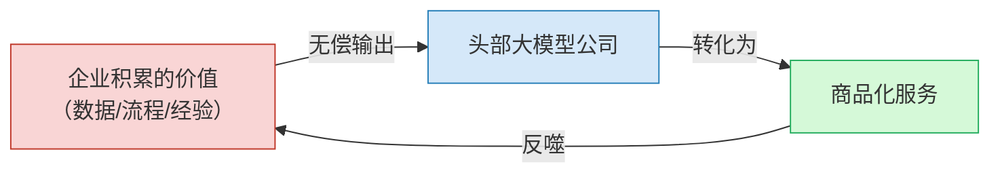
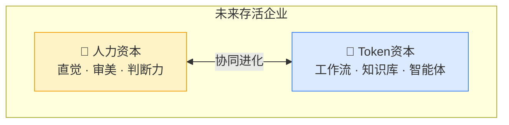
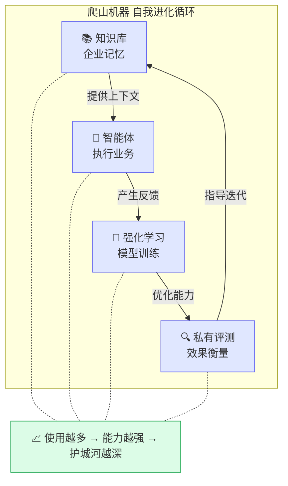
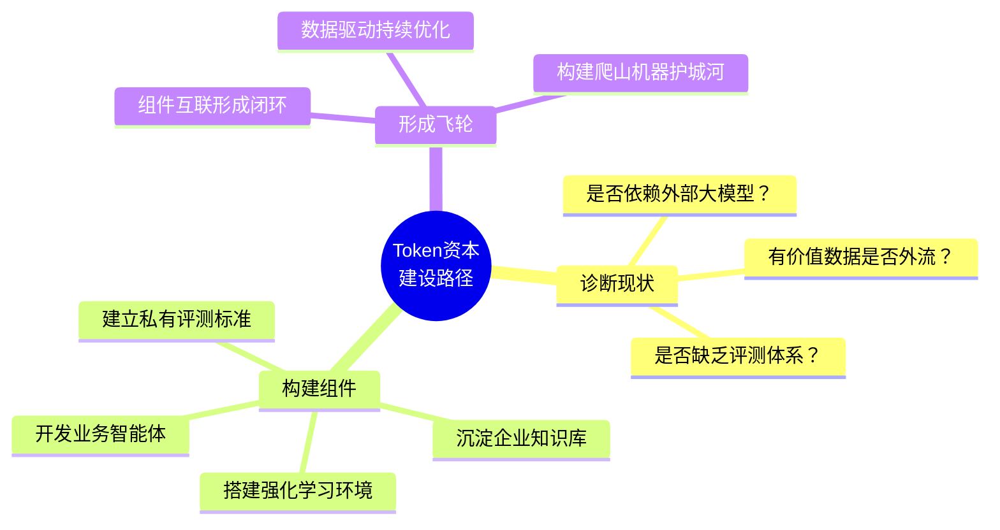

# AI时代企业生存法则：Token资本

> **来源**：微软CEO纳德拉关于AI时代企业生存法则的观点解读

## 核心观点摘要

当前许多企业的商业生态都建立在大模型之上，但缺乏自身的 **"Token资本"**，导致其核心价值被头部大模型公司"吸干"。企业必须同时积累 **人力资本** 和 **Token资本**，才能在AI时代建立真正的护城河。

---

## 问题提出：警惕"免费燃料"

如果企业的商业生态完全依赖大模型，且不建立自己的"Token资本"，那么企业积累的所有有价值的东西，都会被几个头部大模型公司当作 **"免费的燃料"**——它们会毫不留情地吸干这些价值，并将其转化为自身的商品化服务。

> ⚠️ **警示**：没有Token资本的企业 = 大模型生态中的"燃料供应商"

---

## 核心概念：双资本架构

纳德拉提出了一个颠覆性的企业架构，认为未来能存活的公司必须同时拥有两种资本：

| 维度 | 人力资本 🧠 | Token资本 🤖 |
|------|------------|-------------|
| **定义** | 员工的直觉、审美、跨领域连接能力、经验人脉和终极判断力 | 公司自己沉淀的、能随与大模型交互而不断进化的AI能力 |
| **本质** | 人的智慧与判断 | 组织级AI能力资产 |
| **载体** | 核心团队、专家网络 | 工作流、知识库、智能体、评测体系、内部学习系统 |
| **特点** | 不可完全自动化，是最终决策的关键 | 可积累、可进化、可复用，越用越强 |
| **类比** | 企业的"灵魂" | 企业的"AI肌肉" |

---

## 建立Token资本：从"算力耗材"到"爬山机器"

企业必须自己构建进化学习能力，**这无法外包**。系统需要包含以下关键零件：

### 四大核心组件

| 组件 | 作用 | 价值 |
|------|------|------|
| **🔍 私有评测** | 建立自己的评价体系，衡量模型是否真正帮助业务 | 摆脱对公开榜单的依赖，聚焦真实业务指标 |
| **🔄 强化学习环境** | 让模型使用真实运行数据在公司内部训练 | 模型越来越懂业务，持续优化决策质量 |
| **📚 知识库** | 将公司多年的记忆和know-how转化为可调用形式 | 组织经验不再随人员流动而流失 |
| **🤖 智能体** | 开发自己的智能体处理和优化业务流程 | 自动化关键流程，形成闭环执行能力 |

### 爬山机器：自我进化学习循环

当四大组件结合在一起，就构成了纳德拉所说的 **"爬山机器"**——一个与传统资产截然不同的新护城河：

### 传统资产 vs 爬山机器

| 对比维度 | 传统资产 | 爬山机器（Token资本） |
|----------|---------|----------------------|
| **使用效果** | 越用越折旧 | 越用越优化 |
| **进化能力** | 静态，需人工升级 | 自我进化，持续学习 |
| **护城河来源** | 规模、资金、牌照 | 数据飞轮、组织智能 |
| **可复制性** | 竞争对手可购买同类资产 | 难以复制，因植根于独特业务数据 |
| **边际成本** | 递增 | 递减 |

---

## 总结：企业行动清单

> 💡 **核心启示**：在AI时代，企业的核心竞争力不再是"用了哪个大模型"，而是 **"沉淀了多少Token资本"**。没有Token资本的企业，终将成为大模型公司的免费燃料。
