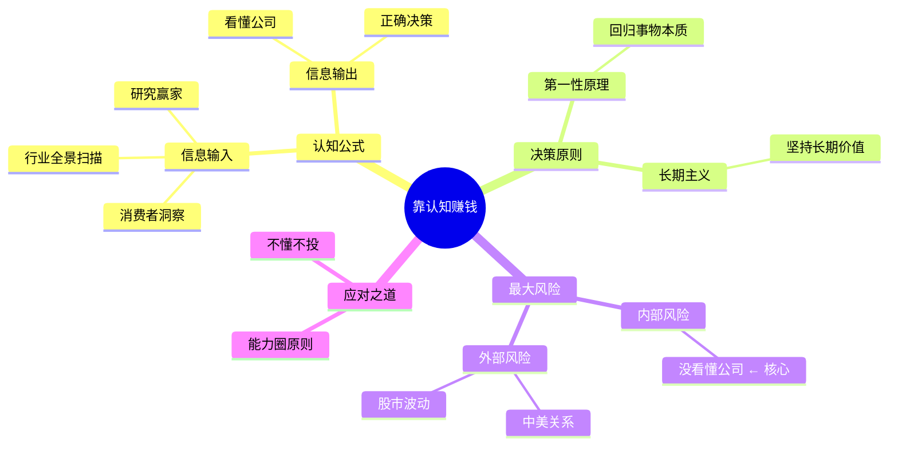
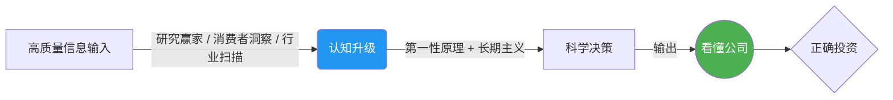
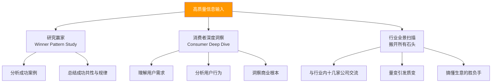
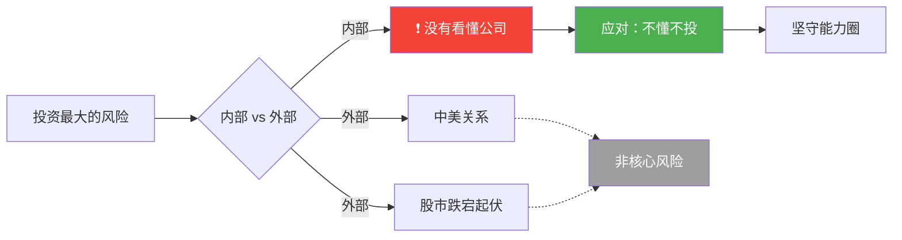
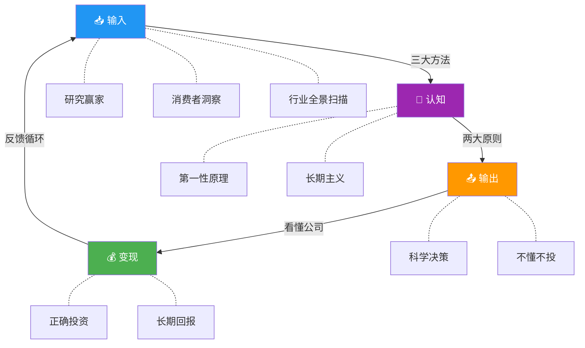
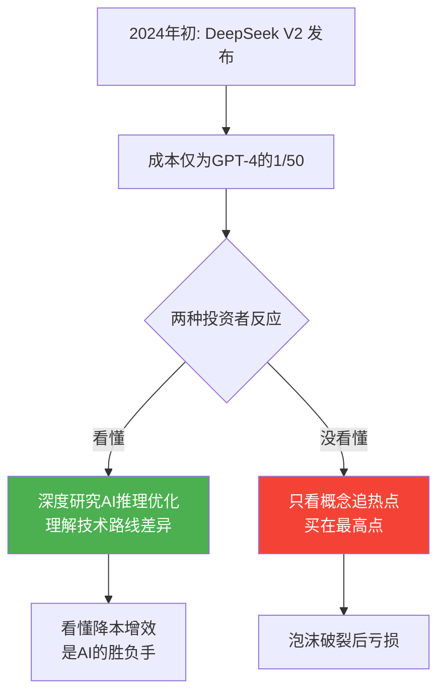
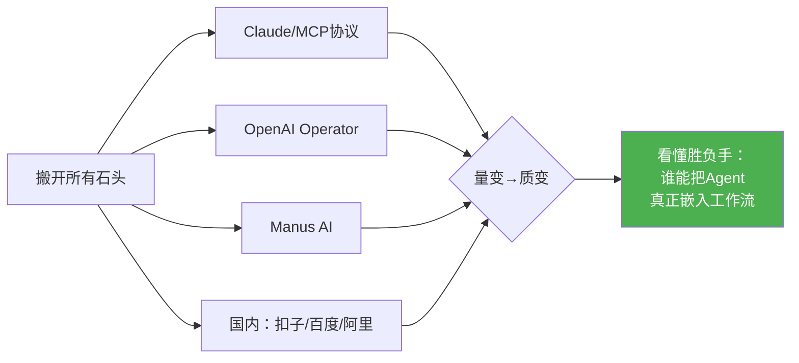
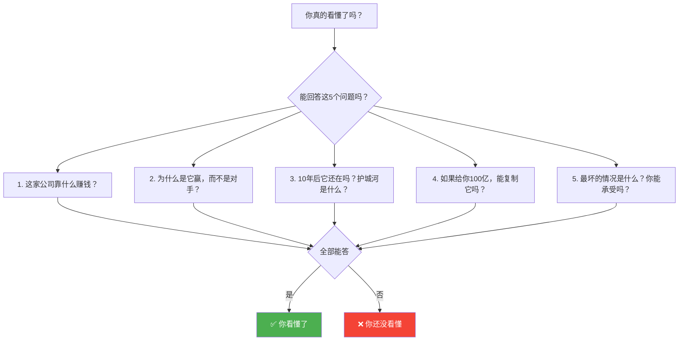
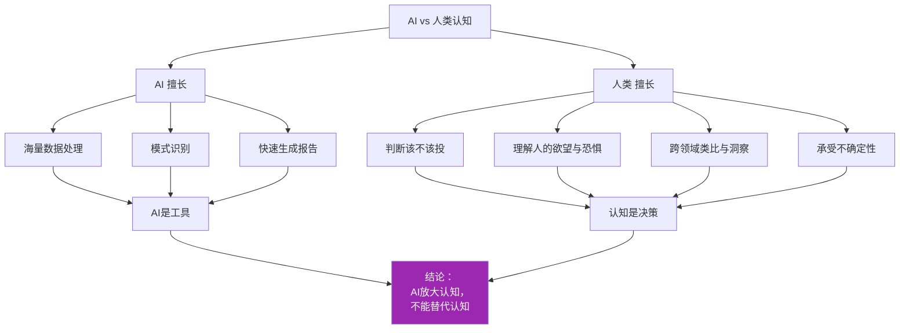
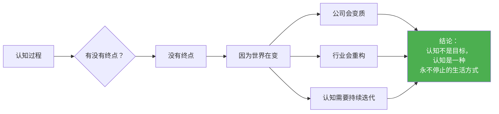

# 徐新的投资心法：如何靠认知赚钱

> **核心论点**：今日资本徐新分享了她的投资方法论核心——**靠认知赚钱**。投资最大的风险不是市场波动，而是**没有看懂公司**。提升认知的关键在于高质量的信息输入和科学的决策过程。

---

## 📊 全览图：认知赚钱的完整框架



---

## 一、认知的公式与决策原则

认知的本质是信息输入与输出的过程。要提升输出质量，必须保证输入质量，并遵循科学的决策原则。



| 环节 | 核心要点 | 说明 |
|------|---------|------|
| 认知公式 | 认知 = 信息输入 + 信息输出 | 输入决定输出质量 |
| 决策原则 | 第一性原理 + 长期主义 | 回归本质，坚持长期价值 |
| 终极目标 | 看懂公司 | 认知变现的前提 |

---

## 二、高质量信息输入的三大方法

为了保证信息输入的质量，徐新分享了三个核心方法：



| # | 方法 | 核心动作 | 目标 |
|---|------|---------|------|
| 1 | 🏆 研究赢家 (Winner Pattern Study) | 分析成功案例，总结共性与规律 | 找到可复制的成功模式 |
| 2 | 👥 消费者深度洞察 (Consumer Deep Dive) | 深入理解用户需求和行为 | 抓住商业的根本 |
| 3 | 🔍 行业全景扫描 (搬开所有石头) | 与行业内十几家公司交流，量变引发质变 | 搞懂生意的胜负手 |

---

## 三、投资最大的风险与应对之道

徐新强调，投资最大的风险并非外部环境，而是源于内部。



| 风险类型 | 具体内容 | 重要程度 |
|---------|---------|---------|
| ⚠️ 最大风险 | 没有看懂这家公司 | 🔴 核心风险 |
| 非核心风险 | 中美关系、股市跌宕起伏等外部因素 | 🟡 可控风险 |

> 💡 **应对之道**：向段永平学习，坚持**"不懂不投"**的原则。在没有真正理解之前，坚决不下注。

---

## 四、逻辑记忆：四步闭环框架



---

## 五、核心总结

投资的本质是认知的变现。

| 层次 | 关键动作 | 核心要素 |
|------|---------|---------|
| **输入层** | 高质量信息获取 | 研究赢家 + 洞察用户 + 扫描行业 |
| **决策层** | 科学决策框架 | 第一性原理 + 长期主义 |
| **风控层** | 坚守能力圈 | 不懂不投（段永平原则） |
| **输出层** | 认知变现 | 看懂公司 → 正确投资 → 长期回报 |

> 🎯 **一句话总结**：通过 **高质量信息输入** × **科学决策原则** = **看懂公司** = **靠认知赚钱**。

---

## 六、正在发生的案例（2024-2026）

> 用当下真实案例，验证"靠认知赚钱"的实战逻辑。

### 案例全景对照表

| 案例 | 对应方法论 | 认知动作 | 结果 |
|------|-----------|---------|------|
| 🟢 徐新重仓京东 | 长期主义 + 消费者洞察 | 早期看懂电商本质是"多快好省"，刘强东是赢家 | 持有10年+，回报超100倍 |
| 🟢 今日资本投资美团 | 行业全景扫描 | 与十几家本地生活公司交流，看懂"高频打低频"逻辑 | 王兴成为赢家，今日资本大赚 |
| 🔴 巴菲特错过科技股初期 | 不懂不投 | 早期看不懂科技股商业模式，选择不投 | 错失亚马逊、谷歌早期百倍机会 |
| 🟡 美股散户炒Meme股 | 反面教材：没看懂公司 | GME/AMC暴涨时跟风买入，不理解公司基本面 | 多数散户血本无归 |

---

### 案例一：DeepSeek 的崛起 —— "研究赢家法则"的活教材



**认知复盘**：
- ✅ **赢家做法**：研究DeepSeek技术路线 → 理解MoE架构+知识蒸馏 → 看清中国AI的真正竞争力在"成本效率" → 提前布局
- ❌ **亏损做法**：AI概念热炒时追高 → 不理解技术本质 → 泡沫退去后一地鸡毛
- 📌 **对应心法**：研究赢家法则——不是看AI这个"赛道"，而是看懂谁是赢家、为什么赢

---

### 案例二：Shein/拼多多出海 —— "消费者深度洞察"的极致

| 维度 | 传统零售 | Shein / Temu |
|------|---------|-------------|
| 供应链 | 层层分销 | 工厂直达消费者 (C2M) |
| 数据驱动 | 靠经验备货 | 实时数据反馈，小单快反 |
| 用户洞察 | 市场调研 | 算法精准推荐 + 社交裂变 |
| 价格优势 | 品牌溢价 | 极致性价比 |
| 扩张速度 | 逐国开城 | 全球化闪电战 |

**认知复盘**：
- ✅ **徐新视角**：消费者要的就是"又好又便宜"。Shein/Pinduoduo真正做到了消费者洞察，用技术手段将中国供应链优势输出全球
- 📌 **对应心法**：消费者深度洞察——不是问用户"你想要什么"，而是看用户**实际在做什么**

---

### 案例三：2025年AI Agent赛道 —— "行业全景扫描"的必要性



**认知复盘**：
- 2025-2026年AI Agent赛道火热，但多数投资人只看"演示效果"
- ✅ **赢家做法**：交流十几家Agent公司 → 发现真正的壁垒不在模型，而在**企业级场景的落地能力**（数据打通、合规、容错）
- ❌ **亏损做法**：被Demo惊艳就投 → 没有看到工程化落地的巨大鸿沟
- 📌 **对应心法**：行业全景扫描——"搬开所有石头"才能看到谁在裸泳

---

### 案例四：段永平与"不懂不投" —— 最高境界的知行合一

| 年份 | 事件 | 段永平的选择 |
|------|------|-------------|
| 2001 | 网易股价跌至$0.8 | 看懂游戏+门户模式 → 抄底买入 |
| 2008 | 金融危机 | 加仓比亚迪（看懂电池+汽车） |
| 2011-2020 | 科技股暴涨 | 看不懂就不碰，持有现金/茅台 |
| 2022 | 中概股暴跌 | 加仓腾讯（看懂社交护城河） |
| 2024-2025 | AI热潮 | 看不懂AI公司就不投，坚守能力圈 |

> 📌 **核心启示**："不懂不投"不是不投，而是**只在真正看懂时重注**。段永平每一笔大赚，都是"认知到位"后的果断行动。

---

## 七、最高级思考问答：全文灵魂拷问

### Q1：为什么"看懂"这么难？

> **问**：徐新说投资最大的风险是"没看懂公司"——但什么叫"看懂"？怎么判断自己真的看懂了？



**答案**：看懂一家公司的标准——**你能向一个12岁孩子解释清楚它怎么赚钱、为什么赢、能赢多久**。如果你解释不了，你就没看懂。

---

### Q2：认知和智商的区别是什么？

> **问**：既然投资靠认知，那聪明人是不是天然更擅长？认知可以"学"吗？

| 维度 | 智商 (IQ) | 认知 (Cognition) |
|------|----------|-----------------|
| 本质 | 计算速度、逻辑推理 | 信息质量 + 思维框架 |
| 来源 | 先天 + 早期训练 | **后天持续输入 + 刻意练习** |
| 在投资中的作用 | 帮你算得快 | 帮你想得对 |
| 能否提升 | 提升有限 | **可以大幅提升** |
| 典型表现 | "这道题我会解" | "这道题该不该解" |

**答案**：投资不需要你是天才，但需要你是**一个持续进行高质量信息输入的"认知机器"**。段永平不是最聪明的投资人，但他可能是最懂"不懂不投"的人。

---

### Q3：AI时代，认知还能赚钱吗？

> **问**：2026年，AI可以分析海量数据、生成研究报告、甚至做投资决策——人类的"认知"还有价值吗？



**答案**：AI让"信息输入"变得廉价且高效——**认知的门槛不是信息获取，而是判断力**。能用好AI做研究的人，认知升级更快；不能的人，会被AI制造的信息噪音淹没。AI时代，认知差距不是缩小，而是**指数级拉大**。

---

### Q4：普通人如何应用这套心法？

> **问**：我不是投资人，这套"认知赚钱"方法论对我有什么用？

| 身份 | 应用场景 | 具体行动 |
|------|---------|---------|
| 🧑‍💻 职场人 | 选择公司/行业 | 用"行业全景扫描"选赛道，用"消费者洞察"判断公司前景 |
| 🚀 创业者 | 选择创业方向 | "研究赢家"找模式，"第一性原理"验证需求真伪 |
| 📈 个人投资者 | 股票/基金投资 | "不懂不投"，先看懂再下手 |
| 🎓 学生 | 选择学习方向 | 用"长期主义"选赛道，不被短期热点带偏 |

**答案**：**人生就是一场投资**。你投资时间、精力、金钱，回报是你的未来。徐新的心法本质上是一套"如何在不确定性中做高质量决策"的方法论——适用于一切选择。

---

### Q5：最终极的问题——认知有天花板吗？

> **问**：如果认知的本质是信息输入+输出，那是否存在一个"足够"的状态？



> **🔮 终极答案**：认知没有天花板。真正的投资大师不是"看懂了然后躺赢"，而是**永远保持好奇、永远在输入、永远在验证**。徐新投了京东10年还能看到新的增长点——这就是认知的复利。
> 
> **靠认知赚钱的本质 = 靠终身学习赚钱。**

---

## 📝 全文终极总结

```mermaid
graph TB
    subgraph 核心公式
        F1[高质量输入] × F2[科学决策] = F3[看懂] → F4[赚钱]
    end
    
    subgraph 三大方法
        M1[研究赢家] + M2[消费者洞察] + M3[行业全景扫描]
    end
    
    subgraph 两大原则
        P1[第一性原理] + P2[长期主义]
    end
    
    subgraph 风控底线
        R1[不懂不投] + R2[能力圈]
    end
    
    subgraph 现实验证
        C1[京东100倍] + C2[DeepSeek崛起] + C3[Shein出海] + C4[Agent赛道]
    end
    
    M1 & M2 & M3 --> F1
    P1 & P2 --> F2
    R1 & R2 --> F3
    
    style F4 fill:#4CAF50,color:#fff
    style F3 fill:#2196F3,color:#fff
```

| 层次 | 内容 | 金句 |
|------|------|------|
| **道** | 投资 = 认知变现 | "投资最大的风险是没看懂公司" |
| **法** | 输入质量 × 决策质量 | "第一性原理 + 长期主义" |
| **术** | 三大方法 + 不懂不投 | "搬开所有石头" |
| **器** | AI工具 + 信息网络 | "AI放大认知，不替代认知" |
| **行** | 终身学习 + 持续迭代 | "认知是一种永不停止的生活方式" |

> 🏆 **全文最后一句话**：在这个信息爆炸的时代，**最稀缺的不是信息，而是认知**。而认知的本质，是**你愿意为理解一件事，付出多少高质量的注意力**。
