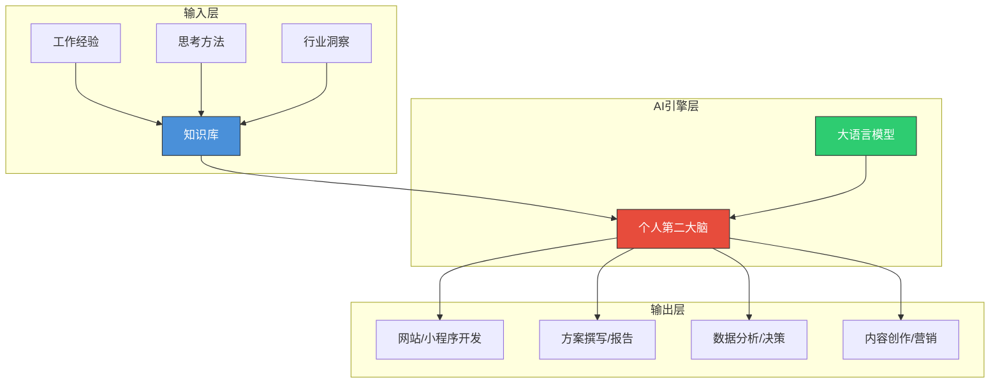
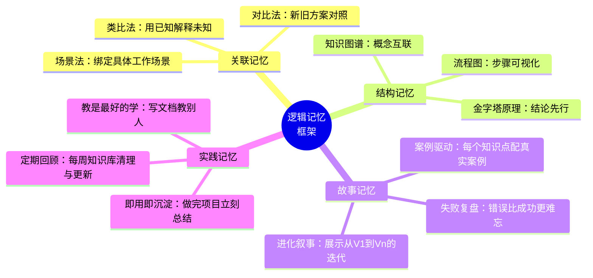

# 什么是”真正会用 AI”——从问答到第二大脑

> **核心命题**：真正会用 AI 的人，不是问得最多的人，而是让 AI 替自己思考得最多的人。

本文探讨如何从”一问一答”的浅层 AI 使用，跃迁到构建个人知识库、打造 AI”第二大脑”的深度工作模式。

---

## 一、三个层次递进

### 1. 误区：问答式使用 AI ❌

将 AI 当作普通搜索引擎，通过频繁问答来获取信息。这种方式：

- 每次对话**从零开始**，AI 不记得你的偏好和上下文
- 输出质量**高度依赖 Prompt 技巧**，不可复现
- 知识**散落在聊天记录中**，无法积累复用
- 本质上是「人适配 AI」，而非「AI 适配人」

### 2. 核心：将经验沉淀为知识库 🧠

将工作流程、思考方式和专业知识**系统性地沉淀**到 AI 系统中：

- 你的文档、SOP、案例库 → 成为 AI 的**长期记忆**
- AI 基于**你的经验**来辅助决策，而非通用回答
- 从「每次重新教 AI」变为「AI 越用越懂你」

### 3. 目标：打造个人”第二大脑” 🚀

建立个人知识助手，能随时调用知识库来快速响应需求——开发网站、生成方案、分析数据、撰写报告，一切基于**你的积累**。

---

## 二、核心架构图

---

## 三、使用层次对比

| 维度 | 浅层使用（问答式） | 深度使用（知识库式） | 最高级（自主代理式） |
|------|-------------------|---------------------|---------------------|
| **上下文** | 每次从零开始 | 持续积累，越用越精准 | 自主检索、自主关联 |
| **Prompt 依赖** | 高度依赖技巧 | 模板化、可复现 | 几乎无需手写 Prompt |
| **知识管理** | 散落在聊天记录 | 结构化沉淀、可检索 | 自动归纳、自动更新 |
| **输出质量** | 不稳定，需反复调 | 稳定，符合个人风格 | 持续进化，超越个人 |
| **效率提升** | ~10% | ~50% | ~200%+ |
| **典型工具** | ChatGPT 网页版 | Claude Projects / GPTs | Manus / Devin / Claude Code |

---

## 四、逻辑记忆框架——让知识真正”活”起来

逻辑记忆的核心不是死记硬背，而是通过**关联、结构、故事**让知识自然生长。

---

## 五、2026 年最新案例

### 案例 1：Claude Code + 个人知识库 = 全栈开发助手

> **背景**：独立开发者小王，需要在 3 天内交付一个客户管理小程序。
>
> **做法**：
> 1. 将过往 3 年的项目文档、代码规范、UI 设计稿整理进 Claude Projects 知识库
> 2. 用 Claude Code 直接读取知识库，自动生成符合自己编码风格的项目脚手架
> 3. 遇到业务逻辑问题时，Claude 基于**他的历史方案**给出建议，而非通用答案
>
> **结果**：原本 2 周的工作量，3 天完成，代码质量反而更高——因为 AI 复用了他过去踩过的坑。

### 案例 2：Cursor + Obsidian Vault = 技术写作飞轮

> **背景**：技术博主需要将学习笔记持续输出为博客。
>
> **做法**：
> 1. 所有学习笔记用 Obsidian 管理，形成结构化 Vault
> 2. Cursor 直接读取 Vault 中的笔记，辅助撰写技术文章
> 3. 文章发布后，读者的反馈又沉淀回 Vault，形成**内容飞轮**
>
> **结果**：月更从 2 篇提升到 8 篇，且每篇都带有个人体系化的独特视角。

### 案例 3：企业级——Notion AI + 内部 SOP 知识库

> **背景**：某创业团队 15 人，需要将老员工的经验快速复制给新人。
>
> **做法**：
> 1. 将所有 SOP、项目复盘、客户沟通记录导入 Notion AI
> 2. 新人入职后直接通过 AI 助手查询「这种情况怎么处理」
> 3. AI 给出的不是通用建议，而是**公司过往的真实处理方案**
>
> **结果**：新人上手时间从 3 个月缩短到 3 周，客户满意度提升 40%。

---

## 六、高阶思考问答（全文总结）

### Q1：构建”第二大脑”的最大障碍是什么？

> **不是技术，而是惯性。** 大多数人习惯了”打开对话框→输入问题→复制答案”的即时满足循环。构建知识库需要**前期投入**——整理文档、建立结构、持续维护——而回报是**延迟的**。破解方法是：不要等到”整理好再开始”，而是**边用边沉淀**，每次完成一个任务，花 5 分钟把关键内容存入知识库。

### Q2：知识库应该存什么、不存什么？

> **存**：决策过程（为什么选 A 不选 B）、失败复盘（踩过的坑）、个人模板（常用 Prompt、SOP、检查清单）、领域洞察（你对行业的独到理解）。
>
> **不存**：AI 能直接搜到的通用知识（那还是搜索引擎的思维）、未经消化的复制粘贴（信息≠知识）、过时且未标注日期的内容（会污染 AI 判断）。

### Q3：从”问答式”到”知识库式”的第一步应该做什么？

> **选一个你重复做过 3 次以上的工作任务**（比如写周报、做竞品分析、回复客户邮件），把你做这件事的流程写成一个 SOP 文档，喂给 AI。下次做同样的事，让 AI 基于这个 SOP 来辅助你。这就是”第二大脑”的最小可行版本——**一个任务、一份文档、一次验证**。

### Q4：AI 最终会取代”会用 AI 的人”吗？

> **不会——至少不会很快。** 因为”会用 AI”的本质不是操作 AI，而是**知道自己要什么**。你的判断力、审美、行业经验、对问题的定义能力——这些是 AI 的”导航系统”。没有导航，再强的引擎也只是原地空转。真正危险的不是 AI 取代人，而是**有知识库加持的一个人**取代了一个团队。

### Q5：如何衡量”第二大脑”是否有效？

> 三个指标：
> 1. **速度**：同样的任务，从想法到交付的时间缩短了多少？
> 2. **质量**：输出的稳定性和一致性是否提升了？
> 3. **复利**：知识库是否越用越”聪明”——同样的问题，AI 的回答是否越来越好？

---

## 七、一句话总结

> 🎯 **真正会用 AI = 你的经验 × AI 的能力 × 结构化的知识库**
>
> 不是比谁问得多，而是比谁**沉淀得多**。从今天开始，每完成一件事，花 5 分钟把它变成 AI 能理解的文档——这就是你”第二大脑”的第一块砖。

---

*下一步行动：选一个你重复最多的工作任务，写出第一份 SOP，喂给你的 AI。*