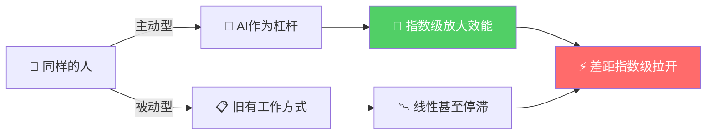
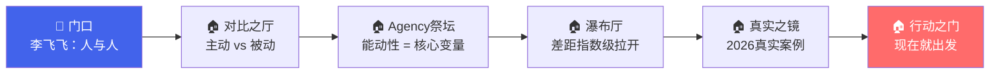

# AI教母李飞飞：未来十年的职场分水岭 — 能动性（Agency）

> **核心命题**：未来十年，职场的分水岭不在于"AI和人"，而在于"人和人"。
> 关键变量不是技术本身，而是**能动性（Agency）**——主动使用AI放大个人自主权、重新设计工作流的意愿和能力。

---

## 核心观点图解



---

## 未来职场的两种人

视频引用李飞飞的观点，将未来的职场人分为两类：

| 维度 | 🟢 主动型 | 🔴 被动型 |
|:---|:---|:---|
| **对AI的认知** | 能力的延伸、杠杆、协作者 | 摆设、威胁、与我无关 |
| **工作方式** | 主动重构任务链和工作流 | 沿用旧流程，等待统一模板 |
| **学习效率** | 指数级增长 | 线性甚至停滞 |
| **典型行为** | 自建AI工作流、组合多工具 | 等公司培训、问"我该用哪个" |
| **结果** | 一人完成过去一个团队的产出 | 被懂得利用AI的人甩开 |

### 典型场景对比

```
┌─────────────────────────────────────────────────────┐
│  场景：产品经理完成竞品研究                            │
├──────────────────────┬──────────────────────────────┤
│   🟢 主动型           │   🔴 被动型                   │
│                      │                              │
│  上午：AI批量抓取     │  第1天：手动搜索竞品           │
│  竞品数据与评价       │  第2天：逐页截图整理           │
│                      │  第3天：写分析报告             │
│  中午：AI辅助生成     │                              │
│  用户画像与洞察       │  耗时：~3天                   │
│                      │  质量：依赖个人经验            │
│  下午：AI共创原型     │                              │
│  构思与PRD草案       │                              │
│                      │                              │
│  耗时：~1天           │                              │
│  质量：数据驱动+AI洞察 │                              │
└──────────────────────┴──────────────────────────────┘
```

---

## 核心在于"能动性"（Agency）

视频反复强调**能动性**是关键，它指的是一个人主动改变工作方式的意愿和能力。

- **技术的核心**：不是工具本身，而是人是否有主动重构工作方式的意愿。
- **能力的差距**：同样是产品经理，会用AI的能一天内完成竞品研究、原型构思等全套流程，而不会用的人还在沿用五年前的旧流程，差距就此拉开。
- **最终的挑战**：未来十年，职场人面临的最大风险不是被AI取代，而是被那些懂得利用AI的人甩开。

### 逻辑记忆链：Agency 5层递进

```
[能动性] → 决定 → [工作方式重构] → 导致 → [效能倍数差异]
    ↓                                        ↓
[不是AI取代人]                      [同起点·不同终点]
    ↓                                        ↓
[是"懂AI的人"取代"不用AI的人"]      [差距 = f(能动性, 时间)]
```

> 🧠 **记忆口诀**：**一人一AI = 一支团队；一人零AI = 一个时代之前的自己**
>
> 📐 **逻辑公式**：`产出差距 = 基础能力 × (AI杠杆)^能动性`
> - 能动性 = 1（主动），杠杆指数级放大
> - 能动性 = 0（被动），杠杆系数为1，原地不动

---

## 2026年正在发生的真实案例

### 案例一：Klarna 的 AI  workforce 替代

瑞典金融科技公司 Klarna 在2024年宣布其AI客服助手已经完成了相当于**700名全职客服**的工作量。到2026年，该公司进一步将AI嵌入产品、风控、营销全链路，**全球员工从5000+缩减至不足3000人**，但业务量持续增长。

> **启示**：这不是"AI取代人"的故事——是**少数懂AI的人重构了整个组织的工作流**，而等待旧流程的人自然被淘汰。

### 案例二：一人公司（Solopreneur）现象爆发

2025-2026年，借助 Cursor + Claude + Midjourney + Vercel 等工具栈，大量个人创业者实现了**从构思到上线的全流程自交付**：
- 独立开发者用AI编程助手，**1周完成过去需要3个月的外包项目**
- 内容创作者用AI辅助脚本+AI视频生成，**一人运营过去需要5人团队的频道**
- 设计师用AI出初稿+人工精修，**日产出提升5-10倍**

> **启示**：主动型职场人不再依赖"岗位"来证明价值——他们本身就是完整的生产力单元。

### 案例三：大厂内部的"AI能力分层"

2026年，Meta、Google、字节跳动等公司开始在内部推行**AI能力评估**：
- 同样的工程师岗位，能用AI辅助代码审查、自动生成测试、快速原型的人，**绩效显著高于同级别同事**
- 公司内部开始出现"AI原住民"和"AI移民"的隐性分层
- 晋升标准悄然加入"是否有效利用AI提升团队效能"

> **启示**：能动性不再是加分项——它正在成为**基本职场生存条件**。

---

## 最高级思考问答（全文总结）

### Q1: 李飞飞说"分水岭在于人和人"——那么AI本身的角色到底是什么？

**A**: AI是**中性的放大器**。它放大的是使用者的意图和能动性。同样一把锤子，在建筑师手中是创造，在旁观者手中只是铁块。**AI不会主动拉开差距——是人对自己能动性的选择拉开了差距。**

### Q2: 如果AI让生产力极大丰富，那么什么会变得稀缺？

**A**: 当**执行**变得廉价，**判断力、创造力和品味**变得稀缺。AI可以100倍加速"怎么做"，但"做什么"和"为什么做"仍然需要人类能动性来定义。**未来的核心竞争力 = 提出好问题的能力 × AI执行效率。**

### Q3: "能动性"是天生的还是可以培养的？

**A**: 能动性是一种**元技能（meta-skill）**，可以通过环境设计和微习惯培养：
1. **降低启动摩擦**：选一个今天就能用的AI工具，完成一个小任务
2. **建立反馈循环**：记录"用AI前 vs 用AI后"的时间和质量差异
3. **社区驱动**：加入AI实践社区，看到他人的可能性会激发自己的能动性
4. **允许失败**：能动性的敌人不是懒惰，而是完美主义

### Q4: 被动型的人还有机会转变吗？窗口期还有多久？

**A**: 有，但窗口在**快速收窄**。转变的关键不是"学更多工具"，而是**认知转换**——从"我该用什么AI"变成"我的哪些工作可以重新设计"。2026年仍是早期红利窗口，但到2028年，AI能动性很可能从"竞争优势"变成"基本门槛"。

### Q5: 全文的终极一句话总结？

> **工具不缺，缺的是人的能动性。与其等待被分配AI模板，不如今天就开始重构自己的工作流——因为未来不属于"会用AI的人"，而属于"主动用AI重新设计一切的人"。**

---

## 🏛️ 记忆宫殿：能动性之旅

> **场景设定**：走进一座名为"AI时代的职场"的建筑，依次经过5个房间。

### 🚪 门口 — 李飞飞站在门前

李飞飞微笑着指向门上的铭文：

> "分水岭不在门里门外，**在你们之间**。"

🧠 **编码**：AI vs 人 ❌ → **人 vs 人 ✅**

---

### 🏠 房间一：对比之厅

左墙：一个人在指挥一支AI机器人交响乐团，音乐磅礴。
右墙：一个人对着一台积灰的机器人，说"等说明书来了再用"。

🧠 **编码**：**主动型** vs **被动型**

---

### 🏠 房间二：Agency 核心祭坛

祭坛中央漂浮着金色大字 **"能动性"**，下方公式闪烁：

```
产出 = 基础能力 × AI杠杆^能动性
```

🧠 **编码**：核心变量 = **能动性**，不是工具

---

### 🏠 房间三：瀑布厅 —  cascading gap

左边瀑布：主动型的产出如瀑布飞流直下，越落越快。
右边涓流：被动型的产出如细线滴漏，几乎停滞。
两股水流汇入底部深渊——**差距之渊**。

🧠 **编码**：差距 = f(能动性 × 时间)，**指数级拉开**

---

### 🏠 房间四：真实之镜

三面镜子映照2026年的真实世界：
- 🪞 Klarna: 700人→AI，公司反增利润
- 🪞 一人公司: 一个人 = 过去一个团队
- 🪞 大厂分层: AI原住民 vs AI移民

🧠 **编码**：这不是未来，**这已经在发生**

---

### 🏠 房间五：出口 — 行动之门

门上最后一行字：

> **"工具不缺。缺的是你迈出去的那一步。"**
> **现在就出发。**

🧠 **编码**：行动 > 等待。**今天就开始重构你的工作流。**

---

### 🗺️ 记忆宫殿速览



---

**回顾路径**：李飞飞指方向 → 两种人对比 → 能动性是核心 → 差距在拉大 → 案例已发生 → **现在就行动**

> 💡 视频最后总结：工具并不缺乏，缺乏的是人的能动性。与其等待，不如主动开始学习和使用AI，将其融入自己的工作中。
