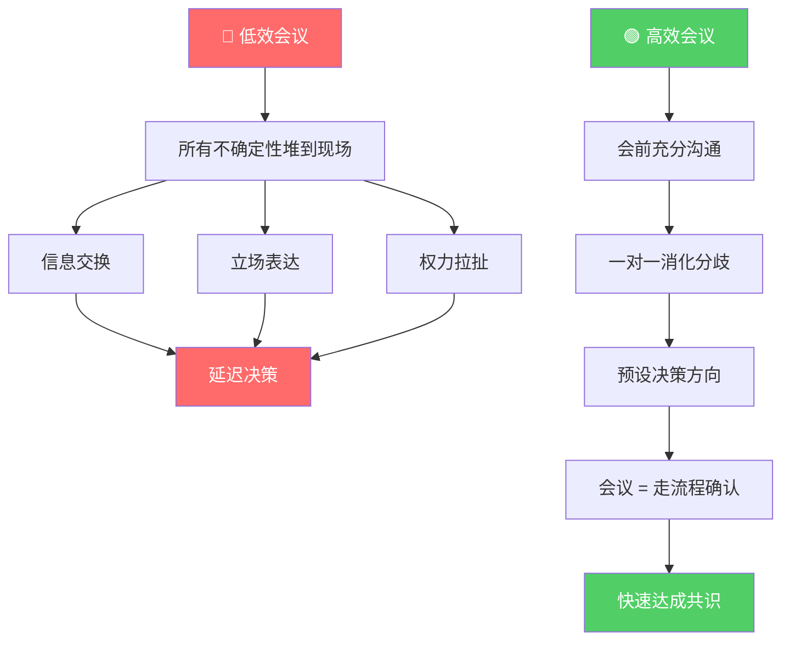
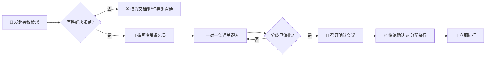

# 开会的本质：决策分配，而非讨论问题

> **一句话核心**：会议的终极目的不是交换信息，而是**确认已经基本成型的决策**。

---

## 🧠 核心论点图解



---

## 📊 低效会议 vs 高效会议：对比表

| 维度 | 🔴 低效会议 | 🟢 高效会议 |
|------|------------|------------|
| **会议目标** | 信息交换、现场讨论 | 确认已前置的决策 |
| **会前准备** | 发个议程、甚至没有 | 一对一沟通已对齐、分歧已消化 |
| **现场角色** | 全员发表意见 | 关键人确认决策方案 |
| **分歧处理** | 会议现场暴露冲突 | 会前已逐一化解 |
| **时间消耗** | 冗长、发散、无结论 | 短而精准、直指决策确认 |
| **决策质量** | 低（信息不全、情绪化） | 高（深思熟虑、充分论证） |
| **会后跟进** | 还要再开会讨论 | 直接执行，责任已明确 |
| **参会人感受** | 浪费时间、疲惫 | 目标明确、行动清晰 |

---

## 🔬 理论深度：为什么会这样？

### 1. 决策前置的认知基础

- **渐进承诺效应（Incremental Commitment）**：人在小范围一对一沟通中更容易松口、妥协，而在公开场合会因"面子"而固守立场。
- **社会认同压力**：会议室内的群体动力学天然制造"表演性发言"，参与者倾向于展示存在感而非推进效率。
- **信息不对称**：每个人掌握的信息碎片不同，会前未对齐 → 会上各说各话。

### 2. 高效会议的三步法则

```
第一步：会前 → 一对一沟通（消化分歧，预设方案）
第二步：会中 → 快速确认（走流程，不做发散讨论）
第三步：会后 → 立即执行（决策即行动，不拖泥带水）
```

---

## 📈 现实数据：低效会议的代价（2025年报告）

> 来源：艾瑞咨询《中国企业会议现状白皮书2025》、36氪《2025企业会议效率报告》

| 指标 | 数据 |
|------|------|
| 低效会议年均经济损失 | **超 1.5 万亿元人民币** |
| 员工认为会议效率低下的比例 | **62%** |
| 平均每周会议时长 | **12 小时** |
| 其中被认定为无效会议占比 | **40%** |
| 低效会议占工作时间比例 | **35%** |
| 平均每次会议成本 | **约 5,000 元** |
| 数字化工具可提升效率 | **30%+** |

**核心洞察**：一个 500 人的公司，每年因低效会议浪费的成本可达 **数百万元**，这还不包括机会成本和员工士气损耗。

---

## 🏢 真实案例

### 案例一：Amazon — 六页备忘录 & 默读会议

**做法**：
- 禁止使用 PPT，所有会议必须以 **6 页叙述性备忘录（Narrative Memo）** 启动
- 会议开始前 20-30 分钟，全员**静默阅读**同一份文档
- 阅读完成后才进入讨论和决策环节

**为什么有效**：
- 文档写作迫使作者**深度思考**，无法用花哨幻灯片掩盖逻辑漏洞
- 静默阅读消除了"演讲者掌控叙事"的权力不对称
- 所有人带着**同一信息基线**进入讨论，避免了信息交换阶段

**贝佐斯原话**：
> *"传统的 PPT 对演讲者很容易，但对听众很难。一份好备忘录可能需要一周甚至更久来写，但它迫使作者清晰地思考。"*

---

### 案例二：字节跳动 — 飞书文档先行 + 异步评审

**做法**：
- 推行「**文档先行**」文化：任何会议必须先有飞书文档
- 参会人在会前通过飞书文档**异步批注、评论**
- 会议只处理**文档中无法解决的争议点**
- 引入 AI 会议纪要自动生成 action items

**效果**：
- 内部调研显示，会议平均时长**缩短 40%**
- 决策执行率显著提升，会后"再开一次会"的情况大幅减少

---

### 案例三：Tesla — Elon Musk 的"极端会议纪律"

**做法**：
- Musk 要求任何会议**不得超过 5 人**
- 如果一个人无法为讨论带来价值，**立即请他离开**
- 频繁的大型会议被定义为「Tesla 的毒药」

**核心原则**：
> *"走出一间会议，除非你在创造价值，否则就是在浪费所有人的时间。"*

---

## 💎 最高级思考问答（全文深度总结）

### Q1：既然会前沟通这么重要，那会议本身还有存在的必要吗？

> **A**：有，但角色变了。会议不再是"创造决策"的地方，而是"仪式化确认"的场景。它的价值在于：
> - 给所有关键人一个**共同承诺的仪式感**
> - 处理最后一公里的、无法在书面中解决的**微妙分歧**
> - 建立团队**信息同步的最小共识面**

### Q2：如果领导者本身不愿意做会前沟通，怎么办？

> **A**：这本质上是个**权力结构问题**，不是方法论问题。解决路径：
> - **向上管理**：用数据说话——展示低效会议的成本（每人每小时薪资 × 人数 × 小时数）
> - **平行影响**：在自己的权限范围内先做，形成示范效应
> - **文化渗透**：推动公司层面的会议规范（如引入"会前必读文档"制度）

### Q3：远程/混合办公时代，决策前置是否更难了？

> **A**：恰恰相反。远程办公天然更适合文档驱动：
> - 异步工具（飞书、Notion、Slack Threads）让一对一沟通**不再受地理限制**
> - 文档留痕使决策过程可追溯，降低了"会后翻旧账"的风险
> - AI 辅助写作和总结降低了文档准备的时间成本

### Q4：如何判断一场会议该不该开？

> **A**：会前自检三问：
> 1. **有明确的决策点吗？** → 没有 = 不该开会，该发文档
> 2. **关键人已经提前对齐了吗？** → 没有 = 先做会前沟通
> 3. **这个决策必须在同一时间、同一空间做出吗？** → 不是 = 异步决策更高效

### Q5：AI 时代，高效会议的未来形态是什么？

> **A**：
> - **会前**：AI 自动整理背景信息、生成决策备忘录草稿、标注分歧点
> - **会中**：AI 实时记录 + 关键决策点标注，减少"记录员"角色
> - **会后**：AI 自动生成 action items、分配责任人、设置 deadline
> - **终极形态**：大部分"信息同步型"会议被 AI 异步摘要取代，人类会议只保留**真正需要群体智慧的高维决策**

---

## 📐 决策前置流程图



---

## 🏛️ 记忆宫殿：高效会议的五层建筑

> 想象你站在一座五层高的古典建筑前。每一层代表高效会议的一个关键要素。

### 🚪 第一层·门厅 —— **过滤**
你推开大门，门厅里站着一个**守门人**。他只问三个问题：*有决策点吗？关键人对齐了吗？必须同时同地吗？* 如果答不上来，你被礼貌地请回去——这场会不该开。

### 📜 第二层·书房 —— **文档**
书房里有一张大书桌，桌上摊开一份**六页备忘录**。灯光温暖而专注。这里没有PPT的浮华，只有文字的力量。每个字都在说：*我已经想清楚了，你呢？*

### 🤝 第三层·走廊 —— **沟通**
走廊里，两个人在**低声交谈**。一对一，没有观众。这里是分歧消融的地方——面子放下来，真话升上去。走过这条走廊，所有暗礁都已清除。

### 🏛️ 第四层·议事厅 —— **确认**
议事厅中央是一张圆桌。所有关键人落座，桌上已经摆好了方案。没有争吵，没有发散——只有**"同意，执行"**四个字干脆落地。这是仪式，不是战场。

### 🚀 第五层·塔楼 —— **执行**
塔楼顶部的旗杆上插着一面旗帜，上面写着行动项和责任人。风把旗帜吹得猎猎作响——**决策即行动，没有一秒浪费**。

---

> 🧩 **记忆口诀**：**门（过滤）→ 书（文档）→ 廊（沟通）→ 厅（确认）→ 塔（执行）**
>
> 每次要开会前，在脑中走过这座五层建筑。如果某一层缺失，你就知道问题出在哪里。

---

*📌 实践建议：下次开会前，先走一遍"五层建筑"，检查每一层是否都已就位。*
