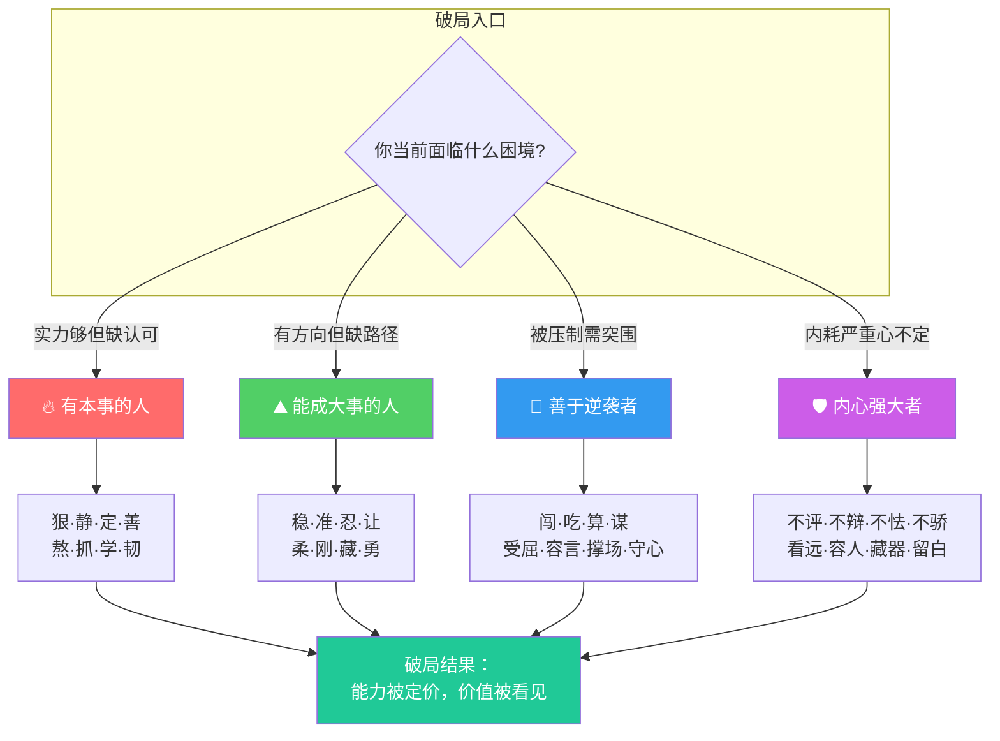
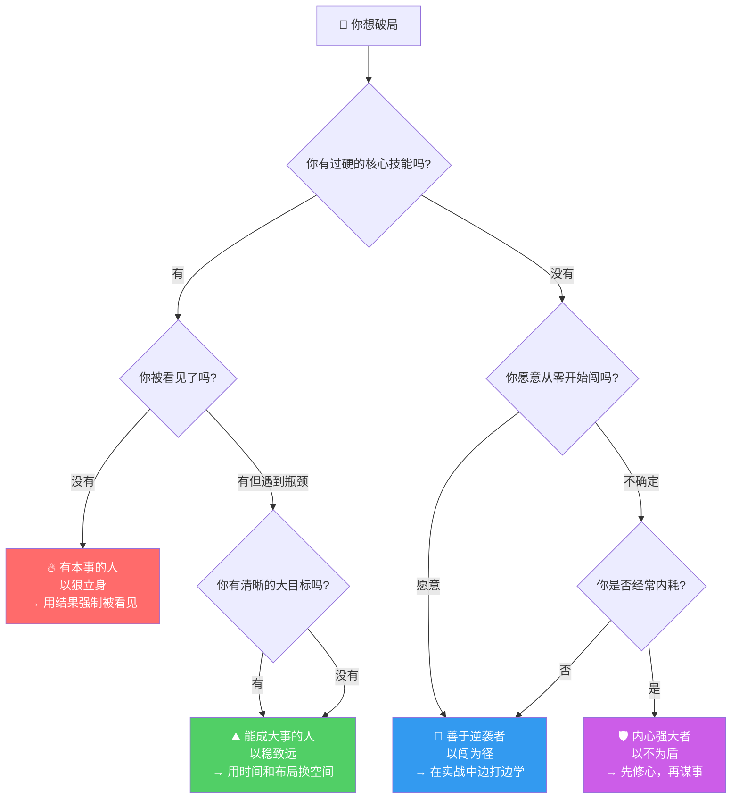

# 人生破局的八种能力：不同困境，不同武器

> **核心命题**：人生没有万能钥匙。不同的困境需要不同的思维模式和行为策略——**你不需要八种全具备，但必须知道自己在哪种困境中，该调用哪种能力组合。**

---

## 一、逻辑框架总图

```
┌─────────────────────────────────────────────────────────────────────┐
│                    人生破局 · 四型八能 总框架                         │
├─────────────────────────────────────────────────────────────────────┤
│                                                                     │
│   困境类型              破局角色              核心特质                │
│   ┌───────────┐        ┌───────────┐        ┌───────────┐          │
│   │ 有实力但   │───────▶│ 有本事的人 │───────▶│  以狠立身  │          │
│   │ 未被看见   │        │           │        │  以稳致远  │          │
│   ├───────────┤        ├───────────┤        ├───────────┤          │
│   │ 有目标但   │───────▶│ 能成大事者 │───────▶│  以闯为径  │          │
│   │ 缺乏路径   │        │           │        │  以为盾    │          │
│   ├───────────┤        ├───────────┤        ├───────────┤          │
│   │ 有资源但   │───────▶│ 善于逆袭者 │───────▶│ 草根突围   │          │
│   │ 被压制     │        │           │        │ 逆风翻盘   │          │
│   ├───────────┤        ├───────────┤        ├───────────┤          │
│   │ 有能力但   │───────▶│ 内心强大者 │───────▶│  以不为盾  │          │
│   │ 被内耗吞噬 │        │           │        │  静水流深   │          │
│   └───────────┘        └───────────┘        └───────────┘          │
│                                                                     │
└─────────────────────────────────────────────────────────────────────┘
```

### Mermaid 能力矩阵图



---

## 二、四型能力全解表

### 📊 总对比表

| 维度         | 🔥 有本事的人   | ⛰️ 能成大事的人 | 🌊 善于逆袭者  | 🛡️ 内心强大者 |
| ---------- | ---------- | --------- | --------- | --------- |
| **核心特质**   | 以"狠"立身     | 以"稳"致远    | 以"闯"为径    | 以"不"为盾    |
| **适合困境**   | 有实力但缺认可    | 有目标但缺路径   | 被压制需突围    | 内耗严重心不定   |
| **底层逻辑**   | 用结果说话      | 用时间换空间    | 用风险换机会    | 用不动应万变    |
| **典型角色**   | 技术大牛/独立贡献者 | 创始人/CEO   | 草根创业者/转型者 | 管理者/思想者   |
| **核心风险**   | 孤傲不合群      | 优柔寡断失时机   | 冒险翻车      | 封闭失良机     |
| **AI时代杠杆** | AI放大个人产出   | AI辅助战略决策  | AI降低创业门槛  | AI减少信息焦虑  |

### 📋 八能详解表

#### 🔥 有本事的人 —— 以"狠"立身

| 能力 | 内涵 | 行为表现 | 反面教材 |
|------|------|---------|---------|
| **狠** | 对自己要求严格，做事果断 | 砍掉低价值事务，拒绝无效社交 | 什么都想要，什么都做不精 |
| **静** | 保持冷静，沉着思考 | 危机时先分析再行动 | 遇事慌张，被情绪牵着走 |
| **定** | 目标坚定，内心笃定 | 定好方向后长期深耕 | 频繁换赛道，永远在起跑线 |
| **善** | 心怀善意，善于成事 | 利他思维，建立信任网络 | 零和博弈，赢了短期输了长期 |
| **熬** | 能吃苦耐劳，坚持不懈 | 在无人关注的日子持续输出 | 三天打鱼两天晒网 |
| **抓** | 善于抓住关键和重点 | 二八法则，聚焦核心杠杆点 | 眉毛胡子一把抓 |
| **学** | 保持学习的热情和能力 | 每年掌握一个新领域核心技能 | 吃老本，停止成长 |
| **韧** | 具备韧性，百折不挠 | 失败后快速复盘再出发 | 一次失败就全盘否定 |

#### ⛰️ 能成大事的人 —— 以"稳"致远

| 能力 | 内涵 | 行为表现 | 反面教材 |
|------|------|---------|---------|
| **稳** | 行事稳重，脚踏实地 | 不打无准备之仗，先算后战 | 冲动决策，赌徒心态 |
| **准** | 目标明确，判断精准 | 数据驱动决策，少拍脑袋 | 凭感觉行事 |
| **忍** | 懂得隐忍和克制 | 时机不对时按兵不动 | 急躁冒进，暴露底牌 |
| **让** | 懂得谦让和取舍 | 战略性放弃非核心业务 | 贪多嚼不烂 |
| **柔** | 以柔克刚，灵活变通 | 遇阻力时绕道而非硬撞 | 一根筋走到底 |
| **刚** | 内心有原则，立场坚定 | 底线问题上寸步不让 | 老好人，没有边界 |
| **藏** | 懂得藏拙和收敛 | 实力八成但只露五成 | 锋芒毕露招敌 |
| **勇** | 拥有内在的勇气 | 关键时刻敢于拍板担责 | 准备一辈子但不敢出手 |

#### 🌊 善于逆袭者 —— 以"闯"为径

| 能力 | 内涵 | 行为表现 | 反面教材 |
|------|------|---------|---------|
| **闯** | 敢于闯荡，不畏艰险 | 第一个吃螃蟹，抢占空白市场 | 等准备好了再开始（永远没准备好） |
| **吃** | 能吃苦，接地气 | 从最脏最累的活干起 | 眼高手低，挑三拣四 |
| **算** | 善于计算和规划 | 每步棋都想好后面三步 | 走一步看一步 |
| **谋** | 深谋远虑，计谋周全 | 布局半年一击即中 | 只看眼前利益 |
| **受屈** | 能承受委屈和压力 | 被拒绝100次仍第101次敲门 | 玻璃心，受不了否定 |
| **容言** | 能容纳不同的意见 | 听逆耳忠言，兼听则明 | 只听好话，信息茧房 |
| **撑场** | 能为自己和他人兜底 | 团队出事时第一个站出来 | 甩锅推责 |
| **守心** | 坚守本心和底线 | 赚快钱的诱惑面前说"不" | 为短期利益牺牲长期信誉 |

#### 🛡️ 内心强大者 —— 以"不"为盾

| 能力 | 内涵 | 行为表现 | 反面教材 |
|------|------|---------|---------|
| **不评** | 不轻易评价他人 | 专注自身，不议论是非 | 八卦消耗精力 |
| **不辩** | 无需向所有人辩解 | 用结果回应质疑 | 花时间说服不认可你的人 |
| **不怯** | 面对挑战不胆怯 | 主动争取高难度机会 | 自我设限，不敢想不敢做 |
| **不骄** | 取得成就不骄傲 | 每次成功后归零再出发 | 躺在功劳簿上 |
| **看远** | 目光长远，格局宏大 | 用十年视角做当下决策 | 被眼前利益遮蔽 |
| **容人** | 有容人之量 | 容纳比自己强的人 | 武大郎开店，只用不如自己的 |
| **藏器** | 藏起锋芒，积蓄力量 | 暗中打磨核心竞争力 | 急于展示，底牌尽失 |
| **留白** | 为事情和关系留下余地 | 不把弦绷到最紧 | 凡事追求极致导致断裂 |

---

## 三、能力选择决策树



---

## 四、2025-2026 当前案例

### 案例1：AI 时代的"有本事的人" —— 独立开发者破局

| 对比维度 | 传统路径（无效努力） | 破局路径（以狠立身） |
|---------|-------------------|-------------------|
| 背景 | 5年Java后端开发，技术扎实但晋升停滞 | 同样背景，但选择聚焦AI应用层 |
| 策略 | 继续卷加班，等领导赏识 | **狠**砍无效社交，**静**心3个月打磨AI产品 |
| 行动 | 等待年终评审 | **抓**住AI Agent风口，**学**习prompt工程+全栈 |
| 结果 | 涨薪10%，仍在原地 | 独立产品月收入3万，被猎头以2倍薪资争抢 |
| 核心差异 | 用**时间**证明自己 | 用**可复制的成果**重新定价 |

> **2026年真实趋势**：Cursor、Claude Code等AI工具让"一个人=一个团队"成为现实。有本事的人不再是"什么都会"的人，而是**"能驾驭AI快速交付完整产品"**的人。

### 案例2："能成大事的人" —— 从打工人到AI教育创业者

**背景**：某在线教育公司运营总监（2025年失业潮中被裁）

**破局路径**：
- **稳**：不急于找工作，先花2个月调研市场
- **准**：精准锁定"AI+企业培训"赛道（传统培训公司转型需求爆发）
- **忍**：前6个月零收入，靠积蓄支撑
- **让**：放弃大厂offer，选择做小b市场
- **藏**：不对外宣传，暗中打磨课程体系
- **勇**：在第7个月推出成熟产品，一击即中

**结果**：2026年初月营收突破50万，团队5人，全部AI驱动运营

### 案例3："善于逆袭者" —— 从工厂流水线到AI数据标注公司创始人

**背景**：95后，大专学历，工厂流水线工人（2024年月薪4500）

**逆袭路径**：
- **闯**：2024年底辞职，借了3万元启动
- **吃**：从自己接数据标注散活做起，每天工作16小时
- **算**：计算出AI训练数据需求将在2025-2026年爆发
- **谋**：布局"标注+质检+项目管理"三层服务架构
- **受屈**：前100个客户开发电话全部被拒绝
- **容言**：听从第一个客户的建议，重构了服务流程
- **撑场**：团队扩大到8人时，疫情导致项目暂停，自掏腰包发工资
- **守心**：拒绝做虚假数据标注的灰色订单

**结果**：2026年营收突破500万，服务3家AI独角兽公司

### 案例4："内心强大者" —— 大厂中层的精神内耗破局

| 阶段 | 状态 | 转变 |
|------|------|------|
| 内耗期 | 每天纠结"要不要跳槽""领导是不是针对我" | 精力100%消耗在内部对话 |
| 觉醒期 | 读到"不辩"——不需要向所有人证明自己 | 停止在会议上为自己辩护 |
| 修炼期 | 实践"不评""容人""留白" | 把关注点从人际关系转移到价值创造 |
| 破局期 | "看远"+"藏器" | 用1年暗中构建AI能力体系，不声张 |
| 结果 | 以"AI+管理"复合身份跳槽 | 薪资涨80%，职位从经理→总监 |

> **核心洞察**：内心强大不是"不在乎"，而是**把有限的注意力从不可控的事（别人的看法）转移到可控的事（自己的成长）**。

---

## 五、最高级思考问答（全文深度总结）

### Q1：这四种类型是互斥的吗？一个人能同时具备多种特质吗？

> **A**：不仅不互斥，而且**真正的高手是"多型融合"的**。但有一个关键顺序：
> 
> ```
> 第一阶段：先成为"内心强大者"（修心）→ 所有后续能力的地基
> 第二阶段：再成为"有本事的人"（立身）→ 建立不可替代的核心能力
> 第三阶段：升级为"能成大事的人"或"善于逆袭者"（成事）→ 根据环境和时机选择
> ```
> 
> 很多人失败不是因为没本事，而是**在内心没修好的情况下就去"闯"或"谋"**——结果被情绪和压力压垮。

### Q2：AI时代，这八种能力中哪些变得更重要，哪些会被AI替代？

> **A**：
> 
> | 能力 | AI时代的变化 | 原因 |
> |------|------------|------|
> | 狠·静·定 | ⬆️ 更重要 | AI加速环境下更需要专注和定力 |
> | 学·抓 | ⬆️⬆️ 极其重要 | 学习能力=生存能力，抓重点=不被信息淹没 |
> | 稳·准·忍 | ⬆️ 更重要 | AI降低试错成本后，"稳"反而成为稀缺品质 |
> | 闯·算·谋 | ⬆️⬆️ AI赋能 | AI让个人创业门槛降到历史最低 |
> | 善·容人·留白 | ⬆️ 更重要 | 人际信任和情感连接是AI无法替代的 |
> | 熬·吃·受屈 | ↔️ 本质不变 | 人性的考验永远存在 |
> | 不评·不辩·不骄 | ⬆️ 更重要 | 社交媒体时代，"不动心"的能力更稀缺 |
> | 藏器·守心 | ⬆️ 更重要 | AI时代信息过载，懂得隐藏和取舍更关键 |

### Q3：如果只能选一种能力来破局，选哪个？

> **A**：**"抓"**——抓住关键和重点的能力。
> 
> 原因：
> 1. 大多数人的问题不是"不努力"，而是"努力分散"
> 2. AI时代机会爆炸，"抓"不住重点=被机会淹没
> 3. "抓"是所有其他能力的放大器——抓得住重点，学才能学到关键，闯才能闯对方向，谋才能谋到要害
> 
> **二八法则的终极版**：找到那20%中的20%，把所有资源押上去。

### Q4：如何判断自己"破局"了还是只是在"挣扎"？

> **A**：用三个指标衡量：
> 1. **时间自由度**：你能否自主选择每天做什么？（不是不用工作，而是可以选择怎么工作）
> 2. **价值定价权**：是你的客户/老板给你定价，还是你自己定义价值标准？
> 3. **抗脆弱性**：如果失去当前一切（工作、客户、资源），你能在6个月内重建吗？
> 
> 三个都是"是" = 已破局。两个"是" = 在正确的路上。一个都不到 = 需要重新审视策略。

### Q5：2026年，普通人最现实的破局路径是什么？

> **A**：
> ```
> Step 1：修心（内心强大者）
>   └─ 停止内耗，把注意力收回到可控的事上
> 
> Step 2：选点（有本事的人）
>   └─ 找到一个"AI能放大你价值"的垂直领域
> 
> Step 3：深扎（能成大事的人）
>   └─ 用6-12个月做到这个领域的前10%
> 
> Step 4：收割（善于逆袭者）
>   └─ 当机会窗口出现时，果断All in
> ```
> 
> **核心公式**：`破局 = 修心 × 选对赛道 × 深耕到前10% × 等待并抓住窗口期`
> 
> 四个条件缺一不可——修心不够会内耗崩溃，选错赛道会越努力越偏，不深耕就没有壁垒，不抓窗口就永远在准备。

---

## 六、行动清单

| 序号 | 行动项 | 对应能力 | 优先级 | 时间框架 |
|------|--------|---------|-------|---------|
| 1 | 诊断自己：当前处于哪种困境？适合哪种破局类型？ | 全局 | 🔴 高 | 今天 |
| 2 | 做一次"注意力审计"：过去1周你的时间花在了哪里？ | 抓·狠 | 🔴 高 | 本周 |
| 3 | 砍掉3件低价值事务，释放时间给核心能力建设 | 狠·让 | 🔴 高 | 本周 |
| 4 | 选择一个AI能放大的垂直领域，制定3个月学习计划 | 学·准 | 🔴 高 | 本月 |
| 5 | 每天10分钟"不动心"练习：不评判、不辩解、不焦虑 | 不评·不辩 | 🟡 中 | 持续 |
| 6 | 写下你的"可交易成果清单"：什么成果能脱离平台独立存在？ | 定·抓 | 🟡 中 | 本月 |
| 7 | 找到你的"十年目标"，倒推今年的关键行动 | 看远·谋 | 🟡 中 | 本月 |
| 8 | 每月一次"破局复盘"：三个指标（自由度/定价权/抗脆弱性）打分 | 稳·韧 | 🟢 低 | 持续 |

---

## 七、逻辑链总结

```
人生困境的四种类型 → 匹配四种破局角色 → 调用对应的八种能力组合
                                                    ↓
修心（地基）→ 立身（核心）→ 成事（策略）→ 逆袭（时机）→ 破局实现
                                                    ↓
                                          可复制的成果
                                          可量化的价值
                                          可证明的决策力
```

### 一句话总结

> **破局不是一种能力，而是一种"匹配"——知道自己在哪种困境中，调用对应的能力组合，在对的时机用对的力。AI时代最大的杠杆是：让AI处理展开，让你专注决策。**

---

## 🏛️ 记忆宫殿：破局者的四重境界

> 想象你走在一条古老的朝圣之路上。路的两旁是四种建筑，每种建筑代表一种破局境界。你必须按顺序走过它们，才能到达终点。

### 🔥 第一重·锻造坊 —— **有本事的人**

你推开第一扇门，热浪扑面而来。一间巨大的锻造坊，炉火熊熊。一个铁匠正在打铁——每一锤都精准、有力、毫不犹豫。铁砧旁刻着八个字：**狠·静·定·善·熬·抓·学·韧**。铁匠头也不抬地说：*"在这里，只有作品说话。你的本事就是你的声音。"* 你看到墙上挂满了被锻造出来的武器——每一件都代表着一个**可复制、可量化的成果**。你领悟到：**没有本事的善良是软弱，没有成果的勤奋是自欺。**

### ⛰️ 第二重·观星台 —— **能成大事的人**

走出锻造坊，你登上一座高塔。塔顶是一个观星台，满天星斗。一位老者正在用浑天仪观测星象——他的动作缓慢但极其精确。他指着一颗最亮的星说：*"看到那颗星了吗？三年前我就开始等它升到最佳观测位置。"* 台阶上刻着八个字：**稳·准·忍·让·柔·刚·藏·勇**。老者说：*"大事不是做出来的，是等出来的。但'等'不是坐着不动——是在等的过程中把一切准备好。"* 你领悟到：**成大事者的秘密不在于做了什么，而在于没做什么。**

### 🌊 第三重·渡口 —— **善于逆袭者**

下塔后，你来到一条汹涌的大河前。河边有一个简陋的渡口，一个年轻人正在扎竹筏。河水湍急，旁人都在退缩，他却笑着往上游客走。岸边石壁上刻着八个字：**闯·吃·算·谋·受屈·容言·撑场·守心**。你问他不怕翻船吗？他说：*"翻船也是在水里翻。在岸上，连翻船的资格都没有。"* 你看到他身上满是伤痕——每一道伤疤都是一个被拒绝的故事，但他眼中的光从未熄灭。你领悟到：**逆袭的本质不是"战胜别人"，而是"比所有人都更能承受失败"。**

### 🛡️ 第四重·静湖寺 —— **内心强大者**

渡过河，你来到一片宁静的湖边。一座古朴的寺庙矗立在水边。寺中有一位僧人，正坐在湖边打坐。湖面如镜，倒映着天空。他周围的石头上刻着八个字：**不评·不辩·不怯·不骄·看远·容人·藏器·留白**。你问他："外面的世界那么吵，你怎么能这么安静？"他微笑着说：*"不是外面安静了，是我不再需要外面安静了。"* 你突然意识到——**前三重境界教你的都是"如何改变世界"，这一重教你的是"如何不被世界改变"。** 这才是所有破局的终极地基。

### 🏔️ 终点·山顶

你最终登上山顶。回望来路——锻造坊的火光、观星台的星光、渡口的浪涛、静湖的倒影——四条路在你的脚下交汇。山顶只有一块石碑，上面写着一句话：

> **"破局者，非八能俱全，乃知何时用何能。"**

---

> 🧩 **记忆口诀**：**坊（本事）→ 台（大事）→ 渡（逆袭）→ 寺（内心）**
>
> 每次迷茫时，在脑中走过这四重境界。问自己：*我现在在哪一重？我需要什么能力？* 答案自然浮现。

---

*📌 实践建议：今天就做第一步——诊断你当前的困境类型，确定你该重点修炼的能力组合，然后开始行动。破局，从此刻开始。*
