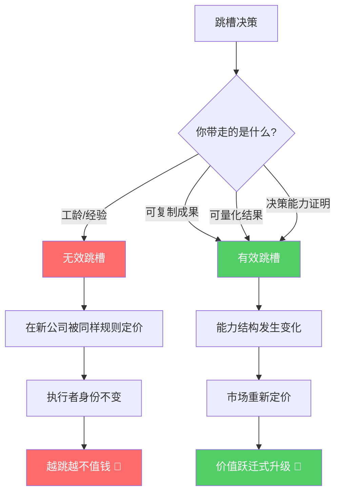

# 跳槽的本质：不是换工作，而是重新定价自己

> **核心命题**：跳槽的本质并非简单更换工作，而是**验证和重新确定个人能力的市场价格**。真正有价值的跳槽，是带走可复制的成果和可量化的结果，实现个人价值的跃迁式升级。

---

## 一、逻辑框架图

```
┌─────────────────────────────────────────────────────────┐
│                   跳槽的本质逻辑                          │
├─────────────────────────────────────────────────────────┤
│                                                         │
│   无效跳槽                        有效跳槽               │
│   ┌───────────┐                  ┌───────────┐          │
│   │ 换环境     │                  │ 换能力结构  │          │
│   │ 重复过去   │     ──────▶     │ 升级身份    │          │
│   │ 执行者身份  │    重新定价     │ 可交易成果  │          │
│   └─────┬─────┘                  └─────┬─────┘          │
│         │                              │                │
│         ▼                              ▼                │
│   被同样的规则定价              被新的市场重新定价         │
│   越跳越不值钱                  越跳越值钱                │
│                                                         │
└─────────────────────────────────────────────────────────┘
```

### Mermaid 流程图



---

## 二、误区：为什么大多数跳槽是"无效"的？

| 误区维度 | 表象 | 本质问题 | 后果 |
|---------|------|---------|------|
| 🔄 角色锁定 | 在新公司仍做同样的执行工作 | 能力结构未变，身份未升级 | 平台不会自动为你升级身份 |
| 📅 带走工龄 | "我有10年经验" | 带走的只是时间，不是能力杠杆 | 1年经验重复了10次 |
| 📉 价值递减 | 越跳薪资涨幅越低 | 没有可交易的核心价值积累 | 市场议价能力持续下降 |
| 🏃 逃避型跳槽 | "我不喜欢现在的领导/环境" | 用空间换时间，回避核心问题 | 同样的问题在新环境重现 |

### 关键洞察

> **工龄 ≠ 能力**：一个人可能在一家公司待了10年，但只是把第1年的经验重复了10次。跳槽时带走的只是"时间记录"，而非"能力杠杆"。

---

## 三、正途：如何实现"有效"跳槽？

### 有效跳槽的三大支柱

| 支柱 | 定义 | 衡量标准 | 举例 |
|------|------|---------|------|
| 🧬 可复制的成果 | 证明你有独立完成项目的能力 | "我从0到1搭建了XX系统" | 主导过完整项目 lifecycle |
| 📊 可量化的结果 | 用数据说话，展示工作成效 | "系统性能提升300%，成本降低50%" | 有明确的 KPI/OKR 数据 |
| 🧠 可证明的决策能力 | 体现思考和判断价值 | "我在X关键时刻选择了Y方向" | 有清晰的决策逻辑和复盘 |

### 核心公式

```
跳槽价值 = (可复制成果 × 可量化结果 × 决策能力) - 路径依赖成本
```

> 只有当三者**同时具备**时，跳槽才能实现真正的价值跃迁。缺一不可——只有成果没有数据，无法说服市场；只有数据没有决策，证明不了领导力。

---

## 四、2025-2026 当前案例

### 案例1：AI 转型期的"被动跳槽" vs "主动升级"

| 对比维度 | 案例A：被动型（无效跳槽） | 案例B：主动型（有效跳槽） |
|---------|------------------------|------------------------|
| 背景 | 某大厂前端开发，因裁员潮被迫跳槽 | 同公司后端开发，主动学习 AI Agent |
| 带走的东西 | "5年 React 开发经验" | "独立设计了 AI 驱动的客服系统，将人工客服量降低60%" |
| 面试表现 | "我参与过XX项目的开发" | "我主导了从0到1的 AI 系统落地，ROI 提升200%" |
| 跳槽结果 | 平薪或降薪，仍是执行者 | 涨薪80%，拿到技术负责人 offer |
| 核心差异 | 带走的是**工具经验** | 带走的是**可复制的成果+可量化的决策** |

### 案例2：传统行业→AI 加速赛道的跃迁

**背景**：2025年下半年，某金融风控分析师（5年经验）

**无效路径**：
- 跳槽到另一家金融公司，做同样的风控建模
- 薪资涨幅 15%，能力结构不变
- 2026年 AI 风控自动化后，再次面临被替代风险

**有效路径**：
- 将风控经验+AI工具能力结合，打造"AI风控解决方案"
- 带走：可复制的风控模型框架 + 可量化的风险降低数据 + 从0到1的AI落地决策经验
- 跳槽到 AI 金融科技公司，职位从分析师→产品负责人
- 薪资涨幅 120%，且能力壁垒显著提升

### 案例3：AI 时代的"超级个体"现象

2026年，越来越多的专业人士通过以下方式实现价值重估：

```
传统路径：公司A(执行者) → 公司B(执行者) → 公司C(执行者)
超级个体：公司A(执行者) → 打造个人AI工具链 → 以"解决方案提供者"身份进入公司B(决策者)
```

> **2026年关键趋势**：AI 工具让个人能力杠杆空前放大。一个懂得利用 AI 的产品经理，其产出可以等于过去5人团队。跳槽时，你不再只是"一个PM"，而是"一个能用AI驱动整个产品线的系统构建者"。

---

## 五、高级思考问答

### Q1：在 AI 加速时代，什么样的"可交易价值"最稀缺？

> **A**：不是技术本身（AI 工具在民主化），而是**"问题定义能力"**和**"跨域整合能力"**。AI 能帮你写代码、做分析、出方案，但**"在不确定性中做出正确判断"**和**"把不同领域的知识组合成新的解决方案"**——这两种能力在2026年是最稀缺的。跳槽时，你应该展示的不是"我会用什么工具"，而是"我在复杂情境中如何做出关键决策并产生可验证的结果"。

### Q2：如何判断自己的跳槽是"有效"还是"无效"？

> **A**：用一个简单的问题检验——**"如果把我过去1年的工作成果写在简历上，去掉公司名字，这些成果是否仍然有说服力？"** 如果你的价值完全依附于平台品牌，那就是无效跳槽。如果你的价值是独立可验证的（可复制、可量化、有决策痕迹），那就是有效跳槽的基础。

### Q3：经济下行期，"有效跳槽"是否还是好策略？

> **A**：经济下行期恰恰是"有效跳槽"的黄金窗口。原因有三：
> 1. **市场在重新洗牌**——旧的能力定价体系被打乱，新的定价体系尚未稳定
> 2. **企业更需要"能带来确定性结果"的人**——而不是"有潜力但需要培养"的人
> 3. **竞争者减少**——大多数人在"苟着"，敢于带着成果重新定价自己的人反而能拿到溢价
>
> 2025-2026年的全球科技行业调整中，我们发现：带着AI落地经验跳槽的人，平均薪资涨幅比2023年高出40%。

### Q4：AI 会让"跳槽"这个行为本身消失吗？

> **A**：不会消失，但会变形。未来的趋势是：
> - **从"跳槽"到"跳能力池"**——你不再属于一家公司，而是属于一个能力网络
> - **从"验证市场定价"到"创造市场定价"**——顶级人才不再等待市场给你定价，而是自己定义价值标准
> - **从"换公司"到"换问题"**——跳槽的核心不再是换雇主，而是换你解决的问题的层级

---

## 六、全文总结

### 核心论点

跳槽不是换地方，而是**换能力结构、换市场定价**。大多数人的跳槽之所以无效，是因为他们只换了物理空间，没有改变价值结构。

### 逻辑链

```
无效跳槽的根因 → 能力结构不变 → 被同样的规则定价 → 越跳越不值钱
                                                              ↓
有效跳槽的路径 → 带走可交易成果 → 市场重新定价 → 价值跃迁式升级
```

### 行动清单

| 序号 | 行动项 | 优先级 | 时间框架 |
|------|--------|-------|---------|
| 1 | 审视当前工作：你是在积累"能力"还是"工龄"？ | 🔴 高 | 本周 |
| 2 | 盘点可交易资产：有哪些成果可以脱离平台独立存在？ | 🔴 高 | 本月 |
| 3 | 量化你的贡献：用数字重写你过去1年的工作成果 | 🟡 中 | 本月 |
| 4 | 构建决策档案：记录你的关键决策及其结果 | 🟡 中 | 持续 |
| 5 | 学习AI工具链：让AI成为你的能力杠杆 | 🔴 高 | 本季度 |
| 6 | 验证市场定价：用面试（而非跳槽）来测试你的市场价值 | 🟢 低 | 半年内 |

### 一句话总结

> **跳槽的终极目标不是找到更好的工作，而是成为更好的自己——带着可复制的成果、可量化的结果和可证明的决策能力，去验证你在全新坐标系中的市场定价。**

---
