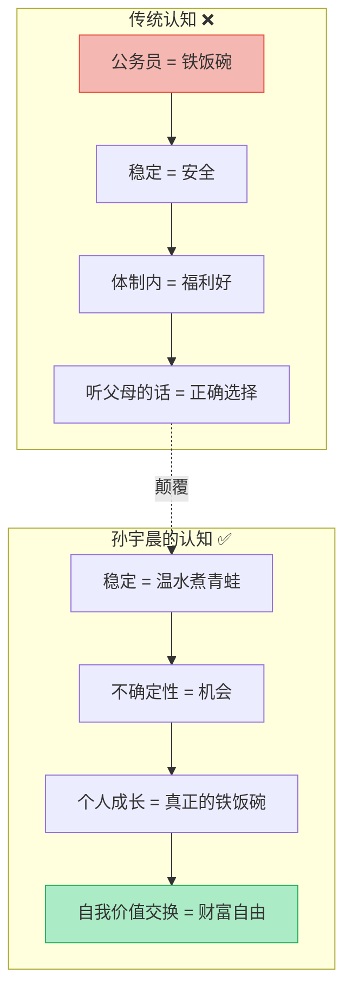
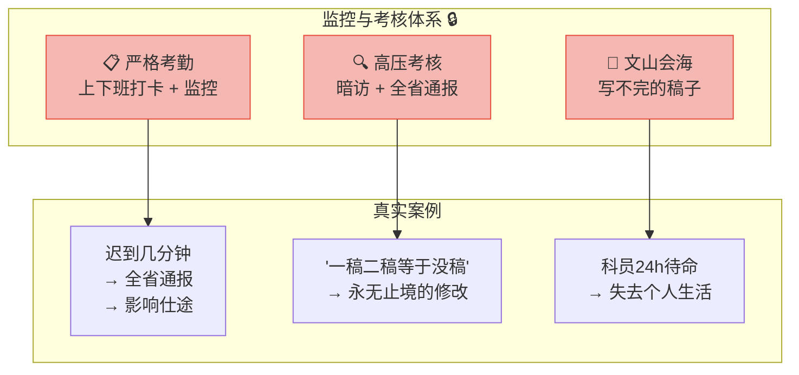
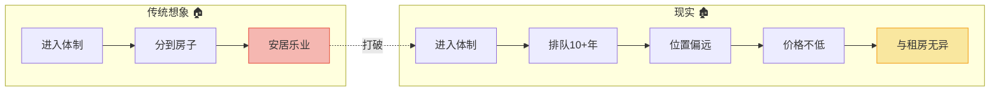
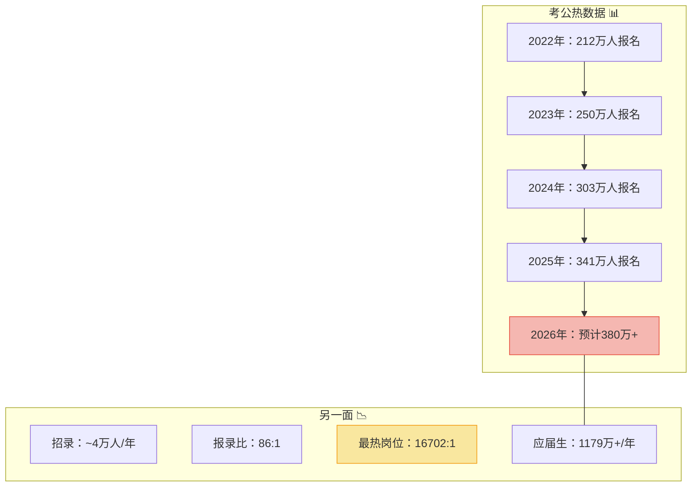
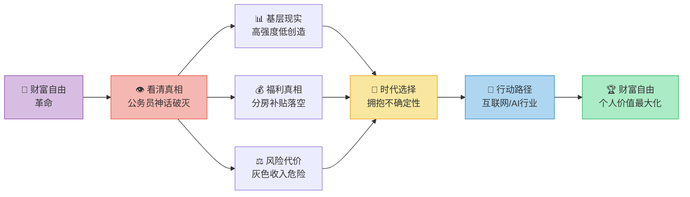
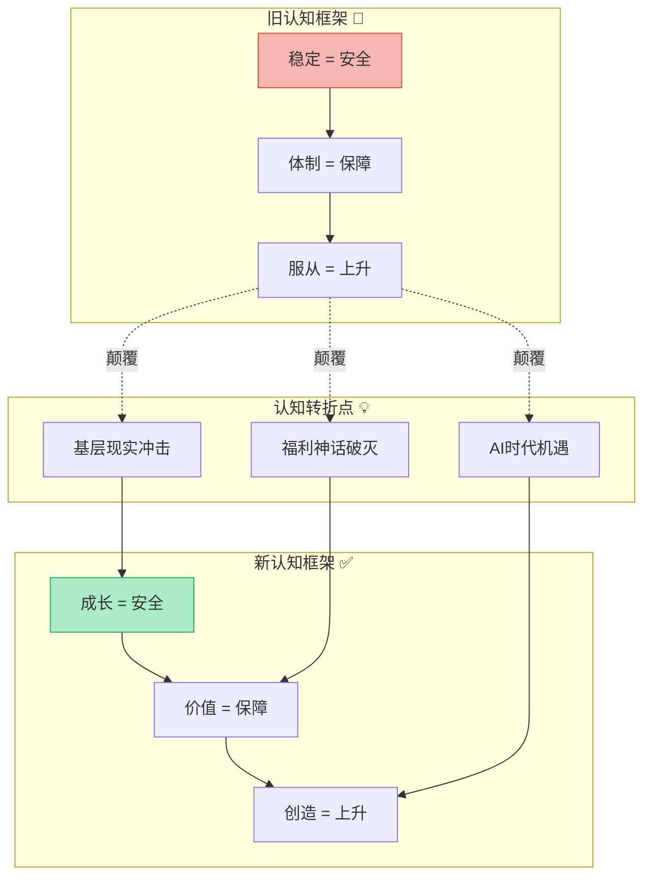
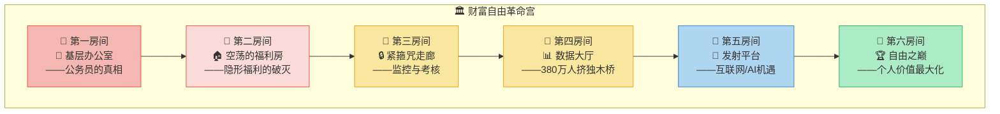

# 孙宇晨：财富自由革命之路

> **核心观点**：孙宇晨深入剖析公务员职业的现实状况与普遍认知误区。公务员并非外界想象的那样轻松，尤其基层公务员，工作具有**高强度、低创造性、高风险**等特点。对于追求个人成长和财富自由的年轻人来说，应更多考虑充满不确定性但能带来巨大机遇的**互联网/AI行业**。

---

## 全景总览：财富自由的认知革命

> 💡 **一句话总结**：真正的安全感不是来自体制的庇护，而是来自**自身不可替代的价值创造能力**。

---

## 第一篇：基层公务员的真实画像

### 1.1 繁忙与琐碎的日常

| 维度 | 现实情况 | 外界想象 |
|------|----------|----------|
| **工作地点** | 广大乡镇地区，条件艰苦 | 城市办公室，体面舒适 |
| **工作内容** | 烧开水、打扫卫生、接电话、通知会议、复印材料、写稿 | 喝茶看报、轻松度日 |
| **工作强度** | 加班常态，24小时待命，局长司长带头加班 | 朝九晚五，周末双休 |
| **成长性** | 几十年如一日，消磨锐气 | 稳步上升，前途光明 |

### 1.2 体制内的"紧箍咒"

---

## 第二篇：拆穿"隐形福利"的神话

### 2.1 三大传说破灭

| 传说 | 真相 | 风险等级 |
|------|------|----------|
| 🏠 **福利分房** | 北京已取消；部委有但排队10+年，位置偏、价格不低 | ⭐⭐⭐ 基本不存在 |
| 💰 **过节费补贴** | "擦边球"政策，不可持续，数额不大 | ⭐⭐ 随时可能取消 |
| 🔵 **灰色收入** | 将职权转化为收入 → 巨大法律风险 → 锒铛入狱 | ⭐⭐⭐⭐⭐ 极度危险 |

### 2.2 分房制度的真相

---

## 第三篇：时代的选择 —— 拥抱不确定性

### 3.1 成长路径对比

| 维度 | 公务员体系 | 互联网/AI行业 |
|------|-----------|--------------|
| **技能更新** | 缓慢，几十年如一日 | 快速迭代，AI时代每月新知识 |
| **成长速度** | 论资排辈，按年限晋升 | 能力导向，3年可跃升数级 |
| **收入天花板** | 有明确上限 | 无上限（期权、创业） |
| **核心竞争力** | 人际关系 + 写作 | 技术 + 产品 + 创造力 |
| **抗风险能力** | 体制依赖，离开即失去 | 可迁移，到哪里都有价值 |
| **时代适配度** | 工业时代的管理逻辑 | 信息/AI时代的创新逻辑 |

### 3.2 2026年最新案例：考公热潮的冷数据

> 🔥 **2026年现实案例**：2025年国考最热岗位竞争比达到**16702:1**，341万人争抢不到4万个名额。与此同时，AI行业人才缺口超过**500万**，算法工程师平均薪资超过**40万/年**。这是"稳定陷阱"的活生生案例——**越多人追求的稳定，越不稳定**。

### 3.3 孙宇晨的实践路径

| 阶段 | 选择 | 结果 |
|------|------|------|
| 🎓 北大毕业 | 拒绝传统职业路径 | 进入互联网创业 |
| 🚀 创办波场TRON | 拥抱区块链不确定性 | 成为全球知名区块链项目 |
| 💰 HTX交易所 | 持续布局加密生态 | 构建完整金融版图 |
| 🌍 全球影响力 | 竞拍巴菲特午餐 | 个人品牌国际化 |

> 💡 **孙宇晨的核心逻辑**：他不是选择"稳定"，而是选择**在不确定性中构建反脆弱性**——这正是塔勒布所说的"从波动中获益"。

---

## 第四篇：逻辑记忆框架

### 4.1 核心逻辑链

> **一句话记忆**：**看破稳定幻觉 → 基层苦+福利空+风险大 → 时代要拥抱不确定性 → 投身互联网/AI → 用个人价值换取财富自由**

### 4.2 认知升级路径

---

## 第五篇：高级思考问答 —— 全文深度总结

### Q1：公务员真的毫无价值吗？

> **A**：不是。关键在于**你想要什么**。如果追求的是：
> - ✅ 安稳的生活节奏 → 公务员可以满足
> - ✅ 社会地位认可 → 在部分地区确实有效
> - ❌ 快速成长和高收入 → 大概率失望
>
> **核心判断**：公务员是一种**确定性溢价**——你放弃了成长可能性，换取可预期的稳定。关键问题是：**你愿意为"稳定"支付多少"可能性"的价格？**

### Q2：互联网行业就一定好吗？

> **A**：互联网/AI行业也面临**996、内卷、中年危机**等问题。但核心区别在于：
>
> | 维度 | 体制内的苦 | 互联网的苦 |
> |------|-----------|-----------|
> | **性质** | 重复性、消耗性 | 挑战性、积累性 |
> | **回报** | 边际递减 | 边际递增（可能） |
> | **退出成本** | 极高（技能废弛） | 较低（能力可迁移） |
> | **天花板** | 可见且有限 | 不可见且可能极高 |
>
> **核心判断**：两种"苦"的本质不同——一个是**消耗你的苦**，一个是**投资你的苦**。

### Q3：AI时代对年轻人意味着什么？

> **A**：2026年的现实是：
> - AI正在**重塑所有行业**，包括体制内（AI+政务）
> - 真正不可替代的能力 = **创造力 + 判断力 + 人机协作**
> - 体制内的"执行型工作"恰恰最容易被AI替代
> - 互联网/AI行业是**创造AI而非被AI替代**的地方
>
> **核心判断**：AI时代最大的风险不是技术本身，而是**你站在AI的哪一边**——是创造者还是被淘汰者。

### Q4：没有技术背景怎么办？

> **A**：孙宇晨的逻辑不是"所有人都去写代码"，而是：
> 1. **选择高成长环境**：不确定性高、迭代快的行业
> 2. **培养核心能力**：学习力、适应力、创造力
> 3. **建立个人品牌**：让你的价值可以被市场定价
> 4. **拥抱变化**：把不确定性当朋友而非敌人

### Q5：如何在"不确定性"中不被淘汰？

> **A**：孙宇晨的答案 = **反脆弱策略**：
> - 永远保持**学习能力**（而非固定技能）
> - 建立**多元收入来源**（而非单一工资）
> - 积累**可迁移资产**（人脉、品牌、知识）
> - 主动**拥抱变化**（而非被动等待安排）

---

## 第六篇：记忆宫殿 —— 财富自由革命认知地图

> 🏛️ **想象你站在一座宏伟的宫殿前，这是你的"财富自由革命宫"。推开大门，六个房间依次展开：**

### 🏛️ 宫殿漫游路线

| 房间 | 场景 | 记忆锚点 | 核心信息 |
|------|------|----------|----------|
| 🚪 **第一房间** | 想象一个忙碌的基层办公室：烧水、复印、写稿的年轻人 | 🔑 **"烧水写稿24h"** | 基层公务员 = 高强度 + 低创造 + 消磨锐气 |
| 🚪 **第二房间** | 一间空荡荡的房子，门口写着"排队10年" | 🔑 **"排队十年的空房子"** | 福利分房是神话，补贴随时取消 |
| 🚪 **第三房间** | 一条布满摄像头的走廊，墙上贴着"迟到=全省通报" | 🔑 **"摄像头走廊"** | 监控+考核 = 自由的代价 |
| 🚪 **第四房间** | 巨大的数据屏幕：380万人 → 4万个名额 → 16702:1 | 🔑 **"380万:4万"** | 考公热的荒谬数据，越多人追的稳定越不稳 |
| 🚪 **第五房间** | 火箭发射平台，写着"不确定性 = 机会" | 🔑 **"火箭=不确定性"** | 互联网/AI行业 = 成长最快的赛道 |
| 🚪 **第六房间** | 山顶上的自由之人，脚下是价值创造的阶梯 | 🔑 **"山顶的自由人"** | 财富自由 = 个人价值最大化，而非体制庇护 |

### 🎯 宫殿口诀（闭眼默念三遍）

> **一进办公室，烧水写稿到天明；**
> **二看空房子，排队十年一场空；**
> **三过监控廊，迟到通报全省知；**
> **四读数据墙，三八零万挤一桥；**
> **五登发射台，不确定性是机遇；**
> **六上自由巅，个人价值胜千金。**

---

## 一句话终极心法

> **财富自由不是找到一份"稳定"的工作，而是成为一个**在任何不确定性中都能创造价值的人**——当你的价值不依赖于任何体制，你才真正自由。**

---

## 附录：全文逻辑地图

| 章节       | 核心问题        | 关键答案                  |
| -------- | ----------- | --------------------- |
| **全景总览** | 财富自由的路径是什么？ | 不是追求稳定，而是构建不可替代的价值    |
| **基层真相** | 公务员真实状态如何？  | 高强度、低创造、消磨锐气          |
| **福利破灭** | 隐形福利存在吗？    | 分房取消、补贴不稳、灰色收入致命      |
| **时代选择** | 为什么选互联网/AI？ | 成长快、能力可迁移、天花板高、AI时代主场 |
| **逻辑记忆** | 如何记住核心逻辑？   | 看破幻觉→理解现实→拥抱变化→投身增长   |
| **高级问答** | 深度思考如何落地？   | 选择"投资你的苦"而非"消耗你的苦"    |
| **记忆宫殿** | 如何永久记忆？     | 六房间宫殿漫游 + 口诀          |
