# 工程师的定义：长期维护与持续交付

> **核心命题**：AI时代的开发者应被视为"工程师"，而非"码农"。工程的核心不是写代码，而是**长期维护一个有生命力的系统**。

---

## 🧠 逻辑记忆框架

**口诀：「品 → 转 → 配 → 衡」** —— 有品味 → 能转型 → 会搭配 → 懂平衡

**分组记忆（2×2 矩阵）：**

| | **思维层** | **执行层** |
|---|---|---|
| **个体视角** | ① 品味（Taste）：长期维护的直觉 | ② 转型：从次抛代码到工程体系 |
| **系统视角** | ③ 搭配：基模+Agent 的组合策略 | ④ 平衡：多模型多Agent 的成本质量博弈 |

**递进逻辑：**
- **第①步**：知道什么叫好代码（品味 = 长期维护的能力）
- **第②步**：知道AI Coding该怎么走（工程体系化，而非次抛）
- **第③步**：知道基模和Agent怎么配合（魔法棒 vs 助手）
- **第④步**：知道多模型多Agent怎么管（成本与质量的永恒博弈）

---

## 一、核心观点总览

| 维度 | 核心主张 | 提出者 | 关键词 | 实践难度 |
|:---|:---|:---|:---:|:---:|
| 工程师定义 | 长期维护 > 一次性编码 | 何涛（DeerFlow） | 品味 · 生命力 | ★★★★☆ |
| 模型突破 | M3 + 10T 大模型训练 | 闫俊杰（MiniMax） | 规模 · 数据观 | ★★★★★ |
| Coding拐点 | 次抛代码 → 工程体系化 | 闫俊杰 | 持续维护 · 迭代 | ★★★★☆ |
| 基模与Agent | 基模=魔法棒，Agent=助手 | 闫俊杰 | 清洁代码蒸馏 | ★★★☆☆ |
| 多模型多Agent | 成本与质量的动态平衡 | 张佳圆（Multica） | 决策路径 · 陪伴 | ★★★★☆ |

---

## 二、工程师的定义：长期维护与持续交付

### 2.1 码农 vs 工程师：一字之差，天壤之别

> DeerFlow 的何涛首先提出，AI时代的开发者应被视为"工程师"，而非"码农"。

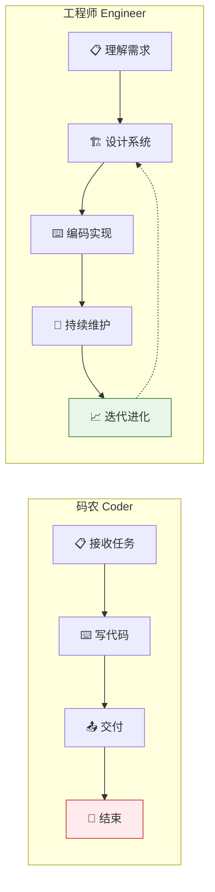

| 维度 | 码农 🚫 | 工程师 ✅ |
|:---|:---|:---|
| **关注范围** | 一次任务 | 一个系统的生命周期 |
| **交付标准** | 代码能跑 | 系统有生命力 |
| **时间维度** | 短期（完成即走） | 长期（持续迭代维护） |
| **核心能力** | 编码速度 | 品味（Taste）+ 架构判断 |
| **AI时代的定位** | 最容易被替代 | 注入"品味"给AI的人 |

> [!important] 何涛的核心洞察
> 当前的AI模型在Benchmark上表现出色，但在实际应用中，需要将人类长期维护项目的**"品味"（Taste）**注入其中，才能实现持续的迭代和维护。**品味 = 知道什么时候代码该改、什么时候不该改、什么时候该重构、什么时候该忍住。**

---

## 三、对话MiniMax闫俊杰：M3突破与10T模型

### 3.1 MiniMax 的关键进展

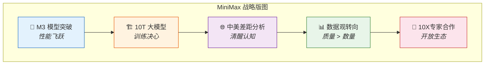

| 战略要素 | 内容 | 行业信号 |
|:---|:---|:---|
| **M3 模型** | 性能关键突破 | 模型能力是基础设施 |
| **10T 训练** | 决心训练 10 万亿参数模型 | 规模竞争仍在加速 |
| **中美差距** | 清醒分析差距所在 | 认知差距 = 追赶的前提 |
| **数据观** | 从"数据量"到"数据质"转向 | 高质量数据成为新瓶颈 |
| **10X 专家** | 与领域专家深度合作 | 模型需要人类知识蒸馏 |

---

## 四、AI Coding的拐点：工程体系 vs 次抛代码

### 4.1 从"次抛"到"工程"的范式跃迁

> 闫俊杰指出，AI Coding正迎来一个拐点——从"次抛代码"（一次性任务）转向工程体系化。

| 阶段 | 产品形态 | AI角色 | 人类角色 | 代码特征 |
|:---|:---|:---|:---|:---|
| **次抛时代** | ChatGPT/Copilot 单轮生成 | 打字机 | 操作者 | 一次性、无维护 |
| **过渡期** | Cursor/Claude Code 多轮对话 | 顾问 | 决策+执行者 | 有结构、少迭代 |
| **工程时代** | Agent 自主开发+维护 | 工程师 | 目标定义+验收者 | 有生命、持续进化 |

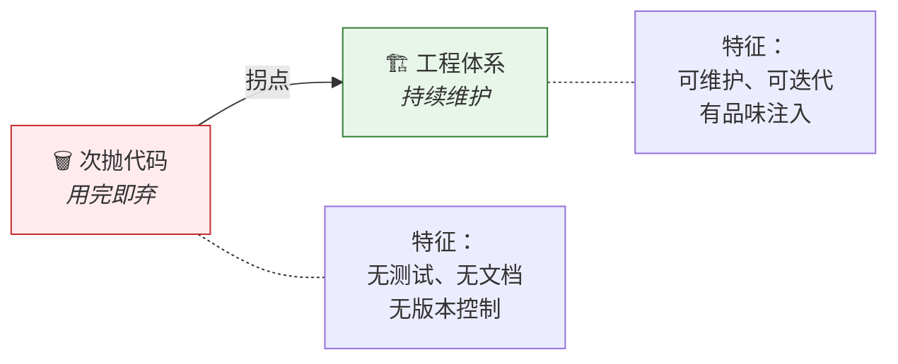

> [!warning] 次抛代码的隐患
> 次抛代码看似高效——AI秒出方案，复制粘贴即用。但它积累了**隐性技术债**：无人维护、无测试覆盖、无架构一致性。当AI生成的代码量指数级增长时，技术债也将指数级爆炸。

### 4.2 工程体系化的四大支柱

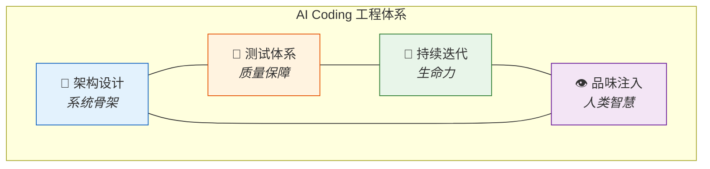

| 支柱 | 含义 | AI能做到 | 人类不可替代 |
|:---|:---|:---:|:---:|
| **架构设计** | 系统的骨架与约束 | ⚠️ 辅助建议 | ✅ 最终决策 |
| **测试体系** | 可验证的完成标准 | ✅ 自动生成测试 | ✅ 定义"什么值得测" |
| **持续迭代** | 长期维护与进化 | ⚠️ 执行修改 | ✅ 判断方向 |
| **品味注入** | 知道什么时候"够了" | ❌ 缺乏直觉 | ✅ 核心人类价值 |

---

## 五、基模与Agent：是什么关系？

### 5.1 "魔法棒" vs "助手"

> 闫俊杰将基模比作"魔法棒"，Agent比作"助手"——二者是互补而非替代的关系。

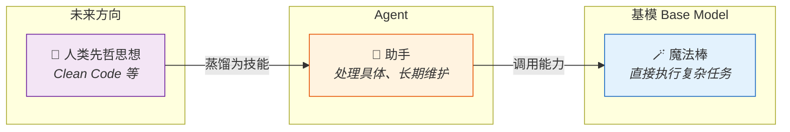

| 维度 | 基模（魔法棒）🪄 | Agent（助手）🤖 |
|:---|:---|:---|
| **核心能力** | 理解+生成+推理 | 规划+执行+维护 |
| **任务模式** | 单步复杂任务 | 多步持续任务 |
| **时间维度** | 即时响应 | 长期陪伴 |
| **记忆** | 无持久记忆 | 有上下文记忆 |
| **人类价值注入** | 训练阶段（蒸馏知识） | 运行阶段（注入品味） |
| **类比** | 引擎 | 驾驶员 |

> [!tip] 关键洞察
> 将人类的"清洁代码"（Clean Code）等工程先哲思想**蒸馏成技能**，再注入Agent——这是未来的重要方向。换句话说：**不是教AI写代码，而是教AI如何像工程师一样思考。**

### 5.2 知识蒸馏路径

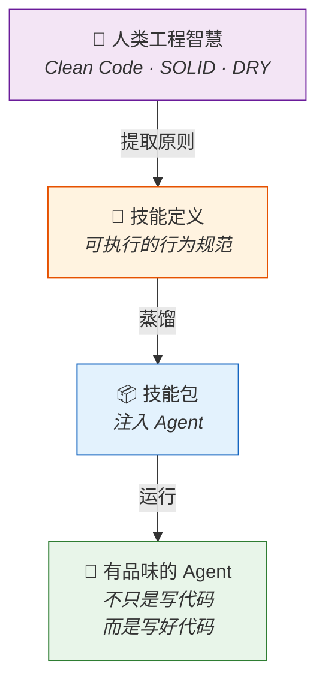

---

## 六、多模型与多Agent：平衡成本与质量

### 6.1 成本-质量博弈模型

> Multica创始人张佳圆认为，在成本和质量之间取得平衡是关键，多模型、多Agent的组合是一种有效思路。

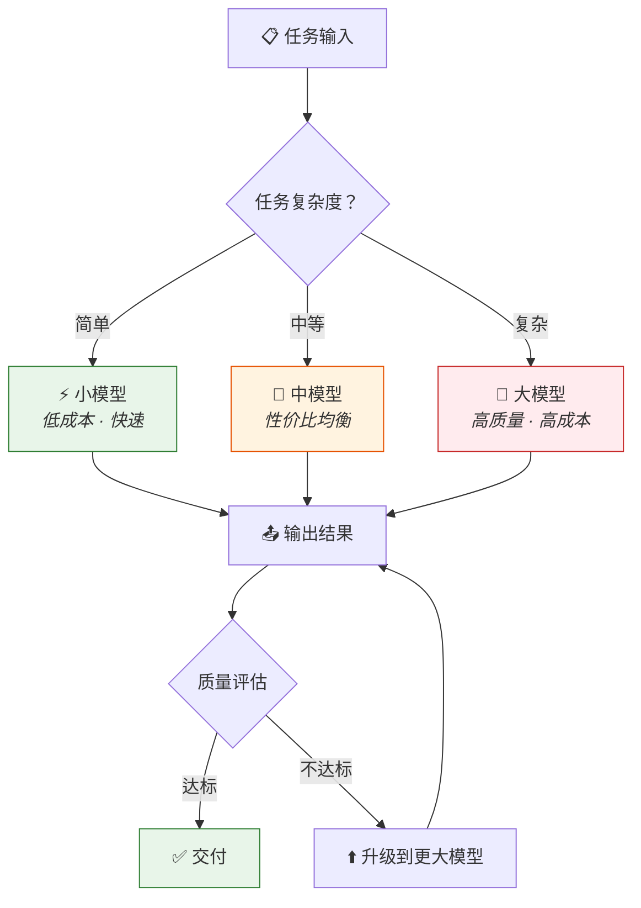

### 6.2 多模型多Agent组合策略

| 策略 | 描述 | 适用场景 | 成本 | 质量 |
|:---|:---|:---|:---:|:---:|
| **单一模型** | 一个模型打天下 | 简单统一任务 | 💰 | ⭐⭐⭐ |
| **级联策略** | 小模型先做 → 不行再上大模型 | 大部分任务简单，偶尔复杂 | 💰💰 | ⭐⭐⭐⭐ |
| **分工策略** | 不同Agent用不同模型 | 多步骤异构任务 | 💰💰💰 | ⭐⭐⭐⭐ |
| **竞争策略** | 多模型同时做 → 选最好的 | 高可靠性要求 | 💰💰💰💰 | ⭐⭐⭐⭐⭐ |

> [!note] 张佳圆的核心观点
> AI的价值在于将**信息转化为可执行的决策路径**，并在高频变化中为用户提供**辅助与陪伴**。多模型不是炫技，而是**经济学**——用最少的Token实现最好的结果。

---

## 七、逻辑记忆：一页全景图

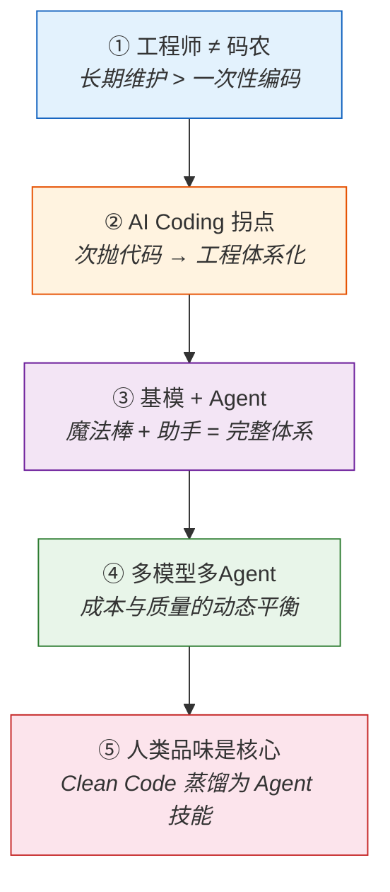

**🧠 五步递进链：**

| 步骤 | 关键概念 | 记忆锚点 |
|:---:|:---|:---:|
| ① | 定义：工程师 = 长期维护者 | **一品**（品味） |
| ② | 拐点：次抛 → 工程体系 | **二转**（转型） |
| ③ | 架构：基模 + Agent 互补 | **三配**（搭配） |
| ④ | 运营：多模型成本质量博弈 | **四衡**（平衡） |
| ⑤ | 核心：人类品味是终极壁垒 | **归人**（回到人） |

---

## 八、正在发生的案例

> [!abstract] 本章定位
> 以下案例全部来自 **2024–2026 年真实发生的事件**，精确对应前文每一个核心论点。

### 📊 案例全景映射表

| 案例 | 发生时间 | 对应理论 | 核心教训 |
|:---|:---:|:---:|:---|
| 🤖 Devin 的信任危机 | 2024.03–至今 | §二 码农 vs 工程师 | 演示≠工程，缺长期维护就是次抛 |
| 💻 Claude Code 的工程实践 | 2025–2026 | §四 工程体系化 | Agent + Harness = 可持续编码 |
| 🧪 SWE-bench 评测体系 | 2024–2026 持续 | §四 品味注入 | 用测试定义"好代码" = 品味的机器化 |
| 🏗️ MiniMax M3 + 10T | 2025–2026 | §三 M3突破 | 规模竞争加速，数据质量成新瓶颈 |
| 🎯 Multica 多Agent平台 | 2025–2026 | §六 成本质量平衡 | 多模型级联 = 经济学最优解 |
| 📜 Clean Code 蒸馏实验 | 2025–2026 | §五 知识蒸馏 | 将工程原则编码为Agent技能 |

---

### 案例 1：Devin — 从"AI工程师"到"AI码农"的教训 🤖

> **对应理论**：§二 码农 vs 工程师 / §四 次抛代码的隐患

| 时间 | 事件 |
|:---:|:---|
| 2024.03 | Cognition Labs 发布 Devin，号称"全球首个AI软件工程师" |
| 2024.03–06 | 演示视频轰动，但社区质疑 Demo 精心挑选 |
| 2024.07–12 | 用户反馈：复杂任务完成率低，代码缺乏维护性 |
| 2025–2026 | 转型企业级工具，强调人类监督和人机协作 |

> [!warning] 核心教训
> Devin 完美印证了何涛的观点：**能写代码 ≠ 工程师。** Devin 是超级"码农"——能快速完成编码任务，但缺乏长期维护系统的"品味"。工程的核心是**生命周期管理**，不是**一次性交付**。

---

### 案例 2：Claude Code — AI Coding 工程体系化的范本 💻

> **对应理论**：§四 工程体系化 / §五 基模+Agent

Claude Code 的架构完美体现了"工程体系 vs 次抛代码"的分野：

| 工程支柱 | Claude Code 实现 | 对应理论 |
|:---|:---|:---:|
| **架构设计** | 多层嵌套Loop（工具级→编辑级→任务级） | §四 架构支柱 |
| **测试体系** | 每次修改自动运行Lint/测试，作为终止条件 | §四 测试支柱 |
| **持续迭代** | Harness工程：可暂停、可恢复、可回滚 | §四 迭代支柱 |
| **品味注入** | 人类定义完成标准，Agent执行并遵守 | §四 品味支柱 |

> [!tip] 关键洞察
> Claude Code 的成功不在于模型多聪明，而在于它**把工程实践编码进了系统**——这就是闫俊杰所说的"将Clean Code蒸馏为Agent技能"的最佳实践。

---

### 案例 3：MiniMax M3 与 10T 路线 🏗️

> **对应理论**：§三 模型突破与数据观转向

| 维度 | 内容 | 行业意义 |
|:---|:---|:---|
| **M3 突破** | 关键性能指标跃升 | 证明持续训练的有效性 |
| **10T 决心** | 训练 10 万亿参数规模 | 规模竞争仍在加速 |
| **数据观转向** | 从"海量数据"到"高质量数据" | 数据质量 > 数据数量 |
| **10X 专家** | 与领域专家深度合作 | 模型需要人类知识注入 |

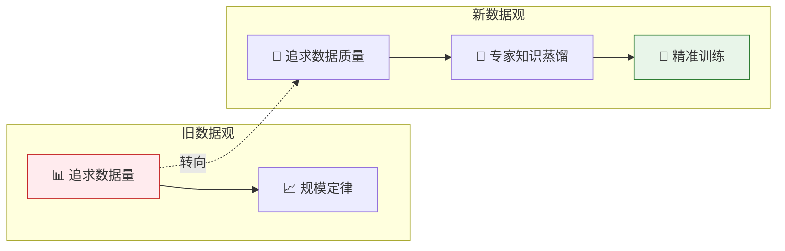

---

### 案例 4：Multica — 多Agent组合的经济学 🎯

> **对应理论**：§六 成本与质量的动态平衡

Multica 张佳圆的实践展示了多模型多Agent组合的落地路径：

| 场景 | 模型选择 | Agent策略 | 成本/Token | 质量 |
|:---|:---|:---|:---:|:---:|
| 信息整理 | Haiku 级模型 | 单Agent快速处理 | 💰 | ⭐⭐⭐ |
| 客户决策辅助 | Sonnet 级模型 | 多Agent协商 | 💰💰💰 | ⭐⭐⭐⭐ |
| 高风险决策 | Opus 级模型 | 多Agent+人工审核 | 💰💰💰💰💰 | ⭐⭐⭐⭐⭐ |

> **张佳圆的核心理念**：AI的价值 = 将**信息**转化为**可执行的决策路径**，在高频变化中为用户提供**辅助与陪伴**。

---

### 案例 5：SWE-bench — 品味的机器化尝试 🧪

> **对应理论**：§四 品味注入 / §五 知识蒸馏

| 维度 | SWE-bench 的做法 | 对应本文理论 |
|:---|:---|:---|
| **目标定义** | 每个任务绑定具体测试用例 | ✅ 可量化目标 = 品味的形式化 |
| **终止条件** | 所有测试通过 → 停止 | ✅ "够了"的判断被编码 |
| **评估标准** | Pass Rate，非主观判断 | ✅ 客观评估替代主观品味 |
| **局限** | 只能处理有明确测试的任务 | ⚠️ 真正的"品味"远不止于此 |

> [!note] 深层含义
> SWE-bench 本质上是在尝试**把"什么是好代码"的品味部分形式化**——用测试用例来定义"够了"。这是闫俊杰所说的"将Clean Code蒸馏为技能"的第一步。

---

## 九、最高级思考问答 · 全文终极总结

> [!abstract] 本章定位
> 以 **层层递进的 7 个终极问答**，将全文从"是什么→为什么→怎么办→去哪里"完整串联。

---

### Q1 · 本质追问：为什么"品味"是工程师的核心？

> 对应：§二 工程师的定义

**追问**：品味（Taste）听起来很主观，为什么它反而最重要？

**回答**：因为**品味是隐性知识的显性表达**。

| 知识类型 | 特征 | 能否被AI学习 | 举例 |
|:---|:---|:---:|:---|
| **显性知识** | 可编码、可文档化 | ✅ 能 | 语法规则、API文档 |
| **隐性知识** | 只可意会、难以言传 | ❌ 不能直接学 | "这段代码感觉不对" |
| **品味** | 隐性知识的决策输出 | ⚠️ 需要蒸馏 | "这里该重构，那里该忍住" |

> [!quote] 深层洞察
> **品味不是玄学，而是长期维护经验凝结成的直觉。** AI可以学显性知识，但学不了品味——除非人类先把品味"蒸馏"成可执行的规则。这就是为什么工程师比码农更难被替代。

---

### Q2 · 拐点追问：次抛代码真的有问题吗？

> 对应：§四 工程体系 vs 次抛代码

**追问**：如果AI能秒出代码，为什么不一直用次抛模式？

**回答**：因为**代码不会消失，它会积累**。

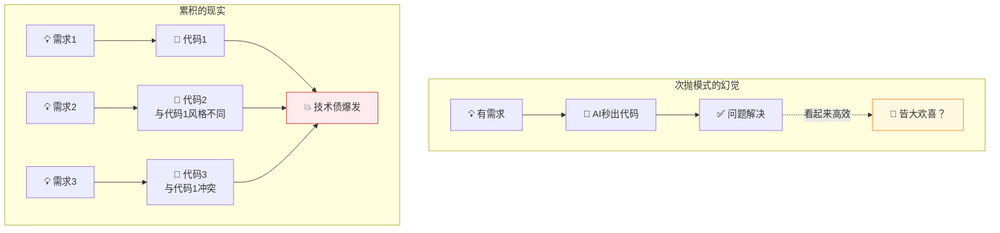

| 时间线 | 次抛模式 | 工程模式 |
|:---:|:---|:---|
| **第1天** | 🚀 极快 | 🐢 较慢（需设计） |
| **第1周** | 😊 还行 | 😊 开始显现优势 |
| **第1月** | 😰 修改困难 | 😌 轻松迭代 |
| **第1年** | 💥 技术债爆炸，推倒重来 | 🌟 系统持续进化 |

**一句话答案**：次抛模式的成本不在**写**的那一刻，而在**改**的每一天。

---

### Q3 · 架构追问：基模和Agent的边界在哪？

> 对应：§五 基模与Agent

**追问**：如果基模越来越强，Agent会不会被取代？

**回答**：不会。因为**"做对的事"和"把事做对"是两个不同的问题。**

| 能力 | 基模（魔法棒）🪄 | Agent（助手）🤖 |
|:---|:---:|:---:|
| **理解自然语言** | ✅ 极强 | ⚠️ 依赖基模 |
| **单步推理** | ✅ 极强 | ⚠️ 依赖基模 |
| **多步规划** | ⚠️ 有限 | ✅ 核心能力 |
| **工具调用** | ❌ 不能 | ✅ 核心能力 |
| **状态记忆** | ❌ 不能 | ✅ 核心能力 |
| **长期维护** | ❌ 不能 | ✅ 核心能力 |

> **类比**：基模 = 一个极聪明但失忆的顾问（每次都要重新了解情况）；Agent = 一个记得所有上下文的助手（能持续跟进）。即使顾问越来越聪明，你仍然需要一个助手来**记住、跟进、执行**。

---

### Q4 · 经济追问：多模型策略的终局是什么？

> 对应：§六 成本与质量

**追问**：随着模型越来越强、越来越便宜，多模型策略会不会消失？

**回答**：不会消失，但**分界线会上移**。

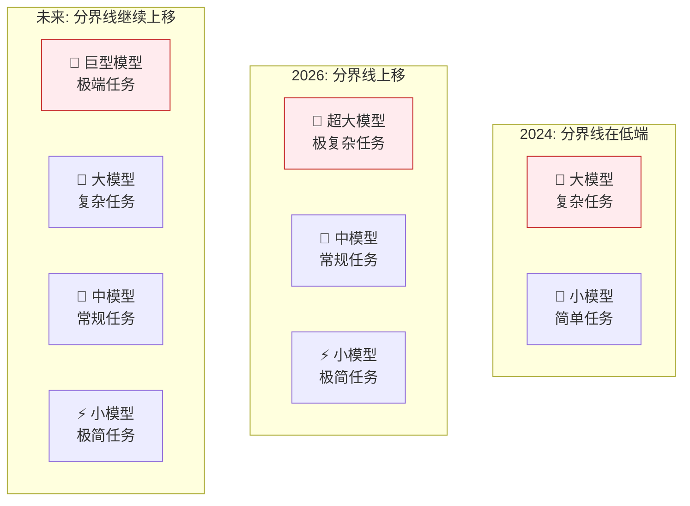

| 不变量 | 说明 |
|:---|:---|
| **成本永远重要** | 即使模型免费，计算时间和延迟也是成本 |
| **任务复杂度永远分层** | 总有简单任务和复杂任务之分 |
| **边际效益递减** | 用大模型做简单任务 = 大炮打蚊子 |

**一句话答案**：多模型策略的本质是**资源分配问题**——只要资源有限（时间、算力、金钱），分层就永远存在。

---

### Q5 · 实践追问：我如何成为"工程师"而非"码农"？

> 对应：§二 + §四 + §五

**追问**：作为一个开发者，我今天该怎么做？

**回答**：**三个层次的转型路径——**

| 层次 | 行动 | 时间线 | 效果 |
|:---:|:---|:---:|:---:|
| 🟢 **第一层** | 每次AI生成代码后，问自己："这段代码三个月后我还能维护吗？" | 今天 | 培养品味意识 |
| 🟡 **第二层** | 为AI生成的代码建立测试体系 + 版本控制 + 文档 | 本周 | 建立工程习惯 |
| 🔴 **第三层** | 将自己的工程经验蒸馏为Agent的"技能包"（规则/约束/提示词模板） | 本月 | 从使用者变为赋能者 |

> [!tip] 行动建议
> **从今天开始，不再问"AI能帮我写多少代码"，而是问"AI写的代码，我能维护多久"。** 这个问题本身，就是品味的起点。

---

### Q6 · 终局追问：AI时代的"工程师"最终长什么样？

> 对应：全文综合

**追问**：如果把所有线索串起来，AI时代的工程师到底需要什么能力？

**回答**：

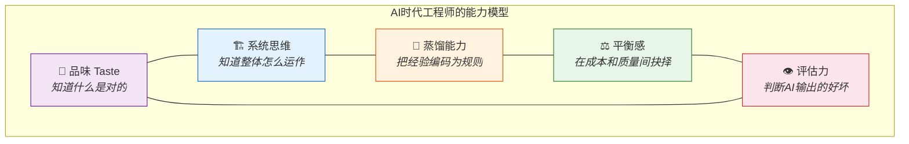

| 旧时代工程师 | AI时代工程师 | 变化 |
|:---|:---|:---:|
| 写代码 | 定义什么是好代码 | 🔄 从执行到判断 |
| 修 Bug | 设计防 Bug 的系统 | 🔄 从修复到预防 |
| 个人产出 | 赋能 Agent 产出 | 🔄 从个体到杠杆 |
| 技术深度 | 技术深度 + 品味 + 系统思维 | 🔄 从单一到复合 |

---

### Q7 · 终极追问：一句话总结这一切？

**回答**：

> [!quote] 全文终极总结
> **AI时代的工程师，不是写代码最快的人，而是知道什么代码值得写的人。**
> 工程的核心是**长期维护一个有生命力的系统**——这需要品味、需要体系、需要平衡、更需要人类的判断力。
> 当AI能写出所有代码时，**定义"好代码"的人**，就是最有价值的人。

---

## 十、全文总结 · 一页速览

### 📊 全文知识体系总表

| 章节 | 核心论点 | 关键概念 | 一句话精华 |
|:---:|:---|:---|:---|
| §二 工程师定义 | 长期维护 > 一次性编码 | 品味（Taste） | 码农写代码，工程师养系统 |
| §三 模型突破 | M3 + 10T + 数据观转向 | 规模 · 质量 | 不是数据多就好，是数据对才好 |
| §四 Coding拐点 | 次抛代码 → 工程体系化 | 持续维护 · 四支柱 | 次抛的成本在"改"的每一天 |
| §五 基模与Agent | 魔法棒 + 助手 = 完整体系 | Clean Code蒸馏 | 教AI写代码 → 教AI像工程师一样思考 |
| §六 多模型多Agent | 成本与质量的动态平衡 | 级联 · 分工 · 竞争 | 不是炫技，是经济学 |
| §七 逻辑记忆 | 五步递进链 | 品→转→配→衡→归人 | 一切回到人的品味 |
| §八 真实案例 | 6个案例全验证 | Devin · Claude Code等 | 理论已在现实中反复上演 |
| §九 深度问答 | 7层追问触达本质 | 品味 · 拐点 · 终局 | 最稀缺的不是算力，是品味 |

---

## 十一、记忆宫殿

> **宫殿选址**：想象你走进一座**现代化智能工厂**

### 🚪 第一进·工厂大门（工程师 vs 码农）

大门口站着两个人：
- **左边**：一个工人快速砌砖，砌完一面墙就走（= 码农），身后的墙歪歪斜斜
- **右边**：一个工程师拿着**放大镜**在检查每块砖的位置（= 品味），身后是一栋稳固的大楼
- 门楣上刻着：**"砌墙者走，养楼者留"**

> 🧠 **记忆锚点**：放大镜 = 品味，歪墙 = 次抛，稳楼 = 长期维护。工程师的核心是维护，不是建造。

### 🏗️ 第二进·主车间（AI Coding 拐点）

车间里两条生产线：
- **左边**：🗑️ 传送带上不断产出**纸杯**（= 次抛代码），用完就扔，地上堆满废弃纸杯
- **右边**：🏗️ 传送带上产出的是一台台**精密仪器**，每台都有编号、说明书、维护记录
- 车间主任在两条线之间挂了一块牌子：**"拐点：纸杯 → 仪器"**

> 🧠 **记忆锚点**：纸杯 = 次抛代码（快但浪费），仪器 = 工程体系（慢但持久）。拐点 = 从纸杯思维转向仪器思维。

### 🔨 第三进·锻造台（基模与Agent）

锻造台上放着两样工具：
- **🪄 魔法棒**（= 基模）：一挥就能变出任何东西，但用完就消失
- **🤖 小助手**（= Agent）：手里拿着一本**手册**（= Clean Code蒸馏的技能包），能持续工作
- 锻造师对它们说：**"魔法棒负责威力，助手负责持久"**
- 墙上的蓝图写着：**"先蒸馏人类智慧 → 注入助手 → 助手调用魔法棒"**

> 🧠 **记忆锚点**：魔法棒 = 基模（强大但短暂），手册 = 蒸馏后的Clean Code，小助手 = Agent（持久且有品味）。

### 🎛️ 第四进·调度中心（多模型多Agent）

调度中心的墙上布满**仪表盘**：
- **💰 成本表**：每个Agent消耗多少Token
- **📊 质量表**：每个Agent的输出质量评分
- **⚖️ 平衡秤**：左边放着金币（成本），右边放着钻石（质量），指针在中间摇摆
- 调度员的话：**"不是所有任务都需要钻石，但所有任务都不能亏本"**
- 三种调度模式：**级联**（先小后大）、**分工**（各司其职）、**竞争**（择优录取）

> 🧠 **记忆锚点**：平衡秤 = 成本vs质量的核心博弈。三种模式 = 级联/分工/竞争。调度员 = 经济学思维。

### 🧭 第五进·厂长办公室（品味与终极价值）

办公室很简洁，只有一张桌子和一个**指南针**：
- 桌上刻着今天的核心公式：**"工程师 = 品味 × 系统思维 × 蒸馏能力"**
- 指南针不指北，指着四个方向：**品 → 转 → 配 → 衡 → 归人**
- 窗户望出去，整个工厂尽收眼底：大门（定义）→ 车间（拐点）→ 锻造台（架构）→ 调度中心（运营）
- 桌上的话：**"当AI能写所有代码时，定义'好代码'的人最有价值"**

> 🧠 **记忆锚点**：指南针 = 品味（知道方向），公式 = 工程师新定义。五字口诀 = 品转配衡人。

---

### 🧠 宫殿快速回顾

| 位置 | 意象 | 对应知识 |
|:---|:---|:---|
| 🚪 工厂大门·放大镜与歪墙 | 砌墙者走，养楼者留 | 工程师 ≠ 码农，品味是核心 |
| 🏗️ 主车间·纸杯vs仪器 | 拐点：纸杯→仪器 | 次抛代码→工程体系化 |
| 🔨 锻造台·魔法棒+手册 | 威力+持久=完整体系 | 基模=魔法棒，Agent=助手，Clean Code=手册 |
| 🎛️ 调度中心·平衡秤 | 金币vs钻石 | 多模型多Agent = 成本质量经济学 |
| 🧭 厂长办公室·指南针 | 品→转→配→衡→人 | 终极公式：品味定义好代码 |

---

### 📎 逻辑记忆总链

```
工厂大门（工程师=养楼者，品味是放大镜）
  → 主车间（拐点=纸杯→仪器，工程体系化）
    → 锻造台（魔法棒+手册=基模+Agent，Clean Code蒸馏）
      → 调度中心（平衡秤=成本vs质量，多模型经济学）
        → 厂长办公室（指南针=品味，一切回到人的判断力）
```

> **走过一遍工厂，五重智慧尽入心中。** 🏭
>
> 💎 **一句话带走**：别问"AI能写多少代码"，问"这些代码我能维护多久"——答案就藏在你的品味里。

---

*参考来源：MiniMax Dev Meetup 圆桌讨论 · Koji 对谈 MiniMax CEO 闫俊杰、Multica 创始人张佳圆、DeerFlow 核心负责人何涛、金融行业AI负责人虞扬*
