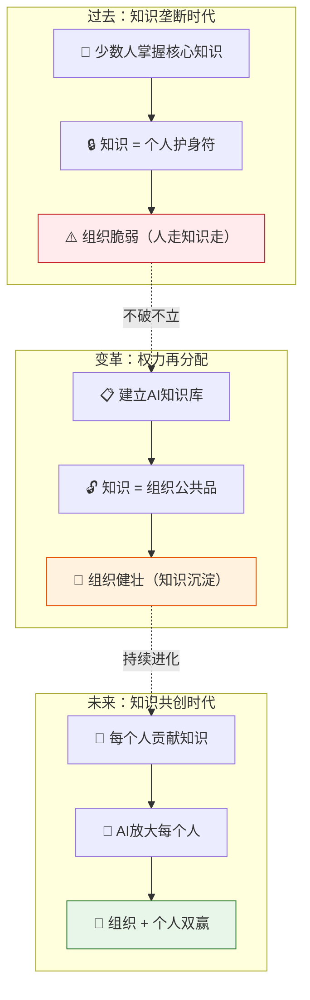

# 企业AI化推不动的真正原因：不是技术，是人心

> **核心语录**：AI知识库的本质，不是技术工程，而是一场权力再分配——把少数人垄断的隐性知识，变成组织共享的显性智慧。

---

## 一、核心观点总览

| 维度 | 表面理解 | 深层逻辑 | 实操要义 |
|------|----------|----------|----------|
| **AI化的阻力** | 技术不成熟、工具不好用 | 员工恐惧知识被夺走，丧失不可替代性 | 先解决"心"的问题，再解决"术"的问题 |
| **知识库的本质** | 一个文档系统 | 将个人隐性知识转化为组织显性知识 | 知识民主化 = 权力再分配 |
| **推动AI化的关键** | 买好工具、设好KPI | 重新设计激励体系，让分享知识的人获益 | 让贡献知识比垄断知识更值钱 |
| **最终目标** | 用AI替代部分员工 | 让AI放大每个人的能力，而非替代某个人 | 组织进化，不是个人淘汰 |

```
逻辑记忆链：

┌─────────────────┐     ┌──────────────────┐     ┌──────────────────┐     ┌─────────────────┐
│  ① 识别恐惧      │ ──▶ │  ② 正视权力博弈   │ ──▶ │  ③ 设计激励兼容   │ ──▶ │  ④ 知识涌现      │
│ （为什么不愿分享）│     │ （谁在保护什么）   │     │ （分享者得利）     │     │ （AI真正生效）   │
└─────────────────┘     └──────────────────┘     └──────────────────┘     └─────────────────┘
         ▲                                                                     │
         └──────────────────────── 复盘迭代 ◀────────────────────────────────────┘
```

---

## 二、知识库：从个人到组织的知识转移

### 2.1 打破信息差：知识从"私藏"变"共享"

```
┌──────────────────────────────────────────────────────────┐
│              知识转移的本质变化                            │
├──────────────────────────────────────────────────────────┤
│                                                          │
│  过去 ❌                          现在 ✅                  │
│  ┌──────────────────┐            ┌──────────────────┐   │
│  │ 👤 老员工私藏      │            │ 🏢 知识库共享      │   │
│  │  报价逻辑         │            │  报价逻辑         │   │
│  │  排产经验         │  ──────▶  │  排产经验         │   │
│  │  客户偏好         │            │  客户偏好         │   │
│  │  （仅少数人掌握）  │            │  （新员工即可使用）│   │
│  └──────────────────┘            └──────────────────┘   │
│                                                          │
│  结果：个人护身符                      结果：组织能力沉淀    │
│                                                          │
└──────────────────────────────────────────────────────────┘
```

> **逻辑记忆**：知识转移 = 从"我知道你不知道" → "我们都知道，AI帮我们用好"

### 2.2 威胁个人价值：消失的"不可替代性"

| 知识类型 | 过去的保护方式 | AI化后的状态 | 影响程度 |
|----------|----------------|--------------|----------|
| **信息差**（我知道你不知道的） | 拒绝分享，保持神秘 | AI让所有人可见 | ★★★★★ 致命 |
| **经验差**（我做过的你没做过的） | 以"经验"为谈判筹码 | AI将经验结构化复用 | ★★★★☆ 重大 |
| **关系差**（我认识的人你不认识的） | 独占客户资源 | AI辅助客户关系管理 | ★★★☆☆ 中等 |
| **认知差**（我懂的底层逻辑你不懂的） | 用专业术语壁垒 | AI翻译成人人可懂的语言 | ★★☆☆☆ 较小 |
| **行动差**（我做得比你快的） | 靠熟练度取胜 | AI加速所有人的执行速度 | ★☆☆☆☆ 轻微 |

```
个人价值威胁链：

   "我的经验是我的护身符"
            │
            ▼
   "AI要把我的经验写下来"
            │
            ▼
   "写下来 = 人人都能用"
            │
            ▼
   "人人都能用 = 我不再特别"
            │
            ▼
   "我不再特别 = 我可能不再被需要"  ← 核心恐惧
```

---

## 三、AI化的表面阻力与深层恐惧

### 3.1 表面理由 vs 深层原因：说出来的≠真正想的

```
┌──────────────────────────────────────────────────────────────┐
│              表面理由 vs 深层恐惧                              │
├──────────────────────────────────────────────────────────────┤
│                                                              │
│  表面说的                       真正想的                       │
│  ┌───────────────────────┐      ┌───────────────────────┐   │
│  │ "业务太特殊了，         │      │ "我不想让AI学会        │   │
│  │  没法标准化"           │      │  我的独门绝活"         │   │
│  └───────────────────────┘      └───────────────────────┘   │
│            │                                │                │
│            ▼                                ▼                │
│  ┌───────────────────────┐      ┌───────────────────────┐   │
│  │ "太忙了，没时间整理"    │      │ "整理了 = 教会了别人   │   │
│  │                       │      │  = 我可能被替代"       │   │
│  └───────────────────────┘      └───────────────────────┘   │
│            │                                │                │
│            ▼                                ▼                │
│  ┌───────────────────────┐      ┌───────────────────────┐   │
│  │ "AI不够智能，不好用"    │      │ "AI学会了 = 我的优势   │   │
│  │                       │      │  消失了"               │   │
│  └───────────────────────┘      └───────────────────────┘   │
│                                                              │
│  核心洞察：阻力从来不是技术问题，而是利益重新分配的恐惧         │
│                                                              │
└──────────────────────────────────────────────────────────────┘
```

### 3.2 表面理由与深层原因对比表

| 表面理由 | 合理外衣 | 深层恐惧 | 恐惧的本质 |
|----------|----------|----------|------------|
| "业务太特殊，无法标准化" | 技术讨论 | 不想让我的经验变成组织的 | 失去不可替代性 |
| "工作太忙，没时间整理文档" | 资源约束 | 整理出来 = 失去独特价值 | 价值感崩塌 |
| "AI不够智能，不适合我们" | 技术质疑 | AI学会了，我就不需要了 | 被替代的恐惧 |
| "数据安全有风险" | 合规考量 | 我的知识进入系统 = 我透明了 | 失去信息不对称优势 |
| "先看看别人怎么做" | 谨慎策略 | 我不想当第一个，也不想当最后一个 | 既怕风险又怕落后 |

### 3.3 深层恐惧的系统动力学图

```
恶性循环（不解决恐惧的结果）：

  员工恐惧 ──▶ 拒绝分享知识 ──▶ AI知识库空洞 ──▶ AI效果差
      ▲                                              │
      │                                              ▼
      └────── 更加恐惧 ◀── "看吧，AI果然没用" ◀── 企业质疑AI价值

良性循环（解决恐惧后的效果）：

  激励到位 ──▶ 主动分享知识 ──▶ AI知识库丰富 ──▶ AI效果好
      ▲                                              │
      │                                              ▼
      └────── 更多参与 ◀── 个人价值反而提升 ◀── 组织整体变强
```

> [!important] 关键洞察
> 恶性循环的破局点只有一个：**让分享知识的人先获益**。不是先有知识库才有激励，而是先有激励才有知识库。

---

## 四、结论：AI化是组织问题，不是技术问题

### 4.1 权力分配：知识库 = 组织的操作系统升级



### 4.2 组织AI化推进路线图

| 阶段 | 核心任务 | 关键挑战 | 成功标准 | 常见失败 |
|------|----------|----------|----------|----------|
| **第一阶段** | 识别恐惧来源 | 管理层不愿直面利益冲突 | 能说出"谁在害怕什么" | 仅谈技术，回避人事 |
| **第二阶段** | 设计激励机制 | 如何让分享者先获益 | 贡献知识 = 升职加薪 | 只加任务不加激励 |
| **第三阶段** | 建立知识库 | 隐性知识的结构化提取 | 知识库覆盖核心业务流程 | 变成文档堆砌场 |
| **第四阶段** | AI融入业务 | 从工具到工作流的再造 | AI成为日常工作一部分 | 买工具但不用 |
| **第五阶段** | 持续迭代进化 | 知识与AI的协同提升 | 组织效率显著提升 | 一次性项目，无人维护 |

### 4.3 三种组织模式对比

| 组织模式 | 知识策略 | AI策略 | 结果 | 代表特征 |
|----------|----------|--------|------|----------|
| **封建制** ❌ | 知识归个人，"各守封地" | 不用AI，或用了也白用 | 人走知识走，组织脆弱 | 老员工是"活数据库" |
| **强制改革制** ⚠️ | 强行要求知识上交 | KPI驱动，"不写就扣分" | 消极对抗，知识库质量差 | 员工写了"假文档"应付 |
| **激励兼容制** ✅ | 分享知识 = 获得更大价值 | AI放大贡献者，"让你更值钱" | 主动分享，组织与个人双赢 | 知识贡献者被表彰、晋升 |

> [!tip] 核心结论
> AI化推不动时，不要问"工具够不够好"，要问"谁在害怕，他在怕什么，我们能不能让分享比垄断更值钱"。

---

## 五、2026年正在发生的案例

### 案例1：某汽车4S店集团的AI知识库失败与重生

> **背景**：2026年初，华南某大型4S店集团引入AI知识库系统，目标是将老销售顾问的报价经验、客户沟通话术结构化，让新人快速上手。
>
> **遭遇阻力**：
> - 金牌销售集体抵制："我的报价策略是根据客户临场反应调整的，AI学不会"
> - 销售经理暗中阻挠："如果新人也能报价，我这个经理的价值在哪？"
> - 3个月后，知识库仅有不到50条低质量条目，AI系统几乎无人使用
>
> **转折点**：新任数字化负责人改变了策略——
> - 让每位贡献知识的销售按知识被调用次数获得分成
> - 将"知识贡献度"纳入晋升考核，权重30%
> - 明确承诺：AI替代的是重复劳动，不是你的判断力
>
> **结果**：6个月后知识库突破2000条高质量条目，新人成交周期从3个月缩短至3周，**贡献知识最多的3位销售反而晋升为区域培训总监，收入提升了40%**。
>
> **逻辑记忆**：激励到位 → 恐惧消失 → 知识涌现 → AI生效 → 贡献者反而更值钱

### 案例2：某医药企业的"销售AI助手"内部博弈

> **背景**：2026年，某中型医药企业试图建立销售AI助手，将区域经理的客户拜访经验、学术推广策略录入系统。
>
> **遭遇阻力**：
> - 区域经理的"不可替代性"来自客户关系和定价判断权——AI一旦介入，这些信息将透明化
> - 最资深的销售总监公开说："AI要是能搞定客户，我早就不干了——问题是AI搞不定"
> - 实质：他的权力不仅来自知识，还来自他控制的信息流（谁得到什么资源、什么价格）
>
> **转折点**：CEO直接介入，重新定义了区域经理的角色——
> - 从"信息把关人"变成"AI系统的训练师"
> - 贡献经验最多的区域经理，负责训练AI的区域策略模块
> - AI输出的策略建议，由区域经理审核把关，最终决策权仍在人
>
> **结果**：AI助手上线后，每位区域经理可同时管理的医院数量从15家增加到30家，销售总监的角色从"管10个人"变成"管AI+管50个人"，组织效能翻倍。
>
> **逻辑记忆**：权力重新定义（信息把关人→AI训练师）→ 不是被AI替代，而是用AI放大

### 案例3：某律所的"知识AI化"——从抵制到拥抱

> **背景**：2026年，某中等规模律所试图建立AI合同审查系统，需要将资深律师的审查逻辑、风险判断标准结构化。
>
> **遭遇阻力**：
> - 资深律师的"专业壁垒"就是他们的定价能力——如果AI能完成80%的合同审查，客户为什么还要付高价？
> - 合伙人内部分歧：高级合伙人靠"经验溢价"收费，自然反对；年轻合伙人靠"效率"竞争，支持变革
> - 最激烈的反对来自一位年入300万的合同法专家："我的判断力是20年积累的，AI怎么可能学会？"
>
> **转折点**：律所改变了收费模式——
> - 从"按小时收费"改为"按解决方案收费"
> - 贡献知识给AI的律师，获得"知识股权"——AI系统每接一单，贡献者获得分成
> - AI处理80%的标准审查，律师聚焦20%的复杂判断，单位时间价值反而更高
>
> **结果**：AI系统上线一年后，律所合同审查业务量增长了5倍（因为成本降低，中小企业也能负担），那位最初最反对的专家，成为系统最大受益者——他的知识被调用3000+次，年"知识分红"超过100万。
>
> **逻辑记忆**：收费模式变革（卖时间→卖解决方案）→ 知识变成资产 → 贡献者获得复利

### 案例数据对比

| 案例 | 知识垄断者 | 核心恐惧 | 激励变革 | 最终效果 |
|------|-----------|----------|----------|----------|
| 4S店集团 | 金牌销售 | 报价策略被学会 | 知识调用分成+晋升权重 | 新人成交周期缩短80% |
| 医药企业 | 区域经理 | 信息控制权透明化 | 角色重定义：信息把关→AI训练师 | 人均管理医院数翻倍 |
| 律师事务所 | 资深律师 | 专业溢价消失 | 知识股权+收费模式变革 | 业务量增长5×，知识分红超100万 |

---

## 六、最高级思考问答（全文总结）

### Q1：如果员工的恐惧是合理的（AI确实会替代部分工作），那该怎么办？

> **A：** 首先承认这个恐惧是合理的——**AI确实会改变岗位结构，但改变≠消灭**。历史上每次技术革命都淘汰了部分岗位，但创造了更多新岗位。关键不是"阻止AI"（这不可能），而是**"让被改变的人先获益"**。
>
> 具体做法：
> 1. 透明化：明确告诉员工，AI会替代哪些任务（不是岗位），以及哪些能力会变得更值钱
> 2. 优先权**：让知识贡献者优先获得新角色的竞聘资格（如"AI训练师"、"知识运营官"）
> 3. **安全网**：提供再培训预算和转型缓冲期
>
> **深层逻辑**：恐惧不是敌人，**不透明的恐惧**才是敌人。当恐惧被说出来、被正视、被设计进制度，它就从阻力变成了动力。

### Q2：如何区分"合理的知识保护"和"不合理的知识垄断"？

> **A：** 用一个简单的判断标准——**"人走知识是否也走？"**

| 情况 | 知识保护 ✅ | 知识垄断 ❌ |
|------|------------|------------|
| **人走知识** | 知识留在组织（已结构化） | 知识跟着人走 |
| **可替代性** | 人可以被替代，知识不可被替代 | 人和知识绑定，不可替代 |
| **组织风险** | 低（有冗余） | 高（单点故障） |
| **个人收益** | 来自持续贡献新判断 | 来自垄断旧知识 |
| **长期价值** | 个人价值随知识积累而增长 | 个人价值随知识过时而贬值 |

> **核心判断**：如果你的价值在于"持续产生新判断"，你的知识是保护；如果你的价值在于"只有我知道这些旧信息"，你的知识是垄断。**AI要打破的是垄断，不是保护。**

### Q3：在AI时代，什么样的知识值得"个人垄断"？

> **A：** 严格来说，**没有知识值得永久垄断**。但有些知识的"保鲜期"更长：
>
> | 知识类型 | 保鲜期 | AI替代难度 | 个人策略 |
> |----------|--------|-----------|----------|
> | 事实性知识（数据、流程） | 极短 | ★★★★★ 极易 | 尽快分享，换取更新的知识 |
> | 技能性知识（操作方法） | 短 | ★★★★☆ 较易 | 转化为AI技能包，署名获利 |
> | 判断性知识（何时用什么） | 长 | ★★★☆☆ 中等 | 持续更新，AI辅助但无法替代 |
> | 关系性知识（人脉、信任） | 较长 | ★★☆☆☆ 较难 | AI辅助管理，核心仍靠人 |
> | 元认知知识（如何思考问题） | 极长 | ★☆☆☆☆ 极难 | 这是终极护城河，持续打磨 |
>
> **逻辑记忆**：越往下越值得深扎——**分享底层，深扎顶层**。把事实和技能分享给AI，把判断力和元认知留给自己持续进化。

### Q4：AI化推不动时，CEO/CTO应该先做什么？

> **A：** 不要先买工具，不要先设KPI——**先做一次"恐惧审计"**。

```
恐惧审计四步法：

  1️⃣ 识别关键知识持有者
     └─ 问：如果我们最资深的3个人同时离职，哪些业务会瘫痪？

  2️⃣ 理解他们的恐惧
     └─ 问：如果把你的经验写进AI，你最担心失去什么？

  3️⃣ 计算恐惧的成本
     └─ 问：如果这些知识永远不被结构化，组织每年损失多少？

  4️⃣ 设计激励兼容方案
     └─ 问：怎样让分享知识比垄断知识更值钱？
```

> **一句话**：先解决人的问题，再解决技术问题。AI化是**组织变革项目**，不是**IT采购项目**。

### Q5：这套逻辑在AI快速进化下会不会失效？

> **A：** 不会失效，反而会**越来越重要**。因为AI越强，知识垄断者的恐惧就越大——他们看到的不是"AI可能替代我"，而是"AI**即将**替代我"。这意味着：
>
> - **2024年**：AI能做30%的知识工作 → 恐惧尚可控，温水煮青蛙
> - **2026年**：AI能做60%的知识工作 → 恐惧显性化，阻力增大
> - **2028年**：AI能做80%的知识工作 → 不分享知识的人将被彻底边缘化
>
> **深层逻辑**：AI越强，"知识垄断"越不可持续。越早建立激励兼容的知识分享机制，组织在AI时代的竞争力就越强。**等待不是安全的，等待是最大的风险。**

### Q6：如何用一句话总结今天的全部思考？

> **A：** **AI化推不动时，别问"工具够不够好"，问"谁在害怕，他在怕什么，我们能不能让分享比垄断更值钱。"**
>
> 知识如水——堵则腐，疏则活。AI不是来夺走你的知识的，而是让被垄断的知识重新流动，灌溉每一个人。最终，**愿意分享知识的人，才是AI时代最值钱的人**。

---

## 七、记忆宫殿

> **宫殿选址**：想象你走进一座**古代粮仓**

### 🚪 第一进·粮仓大门（知识的垄断与共享）

粮仓大门紧闭，门口站着一个**守门人**，手里握着唯一的钥匙。
- 门内粮食堆积如山，但正在**发霉腐烂**（= 知识被垄断，无法流动）
- 门外百姓排队挨饿（= 组织因知识垄断而效率低下）
- 你递给守门人一把**新钥匙**（= AI工具），说："打开门，粮食分给大家，你反而会成为最被需要的人"
- 守门人犹豫片刻，打开了门——门楣上刻着：**"知识如水，堵则腐，疏则活"**

> 🧠 **记忆锚点**：守门人 = 知识垄断者，发霉的粮食 = 未被共享的知识，新钥匙 = AI。打开门不是失去权力，而是创造更大价值。

### 🏗️ 第二进·量粮厅（激励体系设计）

量粮厅中央放着一杆**大秤**：
- **左边**：一袋袋粮食（= 知识贡献），袋上刻着贡献者名字
- **右边**：一锭锭金子（= 激励回报），按贡献大小分配
- 墙上挂着三种分配模式：
  - 🚫 **封建制**：守仓人独占 → 粮腐人走
  - ⚠️ **强制制**：强行收缴 → 消极对抗，粮食掺假
  - ✅ **兼容制**：贡献多 → 回报多 → 粮食越堆越高
- 厅中央的碑文：**"让贡献者先获益"**

> 🧠 **记忆锚点**：大秤 = 激励体系。贡献与回报必须对等。封建制/强制制/兼容制 = 三种组织模式。让分享比垄断更值钱。

### 😵 第三进·暗仓（深层恐惧与表面理由）

暗仓里有几个上锁的**木箱**，箱子外面贴着标签：
- 箱1标签："业务太特殊，无法标准化" → 打开一看：**一把锈锁**（= 害怕失去不可替代性）
- 箱2标签："太忙了，没时间整理" → 打开一看：**一面镜子**（= 不想看到自己不再特别的现实）
- 箱3标签："AI不够智能" → 打开一看：**一个空钱包**（= 恐惧收入来源消失）
- 暗仓出口写着：**"说出来的≠真正想的——恐惧被说出来，才能被解决"**

> 🧠 **记忆锚点**：木箱 = 表面理由，箱内之物 = 深层恐惧。锈锁=不可替代性恐惧，镜子=价值感崩塌，空钱包=收入恐惧。直面恐惧，才能破局。

### 🔭 第四进·瞭望台（案例观察与路径设计）

瞭望台四面开窗，每扇窗看到一个案例：
- **北窗**🚗：4S店销售从"私藏报价"到"知识分红"，晋升为培训总监
- **南窗**💊：区域经理从"信息把关人"到"AI训练师"，管理范围翻倍
- **东窗**⚖️：律师从"按小时卖知识"到"知识股权分红"，收入增长5倍
- **西窗**🗺️：瞭望台中央挂着推进路线图：**识别恐惧 → 设计激励 → 建知识库 → AI融入 → 持续进化**
- 台顶旗帜：**"先解决人的问题，再解决技术问题"**

> 🧠 **记忆锚点**：四面窗 = 四个案例（4S店/医药/律所/路线图）。先有激励，后有知识库。AI化是组织变革，不是IT采购。

### 💎 第五进·粮仓深处（终极价值：知识流动）

粮仓最深处不是粮堆，而是一眼**活水泉**：
- 泉水从地下涌出，通过**沟渠**流向四面八方（= 知识通过AI流向每个人）
- 泉眼旁刻着核心公式：**"价值 = 知识流动 × AI放大 × 激励兼容"**
- 泉边的石碑：**"最终，愿意分享知识的人，才是AI时代最值钱的人"**
- 你手里多了一个**水杯**（= 每天问：今天有什么知识可以分享？）

> 🧠 **记忆锚点**：活水泉 = 流动的知识（vs第一进的发霉粮食）。沟渠 = AI+激励机制。行动 = 每天分享一点知识。

---

### 🧠 宫殿快速回顾

| 位置 | 意象 | 对应知识 |
|------|------|----------|
| 🚪 粮仓大门·守门人与钥匙 | 知识如水，堵则腐，疏则活 | AI化本质：知识从垄断到共享 |
| 🏗️ 量粮厅·大秤与分配 | 让贡献者先获益 | 三种模式：封建/强制/兼容 |
| 😵 暗仓·木箱与真实内容 | 说出来的≠真正想的 | 表面理由vs深层恐惧 |
| 🔭 瞭望台·四窗案例 | 先解决人的问题 | 四个案例+推进路线图 |
| 💎 粮仓深处·活水泉 | 分享知识的人最值钱 | 价值=知识流动×AI放大×激励兼容 |

---

### 📎 逻辑记忆总链

```
粮仓大门（知识如水，堵则腐，疏则活）
  → 量粮厅（让贡献者先获益，激励兼容是关键）
    → 暗仓（说出来的≠真正想的，直面恐惧才能破局）
      → 瞭望台（四个案例验证，路线图清晰）
        → 活水泉（知识流动+AI放大 = 终极价值）
```

> **走过一遍粮仓，五重智慧尽入心中。** 🏛️
>
> 💎 **一句话带走**：AI化推不动时，别问"工具够不够好"，问"谁在害怕，他在怕什么，我们能不能让分享比垄断更值钱"——答案就藏在每个人心里那把不愿交出的钥匙里。

---

*相关笔记：[[日记/0623/2026-06-22 情绪是武器，不是枷锁 —— 处世中的情绪博弈论]] · [[日记/0623/2026-06-22 价值不是创造出来的，而是通过打破限制后自然涌现的]] · [[日记/0623/2026-06-22 如何判断我提取的结构是「对的」]]*
