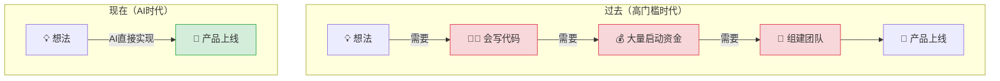
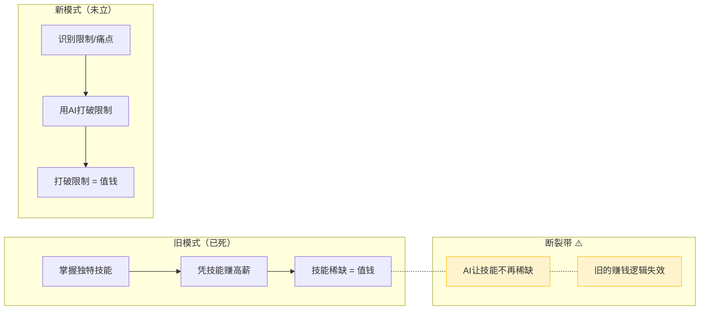

# AI时代的价值逻辑：不学工具，去打破限制

> **核心命题**：价值不是创造出来的，而是通过打破限制后自然涌现的。能打破越硬的限制，你就越值钱。

---

## 一、核心观点总览

| 维度 | 核心原则 | 底层逻辑 | 实践难度 |
|------|----------|----------|----------|
| 价值本质 | 价值源于打破限制 | 限制越少，自由越大，价值自然涌现 | ★★★★☆ |
| AI角色 | 降低创新门槛 | 技术不再是壁垒，人人都能把想法落地 | ★★★☆☆ |
| 当前困境 | 有工具不知打破什么 | 旧模式已死，新模式未立 | ★★★★★ |
| 行动转向 | 从"学工具"到"找问题" | 识别身边的限制 = 识别机会 | ★★★★☆ |

---

## 二、价值的本质——打破限制

### 2.1 反常识：价值不是"创造"的

视频提出一个颠覆性的观点：**价值不是被创造出来的，而是在打破原有限制后自然出现的。**

```
┌──────────────────────────────────────────────────────────┐
│              价值的产生机制                                │
├──────────────────────────────────────────────────────────┤
│                                                          │
│  传统认知 ❌                  真实逻辑 ✅                  │
│  ┌───────────────┐           ┌───────────────┐          │
│  │ 灵感 → 创造    │           │ 发现限制       │          │
│  │ → 产品 → 价值  │           │ → 用AI打破     │          │
│  │ （从无到有）    │           │ → 价值涌现     │          │
│  └───────────────┘           │ （从堵到通）    │          │
│                               └───────────────┘          │
│                                                          │
│  类比：不是"发明水"，而是"打通堵塞的河道"                  │
│                                                          │
└──────────────────────────────────────────────────────────┘
```

> **逻辑记忆**：价值 = f(限制被打破的程度)
> 打破的限制越硬、影响的人越多 → 价值越大

### 2.2 限制硬度与价值对应表

| 限制类型 | 硬度 | 打破后的价值量级 | 典型例子 |
|----------|------|-----------------|----------|
| 信息差 | ★☆☆☆☆ 软 | 小（容易复制） | "我知道你不知道" |
| 技能门槛 | ★★☆☆☆ 较软 | 中（AI正在瓦解） | 编程、设计、翻译 |
| 资源壁垒 | ★★★☆☆ 中等 | 大（需要资本+认知） | 供应链、渠道 |
| 认知壁垒 | ★★★★☆ 硬 | 很大（需要深度思考） | 行业底层逻辑 |
| 制度/规则壁垒 | ★★★★★ 极硬 | 巨大（需要系统性创新） | 牌照、法规、体制 |

**逻辑记忆链**：限制越硬 → 打破越难 → 竞争越少 → 价值越大

---

## 三、AI的作用——降低创新与创业的门槛

### 3.1 AI打破了什么？



### 3.2 门槛变化对照表

| 维度 | AI之前 | AI之后 | 变化幅度 |
|------|--------|--------|----------|
| 技术门槛 | 需要会写代码/懂设计 | Prompt即可生成 | 🔻 降低90% |
| 资金门槛 | 需要团队+办公室+服务器 | 一人即可启动 | 🔻 降低80% |
| 时间门槛 | 产品迭代需数周/数月 | 分钟级迭代 | 🔻 降低95% |
| 认知门槛 | 需要跨领域专家 | AI辅助跨领域决策 | 🔻 降低60% |
| **判断力门槛** | 需要行业洞察 | **仍然需要人来判断** | 🔺 不变反升 |

> **关键洞察**：AI降低了所有执行层面的门槛，但**判断力**的门槛不降反升。因为当所有人都能做时，**做什么**比**怎么做**更重要。

### 3.3 门槛经济学

```
门槛变化公式：

创业总成本（过去）= 技术人才 × 资金 × 时间 × 试错成本
创业总成本（现在）= 你的判断力 × AI执行力 × 极低成本

结论：瓶颈从"能不能做"转向"该不该做"
     核心竞争力从"执行力"转向"识别力"
```

---

## 四、当前困境——拥有工具却不知打破什么

### 4.1 新旧模式断裂带



### 4.2 两种人的分化

| 类型 | 行为模式 | 心态 | 结果 |
|------|----------|------|------|
| **工具囤积者** ❌ | 疯狂学AI工具，追逐新功能 | "我要先学会所有工具" | 焦虑、迷茫、原地踏步 |
| **问题发现者** ✅ | 观察身边的限制和痛点 | "什么东西被堵住了？" | 找到机会、创造价值 |

**逻辑记忆**：
- 工具囤积者 = 拿着锤子找钉子 → 永远在准备
- 问题发现者 = 看到墙上的洞去找工具 → 立刻在行动

### 4.3 迷茫的本质

```
迷茫 = 知道"能做什么" - 不知道"该做什么"
     = 执行能力 ↑ - 方向感 ↓
     = AI时代的通病

解药：停止问"AI能做什么"
     开始问"什么东西被限制住了，AI能帮我打破它？"
```

---

## 五、行动建议——从"学工具"到"找问题"

### 5.1 思维转换路径

```
┌────────────────────────────────────────────────────────────┐
│              思维转换：从工具导向到问题导向                   │
├────────────────────────────────────────────────────────────┤
│                                                            │
│  第一阶段 ❌                  第二阶段 ✅                    │
│  "我要学什么AI工具？"        "什么东西被限制了？"            │
│         ↓                            ↓                     │
│  追逐热点                     观察生活/行业                  │
│         ↓                            ↓                     │
│  焦虑内卷                     发现机会                       │
│         ↓                            ↓                     │
│  工具过剩                     精准打击                       │
│         ↓                            ↓                     │
│  价值稀释                     价值涌现                       │
│                                                            │
│  核心转变：                                             │
│  从 "我会什么工具" → "我能打破什么限制"                     │
│                                                            │
└────────────────────────────────────────────────────────────┘
```

### 5.2 问题发现框架——"四面墙"模型

| 观察方向 | 核心问题 | 典型限制 | AI打破方式 |
|----------|----------|----------|------------|
| 🏠 **自己** | 我每天重复做什么？哪些事让我低效？ | 重复性劳动、信息整理 | AI自动化工作流 |
| 💼 **行业** | 行业里哪些环节效率最低？ | 审批流程、客户对接 | AI代理+流程再造 |
| 👥 **身边的人** | 朋友/同事总在抱怨什么？ | 沟通成本、信息不对称 | AI中介+智能匹配 |
| 🌍 **社会** | 什么制度/规则正在被技术倒逼改革？ | 教育不公、医疗资源不均 | AI个性化+远程化 |

### 5.3 行动清单

```
每日三问：
  1️⃣ 今天有什么事情让我觉得"太麻烦了"？
  2️⃣ 这个"太麻烦了"背后，是哪种限制在起作用？
  3️⃣ AI能不能帮我（或帮别人）打破这个限制？

每周一次：
  📝 记录一个发现的"限制"，存入知识库
  🔍 验证这个限制是否真的可以用AI打破
  🚀 如果可行，花1小时做一个最小验证
```

---

## 六、2026年最新案例

### 案例1：打破"不会编程"的限制——外卖骑手的App创业

> **背景**：2026年初，深圳外卖骑手陈师傅每天送餐时发现：小区物业不让骑手进，客户要下楼取餐，双方都抱怨。
>
> **发现限制**：最后100米的交付体验差 = 一个被"物业规定"限制住的问题
>
> **AI打破方式**：陈师傅用Claude + Cursor零代码基础，3天内搭建了一个"小区驿站智能柜"小程序——骑手扫码存餐，客户扫码取餐，自动通知。
>
> **结果**：3个月覆盖50个小区，月流水12万。**不是他懂编程，而是他发现了那个"被限制住的痛点"。**
>
> **逻辑记忆**：限制藏在抱怨里 → 最值钱的问题 = 最多人抱怨的事

### 案例2：打破"信息不对称"的限制——农产品直播的AI升级

> **背景**：2026年，云南某县城的咖啡种植户面临困境：好咖啡卖不出好价，中间商吃掉了80%利润。
>
> **发现限制**：消费者不知道好咖啡在哪 = 信息差限制
>
> **AI打破方式**：用AI生成每批咖啡豆的"风味画像"+种植故事短视频，结合AI客服系统直接对接终端消费者。
>
> **结果**：同样品质的咖啡，售价提升了3倍，复购率达65%。打破的不是种植技术，而是**信息传递的限制**。
>
> **逻辑记忆**：好产品 ≠ 好价格，中间的桥梁（打破信息限制）才是价值所在

### 案例3：打破"专业服务门槛"的限制——AI法律顾问

> **背景**：2026年数据显示，中国中小企业80%没有法律顾问，遇到合同纠纷只能吃哑巴亏。
>
> **发现限制**：法律服务太贵（咨询费500+/小时） = 价格门槛限制
>
> **AI打破方式**：某法律团队基于大模型构建了"AI法律顾问"，针对中小企业的常见场景（合同审查、劳动纠纷、知识产权）提供7×24小时智能咨询，复杂问题才转人工。
>
> **结果**：服务费降至每月299元，半年服务3000+企业，客户满意度4.6/5。
>
> **逻辑记忆**：专业服务的限制不是"知识"，而是"价格" → AI打破价格门槛 = 市场爆发

### 案例数据对比

| 案例 | 发现的限制 | 限制硬度 | AI打破方式 | 价值量级 |
|------|-----------|----------|-----------|----------|
| 骑手App | 最后100米交付 | ★★☆☆☆ | 零代码搭建工具 | 月入12万 |
| 咖啡直播 | 信息不对称 | ★★★☆☆ | AI内容+客服 | 售价提升3× |
| AI法律顾问 | 专业服务门槛 | ★★★★☆ | AI咨询+人工兜底 | 年服务3000+企业 |

---

## 七、高级思考问答——全文总结

### Q1：如果"价值不是创造的而是打破出来的"，那创新还存在吗？

> **A**：存在，但需要重新定义。创新 ≠ 凭空创造，而是**发现别人没看到的限制，并用新方式打破它**。爱迪生没有"创造"光明，他打破了夜晚的限制。乔布斯没有"创造"通讯，他打破了手机使用的限制。AI时代的创新公式：**创新 = 识别限制 × AI打破 × 规模化交付**。

### Q2：AI降低了所有门槛，最终什么会变得最值钱？

> **A**：当所有执行门槛归零，**三样东西**会变得最值钱：
> 1. **问题定义能力**——能精准描述"什么被限制了"的人
> 2. **判断力**——能区分"真限制"和"伪需求"的人
> 3. **承担责任**——打破限制后的后果需要人来兜底（参见[[日记/0609/2026-06-09 打破旧逻辑，拥抱新价值]]）
>
> 一句话：**AI时代最值钱的能力，是知道该打破什么。**

### Q3：如何判断一个"限制"是否值得去打破？

> **A**：三个筛选条件：
> | 条件 | 问题 | 通过标准 |
> |------|------|----------|
> | **普遍性** | 有多少人受这个限制之苦？ | ≥1000人 → 值得看 |
> | **持续性** | 这个限制是长期的还是暂时的？ | 长期 > 短期 |
> | **可破性** | 现有AI技术能不能打破它？ | 技术上可行 + 成本可接受 |
>
> 三个条件都满足 → 值得All in。满足两个 → 值得小规模试。只满足一个 → 先观察。

### Q4："停止学习AI工具"是否意味着不需要学技术了？

> **A**：不是不学，而是**学的优先级变了**。
> - **过去**：80%学工具操作 + 20%学行业认知 → 工具是核心竞争力
> - **现在**：20%了解工具能力边界 + 80%深扎行业洞察 → **行业认知是核心竞争力**
>
> 你不需要成为AI专家，但需要成为**"AI + 你的行业"的专家**。就像你不需要会造汽车，但需要会开车、懂路况。
>
> **逻辑记忆**：工具是路，认知是方向。路修得再好，方向错了也是白搭。

### Q5：这套逻辑在AI快速进化下会不会失效？

> **A**：不但不会失效，反而会**越来越重要**。因为AI越强，能打破的限制越多，市场就越需要能**精准识别限制**的人。AI的进化方向是"什么都能做"，而人的进化方向应该是"知道该做什么"。这形成了一个永恒的互补结构——参见[[日记/0610/2026-06-10 AI不挑方向，只会放大你的业务循环]]：AI是油门，人永远要当方向盘。

### Q6：普通人如何从今天开始实践？

> **A**：最小可行行动——**"限制日记"**：
> 1. 每天记录1个让你觉得"太麻烦了/不应该这样"的事
> 2. 每周回顾，挑出最有潜力的1个
> 3. 用AI做一个5分钟的最小验证（一个原型、一个Demo、一篇测试文章）
> 4. 如果反馈好 → 继续迭代；如果反馈差 → 换下一个
>
> 30天后，你会发现自己已经从"学工具的人"变成了"发现问题的人"。

---

## 八、全文总结——逻辑链

```
┌──────────────────────────────────────────────────────────────┐
│              AI时代价值创造逻辑 · 全景图                       │
├──────────────────────────────────────────────────────────────┤
│                                                              │
│  第一层：认知刷新                                              │
│  ┌──────────────────────────────────────┐                   │
│  │ 价值 ≠ 创造 → 价值 = 打破限制          │                   │
│  └──────────────────┬───────────────────┘                   │
│                     ▼                                        │
│  第二层：AI的角色                                              │
│  ┌──────────────────────────────────────┐                   │
│  │ AI = 万能锤子（降低所有执行门槛）        │                   │
│  │ 但：锤子不能帮你找到钉子               │                   │
│  └──────────────────┬───────────────────┘                   │
│                     ▼                                        │
│  第三层：人的角色                                              │
│  ┌──────────────────────────────────────┐                   │
│  │ 人 = 问题发现者（识别哪里需要打破）      │                   │
│  │ 核心竞争力：判断力 + 行业认知            │                   │
│  └──────────────────┬───────────────────┘                   │
│                     ▼                                        │
│  第四层：行动路径                                              │
│  ┌──────────────────────────────────────┐                   │
│  │ 停止学工具 → 开始找限制                 │                   │
│  │ 身边 → 行业 → 社会（由近及远）          │                   │
│  └──────────────────┬───────────────────┘                   │
│                     ▼                                        │
│  ═══════════════════════════════════════                     │
│  核心公式：                                                   │
│  💎 价值 = 识别限制 × AI打破 × 规模化交付                     │
│  ═══════════════════════════════════════                     │
│                                                              │
└──────────────────────────────────────────────────────────────┘
```

---

## 九、记忆宫殿

> **宫殿选址**：想象你走进一座**古代城门**

### 🚪 第一进·城门口（价值的本质）

城门被一块**巨石**堵住了，行人绕行、怨声载道。
- 你走上前，发现巨石后面其实是一条**宽阔大道**——只是被堵住了看不见
- 一个老者递给你一根**撬棍**（= AI工具）
- 你用力撬开巨石，大道显现，人流涌出
- 门楣上刻着：**"价值不在石后，在石被移走的那一刻"**

> 🧠 **记忆锚点**：巨石 = 限制，撬棍 = AI，大道 = 价值。价值不是创造的，是打破限制后显现的。

### 🏗️ 第二进·工匠坊（AI降低门槛）

工匠坊里，过去需要**十个师傅**协作才能造一辆车。
- 现在，一个小童拿着**魔法工具箱**（= AI），一个人就能组装
- 但奇怪的是：所有小童都在造一样的车，**没人知道该造什么车**
- 坊主坐在高处，手持一张**地图**（= 判断力），指引方向
- 墙上标语：**"工具遍地皆是，方向千金难求"**

> 🧠 **记忆锚点**：魔法工具箱 = AI降低门槛，地图 = 判断力。门槛降了，方向反而更值钱。

### 😵 第三进·岔路口（新旧模式断裂）

路口站着两种人：
- **左边**：一群人抱着各种锤子、锯子、扳手（= 工具囤积者），不停练习手法，但面前没有墙
- **右边**：几个人在仔细观察城墙上的**裂缝**（= 限制），然后挑选合适的工具去凿开
- 右边的人一个个凿开通道走了出去，左边的人还在练锤子
- 路口石碑：**"持锤者寻钉，破壁者寻路"**

> 🧠 **记忆锚点**：左边 = 工具囤积者（焦虑），右边 = 问题发现者（行动）。迷茫的本质是拿着工具不知道凿哪里。

### 🔭 第四进·瞭望塔（问题发现框架）

瞭望塔四面开窗，每扇窗看到不同的风景：
- **北窗**🏠：看到自己家里的杂乱 → "我每天在低效什么？"
- **南窗**💼：看到街市上的拥堵 → "行业哪里卡住了？"
- **东窗** 👥：看到邻居在争吵 → "身边人在抱怨什么？"
- **西窗**🌍：看到远方的城墙 → "什么规则正在被倒逼改变？"
- 塔顶悬挂四面旗帜：**"自己·行业·身边·社会"**

> 🧠 **记忆锚点**：四面窗 = 四个观察方向。问题发现从近到远：自己 → 行业 → 身边人 → 社会。

### 💎 第五进·藏宝阁（价值与行动）

藏宝阁不展示宝物，而是展示**一堵堵被打破的墙**——每堵墙后面都是一个生意：
- 第一堵墙后：骑手穿梭的驿站（案例1）
- 第二堵墙后：咖啡飘香的庄园（案例2）
- 第三堵墙后：法律文书的办公桌（案例3）
- 阁主的话刻在正中：**"最贵的不是宝物，是那堵被打破的墙"**
- 你手里多了一本**日记本**（= 限制日记），开始记录每一堵你看到的墙

> 🧠 **记忆锚点**：墙 = 限制，墙后的世界 = 价值。行动 = 每天记录一堵"墙"。

---

### 🧠 宫殿快速回顾

| 位置 | 意象 | 对应知识 |
|------|------|----------|
| 🚪 城门口·巨石与撬棍 | 巨石被移开，大道显现 | 价值 = 打破限制后涌现 |
| 🏗️ 工匠坊·魔法工具箱 | 一人造车，但需地图指引 | AI降低门槛，判断力更值钱 |
| 😵 岔路口·持锤者vs破壁者 | 练锤子vs找裂缝 | 停止学工具，开始找问题 |
| 🔭 瞭望塔·四面窗 | 四个方向四种观察 | 问题发现：自己→行业→身边→社会 |
| 💎 藏宝阁·破墙日记 | 每堵墙后是一个生意 | 行动：每天记录限制，最小验证 |

---

### 📎 逻辑记忆总链

```
城门（价值=打破限制）
  → 工匠坊（AI=万能工具，但需方向）
    → 岔路口（别囤工具，去破壁）
      → 瞭望塔（四面窗找限制）
        → 藏宝阁（破墙即价值，日记即行动）
```

> **走过一遍城门，五重智慧尽入心中。** 🏰
>
> 💎 **一句话带走**：别问"AI能做什么"，问"什么东西被限制住了？"——答案就藏在你每天的抱怨里。

---

*相关笔记：[[日记/0609/2026-06-09 打破旧逻辑，拥抱新价值]] · [[日记/0610/2026-06-10 AI不挑方向，只会放大你的业务循环]] · [[日记/0620/2026-06-20 真正会用 AI = 你的经验 × AI 的能力 × 结构化的知识库]]*
