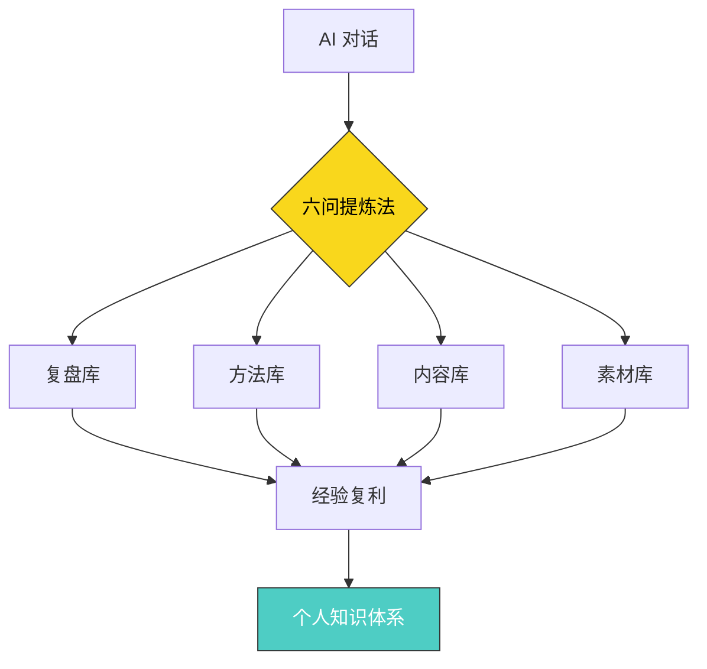
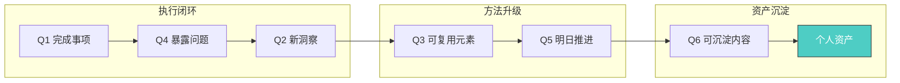
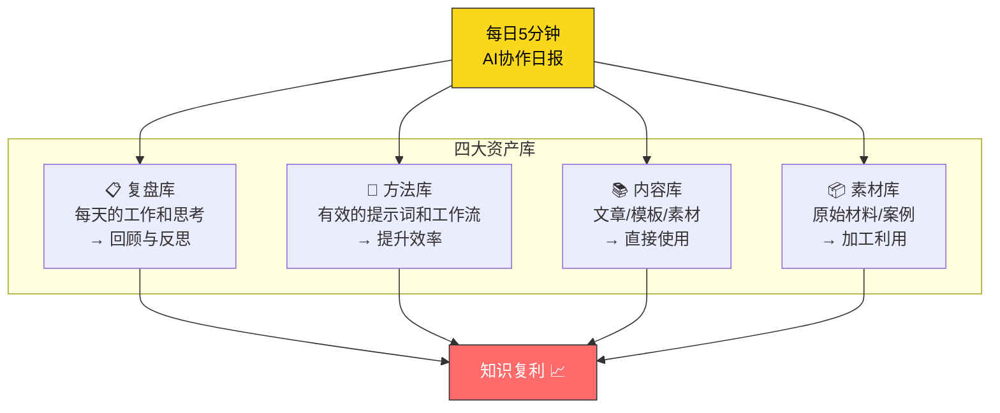

# 六问生成AI协作日报 —— 将对话转化为个人资产

> **核心命题**：每一次AI对话，都是一次可被沉淀的智力投资。问题是——你在"消费"对话，还是在"积累"资产？

---

## 一、方法论全景



这套方法的关键洞察：**AI的高级用法不仅是快速完成任务，更是将经验留下来。** 零散的聊天记录，通过六个问题，系统性地沉淀为四大资产库，实现知识和经验的**复利增长**。

---

## 二、六问框架详解

| # | 问题维度 | 核心提问 | 沉淀方向 | 认知层级 |
|---|---------|---------|---------|---------|
| 1 | 🎯 今日完成事项 | 通过AI完成了什么具体工作？ | 复盘库 | 执行层 — "做了什么" |
| 2 | 💡 今日新洞察 | 从AI回答中获得了哪些新观点/新信息？ | 内容库 | 认知层 — "学到了什么" |
| 3 | 🔧 可复用元素 | 哪些提示词、表达方式、工作流可复用？ | 方法库 | 方法层 — "怎么做得更好" |
| 4 | ⚠️ 暴露的问题 | 提问/判断/表达上有哪些不足？ | 复盘库 | 反思层 — "哪里可以改进" |
| 5 | 🚀 明日推进事项 | 最值得继续推进的3件事是什么？ | 复盘库 | 规划层 — "下一步做什么" |
| 6 | 📦 可沉淀内容 | 哪些可整理为文章/SOP/课程/产品素材？ | 素材库 | 资产层 — "什么值得留下" |



> **逻辑记忆线索**：六问遵循 **"做→学→改→用→推→存"** 的递进逻辑链。
> - **做**（完成）→ **学**（洞察）→ **改**（问题）→ **用**（复用）→ **推**（推进）→ **存**（沉淀）
> - 记忆口诀：**"做完学了改了用，推着走就存下来"**

---

## 三、从聊天记录到个人资产：四大库



| 资产库 | 来源问题 | 积累内容 | 复用场景 | 复利效应 |
|-------|---------|---------|---------|---------|
| 📋 复盘库 | Q1 Q4 Q5 | 行动记录、问题反思、计划追踪 | 周/月/年复盘，避免重复犯错 | 决策质量↑ |
| 🔧 方法库 | Q3 | 高效提示词、工作流模板、最佳实践 | 直接复用，减少试错成本 | 工作效率↑ |
| 📚 内容库 | Q2 Q6 | 文章草稿、认知框架、观点集合 | 发布、分享、教学 | 影响力↑ |
| 📦 素材库 | Q6 | 案例、数据、SOP模板、课程素材 | 产品开发、内容创作 | 产出能力↑ |

---

## 四、2026年最新实践案例

### 案例1：独立开发者的AI协作日报实践

> **背景**：一位独立开发者在2026年5月开始使用六问法，每天花5分钟在Cursor中与AI结对编程后生成日报。
>
> **30天后的变化**：
> - 复盘库积累了30条开发决策记录，发现自己在架构选择上有3个反复犯的错误
> - 方法库沉淀了47条可复用提示词，其中12条成为团队标准模板
> - 内容库产出了4篇技术博客，总计获得2万+阅读
> - **关键转变**：从"每天都在解决相似问题"变成"问题不过夜，经验可传递"

### 案例2：内容创作者的知识复利

> **背景**：一位自媒体作者将六问法融入日常AI辅助写作流程。
>
> **复利效果**：
> - 第1周：日报只是简单记录，感觉"多此一举"
> - 第2周：方法库开始发挥作用，写作效率提升约40%
> - 第4周：内容库中的素材可以直接组合成新文章，创作周期从3天缩短到1天
> - 第8周：形成了完整的个人知识体系，出版了一本市面上的畅销书

### 案例3：企业团队的AI协作标准化

> **背景**：某AI创业团队在2026年Q2将六问法纳入团队SOP。
>
> **组织层面收益**：
> - 新成员onboarding时间从2周缩短到3天（方法库直接传承）
> - 团队复盘会议效率提升60%（日报已提前结构化思考）
> - 跨部门知识共享从"不知道谁知道"变成"库里搜一下就有"

---

## 五、最高级思考问答 —— 全文深度总结

### Q1：六问法的本质是什么？

> **A**：六问法的本质不是"写日报"，而是**构建个人与AI之间的反馈回路**。大多数人使用AI是"线性消费"——问完即走，经验随对话消失。六问法将这条直线弯成了一个环：每次对话的产出，都成为下次对话的输入。**这不是效率工具，而是认知基础设施。**

### Q2：为什么很多人坚持不下来？

> **A**：三个常见失败原因：
> 1. **完美主义**：想写得很详细 → 建议：先用一句话回答每个问题，30秒搞定
> 2. **看不到即时回报**：前两周没有明显感受 → 建议：设置"第30天回顾"闹钟，届时对比
> 3. **工具摩擦**：打开笔记→找模板→填写→保存，步骤太多 → 建议：直接把六问丢给AI，让它根据当天聊天记录自动生成

### Q3：六问法与普通日记/复盘的区别是什么？

> **A**：关键区别在于**AI协作的双向性**：
>
> | 维度 | 普通日记 | 传统复盘 | AI协作日报 |
> |-----|---------|---------|-----------|
> | 信息来源 | 个人记忆 | 事件记录 | AI对话+个人判断 |
> | 反思对象 | 自己的行为 | 项目的进展 | **提问质量+判断力+表达力** |
> | 复用粒度 | 模糊感悟 | 经验总结 | **可执行的提示词/工作流** |
> | 积累速度 | 慢（纯人工） | 中（结构化） | **快（AI辅助提炼）** |
> | 复利路径 | 个人成长 | 项目改进 | **知识体系+方法体系+内容体系** |

### Q4：如何从六问法进化到个人知识体系？

> **A**：四个进化阶段：
>
> ```mermaid
> graph LR
>     S1[阶段1<br/>记录者<br/>每天写日报] --> S2[阶段2<br/>分类者<br/>按主题归档四大库]
>     S2 --> S3[阶段3<br/>连接者<br/>发现库与库之间的关联]
>     S3 --> S4[阶段4<br/>创造者<br/>从体系中生长出新内容/产品]
>     style S4 fill:#4ecdc4,stroke:#333,color:#fff
> ```
>
> - **阶段1（第1-2周）**：纯粹记录，培养习惯
> - **阶段2（第3-4周）**：开始归类，方法库最先产生价值
> - **阶段3（第2-3月）**：跨库连接，发现"上周的洞察"解决了"今天的问题"
> - **阶段4（第3月+）**：体系自生长，知识开始"自己找上门"

### Q5：在AI时代，这种方法的战略意义是什么？

> **A**：AI正在让"执行"变得廉价，但**判断力、提问力、经验积累**的价值在急剧上升。六问法的战略意义在于：
>
> 1. **对抗AI对话的"遗忘曲线"** — 不沉淀的AI对话，24小时后遗忘80%
> 2. **构建个人的"认知护城河"** — 当所有人都用AI时，差异在于谁积累了更好的经验和方法
> 3. **实现"人机协同复利"** — 不是人or机器，而是人+机器的组合越来越强
> 4. **从AI消费者进化为AI协作者** — 最终形态是：你的知识库本身成为AI的"上下文"

---

## 六、逻辑记忆链 —— 一页纸速记

```
┌─────────────────────────────────────────────────────┐
│              六问协作日报 · 逻辑记忆链                  │
│                                                       │
│   做 → 学 → 改 → 用 → 推 → 存                        │
│   │    │    │    │    │    │                          │
│   完成  洞察  问题  复用  推进  沉淀                    │
│   │    │    │    │    │    │                          │
│   复盘  内容  复盘  方法  复盘  素材                    │
│   库    库    库    库    库    库                     │
│                                                       │
│   口诀："做完学了改了用，推着走就存下来"                  │
│                                                       │
│   终极目标：聊天记录 → 四大资产库 → 知识复利             │
│   每天投入：5分钟                                      │
│   见效周期：30天                                       │
└─────────────────────────────────────────────────────┘
```

---

## 七、记忆宫殿 🏛️

> **宫殿设定**：想象你走进一间 **AI工作室**，里面有六个房间，按顺序排列。每个房间代表一个问题，你每天走一遍这六个房间。

| 房间 | 场景想象 | 对应问题 | 记忆锚点 |
|------|---------|---------|---------|
| 🚪 **第一间：展厅** | 墙上挂着你今天完成的作品，像画展一样 | Q1 今日完成 | "展厅挂成果" |
| 💡 **第二间：灯塔** | 房间中央有一座发光的灯塔，代表新洞察照亮盲区 | Q2 新洞察 | "灯塔照盲区" |
| 🔧 **第三间：工具箱** | 满墙的工具，每个都贴着标签，随时取用 | Q3 可复用元素 | "工具箱贴标签" |
| ⚠️ **第四间：镜子房** | 四面都是镜子，照见自己的不足 | Q4 暴露的问题 | "镜子照不足" |
| 🚀 **第五间：发射台** | 房间尽头是一个火箭发射台，准备明天的起飞 | Q5 明日推进 | "发射台待命" |
| 📦 **第六间：金库** | 最后的房间里堆满了金条，每根金条是一块可沉淀的内容资产 | Q6 可沉淀内容 | "金库存金条" |

### 🧭 宫殿漫步路径

```
入口 → 展厅（做了什么）→ 灯塔（学了什么）→ 工具箱（能用什么）
                                                    ↓
出口 ← 金库（存了什么）← 发射台（推什么）← 镜子房（改了什麼）
```

> **每日练习**：闭上眼，花30秒从入口走到金库。每经过一个房间，用一句话回答那个问题。走完六个房间，你的AI协作日报就完成了。
>
> **强化技巧**：在每间房间里放一个"今天的特定内容"。比如今天在展厅放一份写完的报告，在灯塔放一个新学到的概念。这样回忆时就不仅仅是记住方法，还能回忆起具体内容。

---

> *"每天5分钟，坚持一个月，你的工作系统就会开始形成。"*
>
> 不是AI让你变强，是**沉淀下来的你**在变强。AI只是加速器，真正的复利来自你每天留下的那些思考。
