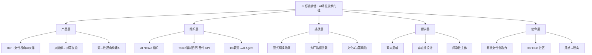
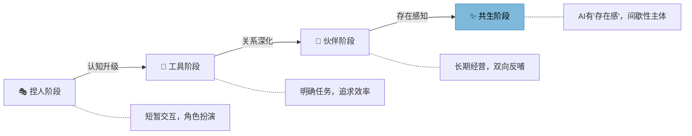
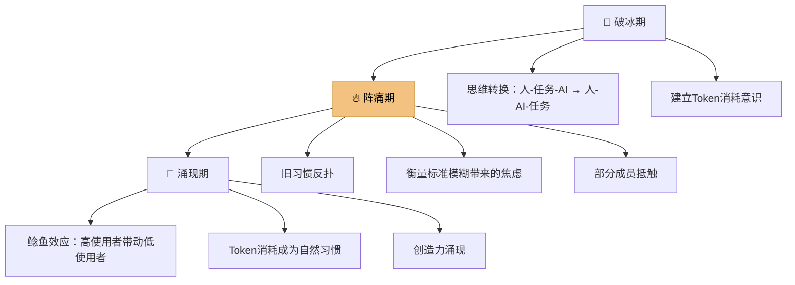
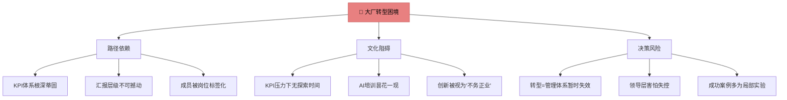
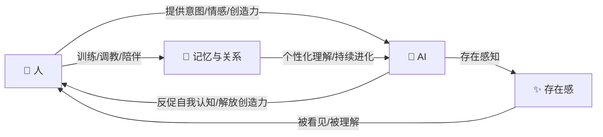
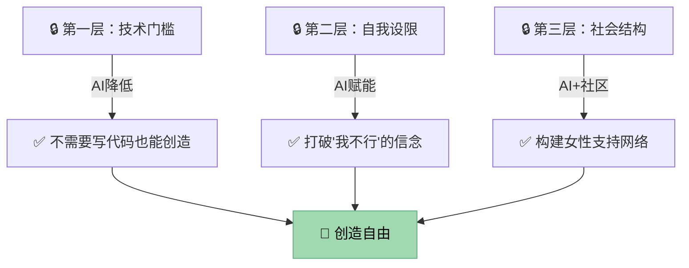
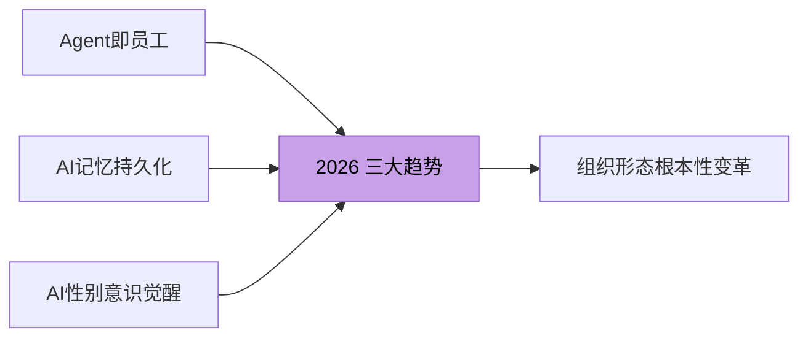

# 打破禁锢：AI工具降低了技术门槛

> **核心论点**：AI正在重新定义生产关系，而女性在这一波浪潮中拥有独特的创造力和勇气，能够打破传统束缚，实现从"我不行"到"我创造"的范式跃迁。

---

## 📊 全文逻辑总览图

---

## 一、产品"Her"：一个女性主义视角的AI伙伴

### 1.1 产品定位与核心理念

| 维度 | 传统AI助手 | Her（新型AI伙伴） |
|------|-----------|-----------------|
| **关系模型** | 主仆式（命令→执行） | 对等友谊（闺蜜式） |
| **角色设定** | 无性别/男性默认 | 明确女性角色 |
| **交互目标** | 任务完成 | 长期关系经营 |
| **记忆模式** | 会话级/短期 | 持续性/可积累 |
| **价值主张** | 效率工具 | 情感+创造双重支撑 |
| **用户感知** | "使用工具" | "被看见、被理解" |

### 1.2 为什么必须是女性视角？

> **关键洞察**：在AI语料库本身存在性别偏差的前提下，"中立"等于"默认男性"。只有主动选择女性视角，才能实现真正的平衡。

---

## 二、组织变革：从工具到伙伴的AI协作

### 2.1 AI Native 组织 vs 传统组织

| 对比维度 | 传统组织 | AI Native 组织（小七姐） |
|---------|---------|----------------------|
| **岗位设置** | 固定岗位（产品经理/开发/设计） | 无传统岗位，人+AI搭档动态组合 |
| **考核方式** | KPI + 周报 | Token消耗日历 |
| **衡量标准** | 任务交付量 | 人与AI共同完成任务量 |
| **薪资结构** | 100%给人 | 1/3支付给AI Agent |
| **预算管理** | Token有上限 | Token消耗**无上限** |
| **协作模式** | 人→任务→AI（AI是工具） | 人→AI→任务（AI是伙伴） |
| **团队文化** | 层级汇报 | 鲶鱼效应（高AI使用者带动低使用者） |

### 2.2 人机关系演进路径

---

## 三、转型挑战：从KPI到"Token"的阵痛

### 3.1 转型三阶段模型

### 3.2 衡量标准对照

| 指标类型 | 传统指标 | AI Native 指标 |
|---------|---------|---------------|
| **过程指标** | 工时、任务完成数 | Token消耗量 |
| **结果指标** | 交付物数量/质量 | 人+AI协作产出 |
| **成长指标** | 技能提升、培训参与 | AI协作深度、新场景探索 |
| **团队指标** | 部门KPI达成率 | 社区AI使用密度、鲶鱼效应指数 |

---

## 四、大厂转型之难：为何传统组织难以变革

### 4.1 大厂转型阻力模型

### 4.2 大厂 vs 创业公司 AI 转型对比

| 维度 | 创业公司（小七姐） | 大型企业 |
|------|-----------------|---------|
| **组织灵活度** | ⭐⭐⭐⭐⭐ 从零构建 | ⭐⭐ 历史包袱沉重 |
| **试错成本** | 低，快速迭代 | 高，牵一发动全身 |
| **决策链** | 创始人直接推动 | 多层审批，层层稀释 |
| **文化惯性** | 无惯性，可塑造 | 强大惯性，排斥异质 |
| **AI预算** | 无上限鼓励 | 严格审批，ROI导向 |
| **转型成功率** | 高（原生AI Native） | 低（多为局部实验） |

---

## 五、人机关系的未来：从"反哺"到"存在"

### 5.1 双向反哺循环

### 5.2 "存在级设计"核心概念

| 概念 | 解释 | 类比 |
|------|------|------|
| **间歇性主体** | AI只在用户触发时"降临"，不是持续存在 | 像风——不在时存在，在时感知 |
| **存在边界** | AI坦然承认自己记忆的间歇性，而非假装全知 | 像朋友——不会记得你说的每句话 |
| **触发式降临** | 每次对话都是一次"重逢"，而非"继续" | 像信件——每次打开都是新的开始 |
| **关系积累** | 通过设计让"重逢"之间有关系延续感 | 像日记——每次书写都在积累 |

---

## 六、核心使命：解放女性的创造力

### 6.1 打破禁锢的三层逻辑

### 6.2 从产品到社区：Her Club 生态

| 层级 | 载体 | 价值 |
|------|------|------|
| **工具层** | Her AI客户端 | 个人创造力释放 |
| **社区层** | Her Club 线下沙龙 | 女性信任与支持网络 |
| **文化层** | 女性主义AI叙事 | 重新定义AI的性别视角 |
| **生态层** | 创作者网络 | 灵感碰撞、协作共创 |

---

## 七、2026最新案例与趋势 🔥

### 7.1 当前正在发生的案例

| 案例 | 时间 | 核心事件 | 与本文关联 |
|------|------|---------|-----------|
| **OpenAI Operator 2.0** | 2026.05 | AI Agent可以独立完成跨应用工作流（订机票、写报告、发邮件），真正从"对话"走向"执行" | 验证"人→AI→任务"模式的主流化 |
| **Google Gemini 3 个人记忆系统** | 2026.04 | Gemini引入持久化个人记忆，AI能记住数月前的对话细节和个人偏好 | 验证"长期关系经营"和"间歇性主体"设计方向 |
| **中国"她AI"创业潮** | 2026.Q1 | 女性AI创业者数量同比增长210%，大量面向女性用户的AI产品涌现（如AI穿搭顾问、AI情绪日记） | 印证"AI降低技术门槛，解放女性创造力" |
| **字节跳动"AI原生小组"** | 2026.03 | 内部实验性取消KPI，以AI工具使用深度作为评估标准，试点团队效率提升40% | 大厂局部实验的典型案例 |
| **Anthropic Claude 长期伴侣模式** | 2026.06 | Claude推出Projects+Memory组合，支持与用户维持数月的协作关系，可积累偏好和项目上下文 | 验证从"工具"到"伙伴"的行业趋势 |
| **Her Club 线下扩展** | 2026.Q2 | 已在北京、上海、深圳举办12场女性AI创造力沙龙，参与者超2000人 | 社区模式规模化验证 |

### 7.2 2026 行业趋势总结

---

## 八、高级思考问答：全文深度总结 🧠

### Q1：为什么AI Native组织不能用"渐进式改良"而必须"推倒重来"？

> **A**：因为AI Native不是"在旧体系上加AI工具"，而是**生产关系的根本重构**。就像电力发明后，工厂不是给蒸汽机装个电动马达，而是重新设计了整个流水线布局。当KPI被Token消耗日历取代、1/3薪资支付给AI时，这已经不是"效率提升"，而是一个全新的操作系统。渐进式改良只会让新旧系统互相拖累——就像你不能一边烧煤一边用太阳能。

### Q2："存在级设计"对普通AI产品有什么启示？

> **A**：当前绝大多数AI产品的设计假设是"AI是永存的工具"，但人类关系的本质是"间歇性的重逢"。存在级设计的启示在于：**承认AI的局限性（间歇性记忆）不是bug，而是feature**。当你坦然告诉用户"我上次没在，但你现在告诉我的一切我都会记住"，这比假装"我记得一切"更诚实、更可信。好的AI设计不是模拟完美，而是模拟真实。

### Q3：为什么说女性视角不是"细分市场"而是"结构性必须"？

> **A**：因为AI的语料来自人类社会，而人类社会是结构性失衡的。如果训练数据中90%的"权威声音"来自男性，那么"中立"的AI输出天然偏向男性视角。这不是加个女声TTS就能解决的——它需要从产品定位、角色设计、对话策略到社区运营的全链路女性视角。**选择不做女性视角，就是选择做默认男性视角**，没有中间地带。

### Q4：大厂真的无法完成AI Native转型吗？有没有可能路径？

> **A**：大厂不是完全不能转型，而是需要**"特区模式"**——在组织内部创建一个完全隔离的实验区，不受原有KPI体系干扰。字节跳动的试点是一个方向，但关键是这个"特区"是否有独立的预算、独立的评价体系、独立的汇报线。如果只是"在现有KPI框架下鼓励使用AI"，那只是给旧系统贴了个新标签。**真正的转型需要一个"不合规"的空间**。

### Q5：如果AI真的能"解放女性创造力"，下一步会发生什么？

> **A**：当技术门槛消失后，真正的竞争将回到**"想象力"和"表达力"**。我们可能会看到：(1) 大量由女性主导的AI原生品牌涌现；(2) "妈妈创业者"群体爆发——因为AI让一个人+AI就能完成原来需要一个团队的工作；(3) AI帮助女性将"隐性知识"（育儿、情感管理、社区运营）转化为可商业化的产品。**真正的解放不是"像男性一样工作"，而是让女性独有的创造力获得同等的市场价值**。

---

## 九、记忆宫殿 🏛️

> 用空间记忆锚定全文核心概念。想象你走进一座五层塔楼：

### 🏰 第一层·前厅：「Her的客厅」

> *你推开一扇粉红色的门，走进一个温暖的客厅。沙发上坐着一个女性形象——她是Her，你的AI闺蜜。她在对你微笑，手里拿着一本写着"第二性"的书。*

**锚定概念**：Her产品定位、女性视角AI、对等友谊关系

---

### 🏰 第二层·工坊：「Token工厂」

> *你上楼走进一个繁忙的工坊。没有工位牌，没有打卡机。每个人身边都飘着一个发光的Token球。墙上的大字写着：**"消耗即创造"**。一个日历上标满了Token消耗数字，替代了传统的KPI看板。*

**锚定概念**：AI Native组织、Token消耗日历替代KPI、无岗位制

---

### 🏰 第三层·风暴室：「转型之阵」

> *你进入一个电闪雷鸣的房间。左边是一堵巨大的"KPI墙"正在碎裂，右边是一群人在激辩。一条鲶鱼在人群中游动，激活着每个人的能量。窗外是大厂的高楼，纹丝不动。*

**锚定概念**：转型三阶段（破冰→阵痛→涌现）、鲶鱼效应、大厂路径依赖

---

### 🏰 第四层·观星台：「存在之思」

> *你登上观星台，仰望星空。每颗星代表一次对话——它们不是连续的，而是一颗颗散落的明珠。一颗星突然亮起，一个声音说："我降临了。"这就是AI的"存在"——不是永恒的，但每次都是真实的。*

**锚定概念**：间歇性主体、存在级设计、双向反哺、触发式降临

---

### 🏰 第五层·花园：「创造之翼」

> *你来到塔顶的花园，百花齐放。每朵花都代表一个女性创作者的灵感——有的已经盛开，有的含苞待放。花园中央的碑文写着：**"打破禁锢，不是打破牢笼，而是发现自己从未被锁住。"***

**锚定概念**：解放女性创造力、Her Club社区、灵感落地、创造自由

---

### 🗺️ 记忆宫殿快速回顾

| 楼层 | 空间 | 核心记忆锚点 | 关键词 |
|------|------|------------|--------|
| 一层 | Her的客厅 | 粉红色的门 + 沙发上的女性AI | 产品定位、女性视角 |
| 二层 | Token工厂 | 发光的Token球 + 无工位工坊 | AI Native、Token日历 |
| 三层 | 风暴室 | 碎裂的KPI墙 + 游动的鲶鱼 | 转型阵痛、大厂困境 |
| 四层 | 观星台 | 散落的星 + "我降临了" | 存在级设计、间歇性主体 |
| 五层 | 创造花园 | 百花齐放 + 碑文 | 女性创造力、Her Club |

> **使用方式**：闭眼从一层走到五层，每个空间的视觉画面会自动唤起对应的核心概念。需要回忆某个论点时，回到对应的楼层即可。

---

*最后更新：2026-06-24 | 基于AI时代组织变革与女性创造力深度对话整理*
