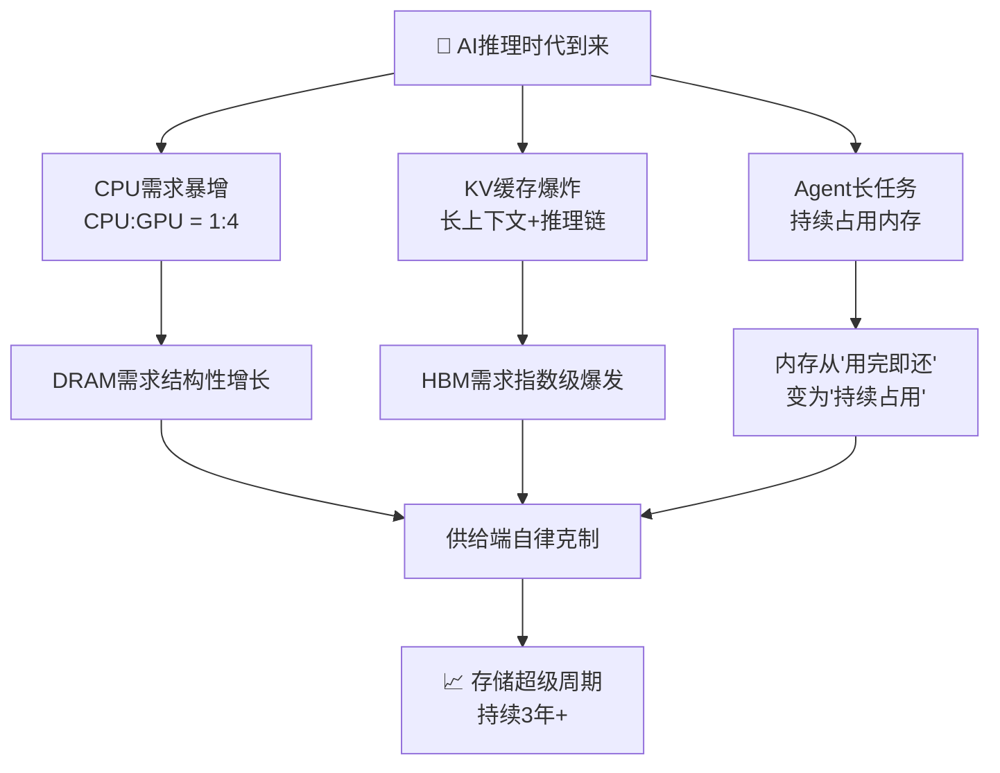
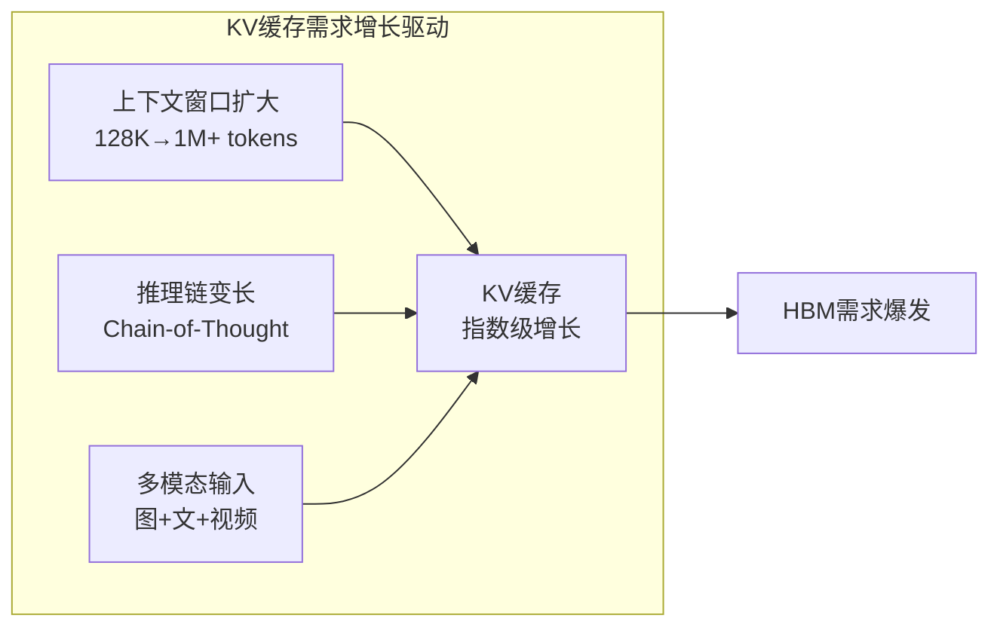
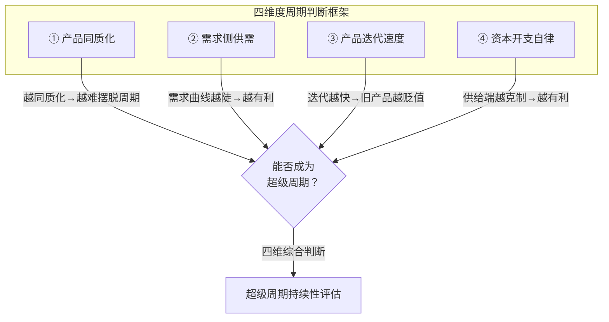
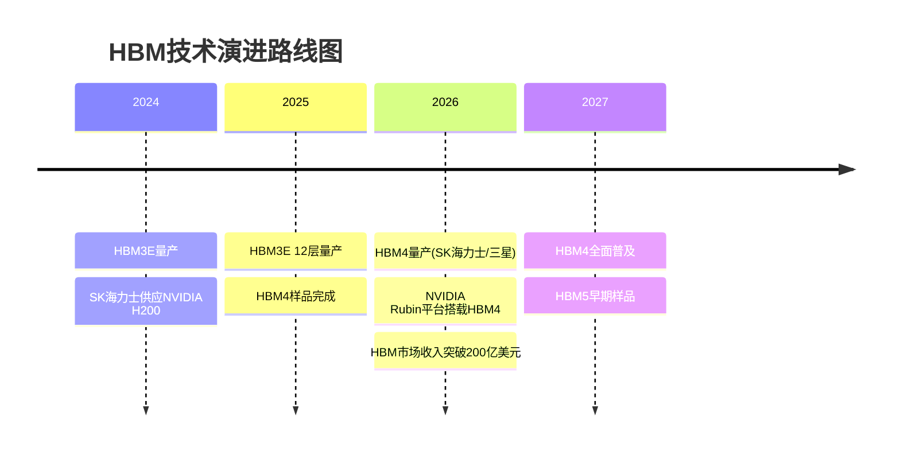
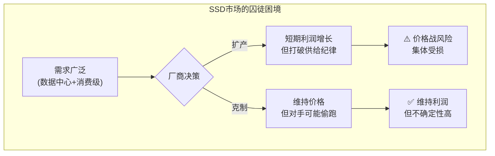
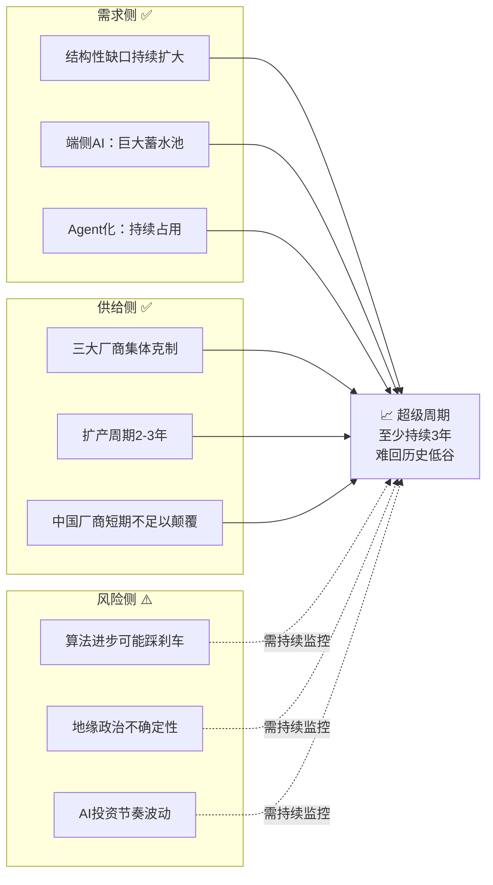

# AI浪潮下的存储超级周期

> **核心命题**：这一轮存储周期是否会重蹈半导体行业以往暴涨暴跌的覆辙？
> **核心判断**：AI推理时代带来结构性存储需求 + 厂商供给端自律克制 → 这一轮周期可能演变为**持续数年的长周期**。

---

## 一、全景概览：存储超级周期的逻辑链条



---

## 二、AI推理时代的三大存储特征

AI推理（即模型训练完成后供用户使用）的普及，正在从根本上改变存储芯片的需求模式。

### 特征对比表

| 特征 | 训练阶段 | 推理阶段 | 存储影响 |
|------|---------|---------|---------|
| **计算模式** | GPU密集型 | CPU密集型（CPU:GPU从1:8→1:4） | DRAM需求翻倍 |
| **内存使用** | 批量处理，用完释放 | KV缓存长期驻留 | HBM持续占用 |
| **任务形态** | 无状态批处理 | 有状态长任务（Agent） | 内存重复复制占用 |

### 2.1 CPU密集型计算

推理任务对CPU的需求远超训练阶段，CPU与GPU的需求比从 **1:8 升至 1:4 甚至更高**。大量CPU的使用直接带动了其配套内存（DRAM）的需求。

### 2.2 KV缓存爆炸 🔥

为了处理更长的上下文和更复杂的推理链，模型对KV缓存（AI的"短期记忆"）的需求呈**指数级增长**，这是HBM需求爆发的核心驱动力。



> **📌 2026年最新案例**：随着长上下文模型（1M+ tokens）成为主流，KV Cache存储需求预计增长 **5-10倍**。PagedAttention、FlashAttention等技术虽在优化显存占用，但总需求增速远超优化速度。

### 2.3 存储长期占用

AI智能体（Agent）是有状态的长任务，其对话记忆、系统设定等会**长期占用内存**，且为保证数据安全，系统需为每个任务复制数据，导致内存被重复占用。消耗模式从"用完即还"变为**"持续占用"**。

---

## 三、判断周期的四维度框架

视频提出了一个四维度框架，用于判断一个行业周期能否摆脱传统的暴涨暴跌宿命。



### 四维度详解

| 维度 | 传统短周期 | 超级周期条件 | 当前状态 |
|------|-----------|-------------|---------|
| ① 产品同质化 | 高度同质，价格战激烈 | 定制化/差异化增强 | HBM差异化增强 ✅，DRAM/SSD仍同质化 ⚠️ |
| ② 需求侧供需 | 需求周期性波动 | 结构性需求持续爆发 | AI推理需求结构性增长 ✅ |
| ③ 产品迭代速度 | 迭代慢，旧产品囤积贬值 | 迭代快，产能无法跨代竞争 | HBM约2年一代 ✅ |
| ④ 资本开支自律 | 集体非理性扩产 | 厂商吸取教训，克制扩产 | 三星/SK海力士/美光均克制 ✅ |

---

## 四、HBM、DRAM、SSD 周期前景

### 4.1 三类产品对比总览

| 产品 | 周期前景 | 核心原因 | 风险等级 |
|------|---------|---------|---------|
| **HBM** | 🟢 最接近成长周期 | 需求指数级增长，供给增速远不及需求；产品迭代快（约2年一代），旧型号迅速贬值，绕开价格战 | ⭐⭐ 低风险 |
| **DRAM** | 🟡 具备摆脱周期的资格 | AI推理带来全新、持续的DRAM需求来源，需求缺口持续扩大。产品高度同质化，但需求结构性爆发 | ⭐⭐⭐ 中风险 |
| **SSD** | 🔴 最不稳定 | 需求广泛但易于扩产，典型"囚徒困境"。一家扩产即打破供给纪律 | ⭐⭐⭐⭐ 高风险 |

### 4.2 HBM：超级周期的皇冠明珠 👑



**HBM4 技术规格对比**：

| 规格 | HBM3E（当前） | HBM4（2026） | 提升幅度 |
|------|-------------|------------|---------|
| 带宽 | ~1.18 TB/s | ~1.5-2 TB/s | +50%~70% |
| 容量 | 最高36GB | 最高64GB | +78% |
| 堆叠层数 | 8-12层 | 12-16层 | +33% |
| 接口宽度 | 1024-bit | 2048-bit | +100% |

### 4.3 DRAM：结构性需求的"沉默巨兽"

> **📌 2026年最新案例**：
> - NVIDIA Rubin GPU平台（2026）专门设计搭载HBM4，单GPU内存需求从H100的80GB → B200的192GB → Rubin的256GB+
> - 全球AI存储市场预计从2023年70亿美元增长至2028年**400亿美元**，CAGR达41.9%
> - 端侧AI（手机/PC端大模型）成为巨大的需求"蓄水池"

### 4.4 SSD：囚徒困境的"不稳定因子"

SSD市场面临典型的博弈困境：



---

## 五、2026年正在发生的案例 🔍

### 案例1：SK海力士的"王座保卫战"

| 项目 | 详情 |
|------|------|
| **市场地位** | HBM全球市占率约50%，NVIDIA核心供应商 |
| **技术领先** | 全球首家完成12层HBM3E开发，HBM4样品率先完成 |
| **产能投资** | 投资约15万亿韩元扩大清州M15X工厂HBM产能 |
| **战略意义** | 从"追赶者"变为"定义者"，打破三星长期垄断存储格局 |

### 案例2：三星的"追赶之战"

| 项目 | 详情 |
|------|------|
| **市场地位** | HBM市占率约40%，加速追赶SK海力士 |
| **技术突破** | HBM3E已通过NVIDIA验证并开始供应 |
| **HBM4计划** | 开发16层HBM4，目标2025末-2026初量产 |
| **客户拓展** | 加强与AMD、AWS合作，降低对NVIDIA的单一依赖 |

### 案例3：中国存储力量的崛起

| 项目 | 详情 |
|------|------|
| **长鑫存储(CXMT)** | 中国最大DRAM制造商，持续扩产DDR4/LPDDR5 |
| **短期影响** | 尚不足以颠覆全球供需格局，但在成熟制程加速渗透 |
| **长期意义** | 为供应链多元化提供缓冲，降低地缘政治风险集中度 |

### 案例4：NVIDIA Rubin平台——HBM4的"超级催化剂"

| 项目 | 详情 |
|------|------|
| **发布时间** | 2026年 |
| **内存配置** | 搭载HBM4，单GPU内存容量预计256GB+ |
| **技术意义** | 2048-bit超宽接口，带宽达1.5-2 TB/s |
| **需求拉动** | 每个Rubin GPU消耗的HBM是H100的3倍以上 |

---

## 六、深度思考问答 🧠

### Q1：为什么这一轮存储周期不会重蹈2017-2019年的暴涨暴跌？

> **A**：2017年周期由"加密货币挖矿+数据中心扩容"驱动，本质是**投机性需求**，退潮极快。而2026年周期的底层逻辑完全不同：
> 1. **需求端**：AI推理是**持续性需求**——每一次用户提问、每一个Agent任务都消耗存储，且随AI渗透率提升而指数增长
> 2. **供给端**：经历了2022-2023年的惨痛亏损，三大厂商（SK海力士/三星/美光）已形成**"自律扩产"共识**
> 3. **产品端**：HBM的快速迭代（2年一代）使得**旧产能无法跨代竞争**，从物理上杜绝了价格战的可能性

### Q2：HBM的"成长性"从何而来？它真的能摆脱周期吗？

> **A**：HBM最接近"成长股"而非"周期股"，核心在于：
> - **需求弹性极大**：KV缓存需求与模型参数量/上下文长度呈双指数关系，远未见顶
> - **供给壁垒极高**：HBM制造涉及先进封装（TSV硅通孔）、良率控制等核心技术，扩产周期长（2-3年）
> - **定价权强**：HBM ASP是普通DRAM的**5-10倍**，厂商利润率极高，无动机打价格战
> 
> **但需警惕**：若算法层面出现突破性进展（如KV缓存压缩效率提升10倍），可能显著压低HBM需求增速。

### Q3：AI推理的"内存消耗模式"为什么是不可逆的？

> **A**：三个不可逆趋势：
> 1. **上下文军备竞赛**：从4K→128K→1M→10M tokens，用户习惯一旦形成便不可逆
> 2. **Agent化**：AI从"一次性问答"变为"持续性助手"，内存占用从**毫秒级**变为**天级**
> 3. **数据冗余备份**：为容灾和安全，每个Agent任务需要**至少2份内存副本**（主+备），实际消耗翻倍

### Q4：投资者应该如何定位这一轮存储周期？

> **A**：
> - **最确定**：HBM产业链（SK海力士 > 三星 > 美光）——需求增速最快、供给壁垒最高
> - **次确定**：DRAM——需求结构性增长，但产品同质化仍是隐患
> - **高风险**：SSD——典型的"看起来很美但容易翻车"，囚徒困境随时可能触发
> - **隐藏机会**：先进封装（TSV）设备商、HBM上游材料商——"卖铲子"逻辑

---

## 七、结论：超级周期的持续性



**综合判断**：这一轮存储超级周期**至少能持续3年**，很难重回过去血亏的低谷。

---

## 八、记忆宫殿 🏛️

> 用空间记忆法，把整个"AI存储超级周期"装进一座宫殿。

### 宫殿结构：「存储之塔」

想象一座**七层高塔**，每一层对应一个核心知识点：

| 层级 | 宫殿场景 | 对应知识 | 记忆锚点 |
|------|---------|---------|---------|
| **第1层** · 地基 | 🏗️ 巨大的CPU芯片铺成的地板，上面站满了小人（Agent）在不停对话 | **推理时代特征**：CPU需求暴增 + Agent长期占用 | "地板上站满了人=CPU被Agent占满" |
| **第2层** · 大厅 | 📚 一面巨大的书架墙，书本（KV缓存）不断自动复制膨胀，书架被撑裂 | **KV缓存爆炸**：指数级增长 | "书把书架撑裂=KV缓存撑爆HBM" |
| **第3层** · 四柱厅 | 🏛️ 四根石柱，每根刻着一个维度：同质化、供需、迭代、自律 | **四维度框架**：判断周期是否可持续 | "四根柱子撑起周期之顶" |
| **第4层** · 珍宝室 | 💎 三个宝箱：金色（HBM=成长周期）、银色（DRAM=脱离周期）、铜色（SSD=不稳定） | **三类产品前景** | "金银铜=HBM>DRAM>SSD" |
| **第5层** · 竞技场 | ⚔️ 三方角斗士：蓝色铠甲(SK海力士·50%)、红色铠甲(三星·40%)、白色铠甲(美光·10%) | **三巨头格局** | "蓝红白三色战士争王座" |
| **第6层** · 瞭望台 | 🔭 望远镜看向远方的Rubin芯片城市，天空飞来HBM4的补给飞艇 | **2026催化剂**：NVIDIA Rubin+HBM4量产 | "Rubin城接收HBM4飞艇" |
| **第7层** · 塔顶 | 📈 金色数字"3年+"悬浮在塔顶，周围环绕三朵乌云（算法进步/地缘政治/AI投资波动） | **结论：3年超级周期+三大风险** | "塔顶金字3年，乌云环绕=风险犹存" |

### 🧩 快速回忆路径

```
地基(CPU+Agent) → 大厅(KV缓存爆炸) → 四柱厅(四维度) → 珍宝室(金银铜=HBM/DRAM/SSD) → 竞技场(蓝红白三巨头) → 瞭望台(Rubin+HBM4) → 塔顶(3年+风险)
```

> **使用指南**：闭上眼，从塔底走上去。每层场景越夸张越好笑——书撑裂书架、角斗士互砍、飞艇空投芯片——**荒诞的画面=牢固的记忆**。

---

*你对AI产业链的哪个环节最感兴趣？我们可以聊聊关于芯片、算力还是应用落地的话题。*
