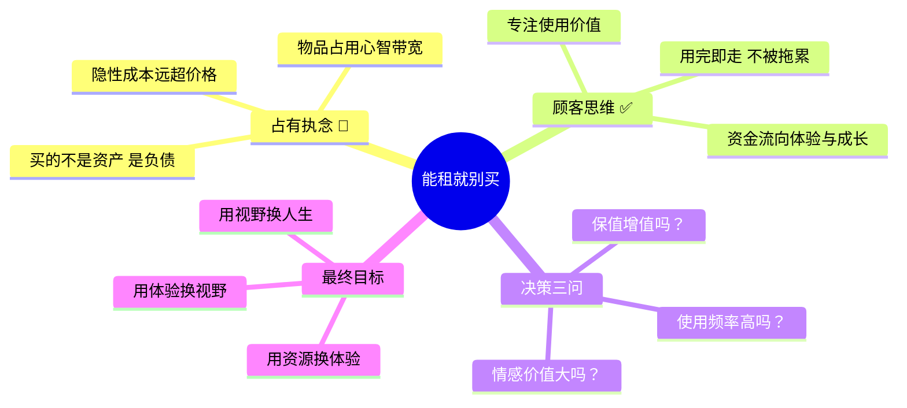
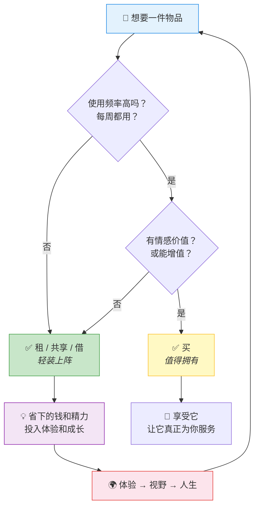
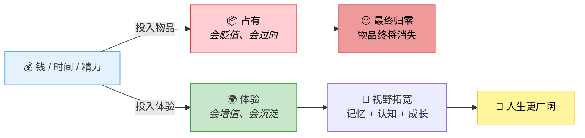
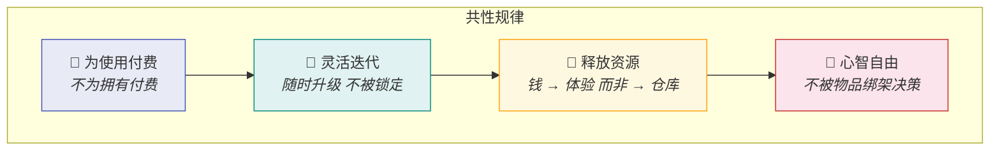
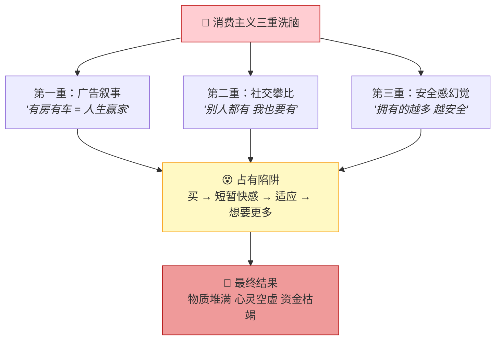

# 能租就别买：从"占有执念"到"顾客思维"的认知革命

> **核心观点**：能租的东西就不要买。人们不该被"占有"的执念所困——拥有一件物品往往意味着承担它难以出售的风险和持续贬值的负债。真正聪明的人用"**顾客思维**"专注于使用价值而非所有权，把资源用于创造**体验**，从而获得更广阔的人生视野。

🔗 相关笔记：[[日记/0614/2026-06-14 段永平的成功心法：拥有的越少，才能越强大]] · [[日记/0620/2026-06-18 看待金钱的底层思维方式]] · [[日记/0618/2026-06-18 培养"离钱近"的兴趣：从消费到创造]]

---

## 🧠 核心框架图



---

## 一、为什么"拥有"是一种隐性负债？

大多数人只看到购买的**标价**，却忽略了拥有物品背后的**隐性成本链**。

### 📊 真实成本对比表

| 维度 | 💰 买（拥有模式） | 🔑 租（使用模式） | 本质差异 |
|:---|:---|:---|:---|
| **初始投入** | 一次性大额支出 | 按需小额支付 | 资金效率 |
| **维护成本** | 自费保养、维修 | 平台/出租方承担 | 风险转移 |
| **存放成本** | 占用物理空间（房价≈元/㎡） | 零仓储 | 空间解放 |
| **贬值风险** | 买入即亏，出手折价 | 无残值焦虑 | 心理减负 |
| **灵活性** | 换了麻烦，不换过时 | 随时升级换代 | 自由迭代 |
| **心理负担** | "怕坏、怕丢、怕旧" | "用完就还，轻装前行" | 心智带宽 |

### 📐 真实成本计算公式

```
┌──────────────────────────────────────────────────────┐
│           拥有的真实成本 ≠ 购买价格                   │
├──────────────────────────────────────────────────────┤
│                                                      │
│  真实成本 = 购买价 + 维护费 + 存放成本 + 贬值损失     │
│              + 出售折价 + 心智消耗                    │
│                                                      │
│  ─────────────────────────────────────────────────   │
│                                                      │
│  📱 例：一台 ¥5000 的相机                           │
│  · 购买价：¥5000                                    │
│  · 一年用 10 次，维护：¥500                         │
│  · 占用柜子空间：¥200（机会成本）                   │
│  · 2年后卖出：回收 ¥2000（贬值 ¥3000）              │
│  · 真实单次成本：(5000+500+200+3000) ÷ 10 = ¥870/次│
│                                                      │
│  📱 同款相机租赁：¥150/天 × 10次 = ¥1500            │
│                                                      │
│  💡 租比买省 ¥7200，还省了心理负担！                 │
└──────────────────────────────────────────────────────┘
```

---

## 二、两种思维模式的全景对比

### 📊 占有思维 vs 顾客思维

| 维度 | ❌ 占有思维（大众） | ✅ 顾客思维（理性人） | 本质差异 |
|:---|:---|:---|:---|
| **关注焦点** | "这是我的" — 所有权 | "我用过就好" — 使用权 | 执念 vs 自由 |
| **满足来源** | 拥有的数量和品牌 | 体验的质量和深度 | 物质 vs 经历 |
| **决策依据** | 面子、安全感、占有欲 | 性价比、使用频率、灵活性 | 情绪 vs 理性 |
| **资源流向** | 钱 → 物品 → 堆积 → 贬值 | 钱 → 使用 → 体验 → 增值 | 消耗 vs 投资 |
| **心理状态** | 怕坏、怕丢、怕旧 | 轻装上阵、来去自由 | 负担 vs 轻松 |
| **长期结果** | 空间被占满，资金被锁定 | 空间清爽，资金灵活流动 | 负债 vs 资产 |

### 🔄 决策流程图：买还是租？



---

## 三、买 vs 租决策矩阵

> 不是所有东西都应该租，关键在于**分类决策**。

| 物品类别 | 推荐方式 | 典型案例 | 核心理由 |
|:---|:---:|:---|:---|
| 🎯 **高频 + 高情感** | ✅ **买** | 日常穿的衣服、主力手机、常用工具 | 使用价值高，情感连接深 |
| 📈 **高频 + 高保值** | ✅ **买** | 核心生产力工具（电脑）、经典款手表 | 长期高回报，贬值可控 |
| 🎯 **低频 + 高价值** | 🔑 **租** | 相机镜头、礼服、专业设备 | 偶尔使用，买 = 亏 |
| 🎯 **低频 + 低价值** | 🔑 **借/共享** | 电钻、梯子、旅行装备 | 买回即吃灰 |
| 🎯 **体验型需求** | 🔑 **订阅/共享** | 旅行住宿、豪车试驾、高端餐厅 | 体验 > 占有 |
| 🎯 **快速迭代型** | 🔑 **租** | 无人机、VR设备、最新电子产品 | 新品周期短，买即落后 |

### 💡 一句话判断标准

> **高频使用 + 情感价值 = 买；其余情况 = 先想想要不要租。**

---

## 四、核心公式：体验 > 占有



> **把钱花在体验上，比花在物品上，更能拓展人生视野。**

---

## 五、2026年正在发生的真实案例

> 不是理论，是**此刻正在发生的趋势**。以下案例反映了"能租就別买"哲学在各领域的渗透。

### 案例一：云游戏替代游戏主机 🎮

| 维度 | 详情 |
|:---|:---|
| **背景** | 2026年，云游戏服务全面成熟（Xbox Cloud、GeForce NOW、网易云游戏） |
| **传统模式** | 花 ¥5000 买主机 + ¥500/个游戏 → 一年后发现吃灰 |
| **新思维** | 每月 ¥99 订阅云游戏服务，随时畅玩几百款，不买设备 |
| **节省** | 年省 ¥4000+，家里不堆设备，换城市零负担 |
| **关键洞察** | **90%的人买主机，实际使用时间不到 100 小时。云游戏让你只为"玩"付费，不为"拥有"付费** |

### 案例二：订阅制时尚替代囤衣服 👗

| 维度 | 详情 |
|:---|:---|
| **背景** | 服装租赁平台在 2026 年爆发增长，AI 个性化推荐搭配 |
| **传统模式** | 每季花 ¥5000+ 买衣服，衣柜爆满，很多只穿一两次 |
| **新思维** | 月付 ¥299 租衣平台，每月换 5 件，穿完寄回，AI 推荐新搭配 |
| **节省** | 年省 ¥30000+，衣柜清爽，每天有新衣服穿 |
| **关键洞察** | **衣服的核心需求是"穿"而不是"有"。对大多数人来说，变化感比拥有感更重要** |

### 案例三：租房 vs 买房——新世代的资产观 🏠

| 维度 | 详情 |
|:---|:---|
| **背景** | 2026年，一线房价收入比持续走高，年轻人重新审视"必须买房"的执念 |
| **传统模式** | 掏空六个钱包付首付，月供 30 年，不敢跳槽、不敢创业 |
| **新思维** | 租品质好房（月租 ¥5000），把首付差额投入自我提升和指数基金 |
| **节省** | 保持流动性、职业灵活性和人生选择权 |
| **关键洞察** | **"有房"不等于"有家"。当房产从"资产"变成"负债"（月供锁定人生），租房反而是一种更理性的资源配置** |

### 案例四：AI工具——订阅制时代的终极样本 🤖

| 维度 | 详情 |
|:---|:---|
| **背景** | 2026年，几乎所有 AI 工具都采用订阅模式（Claude Pro、ChatGPT Plus、Midjourney） |
| **事实** | 没有人"买断"一个 AI——我们都在"租"它的能力 |
| **启示** | 连最强大的生产力工具都转向了"使用权 > 所有权"模式 |
| **关键洞察** | **当连"智能"都可以租用，还有什么东西是你"必须拥有"的？订阅经济正在重新定义"拥有"的含义** |

### 四大案例的共性规律



| 共性 | 云游戏 | 订阅时尚 | 租房生活 | AI工具 |
|:---|:---|:---|:---|:---|
| 为使用付费 | 按小时玩 | 按月穿 | 按月住 | 按月用 |
| 灵活迭代 | 换游戏零成本 | 换风格零成本 | 换城市零成本 | 换模型零成本 |
| 释放资源 | 不买设备 | 不囤衣服 | 不锁首付 | 不买服务器 |
| 心智自由 | 不怕主机过时 | 不怕衣服过季 | 不怕房价波动 | 不怕技术迭代 |

---

## 六、逻辑记忆卡片

> 用**逻辑链**将核心概念串联，形成可推导的记忆网络。

| 关键词 | 核心要义 | 逻辑链 | 一句话记忆 |
|:---|:---|:---|:---|
| **占有执念** | 拥有 = 承担风险 | 买 → 拥有 → 维护 → 贬值 → 负债 | 拥有的越多，负担越重 |
| **顾客思维** | 使用 > 拥有 | 用 → 体验 → 成长 → 增值 | 像顾客一样消费，像投资者一样思考 |
| **真实成本** | 标价 ≠ 全部代价 | 价格 + 维护 + 存放 + 贬值 = 真成本 | 买一件东西的真实成本，是标价的 2-3 倍 |
| **体验优先** | 经历 > 物品 | 钱 → 体验 → 记忆 → 视野 → 人生 | 花在体验上的钱，永远不会贬值 |
| **决策三问** | 分类决策框架 | 高频？保值？情感？→ 全Yes才买 | 满足不了三问的物品，先考虑租 |

---

## 七、高级思考问答（全文总结）

> 以下问答是全文的**认知压缩**。能回答这五个问题，说明你真正理解了"能租就别买"这套思维体系。

### Q1："能租就别买"的边界在哪里？什么东西是一定要买的？

**答**：边界在三个维度交叉处——**高频使用 × 高保值率 × 强情感连接**。满足三项全Yes的东西（如每天用的电脑、贴身物品、有纪念意义的物件）值得买。其他一切，都应该先问一句"能租吗？"

但更重要的不是这个公式，而是一种思维转变：**从"我必须要拥有它"变成"我只需要使用它"。** 当你的注意力从"所有权"转向"使用权"，你会发现 80% 的购买冲动都可以用租赁解决。

> 🧠 **记忆锚点**：买的不是物品，是它给你的体验。如果租也能给你同样的体验，为什么要买？

---

### Q2：为什么人们明知"租更划算"，还是忍不住买？

**答**：因为消费主义通过三重洗脑让我们把"拥有"等同于"幸福"：



破解方法：**买东西前问自己——"如果没有人看到我拥有它，我还会买吗？"** 如果答案是否，那你是在为"面子"买单，不是为"需求"买单。

> 🧠 **记忆锚点**：你买的不是物品，是"别人会怎么看我"的幻觉。

---

### Q3：在 AI 时代，"能租就别买"有什么新的含义？

**答**：2026年，"订阅制"已经从商业模式变成了**生活方式的底层架构**。几乎所有东西都可以订阅：

| 过去（拥有时代） | 现在（使用时代） | 趋势 |
|:---|:---|:---|
| 买软件光盘 | 订阅 SaaS 服务 | 一切软件即服务 |
| 买音乐 CD | 订阅音乐流媒体 | 一切内容即服务 |
| 买游戏主机 | 订阅云游戏 | 一切算力即服务 |
| 买 AI 工具 | 订阅 AI 服务 | 一切智能即服务 |
| 买课程 | 订阅知识平台 | 一切教育即服务 |

**这意味着"拥有"这个概念本身正在被重新定义。** 未来的富有不是"拥有很多"，而是"能访问很多"——拥有多少访问权、多少选择自由、多少人生可能性。

> 🧠 **记忆锚点**：未来的富有 = 你能访问多少，而不是你能拥有多少。

---

### Q4："拥有"和"体验"对幸福感的影响有什么本质区别？

**答**：心理学上有一个概念叫**"享乐适应"**（Hedonic Adaptation）——人对任何持久的物质刺激都会很快适应。新手机带来的快感通常不超过两周，新车不超过一个月。

但**体验不会适应**。一次旅行、一场音乐会、一个学新技能的过程——这些记忆会随着时间**增值**而非贬值。

```
快感衰减对比

拥有（物质）:
  买的那一刻 ████████████████████ 100%
  一周后      ████████           40%
  一个月后    ███                15%  ← 享乐适应
  一年后      █                  5%   ← 几乎归零

体验（经历）:
  体验那一刻  ████████████       60%
  一周后      ███████████████    75%  ← 回忆开始发酵
  一个月后    ████████████████   80%  ← 成为故事
  一年后      █████████████████  90%  ← 成为你的一部分
```

> 🧠 **记忆锚点**：物质会折旧，体验会增值。把钱花在体验上，是回报率最高的投资。

---

### Q5：如果只记住一句话，应该是什么？

> **拥有的越少，你越自由。**
>
> 不是买不起，而是不需要靠"拥有"来证明自己。
> 不是不能买，而是把买物品的钱拿去**体验世界**。
>
> 物品最终都会消失，但体验会沉淀为你认知的一部分，
> 变成别人拿不走的**视野**和**智慧**。
>
> 最富有的人，不是拥有最多的人，
> 而是**被最少东西所需要**的人。

---

## 🏛️ 记忆宫殿：顾客思维之屋

> 想象你走进一栋房子。每个房间都存放着今天学到的一个核心概念。走一遍，记住它。

| 位置 | 意象 | 核心概念 | 记忆要点 |
|:---|:---|:---|:---|
| 🚪 **门口** | 一个巨大的"租"字招牌，左边是沉重的行李箱，右边是轻装背包的人 | 两种人生入口 | 拥有 = 负重；租用 = 轻行 |
| 🛋️ **客厅** | 沙发上堆满了落灰的物品——跑步机、乐器、游戏机，墙上贴着价签和贬值曲线 | 隐性成本可视化 | 每一件闲置物品都在消耗你的空间和心智 |
| 🍳 **厨房** | 冰箱上贴着一张决策流程图：高频？保值？情感？三个问题贴在冰箱门上 | 决策三问 | 每次想买东西，先打开"冰箱"问自己三个问题 |
| 🖼️ **书房** | 墙上挂着两幅画——左边是一堆贬值的物品（灰暗），右边是一张世界地图钉满旅行照片（明亮） | 体验 > 占有 | 物品贬值归零，体验增值永存 |
| 🪟 **阳台** | 透过落地窗看向远方的地平线，窗台放着一张表格：云游戏、租衣、订阅AI | 2026新趋势 | 整个世界都在从"拥有"转向"使用" |
| 🔁 **回到门口** | 回头一看——门口的"租"字招牌变成了"**体验**"两个字 | 核心升华 | 不是不能买，而是先选择体验 |

### 🚶 走一遍宫殿（闭上眼睛）

> 你走进**门口**，左边的人拖着沉重的行李箱走不动，右边的人背着轻包大步向前。
>
> 你走进**客厅**，看到满沙发落灰的物品，每一件都贴着贬值的标签。
>
> 你打开**厨房**的冰箱，门上写着三个大字："高频吗？保值吗？有感情吗？"
>
> 你走进**书房**，左边的画灰暗压抑——一堆贬值物品；右边的画色彩鲜明——世界地图上的旅行照片。
>
> 你站上**阳台**，透过落地窗，看到远处一个崭新的世界——人们轻装上阵，为体验付费，为成长投资。
>
> 你回到**门口**，"租"字变成了"体验"。你终于明白——**不是不能拥有，而是先选择体验。**

---

## 📝 行动清单

| 序号 | 行动 | 时间框架 | 预期效果 |
|:---:|:---|:---:|:---|
| 1 | 盘点家里过去3个月没用过的物品，计算真实拥有成本 | 本周 | 看清"拥有"的隐性负债 |
| 2 | 下次想买东西前，先搜索"能不能租/借/共享" | 每次购物 | 培养顾客思维 |
| 3 | 列一张"体验清单"——想去的地方、想学的东西、想尝试的事 | 本月 | 把消费欲望从物品转向体验 |
| 4 | 用"决策三问"（高频？保值？情感？）评估所有待购物品 | 长期 | 建立理性消费框架 |
| 5 | 将省下的钱投入一项新体验，记录感受 | 持续 | 验证"体验 > 占有"的人生公式 |

---

> 💡 **你在购物时会优先考虑"拥有"还是"使用"呢？或者有没有什么你觉得**必须买**而不是租的东西？欢迎反思——有时候，最坚定的"必须买"背后，藏着一个最深层的"占有执念"。**
