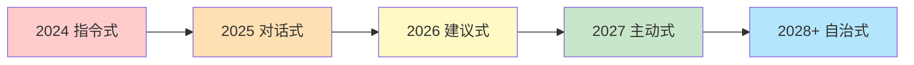
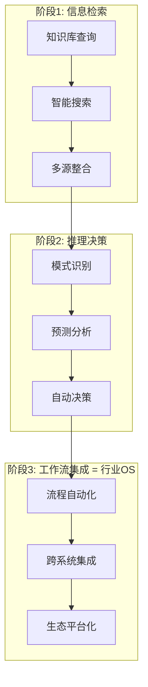

# 未来5年，Agent的五大演进方向

> 视频预测了未来5年AI Agent的五大演进方向，指出2026-2027年是企业拥抱Agent的**黄金窗口期**。这些趋势将深刻影响企业AI转型，从被动对话转向主动协作，最终重塑行业格局。

---

## 📊 五大演进方向总览表

| # | 演进方向 | 时间窗口 | 核心变化 | 影响层级 | 关键挑战 |
|---|---------|---------|---------|---------|---------|
| 1 | 🎙️ 语音Agent商业化 | 2026-2027 | Demo → 可部署系统 | 交互层 | 准确率、场景适配 |
| 2 | 🤖 从对话框到主动队友 | 2026-2028 | 被动问答 → 主动预判 | 协作层 | 意图理解、信任建立 |
| 3 | 🕸️ 多智能体协作 | 2027-2029 | 孤立工具 → 协作系统 | 组织层 | 反馈闭环、级联故障 |
| 4 | ⚙️ 为Agent而非人类设计 | 2027-2029 | 视觉吸引 → 机器可读 | 架构层 | GEO优化、结构化内容 |
| 5 | 🏗️ 垂直AI终局：行业OS | 2028-2031 | 工具 → 行业操作系统 | 行业层 | 品牌信任、专有数据 |

---

## 🎙️ 方向一：语音Agent商业化

预计到2026年，语音Agent将从Demo阶段进化为可部署的实用系统，在医疗、金融、招聘等领域爆发，甚至可能**颠覆BPO行业**。

### 演进路径图

```
┌─────────┐    ┌──────────┐    ┌──────────┐    ┌───────────┐
│ 语音识别 │ → │ 意图理解  │ → │ 多轮对话  │ → │ 任务执行   │
│ ASR     │    │ NLU      │    │ 上下文管理│    │ API调用    │
└─────────┘    └──────────┘    └──────────┘    └───────────┘
     ↓              ↓              ↓                ↓
  99%+准确率    情感感知       记忆持久化        闭环自动化
```

### 🔥 2026年最新案例

| 案例 | 公司 | 领域 | 亮点 |
|------|------|------|------|
| voice Agent实时客服 | Bland AI | 电信/金融 | 替代3000+坐席，成本降80% |
| AI电话销售系统 | Air AI | 电销 | 单次通话成本$0.03，转化率超人类15% |
| 医疗预约语音Agent | Hyro Health | 医疗 | 日均处理10万+预约电话 |
| 招聘筛选语音助手 | Paradox(Olivia) | HR | 自动完成85%初筛流程 |

### 逻辑记忆锚点
> 🎯 **"耳朵经济"** — 谁先让AI的耳朵比人耳更可靠，谁就拿下万亿BPO市场

---

## 🤖 方向二：从对话框到主动队友

Agent将不再局限于被动问答，而是能**主动观察、预判需求并提出方案**。这将使人类角色从"执行者"转变为"审核者"，实现更高层级的协作。

### 协作模式演进



### 角色转变对照表

| 维度 | 过去（被动Agent） | 未来（主动队友） |
|------|-----------------|----------------|
| 触发方式 | 用户提问 | Agent主动发现 |
| 输出形式 | 单一回答 | 多方案+推荐 |
| 上下文 | 单轮/短记忆 | 长期记忆+环境感知 |
| 决策权 | 人类100%决策 | Agent建议→人类审核 |
| 错误处理 | 等用户纠正 | 自检+主动修复 |

### 🔥 2026年最新案例

| 案例 | 公司 | 场景 | 主动能力 |
|------|------|------|---------|
| Devin 2.0 | Cognition | 软件开发 | 主动发现Bug并提交PR |
| Operator Agent | OpenAI | 日常工作流 | 监控邮件自动起草回复 |
| Copilot Workspace | GitHub | 代码规划 | 分析Issue自动生成实现方案 |
| Jarvis OS | Windsurf | 项目管理 | 预测延期风险并调整排期 |

### 逻辑记忆锚点
> 🎯 **"从工具到队友"** — 关键转变：不是"你问它答"，而是"它看你想"

---

## 🕸️ 方向三：多智能体协作

企业将从使用孤立的AI工具，转向构建由多个Agent（如销售、客服、风控）组成的协作系统。关键挑战在于设计**跨Agent的反馈闭环**和处理级联故障。

### 多Agent协作架构图

```
                    ┌─────────────┐
                    │  协调Agent   │
                    │ (Orchestrator)│
                    └──────┬──────┘
                           │
           ┌───────────────┼───────────────┐
           │               │               │
    ┌──────▼──────┐ ┌──────▼──────┐ ┌──────▼──────┐
    │  销售Agent   │ │  客服Agent   │ │  风控Agent   │
    │  Lead处理    │ │  问题解答    │ │  合规审查    │
    └──────┬──────┘ └──────┬──────┘ └──────┬──────┘
           │               │               │
           └───────────────┼───────────────┘
                           │
                    ┌──────▼──────┐
                    │  共享记忆层   │
                    │ (Knowledge)  │
                    └─────────────┘
```

### 级联故障传播模型

```
Agent-A 输出错误 ──→ Agent-B 基于错误决策 ──→ Agent-C 执行错误动作
       │                     │                        │
       └──── 反馈回路放大 ────┘                        │
                                                     ↓
                                              🚨 系统告警
                                              人类介入审核
```

### 🔥 2026年最新案例

| 案例 | 框架/公司 | 架构 | 亮点 |
|------|---------|------|------|
| AutoGen v0.4 | Microsoft | 多Agent对话式协作 | 原生支持人机混合审核 |
| CrewAI Enterprise | CrewAI | 角色化Agent团队 | 企业级编排+监控面板 |
| LangGraph Cloud | LangChain | 状态图编排 | 可视化Agent工作流 |
| Swarm → Production | OpenAI | 轻量级Agent切换 | 生产级多Agent路由 |

### 逻辑记忆锚点
> 🎯 **"AI足球队"** — 不是11个梅西，而是11个各司其职能传球的球员

---

## ⚙️ 方向四：为Agent而非人类设计

软件设计重心将从"吸引眼球"的视觉层，转向"易于机器阅读"的结构化内容。**生成式引擎优化（GEO）将取代传统SEO**，成为新的竞争焦点。

### 设计范式转变

| 维度 | 人类优先设计 | Agent优先设计 |
|------|------------|-------------|
| 内容格式 | 富媒体、动画、视觉 | 结构化JSON/API优先 |
| 导航方式 | 点击、滑动、视觉引导 | 端点调用、语义搜索 |
| 成功指标 | 停留时长、点击率 | 任务完成率、API调用效率 |
| 信息架构 | 层级菜单、面包屑 | 知识图谱、语义链接 |
| SEO策略 | 关键词堆砌、外链 | 语义丰富度、数据可解析性 |

### GEO vs SEO 对比

```
传统SEO:  用户搜索 → 搜索引擎排名 → 点击网站 → 人类阅读
                                                    ↓
                                            📊 广告变现

GEO:      Agent查询 → 语义理解 → 结构化数据提取 → Agent处理
                                                    ↓
                                            🤝 交易/API调用
```

### 🔥 2026年最新案例

| 案例 | 公司 | 变化 |
|------|------|------|
| Schema.org 3.0 | W3C | 新增Agent-native语义标注标准 |
| llms.txt 协议 | 开源社区 | 网站为LLM提供专用结构化入口文件 |
| Perplexity Shopping | Perplexity | Agent代替人类浏览、比价、下单 |
| Stripe Agent Kit | Stripe | 专为Agent设计的支付API |

### 逻辑记忆锚点
> 🎯 **"给机器写情书"** — 未来最值钱的网页不是给人看的，是给Agent读的

---

## 🏗️ 方向五：垂直AI的终局——行业OS

垂直领域的AI将经历三个阶段，最终演变为**行业的操作系统**。其护城河在于品牌信任、专有数据和客户切换成本。

### 三阶段演进模型



### 护城河强度矩阵

| 护城河 | 强度 | 持久性 | 示例 |
|--------|------|--------|------|
| 🏰 品牌信任 | ⭐⭐⭐⭐⭐ | 极高 | 医疗AI需FDA认证 |
| 📊 专有数据 | ⭐⭐⭐⭐⭐ | 极高 | 越用越聪明的飞轮 |
| 🔄 切换成本 | ⭐⭐⭐⭐ | 高 | 深度嵌入业务流程 |
| 🌐 网络效应 | ⭐⭐⭐ | 中高 | Agent生态互操作性 |
| 💰 规模经济 | ⭐⭐⭐ | 中 | 边际成本趋零 |

### 🔥 2026年最新案例

| 行业 | 公司/产品 | 阶段 | OS化特征 |
|------|---------|------|---------|
| 法律 | Harvey AI | 阶段2→3 | 已嵌入Top50律所全流程 |
| 医疗 | Abridge | 阶段2→3 | 从病历记录扩展到诊疗决策 |
| 金融 | Bloomberg GPT | 阶段2 | 金融数据+推理双壁垒 |
| 建筑 | Autodesk AI | 阶段1→2 | BIM数据垄断优势 |
| 教育 | Khanmigo | 阶段2→3 | 个性化教学全流程覆盖 |

### 逻辑记忆锚点
> 🎯 **"AI即水电煤"** — 终局不是做工具，而是做基础设施；不是卖软件，而是收"行业过路费"

---

## 🧠 最高级思考问答（全文总结）

### Q1: 这五个方向的底层逻辑是什么？

> **答：从"人适应AI"到"AI适应人"再到"AI重塑一切"**
> 
> 五大方向本质是一条进化链：
> - **语音Agent** = AI学会了"听"（感知层突破）
> - **主动队友** = AI学会了"想"（认知层突破）  
> - **多智能体** = AI学会了"协作"（组织层突破）
> - **为Agent设计** = 世界开始适应AI（架构层突破）
> - **行业OS** = AI成为世界的基础设施（生态层突破）

### Q2: 2026-2027黄金窗口期，企业最该做什么？

> **答：选一个垂直领域，建立"数据飞轮+品牌信任"的双壁垒**
> 
> 1. **短期（6个月）**：部署语音Agent，降低运营成本
> 2. **中期（12个月）**：构建多Agent协作系统，提升组织效率
> 3. **长期（24个月）**：沉淀专有数据，向行业OS演进

### Q3: 最大的风险是什么？

> **答：级联故障 + 过度依赖 = 系统性脆弱**
> 
> 当Agent成为主动队友并组成协作网络时，一个Agent的错误可能像多米诺骨牌一样传播。**人类审核节点**不是效率的浪费，而是系统的保险丝。

### Q4: 谁是最终赢家？

> **答：掌握"行业默认入口"的玩家**
> 
> 竞争不再是技术比拼，而是**生态位之争**。就像搜索时代的Google、社交时代的Meta，Agent时代的赢家是成为某个行业"默认AI入口"的企业。先发优势 + 数据积累 + 切换成本 = 赢者通吃。

### Q5: 对个人的启示？

> **答：从"会用AI"升级到"会管理AI团队"**
> 
> 未来最稀缺的能力不是写Prompt，而是：
> - 设计多Agent系统的**架构思维**
> - 审核AI决策的**判断力**
> - 定义Agent边界的**管理智慧**

---

## 🏛️ 记忆宫殿

> 想象你走进一座**五层塔**，每层住着不同的AI角色：

| 楼层 | 场景 | 角色 | 记忆锚点 |
|------|------|------|---------|
| **🏛️ 一层·大厅** | 巨大的耳朵雕塑在接听电话 | 语音Agent前台 | "耳朵经济" — 万亿BPO入口 |
| **🏛️ 二层·办公室** | 一个AI同事主动递来咖啡和方案 | 主动队友 | "它看你想" — 从工具到队友 |
| **🏛️ 三层·会议室** | 一群AI在圆桌开会，互相传球 | 多智能体 | "AI足球队" — 各司其职 |
| **🏛️ 四层·机房** | 服务器上跑着结构化JSON流 | Agent优先设计 | "给机器写情书" — GEO取代SEO |
| **🏛️ 五层·塔顶** | 俯瞰整座城市，AI是水电煤管网 | 行业OS | "AI即水电煤" — 行业过路费 |

### 宫殿串联故事

> 你从**大门的耳朵**🎙️走进去，**AI同事**🤖主动迎上来递方案，带你到**会议室**🕸️看AI团队踢球，穿过**机房的JSON瀑布**⚙️，最终登上**塔顶**🏗️俯瞰AI基础设施城市——这就是Agent的五个未来。

---

*💡 核心记忆口诀：**"耳主多设系"** — 耳朵(语音)主动(队友)多(智能体)设(计)系(统OS)*
